# Adaboost

## 从例子说起

有如下训练样本，我们需要构建强分类器对其进行分类。x是特征，y是标签

| 序号 | 1    | 2    | 3    | 4    | 5    | 6    | 7    | 8    | 9    | 10   |
| ---- | ---- | ---- | ---- | ---- | ---- | ---- | ---- | ---- | ---- | ---- |
| x    | 0    | 1    | 2    | 3    | 4    | 5    | 6    | 7    | 8    | 9    |
| y    | 1    | 1    | 1    | -1   | -1   | -1   | 1    | 1    | 1    | -1   |

首先明确Adaboost是通过改变训练样本的权重，学习多个分类器，并将这些分类器进行线性组合，提高分类器的性能。

因而唯一需要训练的参数就是样本的权重，训练集中有10条样本，因此，假设这10条样本的权重分别为

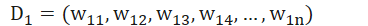

初始时，其中，N为样本的数量，即假设权重是均匀分布的。

 

其次，Adaboost是通过多个弱学习器组成强学习器，因此我们还要假设这些弱学习器的模型

《统计学习方法》中假设弱学习器是有x<v或x>v产生

因而无非两种形式：

G1(x) = 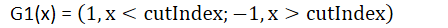

G2(x) = 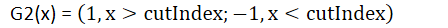

 

开始步骤

1. 初始化权值分布
2. 在权值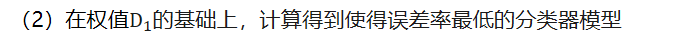
   其中误差率为：错分的数量/样本数量
   具体：选择G1
   1. 假设cutindex=0.5，即x<0.5为1，x>0.5为-1，则预测输出为[-1,-1,-1,-1,-1,-1,-1,-1,-1,-1]，真实输出为[1,1,1,-1,-1,-1,1,1,1,-1]，因此误差率为6/10=0.6
   2. 假设curindex=1.5，即x<1.5为1，x>1.5为-1，则预测输出为[1,-1,-1,-1,-1,-1,-1,-1,-1,-1]，真实输出为[1,1,1,-1,-1,-1,1,1,1,-1]，因此误差率为5/10=0.5
   3. …
   4. 最终我们可以得到G1模型，curindex=2.5时，分类误差率最低为0.3
3. 计算G1（2.5）的系数，推导过程后面，这里直接给计算步骤 =0.4236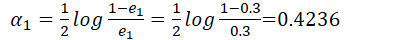
4. 更新训练数据的权值分布

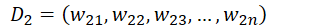

其中

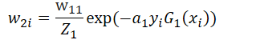

即归一化操作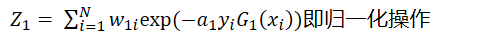

可以得到

[0.07142857142857142, 0.07142857142857142, 0.07142857142857142, 0.07142857142857142, 0.07142857142857142, 0.07142857142857142, 0.16666666666666663, 0.16666666666666663, 0.16666666666666663, 0.07142857142857142]

即

重复以上过程，我们可以得到

G1函数 cutIndex2 = 8.5

a2 = 0.6496414920651304

D3=[0.04545454545454546, 0.04545454545454546, 0.04545454545454546, 0.16666666666666669, 0.16666666666666669, 0.16666666666666669, 0.10606060606060606, 0.10606060606060606, 0.10606060606060606, 0.04545454545454546]

此时

最终可以得到

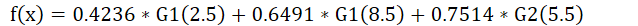

代码如下

```python
import math
def G1(cur, x):
    if x < cur:
        return 1
    else:
        return -1
def G3(cur, x):
    if x > cur:
        return 1
    else:
        return -1
def calc(x, y, D, index, G):
    error = sum([(not (G(index, x[i]) == y[i])) * D[i] for i in range(len(x))])
    return error
def min_cut(x, y, D, G):
    min_error = 1
    cur = 0
    for i in range(0, len(x) + 1):
        index = i - 0.5
        if calc(x, y, D, index, G) < min_error:
            cur = index
            min_error = calc(x, y, D, index, G)
    return cur, min_error
def alpha(error):
    return 0.5 * math.log((1 - error) / error)
def new_D(D, alpha_value, x, y, G, cur):
    U_D = [D[i] * math.exp(-alpha_value * y[i] * G(cur, x[i])) for i in range(len(y))]
    s = sum(U_D)
    return [i / s for i in U_D]
x = [0, 1, 2, 3, 4, 5, 6, 7, 8, 9]
y = [1, 1, 1, -1, -1, -1, 1, 1, 1, -1]

D0 = [1 / len(x)] * len(x)
cut_index, error = min_cut(x, y, D0, G1)
alpha_value = alpha(error)
D1 = new_D(D0, alpha_value, x, y, G1, cut_index)
cut_index_1, error_1 = min_cut(x, y, D1, G1)
alpha_value_1 = alpha(error_1)
D2 = new_D(D1, alpha_value_1, x, y, G1, cut_index_1)
cut_index_2, error_2 = min_cut(x, y, D2, G3)
alpha_value_2 = alpha(error_2)
D3 = new_D(D2, alpha_value_1, x, y, G3, cut_index_2)
print(D1)
print(D2)
print(alpha_value, alpha_value_1, alpha_value_2)
print(cut_index, cut_index_1, cut_index_2)
```

最后输出

```
0.4236 0.6496 0.7520
2.5 8.5 5.5
```

## 从原理出发

### 公式化以上过程

输入：训练数据集和弱学习算法

其中,

 

（1）初始化训练数据集的权重分布

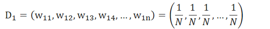

（2）对m=1，2，3，4，…,M

(a) 使用具有权值分布的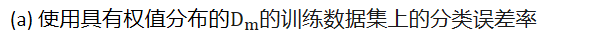