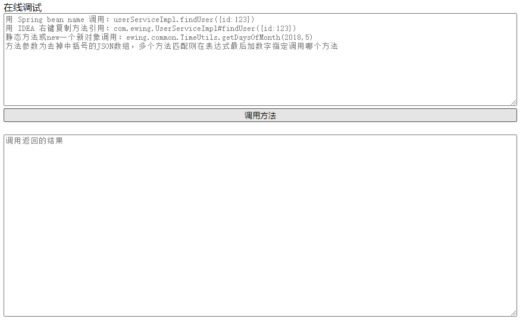

# BackdoorController

动态代理，执行项目中任意代码

## Demo

****



****

## 代码

```java
/**
 * @file: BackdoorController
 * @author: gaoming
 * @date: 2021/06/16
 * @version: 1.0
 * @description:
 **/

import com.google.common.base.Strings;
import com.google.gson.Gson;
import com.google.gson.GsonBuilder;
import com.google.gson.JsonArray;
import com.google.gson.JsonElement;
import io.swagger.annotations.Api;
import org.slf4j.Logger;
import org.slf4j.LoggerFactory;
import org.springframework.aop.framework.AopProxyUtils;
import org.springframework.beans.factory.annotation.Autowired;
import org.springframework.beans.factory.annotation.Value;
import org.springframework.context.ApplicationContext;
import org.springframework.http.MediaType;
import org.springframework.http.ResponseEntity;
import org.springframework.stereotype.Controller;
import org.springframework.util.Assert;
import org.springframework.util.CollectionUtils;
import org.springframework.util.StringUtils;
import org.springframework.web.bind.annotation.RequestMapping;
import org.springframework.web.bind.annotation.RequestParam;
import java.lang.reflect.Method;
import java.lang.reflect.Modifier;
import java.lang.reflect.Type;
import java.util.ArrayList;
import java.util.Iterator;
import java.util.List;
import java.util.Objects;
import java.util.regex.Matcher;
import java.util.regex.Pattern;

@Controller
@RequestMapping("/backdoor")
@Api(value = "/backdoor")
public class BackdoorController {
    private static final Logger LOGGER = LoggerFactory.getLogger(BackdoorController.class);

    @Value("${mgk.backdoor.enabled:false}")
    private boolean enable;

    @Autowired
    private ApplicationContext applicationContext;

    private static final Pattern BEAN_METHOD = Pattern.compile("([a-zA-Z0-9_$.]+)[.#]([a-zA-Z0-9_$]+)[（(](.*)[)）](\\d*)", Pattern.DOTALL);

    @RequestMapping
    public ResponseEntity home(@RequestParam(value = "expression", required = false)
                                       String expression) throws Exception {
        if (!enable) {
            return ResponseEntity.ok().body("Forbidden!");
        }
        String page = "<!DOCTYPE html>\n" +
                "<html lang='en'>\n" +
                "<head>\n" +
                "    <meta charset='UTF-8'>\n" +
                "    <title>在线调试</title>\n" +
                "</head>\n" +
                "<body>\n" +
                "\n" +
                "<form method='post' action=''>\n" +
                "    <label>在线调试</label>\n" +
                "    <br/>\n" +
                "    <textarea rows='10' cols='120' name='expression' placeholder='" +
                "用 Spring bean name 调用：userServiceImpl.findUser({id:123})\n" +
                "用 IDEA 右键复制方法引用：com.ewing.UserServiceImpl#findUser({id:123})\n" +
                "静态方法或new一个新对象调用：ewing.common.TimeUtils.getDaysOfMonth(2018,5)\n" +
                "方法参数为去掉中括号的JSON数组，多个方法匹配则在表达式最后加数字指定调用哪个方法'>";

        // 写入参数
        page += expression == null ? "" : expression.trim();

        page += "</textarea>\n" +
                "    <br/>\n" +
                "    <input type='submit'  value='调用方法' style='width:863px'/>\n" +
                "</form>\n" +
                "<br/>\n" +
                "<textarea rows='20' cols='120' placeholder='调用返回的结果'>";

        // 写入返回值
        try {
            if (StringUtils.hasText(expression)) {
                page += methodExecute(expression);
            }
        } catch (Throwable throwable) {
            Throwable cause = throwable;
            while (throwable != null) {
                cause = throwable;
                throwable = cause.getCause();
            }
            page += "调用异常：" + cause.getMessage();
        }

        page += "</textarea>\n" +
                "</body>\n" +
                "</html>";

        return ResponseEntity.ok()
                .contentType(MediaType.valueOf("text/html;charset=UTF-8"))
                .body(page);
    }

    /***
     * 可执行项目中的任意方法，优先调用 Spring 代理的方法。
     *
     * @param expression 用 Spring bean name 调用：userServiceImpl.findUser({name:"元宝"})
     *                   用 IDEA 右键复制方法引用：com.ewing.UserServiceImpl#findUser({name:"元宝"})
     *                   静态方法或new一个新对象调用：ewing.common.TimeUtils.getDaysOfMonth(2018,5)
     *                   方法参数为去掉中括号的JSON数组，多个方法匹配则在表达式最后加数字指定调用哪个方法。
     */
    private String methodExecute(String expression) {
        Assert.isTrue(!Strings.isNullOrEmpty(expression), "表达式不能为空");
        Matcher matcher = BEAN_METHOD.matcher(expression);

        Assert.isTrue(matcher.matches(), "表达式格式不正确");

        String classOrBeanName = matcher.group(1);
        String methodName = matcher.group(2);
        JsonArray arguments = getJsonArray("[" + matcher.group(3) + "]");
        String indexGroup = matcher.group(4);
        boolean hasIndexGroup = StringUtils.hasText(indexGroup);
        int methodIndex = hasIndexGroup ? Integer.valueOf(indexGroup) : 0;

        // 根据名称获取Bean
        TargetInstance targetInstance = getTargetInstance(classOrBeanName);

        List<TargetInvoker> targetInvokers = getTargetInvokers(targetInstance, methodName, arguments);

        if (targetInvokers.size() > 1 && !hasIndexGroup) {
            StringBuilder resultBuilder = new StringBuilder("请在输入表达式之后加以下数字来选择调用的方法：");
            for (int i = 0; i < targetInvokers.size(); i++) {
                resultBuilder.append('\n').append(i).append(':').append(targetInvokers.get(i).method);
            }
            return resultBuilder.toString();
        }

        Assert.isTrue(!CollectionUtils.isEmpty(targetInvokers), "找不到满足参数的方法：" + methodName);
        Assert.isTrue(targetInvokers.size() >= methodIndex + 1, "没有第 " + methodIndex + " 个可调用的方法");

        Object result = targetInvokers.get(methodIndex).invoke();
        try {
            return result instanceof String ? (String) result : GsonUtils.toJson(result);
        } catch (Exception e) {
            return String.valueOf(result);
        }
    }

    private static class TargetInstance {
        Object originTarget;
        Object advisedTarget;
        Class originTargetClass;
        Class advisedTargetClass;
    }

    private List<TargetInvoker> getTargetInvokers(TargetInstance targetInstance, String methodName, JsonArray arguments) {
        List<TargetInvoker> targetInvokers = new ArrayList<>();
        if (targetInstance == null) {
            return targetInvokers;
        }

        Object[] targets = {targetInstance.advisedTarget, targetInstance.originTarget};
        Class[] classes = {targetInstance.advisedTargetClass, targetInstance.originTargetClass};

        for (int i = 0; i < classes.length && targetInvokers.isEmpty(); i++) {
            Class clazz = classes[i];
            if (clazz == null) {
                continue;
            }
            for (Method method : clazz.getDeclaredMethods()) {
                if (!method.getName().equals(methodName)) {
                    continue;
                }
                Type[] types = method.getGenericParameterTypes();
                if (types.length != arguments.size()) {
                    continue;
                }
                // 参数转换无异常表示参数匹配
                Iterator<JsonElement> elementIterator = arguments.iterator();
                try {
                    List<Object> args = new ArrayList<>(types.length);
                    for (Type type : types) {
                        Object arg = GsonUtils.getGson().fromJson(elementIterator.next(), type);
                        args.add(arg);
                    }

                    TargetInvoker targetInvoker = new TargetInvoker();
                    targetInvoker.arguments = args;
                    targetInvoker.method = method;
                    targetInvoker.target = targets[i];
                    targetInvokers.add(targetInvoker);
                } catch (Exception e) {
                    // 继续判断下一个方法是否满足条件
                }

            }
        }
        return targetInvokers;
    }

    private static class TargetInvoker {
        Method method;
        Object target;
        List<Object> arguments;

        Object invoke() {
            Method methodPresent = Objects.requireNonNull(this.method, "方法不能为空");
            Object invokeTarget = this.target;
            try {
                if (Modifier.isStatic(methodPresent.getModifiers())) {
                    invokeTarget = methodPresent.getDeclaringClass();
                } else if (invokeTarget == null) {
                    invokeTarget = methodPresent.getDeclaringClass().newInstance();
                }
                Object targetPresent = Objects.requireNonNull(invokeTarget, "实例不能为空");

                methodPresent.setAccessible(true);
                Object result = arguments == null || arguments.isEmpty() ?
                        methodPresent.invoke(targetPresent) :
                        methodPresent.invoke(targetPresent, arguments.toArray());

                return methodPresent.getReturnType().equals(Void.TYPE) ? "调用成功，该方法无返回值" : result;
            } catch (ReflectiveOperationException e) {
                LOGGER.error("调用方法失败", e);
                throw new RuntimeException(e);
            }
        }
    }

    private TargetInstance getTargetInstance(String classOrBeanName) {
        TargetInstance targetInstance = new TargetInstance();
        try {
            targetInstance.advisedTarget = applicationContext.getBean(classOrBeanName);
        } catch (Exception e) {
            LOGGER.info("Get spring bean name {} error: {}", classOrBeanName, e.getMessage());
        }

        if (targetInstance.advisedTarget == null) {
            try {
                targetInstance.advisedTarget = applicationContext.getBean(Class.forName(classOrBeanName));
            } catch (Exception e) {
                LOGGER.info("Get spring bean class {} error: {}", classOrBeanName, e.getMessage());
            }
        }

        if (targetInstance.advisedTarget == null) {
            try {
                targetInstance.originTargetClass = Class.forName(classOrBeanName);
            } catch (Exception e) {
                throw new RuntimeException("找不到类：" + classOrBeanName);
            }
        } else {
            targetInstance.advisedTargetClass = targetInstance.advisedTarget.getClass();
            targetInstance.originTarget = AopProxyUtils.getSingletonTarget(targetInstance.advisedTarget);
            targetInstance.originTargetClass = AopProxyUtils.ultimateTargetClass(targetInstance.advisedTarget);
        }
        return targetInstance;
    }

    private JsonArray getJsonArray(String jsonParams) {
        try {
            return GsonUtils.toObject(jsonParams, JsonArray.class);
        } catch (Exception e) {
            throw new RuntimeException("方法参数格式不正确");
        }
    }

    static class GsonUtils{

        private static final Gson gson = new GsonBuilder()
                .setLenient()
                .enableComplexMapKeySerialization()
                .serializeNulls()
                .setDateFormat("yyyy-MM-dd HH:mm:ss")
                .disableHtmlEscaping()
                .create();

        private GsonUtils() {
        }

        /**
         * 公开可给外部使用。
         */
        public static Gson getGson() {
            return gson;
        }

        public static String toJson(Object object) {
            return gson.toJson(object);
        }

        /**
         * 将json字符串转成object。
         */
        public static <T> T toObject(String json, Class<T> type) {
            return gson.fromJson(json, type);
        }
    }

}
```

