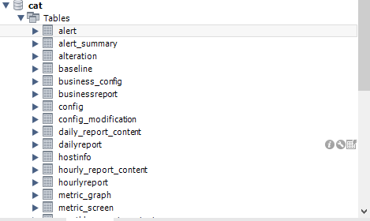

# Cat

CAT（Central Application Tracking），是美团点评基于 Java 开发的一套开源的分布式实时监控系统。美团点评基础架构部希望在基础存储、高性能通信、大规模在线访问、服务治理、实时监控、容器化及集群智能调度等领域提供业界领先的、统一的解决方案，CAT 目前在美团点评的产品定位是应用层的统一监控组件，在中间件（RPC、数据库、缓存、MQ 等）框架中得到广泛应用，为各业务线提供系统的性能指标、健康状况、实时告警等服务。

## 本地部署

[部署文档](https://github.com/dianping/cat/wiki/readme_server)

### windows部署

#### 环境准备

1. Windows
2. CAT
3. Java
4. Tomcat
5. Maven
6. Mysql

#### 部署步骤

##### 下载Cat源码

[cat](https://github.com/dianping/cat)

```bash
git clone git@github.com:dianping/cat.git
```

##### 初始化数据库

`script/CatApplication.sql`

```sql
CREATE TABLE `dailyreport` (
  `id` int(11) NOT NULL AUTO_INCREMENT,
  `name` varchar(20) NOT NULL COMMENT '报表名称, transaction, problem...',
  `ip` varchar(50) NOT NULL COMMENT '报表来自于哪台cat-consumer机器',
  `domain` varchar(50) NOT NULL COMMENT '报表处理的Domain信息',
  `period` datetime NOT NULL  COMMENT '报表时间段',
  `type` tinyint(4) NOT NULL COMMENT '报表数据格式, 1/xml, 2/json, 默认1',
  `creation_date` datetime NOT NULL COMMENT '报表创建时间',
  PRIMARY KEY (`id`),
  UNIQUE KEY `period` (`period`,`domain`,`name`)
) ENGINE=InnoDB DEFAULT CHARSET=utf8 COMMENT='天报表';
...
```



##### 创建配置文件

在Tomcat所在的盘中创建`/data/appdatas/cat`文件夹，然后创建`/data/appdatas/cat/client.xml`，写入如下内容

```xml
<?xml version="1.0" encoding="utf-8"?>
<config mode="client">
    <servers>
        <server ip="127.0.0.1" port="2280" http-port="8080"/>
    </servers>
</config>
```

其中，`127.0.0.1`改为你电脑的内网`IP`，`2280`是默认的`CAT`服务端接受数据的端口，不允许修改，`http-port`是`Tomcat`启动的端口，默认是`8080`，建议使用默认端口。

再创建`/data/appdatas/cat/datasources.xml`文件，写入如下内容：

```xml
<?xml version="1.0" encoding="utf-8"?>
<data-sources>
	<data-source id="cat">
		<maximum-pool-size>3</maximum-pool-size>
		<connection-timeout>1s</connection-timeout>
		<idle-timeout>10m</idle-timeout>
		<statement-cache-size>1000</statement-cache-size>
		<properties>
			<driver>com.mysql.jdbc.Driver</driver>
			<url>jdbc:mysql://127.0.0.1:3306/cat</url>  <!-- 请替换为真实数据库URL及Port  -->
			<user>root</user>  <!-- 请替换为真实数据库用户名  -->
			<password>root</password>  <!-- 请替换为真实数据库密码  -->
			<connectionProperties><![CDATA[useUnicode=true&characterEncoding=UTF-8&autoReconnect=true&socketTimeout=120000]]></connectionProperties>
		</properties>
	</data-source>
</data-sources>
```

其中，需要替换的有：数据库`IP`、`port`、`user`和`password`

##### CAT的war部署

**源码构建**

1. 在cat的源码目录，执行`mvn clean install -DskipTests`
2. 如果发现`cat`的`war`打包不通过，`CAT`所需要依赖jar都部署在 `http://unidal.org/nexus/`
3. 可以配置这个公有云的仓库地址到本地`Maven`配置（一般为`~/.m2/settings.xml`)，理论上不需要配置即可，可以参考`cat`的`pom.xml`配置：

```xml
<repositories>
  <repository>
     <id>central</id>
     <name>Maven2 Central Repository</name>
     <layout>default</layout>
     <url>http://repo1.maven.org/maven2</url>
  </repository>
  <repository>
     <id>unidal.releases</id>
     <url>http://unidal.org/nexus/content/repositories/releases/</url>
  </repository>
</repositories>
```

**官方下载**

1. 如果自行打包仍然问题，请使用下面链接进行下载：

   http://unidal.org/nexus/service/local/repositories/releases/content/com/dianping/cat/cat-home/3.0.0/cat-home-3.0.0.war

2. 官方的cat的master版本，`重命名为cat.war进行部署，注意此war是用jdk8，服务端请使用jdk8版本`

使用`Maven`构建`CAT`的`war`

```bash
mvn clean install -DskipTests
```

构建成功后，将`cat-home/target/cat-alpha-3.0.0.war`重命名为`cat.war`，复制到`Tomcat`的`webapps`下，启动`tomcat`

**文件不存在**

```java
import com.dianping.cat.consumer.state.model.entity.Detail;
import com.dianping.cat.consumer.state.model.entity.Machine;
import com.dianping.cat.consumer.state.model.entity.Message;
import com.dianping.cat.consumer.state.model.entity.ProcessDomain;
import com.dianping.cat.consumer.state.model.entity.StateReport;
import com.dianping.cat.consumer.state.model.transform.DefaultMerger;
```

这些类（包括但不限于）是codegen-maven-plugin生成的。 具体执行时机为：`maven`的 `Phase: generate-sources`, 绑定的`Goal: dal-model`。

至少执行一次 `mvn generate-sources`，执行之后可以看到： `cat-core/target/generated-sources`下有

```
dal-jdbc:
    com.dianping.cat.core
dal-model:
    com.dianping.cat
```

如果是IDEA：

1. 点击`Maven`的`reimport` 即可。
2. 如果上述文件夹不是`Generated Sources Root`的图标，则`Mark as Generated Sources Root`。

很遗憾，一致报错`500`，不建议在`windows`环境下单机部署

### linux部署

基于debian的CAT搭建

#### 安装git

```bash
apt-get install git
```

#### 安装unzip

```bash
apt-get install unzip
```

#### 同步maven cat jdk安装包到/home/tools

```
apache-maven-3.3.9-bin.tar.gz
cat-master.zip
jdk-7u25-linux-x64.tar.gz
```

#### 解压到/application

```bash
tar -xzvf apache-maven-3.3.9-bin.tar.gz -C /application
unzip cat-master.zip -d /application
tar -xzvf jdk-7u25-linux-x64.tar.gz -C /application
```

#### 配置环境变量

在`etc/profile`中新增后`source /etc/profile`

##### java

```
JAVA_HOME=/application/jdk1.7.0_25
PATH=$JAVA_HOME/bin:$PATH
java -version
```

##### maven

```
M2_HOME=/application/apache-maven-3.3.9
M2=$M2_HOME/bin
PATH=$M2:$PATH
mvn -v
```

成功后将`setting`文件和`repository`导入

#### 安装mysql

```bash
apt-get install mysql-server mysql-client
```

过程中输入`root`用户密码`(XXXX)`

`ps -ef | grep mysql`查看启动结果

安装路径为`/usr/bin`，在对应路径下`mysql -uroot -pXXXX`即可登录`mysql`

如后期查询 `show tables from cat;`

#### 部署cat

```bash
mvn cat:installcp -r cat-master/ cat
cd cat
mvn clean install -DskipTests
# 新建数据/日志文件夹
mkdir -p /data/appdatas/cat
mkdir -p /data/applogs/cat
chmod 777 /data/appdatas/cat
chmod 777 /data/applogs/cat
mvn cat:install
# 数据库ip 10.28.1.175 默认端口号 3306 root/root
# jdbc:mysql://10.28.1.175:3306
cd cat-home
nohup mvn jetty:run &
```

#### 另外

1. (安装mysql的虚拟机，/etc/mysql 中my.cnf中bind-address改为0.0.0.0，之后重启/etc/init.d# /etc/init.d/mysql restart
2. 在mysql中将远程连接打开

```bash
mysql>use mysql;
mysql>update user set host='%' where user='root';
mysql>flush privileges;
mysql>quit
```

## 参考文档

[分布式监控CAT服务端的本地部署](https://www.cnblogs.com/heihaozi/p/11762894.html)