# Devops

## Devops介绍

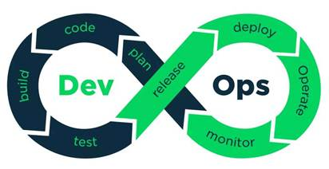

DevOps这个词来源于2009年在比利时根特市举办的首届DevOpsDays大会，为了在Twitter上更方便的传播，由DevOpsDays缩写为DevOps。目前，DevOps处于高速增长的阶段。尤其是在大企业中，DevOps受到了广泛的欢迎。根据2018年的调查发现，74%的受访者已经接受了DevOps，而前一年这一比例为66%。越大的企业，越喜欢DevOps。包括Adobe、Amazon、Apple、Airbnb、Ebay、Etsy、Facebook、linkedIn、Netflix、NASA、Starbucks、Walmart、Sony等公司，都在采用DevOps。如今，DevOps几乎已经成为了软件工程的代名词。

DevOps是一组过程、方法与系统的统称，用于促进开发（应用程序/软件工程）、技术运营和质量保障（QA）部门之间的沟通、协作与整合。它的出现是由于软件行业日益清晰地认识到：为了按时交付软件产品和服务，开发和运营工作必须紧密合作。

DevOps 旨在统一软件开发和软件操作，与业务目标紧密结合，在软件构建、集成、测试、发布到部署和基础设施管理中大力提倡自动化和监控。

DevOps的目标是缩短开发周期，增加部署频率，更可靠的发布。用户可通过完整的工具链，深度集成代码仓库、制品仓库、项目管理、自动化测试等类别中的主流工具，实现零成本迁移，快速实践 DevOps。 DevOps 帮助开发者和运维人员打造了一个全新空间，构建了一种通过持续交付实践去优化资源和扩展应用程序的新方式。DevOps和云原生架构的结合能够实现精益产品开发流程，适应快速变化的市场， 更好的服务企业的商业目的。

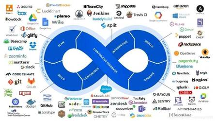

## GitLab介绍

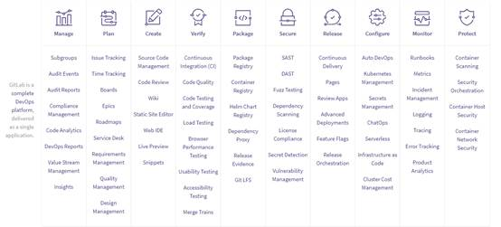

GitLab是由GitLabInc.开发，使用MIT许可证的基于网络的Git仓库管理工具，且具有wiki和issue跟踪功能。使用Git作为代码管理工具，并在此基础上搭建起来的web服务。同时GitLab也是一个完整的DevOps平台，它提供了管理、计划、创建、校验、打包、安全、发布、配置、监控、保护的一系列流程

在一个软件的生命周期中，通常为了保证软件的质量会进行一系列操作，如Code Review、持续集成、需求管理、缺陷跟踪。为了完成这些操作，需要进行额外的工作，如使用Review Board进行代码检测，使用BuildBot或者Jekins持续集成，使用Jira做需求管理，以及利用BugFree做缺陷管理。而这些功能型软件，在 GitLab 上所有的事情全部一站搞定。GitLab 做到了一切以代码为核心，围绕在代码周边的是：需求（issue）、持续集成（gitlab-ci）、code-review等等

## Devops工具

 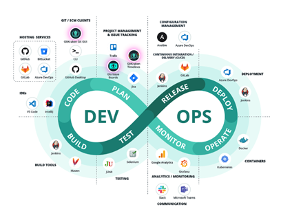

###  计划

#### JIRA

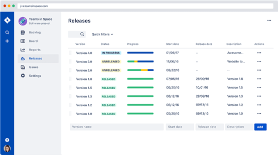

JIRA-Jira是一个Atlassian工具，最初是作为Bug和问题跟踪器设计的。如今，Jira已经发展成为一个强大的工作管理工具，适用于各种用例，从需求和测试用例管理到敏捷软件开发。

Jira提供了规划和路线图工具，因此团队可以管理利益相关者、预算和功能需求。Jira集成了各种CI/CD工具，以促进整个软件开发生命周期的透明度。当需要部署的时候，实时的生产代码状态信息会在Jira问题中浮现出来。集成的功能标记工具允许团队逐步、安全地推出新功能。

#### Trello

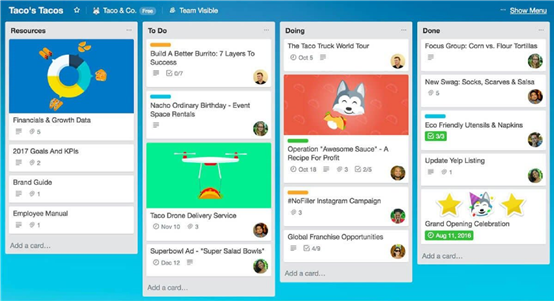

Trello是一个项目管理工具，将项目组织成看板式的板子。2017年，Trello被Atlassian收购，此后，Trello作为Jira的轻量级替代方案，在软件开发团队中获得了很大的吸引力。它更容易配置和管理，而且通常情况下，开发人员更愿意与之对接而不是Jira，由于所有的自定义功能，Jira可能会变得相当复杂，有时也会变得笨重。

Trello提供了Web和移动版本。你的项目板会告诉你正在做什么，由谁来做，以及在一个过程中处于什么位置。项目板上写满了卡片，这些卡片是你和你的团队的任务。你的团队可以对卡片进行评论和协作，每个卡片上都可以有照片、附件、截止日期等。

#### Glo Issue Boards

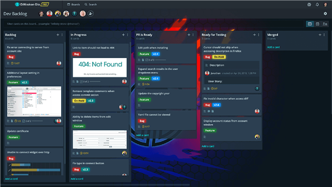

Glo Issue Boards是在GitKraken工具套件中的由Axosoft开发的产品。它与Trello类似，但Glo更以开发者为中心。这个任务和问题跟踪系统允许开发团队在看板、日历、时间线或仪表板中可视化任务。

Glo直接与GitHub集成，以减少开发团队在完成任务时的上下文切换。Glo与GitHub的问题和里程碑进行双向实时同步，因此开发人员和管理人员可以随时了解当前项目的进展情况。

高绩效的开发人员依靠自动化来提高工作效率，而赋予自动化功能的计划/跟踪工具正是基于这个原因而变得非常强大。使用GitHub Actions很容易设置Glo卡自动化，以减少开发人员工作流中的步骤数：本质上是通过工作流实现任务的自动化进程。

此外，将卡与拉动请求链接起来，可以进一步实现自动化。当GitHub中的拉动请求状态被更新时，Glo卡会根据你选择的映射自动推进到另一列。Glo与GitKraken Git GUI完全集成，因此开发者在GitKraken中创建GitHub的拉取请求时，可以实际链接一个Glo卡。这些自动化功能非常符合DevOps策略，可以减少上下文切换，提高效率。

#### GitKraken Timelines

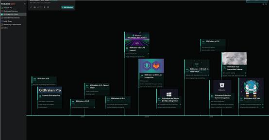

GitKraken Timelines是Axosoft的一个产品，它是Axosoft在GitKraken 工具套件。它旨在帮助团队以时间轴视图的形式规划和沟通项目目标和里程碑。对于高层规划来说，这是一个很好的工具，可以快速传达即将到来的最后期限或回顾进度。每个里程碑都可以有一个图片或GIF以及相关的子项目。很容易叠加多个时间轴来比较不同项目或团队之间的截止日期。时间轴可以是私有的、协作的或公开的。而且它们可以通过链接、嵌入或演示模式轻松共享。

### 代码

版本控制是一种跟踪和管理代码修改的方法；允许开发人员看到项目的完整修改历史，并在需要时返回到以前的版本或文件。全球范围内的团队正在摆脱集中式版本控制系统（VCS），如Subversion，转而迁移到Git。根据Stack Overflow的开发者调查，由于Git是一种免费的分布式VCS，利用了分支和合并功能，现在超过90%的开发者都在使用Git进行版本控制。

#### GitHub

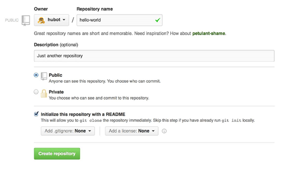

GitHub的核心部分，是一个托管和审核数以亿计的私有、公共和开放源码仓库的平台。GitHub也是构建该产品的公司的名字，它在2018年被微软收购。在我们的DevOps报告中，GitHub不仅在托管服务中排名第一，在我们的2020年20大开发者工具报告中，GitHub排名第7位。

GitHub正在不断扩展其产品，以配合DevOps工作流程中越来越多的流程。为了与GitHub存储库对接，许多开发者使用GitKraken Git GUI，它与GitHub.com和GitHub Enterprise无缝集成。GitHub提供了项目（Project）和问题（Issues）的基本项目管理。像Glo Issue Boards这样的工具提供了与GitHub同步的集成，可以提供更强大的计划和跟踪功能。GitHub的其他核心组件包括代码审核、安全开发，以及最近的CI/CD。

#### Bitbucket

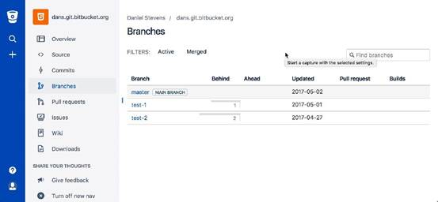

Bitbucket是Atlassian的产品，首先是一个代码管理工具。为了与托管在Bitbucket上的Git repos对接，GitKraken的GUI和其他几个Git客户端与Bitbucket.org或Bitbucket Server集成，提供了一个精简的工作流程。

遵循DevOps的方法论，Bitbucket已经将其提供的服务扩展到不仅仅是托管，还包括项目规划、协作、测试和部署服务。正如你所期望的那样，Bitbucket提供了与Jira的紧密集成，Trello也有了与Bitbucket Cloud集成的Powerup。

#### GitLab

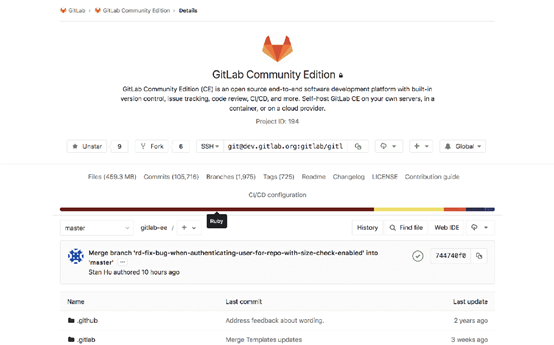

GitLab 在我们的DevOps报告中，GitLab是最常用的托管服务的第3位，也是最受欢迎的托管服务。

2020年Top 20开发者工具排行榜中的第14位。

GitLab是最早全面拥抱DevOps的托管服务之一，此后一直致力于打造一个完整的DevOps平台。GitLab提供了管理、计划、创建、验证、打包、发布、配置、监控和安全应用的一切。为了进一步简化开发工作流程，可以利用GitKraken的GUI与GitLab.com和GitLab Self-Managed上的Git仓库进行集成。

#### Azure DevOps

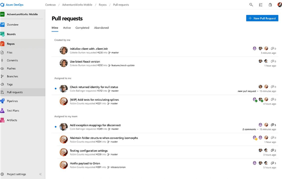

Azure DevOps是微软的一款产品，提供Git仓库托管、报告、需求管理、项目管理、自动构建、实验室管理、测试和发布管理功能。该产品于2018年发布，取代了Visual Studio Team Services (VSTS)等工具，并结合了许多其他工具，覆盖了整个应用生命周期，实现了DevOps功能。

### 构建

#### Jenkins-Jenkins

Jenkins是一个开源的自动化服务器，允许组织通过自动化来加速他们的软件开发。Jenkins在整个DevOps生命周期中管理和控制软件交付过程，包括构建、测试、运维和部署。设置Jenkins以监视GitHub、Bitbucket或GitLab上的任何代码更改，并使用Maven和Gradle等工具自动进行构建。利用容器技术，如Docker和Kubernetes，启动测试，然后在生产中采取回滚或前滚等操作。

#### Maven

Maven是一个构建自动化工具，主要用于Java项目，但也可以用于构建和管理用C#、Ruby、Scala和其他语言编写的项目。Maven项目由Apache软件基金会托管。

团队可以使用Maven的项目对象模型（project object model，POM）和一组插件，来使用统一的构建系统构建项目。

#### Visual Studio

Visual Studio的Windows和Mac版本有用于所有.NET语言的内置编译器工具。使用它可以立即创建构建，并在调试器中测试它们；为C++和C类项目运行多处理器构建；自定义构建系统的不同方面。您可以使用MSBuild命令行工具来自动化Ci/CD管道中的构建，或者在Windows和Linux中使用CMake工具运行C++构建。

#### Gradle

Gradle是一个开源的构建自动化系统，可以帮助团队更快地构建、自动化和交付更好的软件。开发人员可以使用Gradle来编写Java、C++、Python等，并在任何平台上打包部署。Gradle的插件和集成生态系统帮助团队扩展自动化。端到端地对软件的交付进行建模、集成和系统化，并使用快速构建扩展开发。Gradle提供了许多功能，从编译避免到高级缓存，再到支持持续交付。

### 发布

#### Ansible

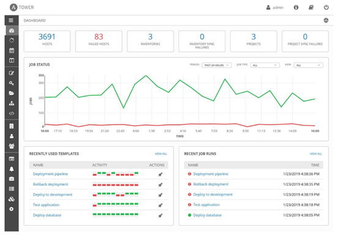

Ansible为基础设施、应用、网络、容器、安全乃至更多其他多样性的系统提供了简单的自动化方案。Ansible通过配置对基础设施的数据信息进行直接描述，提升了文档的可读性。系统管理除了账号密码或者SSH密钥外，再也无需它物。不需要再安装代理软件，避免了自动化系统常见的“为了管理而管理代理软件”的问题。Ansible依赖于OpenSSH，而它又是最安全的远程配置管理系统之一。

Ansible不仅在DevOps报告中位列配置管理工具第一名，而且在2019年Stack Overflow的开发者调查显示：62%的使用过Ansible的开发者都特别喜欢这个工具。

#### Azure DevOps

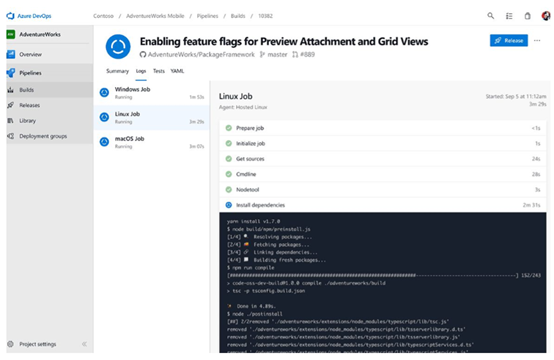

Azure DevOps是由微软创建的一系列DevOps解决方案的集合。使用Azure云的自动化功能简化了其中的配置管理。整个系统的资源配置的统一管理增强了系统状态的可靠性，做到随时回滚配置更新，自动化处理异常修改和问题排查。

编辑和管理PowerShell的配置，导入配置脚本，生成节点配置，这些都可以在云上完成。使用Azure配置管理来监测和自动化更新物理机和虚拟机的配置。

#### Chef

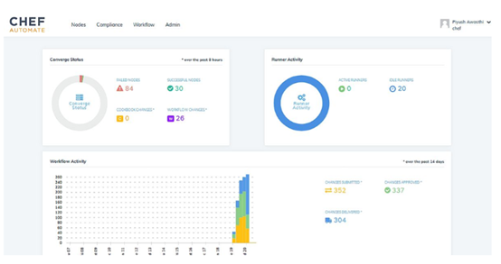

Chef 是一个处理物理机、虚拟机和云上主机的配置管理工具。它赋能IT流程的持续自动化，促进企业组织的高效团队协作，Chef Automate利用chef、Habitat和InSpec构建横跨内外边界的管道，标准化本地数据中心和公有云的环境和流程。

DevOps人员利用相同的工具把配置编程代码，流程化处理申请，高效的准备环境和发布应用。

###  持续集成/交付（CI/CD）

持续集成是DevOps最佳实践之一，旨在一天多次合并代码到同一个共享库，然后从此库开展自动化构建和测试。CI助力于企业研发小组快速监测错误，减少合并错误，避免问题积压恶化。

持续交付在CI之上更进一步，使得软件可以在任意时间内发布到生产环境，通常自动化推送更新到临时系统中。企业研发小组认为DevOps的CD实践保证了每次的修改都能发布，而且还降低了每次发布的风险。这让企业通过更频繁的提供价值获得竞争优势，创建更为紧密的客户反馈闭环。

#### Jenkins

Jenkins 是我们调研报告中排名第一的CI/CD工具；它有助于企业通过自动化加速软件开发。Jenkins通过DevOps生命周期控制和管理着整个软件的交付周期，包括：构建、测试、运维和部署。通过Jenkins来监控GitHub、Bitbucket 或者GitLab中的任何代码变化，并自动触发利用Maven或者Gradle编译的构建。利用如Docker和Kubernetes的容器技术初始化测试环境，并在生产环境中进行回滚或前滚。

#### GitLab

GitLab通过自行演进，成为了一个覆盖整个DevOps周期的应用。因此GitLab CI/CD只是整个GitLab应用中的一小部分，提供从计划到部署的无缝用户体验。可以利用GitLab CI/CD在Unix、windows、macOS或者任何运行Go语言的环境，此外还支持多机器构建，以加快速度执行速度。GitLab CI/CD还支持实时日志输出、柔性pipeline和可视化pipeline、自动拓展、制品构建、支持Docker和容器注册等等。

#### Azure DevOps

Azure DevOps是由微软创建的一系列DevOps解决方案的集合。开发人员利用它可以自动化从编码到上云的整个持续集成和持续交付的DevOps流程。

通过Azure的端到端的解决方案，开发团队可以实现整个应用生命周期(计划、开发、交付和运维)内任何阶段内的DevOps实践。通过与Visual Studio和VS Code的紧密集成，开发者更容易在Azure DevOps上致力于自己的CI/CD流水线。

#### Travis CI

Travis CI是由Github提供的持续集成服务，用于构建和测试上传在它上面的工程。相较于Jenkins，使用Travis CI的一大优势是更快的初始化：登录GitHub、测试工程、推送至GitHub一气呵成。如果你所在的组织利用Github开展开源项目，Travis CI是一个好选项。Travis CI还集成了广受欢迎的通讯工具，例如Slack，以保证开发团队随时了解构建状态。

### 部署

持续部署是企业拥有成熟的DevOps流程后的一项进阶的DevOps实践，它比持续交付更近一步，可以自动化部署更新到生产环境中，而不是其他非生产环境。研发小组不管是部署到生产还是非生产环境，都需要一个工具来实现部署策略。

#### Jenkins

Jenkins 不仅仅只是一个构建工具，同时也是持续交付解决方案中被采用的最广泛的工具之一。无法计数的Jenkins插件，让其几乎能整合任意工具，包括整个持续交付流程中所有最经典的解决方案。Jenkins插件让开发人员可以通过网络部署docker镜像，部署到Kunenetes机群。使用Pipeline插件，开发人员还可以调用云服务提供商（AWS/Azure）的API通过流程即代码的方式部署任意服务。

#### Azure DevOps

Azure DevOps 是一套微软提供DevOps解决方案，Azure Pipeline是其中的一个服务，它可以用于自动化构建和部署到众多的云提供商，尤其是Azure。

#### AWS

AWS CodeBuild 是一套掌控全局的集成服务：编译代码、运行测试、生成带部署的软件包。它还不需要服务器来部署和扩展，也不需要安装、配置和运维任何软件。

AWS CodeBuild是 AWS Code Services家族中的一员，通过AWS Code Services可以创建、完成和自动化软件持续集成和持续交付的发布流程。你也可以只集成Code Build到已存在的CI/CD流程中去。例如: 可以利用Code Build当作已有的Jenkins的一个节点来设置分布式构建。

#### GitLab

GitLab CI/CD不仅仅只能测试、构建项目，还能够部署到基础设施上。GitLab为每个环境提供完整的部署历史记录，且能够持续追踪部署状态，因此可以查询到当前服务器的部署信息。如果项目连接的是Kubernetes，也可以用它来辅助部署。

GitLab致力于自动化发布与交付应用，缩短交付周期，加速手动流程，提高团队效率。随着无触化持续交付被引入流水线，系统自动获取信息识别做要做的事情，进而实现自动化多环境部署，不管是生产还是非生产环境，甚至实现更加高级的方式，如金丝雀发布。通过特性开关、内置审计/可追溯性、按需环境创建和GitLab的静态内容交付页面，可以实现更有信心的更快速的交付。

### 运维

#### Docker

Docker这一个工具的设计目标是使用容器来更简单的创建、部署和运行应用。Docker容器把软件和其依赖环境结合在一起设置成一个标准化单元来部署，该单元包含运行所需的一切：代码、运行时、系统工具和标准库。企业团体使用Docker容器来保证应用始终运行一致，让协作变得像分享容器镜像一样简单。

Docker不仅仅在这篇DevOps报告中位列容器工具排行榜第一，而且在2019年Stack Overflow的开发者调查显示：Docker还是排名第三的最通用平台，35%专业开发者报告说他们在Docker平台上开发过东西，Docker还是该报告中排名第二的最受喜爱的平台。

#### Kubernetes

Kubernetes是一个开源的容器编排工具，旨在自动化应用部署，扩展和管理。Kubernetes起初是Google的一个项目，现在由CNCF(云原生计算基金会)维护。

Docker 和Kubernetes并不直接竞争，Kubernetes是服务于类似Docker这样的容器平台的容器编排器。主流的云供应商都支持此功能。如果企业打算上云，Kubernetes是个非常可靠的选择。它提供了一个主流的框架来运行分布式系统。每个项目的开发到生产环境，研发小组都能够运行在一致的基础设施之上。Kubernetes可以管理扩展需求，可用性，故障迁移，部署模式等等。

尽管Kubernetes是个健壮的工具，但它的复杂性以及在DevOps工具链中新增的非必需功能也臭名昭著。许多像AWS和Azure的云服务提供商提供的云编排能力就能够满足企业的需要。

#### AWS

AWS名如其意，是AWS的提供的服务，旨在按需提供云计算平台和对应的API。如果你使用其他的AWS开发者工具来掌管代码、构建、测试和部署服务到AWS，那就应该考虑扩展DevOps工具链，并在AWS上运行容器。

如果贵公司选择了AWS，那么就会涉及一到两个容器编排工具：Amazon的ECS或者EKS。如果对AWS的架构和API熟悉，那么使用ECS来运行容器是更好的选择。因为ECS于AWS的其他服务深度集成，如：IAM、VPC和Amazon Route 53。如果使用Kubernetes，那么EKS是个安全、可靠、可扩展的运行Kubernetes的方式。

### 监控

#### Google Analytics

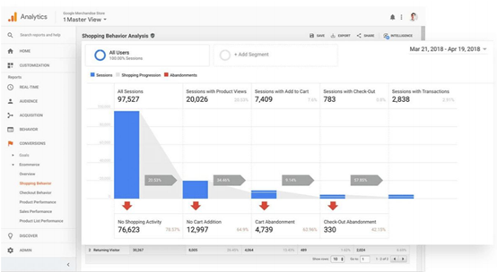

Google Analytics是一款强大的分析和监控工具，帮助企业团体收集、配置和分析关键数据。该工具提出的洞见可基于用户和网站、网络应用、Android和IOS下的APP交互。开发者可以利用Google Analytics的健壮API来创建综合报告和定制化配置。

#### Grafana

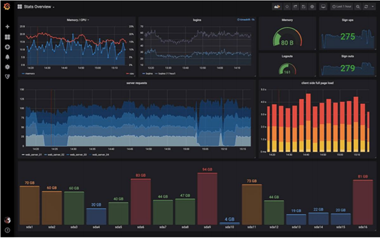

Grafana是一款开源的分析和监测工具，支持十几种用于从源头拉取数据的本地化数据库。它极度可视化，从热力图到直方图，图表到地理图以及各种各样的仪表盘。Grafana还支持团队使用Slack之类的工具发送告警和通知。

#### Azure

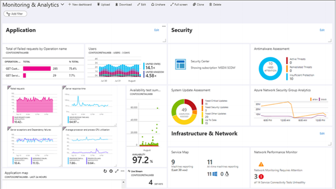

Azure 监测器是微软提供的用于对应用、基础设施和网络进行全局可视化监测的工具。通过Azure Monitor遥测技术实现全站监测，触发式告警和获取日志。

#### AWS

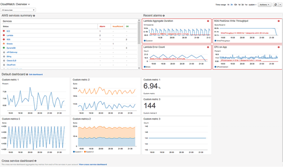

AWS CloudWatch向DevOps工程师、研发人员、SRE工程师和IT经理提供监测和分析的服务。CloudWatch提供数据，研发人员采取行动：利用此工具来监测应用，反馈性能变化，优化资源，获取运维健康状况的概览。

CloudWatch以日志形式收集监控和运维数据，度量指标，提供关于运行在AWS或者内部服务器上的资源、应用和服务的相关信息。

## 国内基于GitLab的Devops产品

GitLab虽然集成了管理、计划、创建、校验、打包、安全、发布、配置、监控、保护的一系列功能，但是在Devops整体流程上，其部分功能仍会被其他主流软件所替代。

通常，GitLab可作为代码托管平台以及代码发布工具，在其他功能上，GitLab不具备统治能力。如Jenkins在代码构建，Deploy上使用较多。

 

### TAPD

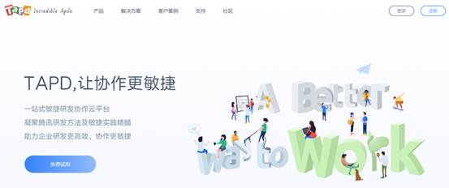

TAPD（Tencent Agile Product Development）腾讯敏捷协作平台，是一款由腾讯公司自主研发的协作及软件研发管理平台。TAPD 沉淀了腾讯十余年敏捷研发文化、研发模式和实践成果，能够帮助企业高效协作和提升研发效能。

TAPD提供看板、在线文档、敏捷需求规划、迭代计划&跟踪、任务工时管理、缺陷跟踪管理、测试计划&用例、持续集成、持续交付&部署等丰富的可配置功能，并提供三种敏捷协作解决方案，满足不同客户场景需要：

1、轻量协作解决方案：适用于不同行业协作场景，满足任务协同，文档协作和沟通交流的场景所需，帮助团队可视化工作进展、沉淀分享项目知识、提升团队协作效率。

2、敏捷研发解决方案：专为产品研发场景打造，针对研发痛点，提供贯穿敏捷研发生命周期的一站式服务，帮助团队提升研发效率，高质量交付成功产品。

3、Devops解决方案：专为DevOps持续交付场景打造，深度整合研发工具链，助力团队高效、可靠地构建与发布产品，快速交付用户价值。

#### 代码集成

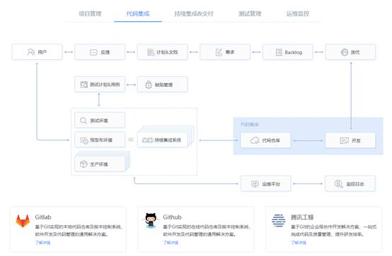

TAPD在代码集成中，支持GitLab、GitHub和腾讯工峰三个代码托管平台。

二次开发增加能力：

Ø 1 代码提交关联

支持关联TAPD业务对象，当团队成员在Github仓储中提交代码时，源码提交记录实时显示

Ø 2 提交趋势统计

支持统计项目下代码提交趋势，配合源码应用使用，即时掌握产品开发动态

Ø 3 成员贡献统计

支持统计团队成员代码提交数据，即时获悉成员代码提交趋势

#### 持续集成&交付

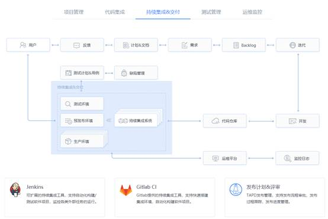

Jenkins：是一个开源自动化服务器，作为一个可扩展的自动化服务器，Jenkins可以用作简单的CI服务器，或者变成任何项目的持续交付中心。社区分厂活跃，插件较为齐全，可以集成打通需求管理，版本管理系统等。

GitLab-CI：GitLab-CI也是一个持续集成平台，支持Shell和yaml，但是社区没有Jenkins活跃，插件不是很齐全

### 高校代码托管

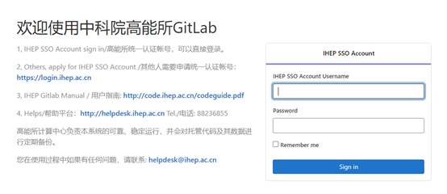

中科院高能所[http://code.ihep.ac.cn/users/sign_in]

GitLab广泛应用于高校或个人构建自己的代码管理平台，利用GitLab的代码托管能力，能够快速的构建代码托管平台，进行统一管理。

### 其他

据了解，国内公司包括百度、阿里、腾讯、美团、B站等都其自身的Devops系统，部门之间所用的基础技术架构也会有所区别，GitLab作为开源软件以代码托管功能广泛应用于各大公司的私有代码平台的构建中，但各公司对外并没有显著的表明自身所用的技术架构，因为这种基础功能没有对外公布的必要。

总的来说，作为代码托管功能，GitLab具有广泛的应用，无论是国内的互联网公司，还是各个高校搭建自身的代码托管平台，都会使用GitLab。然而在Devops的其他功能上，会选择其他的软件，如在代码构建中使用jekins等，对不同的流程使用不同的软件从而构建自身的Devops平台。

## 参考文献

[1] 2021年的十五个DevOps趋势预测. 陈琦

[2] 2021 年 DevOps 的八大趋势. 谷安学院

[3] 2021 DevOpsDays 东京站完美收官. CODING

[4] 什么是DevOps？UCloud云计算

[5] 国内知名大厂都在用的DevOps,它到底有什么魔力？.运维派官方

[6] 号称可替代 GitLab 的开源 DevOps 平台. 非著名程序员

[7] 基于GitLab实现端到端DevOps流水线实践. Devops云学堂

[8] 云原生大规模普及，极狐与GitLab引发中国DevOps井喷.云科技时代

[9] 2020年DEVOPS工具报告. 中国Devops社区

[10] 中国DevOps现状调查报告（2019）.车昕