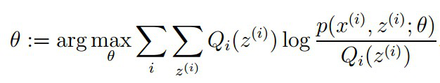

# EM算法

## 预备知识

### 极大似然估计

#### 经典问题——学生身高问题

​    我们需要调查我们学校的男生和女生的身高分布。 假设你在校园里随便找了100个男生和100个女生。他们共200个人。将他们按照性别划分为两组，然后先统计抽样得到的100个男生的身高。假设他们的身高是服从高斯分布的。但是这个分布的均值u和方差∂2我们不知道，这两个参数就是我们要估计的。记作θ=[u, ∂]T。

​    问题：我们知道样本所服从的概率分布的模型和一些样本，而不知道该模型中的参数。

​    我们已知的有两个：

1. 样本服从的分布模型
2. 随机抽取的样本  

需要通过极大似然估计求出的包括：模型的参数

总的来说：极大似然估计就是用来估计模型参数的统计学方法。

####  如何估计

问题数学化： 

1. 样本集
2. 概率密度：p(xi|θ)抽到男生i（的身高）的概率     100个样本之间独立同分布，所以我同时抽到这100个男生的概率就是他们各自概率的乘积。就是从分布是p(x|θ)的总体样本中抽取到这100个样本的概率，也就是样本集X中各个样本的联合概率，用下式表示：

这个概率反映了，在概率密度函数的参数是θ时，得到X这组样本的概率。 需要找到一个参数θ，其对应的似然函数L(θ)最大，也就是说抽到这100个男生（的身高）概率最大。这个叫做θ的最大似然估计量，记为

 

#### 求最大似然函数估计值的一般步骤

首先，写出似然函数：

其次，对似然函数取对数，并整理：

然后，求导数，令导数为0，得到似然方程；

最后，解似然方程，得到的参数即为所求。

 

#### 总结

 　多数情况下我们是根据已知条件来推算结果，而极大似然估计是已经知道了结果，然后寻求使该结果出现的可能性最大的条件，以此作为估计值。

 

### Jensen不等式

#### 定义

​    设是定义域为实数的函数，如果对于所有的实数，的二次导数大于等于0，那么是凸函数。  

​     Jensen不等式表述如下：    如果是凸函数，是随机变量，那么： 。当且仅当是常量时，上式取等号。

 

#### 举例

​    图中，实线是凸函数，X是随机变量，有0.5的概率是a，有0.5的概率是b。X的期望值就是a和b的中值了，图中可以看到成立。     

​    Jensen不等式应用于凹函数时，不等号方向反向。

##  EM算法详述

### 问题描述

​    我们抽取的100个男生和100个女生样本的身高，但是我们不知道抽取的那200个人里面的每一个人到底是从男生的那个身高分布里面抽取的，还是女生的那个身高分布抽取的。 用数学的语言就是，抽取得到的每个样本都不知道是从哪个分布抽取的。 这个时候，对于每一个样本，就有两个东西需要猜测或者估计： （1）这个人是男的还是女的？（2）男生和女生对应的身高的高斯分布的参数是多少？

​    EM算法要解决的问题是： 

1. 求出每一个样本属于哪个分布 
2. 求出每一个分布对应的参数

### 举例说明

身高问题使用EM算法求解步骤：

1. 初始化参数：先初始化男生身高的正态分布的参数：如均值=1.7，方差=0.1
2. 计算每一个人更可能属于男生分布或者女生分布；
3. 通过分为男生的n个人来重新估计男生身高分布的参数（最大似然估计），女生分布也按照相同的方式估计出来，更新分布。
4. 这时候两个分布的概率也变了，然后重复步骤（1）至（3），直到参数不发生变化为止。

### 算法推导

已知：样本集，包含m个独立的样本

未知：每个样本i对应的类别是未知的（相当于聚类）

输出：我们需要估计概率模型的参数θ

目标：找到适合的让最大

 

 

要使L(θ)最大，我们可以不断最大化下界J，来使得L(θ)不断提高，达到最大值。

问题： 什么时候下界J(z,Q)与L(θ)在此点θ处相等？

根据Jensen不等式，自变量X是常数，等式成立。即：

​    由于

​    ，则可以得到：分子的和等于c

​    在固定参数θ后，使下界拉升的Q(z)的计算公式，解决了Q(z)如何选择的问题。这一步就是E步，建立L(θ)的下界。接下来的M步，就是在给定Q(z)后，调整θ，去极大化L(θ)的下界J。

 

### 算法流程

初始化分布参数θ； 重复以下步骤直到收敛：     

E步骤：根据参数初始值或上一次迭代的模型参数来计算出隐性变量的后验概率，其实就是隐性变量的期望。作为隐藏变量的现估计值：

M步骤：将似然函数最大化以获得新的参数值：

 

### 总结

​    期望最大算法（EM算法）是一种从不完全数据或有数据丢失的数据集（存在隐含变量）中求解概率模型参数的最大似然估计方法。

##  参考文献

[EM算法 期望最大化(Expection Maximization)](https://www.cnblogs.com/Gabby/p/5344658.html)

 

 

 

 

 

 

 

 

 

 

 

 