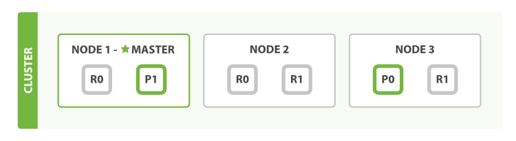

# ElasticSearch

ElasticSearch是一个接近实时的搜索平台，意味着，从索引一个文档直到这个文档被搜索到有一个轻微的延迟

## 基本信息

### 集群（Cluster）

集群，一个ES集群就是由一个或者多个节点组织在一起，他们共同持有你整个数据，并一起提供索引和搜索功能。一个集群由一个唯一的名字标识，这个名字默认是`elasticsearch`。这个名字很重要，因为一个节点只能通过指定某个集群的名字，来加入这个集群。如果由于节点设置为按名称加入集群的话，则该节点只能是集群的一部分。一个`ES`集群由一个或多个节点（`Node`）组成，每个集群都有一个`cluster name`作为标识。

集群是一组具有相同`cluster name`的节点集合，他们协调工作，共享数据并提供故障转移和扩展功能，当然一个节点也可以组成一个集群。

集群的健康状态

> 集群状态通过绿色、黄色、红色来标识
>
> 绿色：一切都很好（集群功能齐全）
>
> 黄色：所有数据均可用，但尚未分配一些副本（集群功能齐全）
>
> 红色：某些数据由于某种原因不可用（集群部分功能）
>
> 【注意】当集群为红色时，它将继续提供来自可用分片的搜索请求，但是需要尽快修复，因为存在尚未分配的分片

检查集群健康状态，我们可以在 `Kibana` 控制台中运行以下命令`GET /_cluster/health`，得到如下信息

```json
{
  "cluster_name": "elasticsearch",
  "status": "yellow",
  "timed_out": false,
  "number_of_nodes": 1,
  "number_of_data_nodes": 1,
  "active_primary_shards": 28,
  "active_shards": 28,
  "relocating_shards": 0,
  "initializing_shards": 0,
  "unassigned_shards": 5,
  "delayed_unassigned_shards": 0,
  "number_of_pending_tasks": 0,
  "number_of_in_flight_fetch": 0,
  "task_max_waiting_in_queue_millis": 0,
  "active_shards_percent_as_number": 84.84848484848484
}
```

```java
{
  "cluster": "sycpb_ind_3",
  "max_task_wait_time": "-",
  "relo": "0",
  "epoch": "1639628430",
  "node.data": "3",
  "pending_tasks": "0",
  "shards": "630",
  "pri": "315",
  "active_shards_percent": "100.0%",
  "status": "green",
  "timestamp": "04:20:30",
  "unassign": "0",
  "node.total": "6",
  "init": "0"
}
```

### 节点（Node）

一个`ES`实例就是一个`node`，一个机器可以有多个实例，所以并不能说一台机器就是一个`node`，大多数情况下每个`node`运行在一个独立的环境或者虚拟机

节点，一个运行的ES实例就是一个节点，节点存储数据并参与集群的索引和搜索功能

一个节点（Node）是你集群中的一个服务器，作为集群的一部分，它存储你的数据，参与集群的索引和搜索功能。

就像集群一样，节点由名称标识，默认情况下，该名称是在启动时分配给节点的随机通用唯一标识符（UUID）。如果不需要默认值，可以定义所需的任何节点名称。此名称对于管理目的非常重要，您可以在其中识别网络中哪些服务器与 Elasticsearch 集群中的哪些节点相对应。

一个节点可以通过配置集群名称的方式来加入一个指定的集群。默认情况下，每个节点都会被安排加入到一个叫做`elasticsearch`的集群中，这意味着，如果你在你的网络中启动了若干个节点，并假定它们能够相互发现彼此，它们将会自动地形成并加入到一个叫做`elasticsearch`的集群中

#### ES集群发现机制

`ES`是一种p2p（pear to pear）的分布式架构设计，集群中的每个节点都可以与其他任意节点相互通讯。这是不同于`hadoop`和`master-slave`的分布式系统

`ES`集群中也存在`master`角色，但是其功能主要是维护集群的元信息（`cluster status`），当任意`node`上的信息修改时，将变更信息同步到其他剩余`Node`上，即每个`Node`都具有一套完整的`cluster status`

ES各节点想组成一个集群有两个必要条件：

1. cluster.name 必须一致
2. 通过discovery.zen.ping.unicast.hosts 可以相互关联起来，discovery.zen.ping.unicast.hosts 列表中的IP列表称为种子节点

### 索引（Index）

索引是具有某些类似特征的文档集合。例如，您可以拥有店铺数据的索引，商品的一个索引以及订单数据的一个索引。

索引由名称标识（必须全部小写），此名称用于在对其中的文档执行索引，搜索，更新和删除操作时引用索引

一系列`documents`的集合

### 类型（Type）

类型，曾经是索引的逻辑类别/分区，允许您在同一索引中存储不同类型的文档，例如，一种类型用于用户，另一种类型用于博客帖子

> **在 6.0.0 中弃用，以后将不再可能在索引中创建多个类型，并且将在更高版本中删除类型的整个概念**

### 文档（Document）

文档是可以建立索引的基本信息单元。例如，您可以为单个客户提供文档，为单个产品提供一个文档，为单个订单提供一个文档。该文档以`JSON`（`JavaScript Object Notation`）表示，`JSON`是一种普遍存在的互联网数据交换格式。

在索引/类型中，您可以根据需要存储任意数量的文档。请注意，尽管文档实际上驻留在索引中，但实际上必须将文档编入索引/分配给索引中的类型。

### 分片（Shards）

索引可能存储大量可能超过单个节点的硬件限制的数据。例如，占用1TB磁盘空间的十亿个文档的单个索引可能不适合单个节点的磁盘，或者可能太慢而无法单独从单个节点提供搜索请求。

为了解决这个问题，`Elasticsearch` 提供了将索引细分为多个称为分片的功能。创建索引时，只需定义所需的分片数即可。每个分片本身都是一个功能齐全且独立的**索引**，可以托管在集群中的任何节点上。

设置分片的目的及原因主要是：

- 它允许您水平拆分/缩放内容量
- 它允许您跨分片（可能在多个节点上）分布和并行化操作，从而提高性能/吞吐量

分片的分布方式以及如何将其文档聚合回搜索请求的机制完全由 `Elasticsearch` 管理，对用户而言是透明的。

在可能随时发生故障的网络/云环境中，分片非常有用，建议使用故障转移机制，以防分片/节点以某种方式脱机或因任何原因消失。为此，`Elasticsearch` 允许您将索引的分片的一个或多个副本制作成所谓的副本分片或简称副本。

`ES`是分布式搜索引擎，每个索引有一个或多个分片，索引的数据被分配到各分片上，相当于一桶水用了`N`个杯子装，分片有助于横向扩展，`N`个分片会被尽可能平均地分配在不同的节点（例如你有`2`个节点，`4`个主分片），那么每个节点会分到`2`个分片，后来你增加了`2`个节点，那么你这`4`个节点上都会有`1`个分片，这个过程叫`relocation`，`ES`感知后自动完成，分片是独立的，对于一个`Search Request`的行为，每个分片都会执行这个`Request`。另外，每个分片都是一个`Luncene Index`，所以一个分片只能存放`Integer.MAX_VALUE-128=2,147,483,519`个`docs`

### 副本（Replicasedit）

副本，是对分片的复制。目的是为了当分片/节点发生故障时提供高可用性，它允许您扩展搜索量/吞吐量，因为可以在所有副本上并行执行搜索。

总而言之，每个索引可以拆分为多个分片。索引也可以复制为零次（表示没有副本）或更多次。复制之后，每个索引将具有主分片(从原始分片复制而来的)和复制分片(主分片的副本)。

可以在创建索引时为每个索引定义分片和副本的数量。创建索引后，您也可以随时动态更改副本数。您可以使用`_shrink` 和 `_splitAPI` 更改现有索引的分片数，但这不是一项轻松的任务，所以预先计划正确数量的分片是最佳方法。

可以理解为备份分片，相应地有`primary shard`（主分片），主分片和备份片不会出现在同一个节点，防止单点故障，默认情况下一个索引会创建`5`个分片`1`个备份片（`5primary+5replica=10个分片`），如果你只有一个节点，那么`5`个`replica`都无法分配（`unassigned`），此时`cluster status`会变成`yellow`。`replica`地作用主要包括：

1. 容灾：`primary`分片丢失，`replica`分片就会被顶上去成为新的主分片，同时根据这个新的主分片创建新的`replica`，集群数据安然无恙
2. 提高查询性能：`replica`和`primary`分片的数据是相同的，所以对于一个`query`既可以从主分片查询，也可以查询备份片，在合适的范围多个`replica`性能会更优（但是考虑资源占用也会提升），另外`index request`（索引请求，添加新文档等）只能发生在主分片上，`replica`不能执行`index request`。对于一个索引，除非重建索引，否则不能调整主分片的数目，但是可以随时调整`replica`数目

默认情况下，Elasticsearch 中的每个索引都分配了5个主分片和1个副本，这意味着如果集群中至少有两个节点，则索引将包含5个主分片和另外5个副本分片（1个完整副本），总计为每个索引10个分片。

### 小结

我们假设有一个集群由三个节点组成(Node1 , Node2 , Node3)。 它有两个主分片(P0 , P1)，每个主分片有两个副本分片(R0 , R1)。相同分片的副本不会放在同一节点，所以我们的集群看起来如下图所示 “有三个节点和一个索引的集群”。



类似于关系型数据库：数据库集群，假如有个用户表，我担心数据量过大，我新建了多个用户表(即 Shard)，将用户信息数据切分成多份，然后根据某种规则分到这些用户表中，我又担心某个表会出现异常造成数据丢失，我又将每个表分别备份了一次(即 Replica )。

**副本是乘法，越多越浪费，但也越保险。分片是除法，分片越多，单分片数据就越少也越分散**

另外，我们可以画一个对比图来类比传统关系型数据库：

> 关系型数据库 -> Databases(库) -> Tables(表) -> Rows(行) -> Columns(列)。
>
> Elasticsearch -> Indeces(索引) -> Types(类型) -> Documents(文档) -> Fields(属性)。

Elasticsearch集群可以包含多个索引(indices)（数据库），每一个索引可以包含多个类型 (Types)（表），每一个类型包含多个文档(documents)（行），然后每个文档包含多个字段(Fields)（列）。

虽然这么类比，但是毕竟是两个差异化的产品，而且上面也说过在以后的版本中类型 (Types) 可能会被删除，所以一般我们创建索引都是一个种类对应一个索引。生鲜就创建商品的索引，生活用品就创建生活用品的索引，而不会说创建一个商品的索引，里面既包含生鲜的类型，又包含生活用品的类型。

而且你可能已经注意到索引(index)这个词在Elasticsearch中有着不同的含义，所以有必要在此做一下区分:

> **「索引」含义的区分**
>
> - **索引（名词）** 如上文所述，一个索引(index)就像是传统关系数据库中的数据库，它是相关文档存储的地方，index的复数是 indices 或 indexes。
> - **索引（动词）** 「索引一个文档」表示把一个文档存储到索引（名词）里，以便它可以被检索或者查询。这很像SQL中的INSERT关键字，差别是，如果文档已经存在，新的文档将覆盖旧的文档。
> - **倒排索引** 传统数据库为特定列增加一个索引，例如B-Tree索引来加速检索。Elasticsearch和Lucene使用一种叫做倒排索引(inverted index)的数据结构来达到相同目的。

## Java Spring ES 配置

### ESConfig

```Java
@Configuration
@PropertySource(value = "classpath:es.properties")
@EnableElasticsearchRepositories(basePackages = "com.repositories")
public class ESConfig {
    private static final String ES_CLIENT_TRANSPORT_SNIFF = "client.transport.sniff";

    @Value("${es.cluster.nodes}")
    private String clusterNodes;

    @Value("${es.cluster.name}")
    private String clusterName;

    @Value("${es.client.transport.sniff}")
    private String transportSniff;

    @Bean(name = "transportClient")
    public Client client() {
        System.setProperty("es.set.netty.runtime.available.processors", "false");
        ElasticsearchProperties properties = new ElasticsearchProperties();
        properties.setClusterNodes(clusterNodes);
        properties.setClusterName(clusterName);
        Map<String, String> additionalProperties = new HashMap<>();
        additionalProperties.put(ES_CLIENT_TRANSPORT_SNIFF, transportSniff);
        properties.setProperties(additionalProperties);
        try {
            return new ElasticsearchAutoConfiguration(properties).elasticsearchClient();
        } catch (Exception e) {
            return null;
        }
    }
    @Bean
    public ElasticsearchTemplate elasticsearchTemplate(@Qualifier("transportClient") Client client) {
        return new ElasticsearchTemplate(client);
    }
}
```

### ESPo

```java
@Builder
@Data
@NoArgsConstructor
@AllArgsConstructor
@Document(indexName = "index_name")
public class ESPo {
    private static final long serialVersionUID = -3705781534102811541L;
    @Id
    private Long Id;
    @Field(type = FieldType.Keyword)
    private String name;
}
```

### ModelRepository

```java
public interface ModelRepository extends ElasticsearchRepository<ESPo, Long> {
}
```

### 使用

```java
@Autowired
private ElasticsearchTemplate elasticsearchTemplate;
```

```java
@Autowired
private ModelRepository modelRepository;
```

## ElasticSearch客户端

```bash
curl localhost:9200
```

```java
{
  "name" : "nvm-sycpb-es-01", // 节点名称
  "cluster_name" : "sycpb-fat1-es", // 集群名称
  "cluster_uuid" : "CEbuZ-x2R7uHUaD91tpOfA", // 集群UUID
  "version" : { // 集群版本信息
    "number" : "5.6.9",
    "build_hash" : "877a590",
    "build_date" : "2018-04-12T16:25:14.838Z",
    "build_snapshot" : false,
    "lucene_version" : "6.6.1"
  },
  "tagline" : "You Know, for Search"
}
```

默认情况下，`Elastic`只允许本机访问，如果需要远程访问，可以修改`Elastic`安装目录的`config/elasticsearch.yml`，去掉`network.host`注释，将它改成`0.0.0.0`，然后重新启动`Elastic`。

```
network.host: 0.0.0.0
```

上面代码中，设成`0.0.0.0`让任何人都可以访问，线上服务不要这样设置，要设成具体的`IP`

### 基本概念

#### Node与Cluster

`Elastic`本质上是一个分布式数据库，允许多台服务器协同工作，每台服务器可以运行多个`Elastic`实例，单个`Elsatic`实例称之为一个节点（`Node`），一组节点构成一个集群（`Custer`）

#### Index

`Elastic`会索引所有字段，经过处理后写入一个反向索引(`Inverted Index`)，查找数据时，直接查找该索引。所以，`Elsatic`数据管理的顶层单元就叫做索引，它是单个数据库的同义词，每个`Index`（即数据库）的名字必须是小写。

查询当前节点的所有`Index`

```
$ curl -X GET 'http://localhost:9200/_cat/indices?v'
```

```
GET _cat/indices
```

#### document

`Index`里面单条的记录称为`Document`（文档），许多条`Document`构成了一个`Index`

```json
{
  "user": "张三",
  "title": "工程师",
  "desc": "数据库管理"
}
```

同一个`Index`里面的`Document`不要求有相同的结构（`scheme`），但是最好保持相同，这样有利于提高搜索效率

#### Type

`Document`可以分组，比如`weather`这个`Index`里面，可以按照城市（北京和上海）分组，也可以按照气候（晴天和雨天）进行分组，这种分组就叫做`Type`，它是虚拟的逻辑分组，用来过滤`Document`

不同的`Type`应该有相似的结构（`schema`），举例来说，`id`字段不能在这个组是字符串，在另一个组是数值。这是与关系型数据库的表一个区别，性质完全不同的数据，比如（`products`和`logs`）应该存成两个`Index`，而不是一个`Index`里面的两个`Type`

```
$ curl 'localhost:9200/_mapping?pretty=true'
```

```
GET _mapping
```

根据规划，`Elastic6.x`只允许每个`Index`包含一个`Type`，`7.x`将会彻底删除`Type`

### 新建和删除Index

【新建`Index`】

```
$ curl -X PUT 'localhost:9200/gaomingtest'
```

```
PUT gaomingtest
```

```json
{
  "acknowledged": true,
  "shards_acknowledged": true,
  "index": "gaomingtest"
}
```

注意`Index`必须要小写

```json
PUT accounts
{
  "mappings": {
    "person":{
      "properties": {
        "user":{
          "type": "text",
          "analyzer": "standard",
          "search_analyzer": "standard"
        },
        "title":{
          "type": "text",
          "analyzer": "standard",
          "search_analyzer": "standard"
        }
      }
    }
  }
}
```

首先新建一个名称为`gaomingtest`的`Index`，里面有一个名称为`person`的`Type`。`person`有两个字段，`user`和`title`

【删除`Index`】

```
$ curl -X DELETE 'localhost:9200/accounts'
```

```
DELETE accounts
```

```json
{
  "acknowledged": true
}
```

### 中文分词设置

```
http://www.ruanyifeng.com/blog/2017/08/elasticsearch.html
```

### 数据操作

#### 新增记录

向指定的 `/Index/Type`发送`PUT`请求，就可以在`Index`里面新增一条记录，比如向`/account/person`发送请求，就可以新增一条人员记录

```
$ curl -X PUT 'localhost:9200/accounts/person/1' -d '
{
  "user": "张三",
  "title": "工程师",
  "desc": "数据库管理"
}'
```

```json
PUT /accounts/person/1
{
    "user": "张三",
  	"title": "工程师",
  	"desc": "数据库管理"
}
```

服务器会返回`JSON`对象，会给出`Index`，`Type`，`Id`，`Version`等信息

```json
{
  "_index":"accounts",
  "_type":"person",
  "_id":"1",
  "_version":1,
  "result":"created",
  "_shards":{"total":2,"successful":1,"failed":0},
  "created":true
}
```

最后的1是该条记录的`Id`，它不一定是数字，任意字符串都可以

新增记录的时候，也可以不指定`Id`，这时要改成`POST`请求

```
$ curl -X POST 'localhost:9200/accounts/person' -d '
{
  "user": "李四",
  "title": "工程师",
  "desc": "系统管理"
}'
```

```json
POST /accounts/person
{
    "user": "张三",
  	"title": "工程师",
  	"desc": "数据库管理"
}
```

```
{
  "_index":"accounts",
  "_type":"person",
  "_id":"AV3qGfrC6jMbsbXb6k1p",
  "_version":1,
  "result":"created",
  "_shards":{"total":2,"successful":1,"failed":0},
  "created":true
}
```

【注意】

如果没有先创建`Index`（这个例子是`accounts`），直接执行上面的命令，`Elastic`也不会报错，而是直接生成指定的`Index`，所以打字的时候要小心，不要写错`Index`的名称。

#### 查看记录

向`Index/Type/Id`发出`GET`请求，就可以查看这条记录‘

```
$ curl 'localhost:9200/accounts/person/1?pretty=true'
// 上面代码请求查看/accounts/person/1这条记录，URL的参数pretty=true表示以易读的格式返回
```

```
GET /Index/Type/1
GET /accounts/person/1
GET /mgk_model/esmgkmodelpo/393093159868182528
```

```json
{
  "_index": "mgk_model",
  "_type": "esmgkmodelpo",
  "_id": "393093159868182528",
  "_version": 1,
  "found": true,
  "_source": {
    "accountId": 10005,
    "modelId": 393093159868182500,
    "modelName": "h5xx",
    "modelType": 1,
    "modelStyle": 10,
    "tradeIds": [
      384085805105614850,
      384085697987285000
    ],
    "modelStatus": 1,
    "id": 393093159868182500
  }
}
```

返回的数据中，`found`表示查询成功，`_source`字段表示返回原始记录

如果`Id`不正确，就查不到数据，`found`字段就是`false`

```json
{
  "_index": "index",
  "_type": "po",
  "_id": "1",
  "found": false
}
```

#### 删除记录

【删除索引】

```
DELETE localhost:9200/accounts
```

```
DELETE /index
```

【删除记录】

```
$ curl -X DELETE 'localhost:9200/accounts/person/1'
```

```
DELETE /accounts/person/1
```

```
DELETE /index/p/393093159868182528
```

#### 更新记录

【更新记录就是使用`PUT`请求，重新发送一次数据】

```
$ curl -X PUT 'localhost:9200/accounts/person/1' -d '
{
    "user" : "张三",
    "title" : "工程师",
    "desc" : "数据库管理，软件开发"
}' 
```

```json
PUT /accounts/person/1
{
    "user" : "张三",
    "title" : "工程师",
    "desc" : "数据库管理，软件开发"
}
```

上面代码中，我们将原始数据从"数据库管理"改成"数据库管理，软件开发"。 返回结果里面，有几个字段发生了变化

```json
{
  "_index":"accounts",
  "_type":"person",
  "_id":"1",
  "_version":2,
  "result":"updated",
  "_shards":{"total":2,"successful":1,"failed":0},
  "created":false
}
```

```json
"_version" : 2,
"result" : "updated",
"created" : false
```

记录的Id没变，但是版本（`version`）从1变成2，操作类型`result`从`created`变成`updated`，`created`字段变成`false`，因此这次不是新建记录

【更新部分数据】

```json
POST /accounts/person/1/_update
{
      "doc":{
          "job_description" : "Systems administrator and Linux specialist"
       }
}
```

```json
{
    "_index": "accounts",
    "_type": "person",
    "_id": "1",
    "_version": 2, // 版本+1
    "found": true,
    "_source": {
        "name": "John",
        "lastname": "Doe",
        "job_description": "Systems administrator and Linux specialist"
    }
}
```

### 数据查询

#### 返回所有的记录

使用`GET`方法，直接请求`/Index/Type/_search`，就会返回所有的记录

```
$ curl 'localhost:9200/accounts/person/_search'
```

```json
{
  "took":2,
  "timed_out":false,
  "_shards":{"total":5,"successful":5,"failed":0},
  "hits":{
    "total":2,
    "max_score":1.0,
    "hits":[
      {
        "_index":"accounts",
        "_type":"person",
        "_id":"AV3qGfrC6jMbsbXb6k1p",
        "_score":1.0,
        "_source": {
          "user": "李四",
          "title": "工程师",
          "desc": "系统管理"
        }
      },
      {
        "_index":"accounts",
        "_type":"person",
        "_id":"1",
        "_score":1.0,
        "_source": {
          "user" : "张三",
          "title" : "工程师",
          "desc" : "数据库管理，软件开发"
        }
      }
    ]
  }
}
```

其中，`took`字段表示该操作的耗时（单位为毫秒），`time_out`字段表示是否超时，`hits`字段表示命中的记录，里面的子字段含义如下：

- `total`：返回记录数
- `max_score`:最高的匹配程度，本例是`1.0`
- `hits`：返回的记录组成的数组

返回的记录中，每条记录都有一个`_score`字段，表示匹配的程度，默认是按照这个字段进行降序排序

#### 全文搜索

`Elastic`的查询非常特别，使用自己的查询语法，要求`GET`请求带有数据体

```
$ curl 'localhost:9200/accounts/person/_search'  -d '
{
  "query" : { "match" : { "desc" : "软件" }}
}'
```

```json
GET /accounts/person/_search
{
    "query": {
        "match": {
            "desc": "软件"
        }
    }
}
```

```json
{
  "took":3,
  "timed_out":false,
  "_shards":{"total":5,"successful":5,"failed":0},
  "hits":{
    "total":1,
    "max_score":0.28582606,
    "hits":[
      {
        "_index":"accounts",
        "_type":"person",
        "_id":"1",
        "_score":0.28582606,
        "_source": {
          "user" : "张三",
          "title" : "工程师",
          "desc" : "数据库管理，软件开发"
        }
      }
    ]
  }
}
```

`Elastic`默认一次返回`10`条结果，可以通过`size`字段改变这个设置

```json
GET /accounts/person/_search
{
    "query": {
        "match": {
            "desc": "软件"
        }
    },
    "size": 1
}
```

上面代码指定，每次只返回一条结果，还可以通过`from`字段，指定位移

```json
GET /accounts/person/_search
{
    "query": {
        "match": {
            "desc": "软件"
        }
    },
    "from": 1,
    "size": 1
}
```

上面代码指定，从位置`1`开始（默认是从位置`0`开始），只返回一条结果

#### 逻辑运算

如果有多个搜索关键字，`Elastic`认为他们是`or`关系

```
$ curl 'localhost:9200/accounts/person/_search'  -d '
{
  "query" : { "match" : { "desc" : "软件 系统" }}
}'
```

```json
GET /accounts/person/_search
{
    "query": {
        "match": {
            "desc": "软件 系统"
        }
    }
}
```

上面代码搜索的是`软件or系统`

如果要执行多个关键字的`and`搜索，必须使用布尔查询

```json
$ curl 'localhost:9200/accounts/person/_search'  -d '
{
  "query": {
    "bool": {
      "must": [
        { "match": { "desc": "软件" } },
        { "match": { "desc": "系统" } }
      ]
    }
  }
}'
```

```json
GET /accounts/person/_search
{
    "query": {
        "bool": {
            "must": [
                {
                    "match" :{
                        "desc": "软件"
                    }
                },
                {
                    "match" : {
                        "desc": "系统"
                    }
                }
            ]
        }
    }
}
```

#### 一般检索

【检索包含`something`的`doc`】

```
GET _search?q=something
```

```
// 全文检索
GET _search?q=field:value
// 特定字段中包含
GET _search?q=job_description:john
```

```
// 查找特定Index下的数据
GET /accounts/person/_search?q=job_description:john
```

### 索引API

#### 插入数据

```json
PUT twitter/tweet/1
{
    "user" : "kimchy",
    "post_date" : "2009-11-15T14:12:12",
    "message" : "trying out Elasticsearch"
}
```

```
{
    "_shards" : { // 分片
        "total" : 2,
        "failed" : 0,
        "successful" : 2
    },
    "_index" : "twitter",
    "_type" : "tweet",
    "_id" : "1",
    "_version" : 1,
    "created" : true,
    "result" : created
}
```

`total`：指示应对索引操作执行了多少个分片副本（主和副本分片）

`successful`：指示索引操作成功的碎片副本数

`failed`：在副本碎片上的索引操作失败时包含与复制相关的错误的数组

索引操作成功 `successful`至少为1

#### 自动索引创建

如果索引未创建，直接使用创建索引语句会自动创建该索引，并且会为未创建的类型创建动态的类型

#### 版面控制

每个被索引的文档都会有版本号，索引请求返回相关联的索引号。当指定了`version`参数时，索引`API`可以选择乐观并发控制。版本控制，可以控制想要操作的文档的版本。例如：事务管理，`read-then-update`。为文档指定一个版本可以保证在操作中文档版本未发生变化。

```
PUT twitter/tweet/1?version=2
{
    "message" : "elasticsearch now has versioning support, double cool!"
}
```

【注意】版本控制是实时的，不会受到最近的查询操作影响。如果不指定版本，将不会执行任何的版本检查

内置的版本控制初始值为`1`，随着每次的更新、删除等版本增加。外置的版本控制可以取代内置的版本控制，如保存在数据库中。为了保证这种功能，需要为外部的版本控制提供`version_type`版本类型，这种版本类型可以是`numeric`或者`long`类型，必须小于`9.2e+18`。使用外部的版本控制时，如果提供的版本号大于当前系统存储的版本号，则接受并通过索引请求，否则（小于等于）提示版本冲突，并且索引操作失败。

#### 版本类型

【internal】

【external】

#### 操作类型

索引操作接受`op_type`参数，可以指定`op_type=create`强制创建操作，当`create`指定，如果被创建的文档id在索引中已经存在则会失败。

```json
PUT twitter/tweet/1?op_type=create
{
    "user" : "kimchy",
    "post_date" : "2009-11-15T14:12:12",
    "message" : "trying out Elasticsearch"
}
```

```json
PUT twitter/tweet/1/_create
{
    "user" : "kimchy",
    "post_date" : "2009-11-15T14:12:12",
    "message" : "trying out Elasticsearch"
}
```

#### ID自动生成

未指定`id`索引操作也可以被执行，`id`会自动生成。此外，`op_type`会被自动设置为`create`

```json
POST twitter/tweet/
{
    "user" : "kimchy",
    "post_date" : "2009-11-15T14:12:12",
    "message" : "trying out Elasticsearch"
}
```

#### Routing

指定在哪个分片上存储

```json
POST twitter/tweet?routing=kimchy
{
    "user" : "kimchy",
    "post_date" : "2009-11-15T14:12:12",
    "message" : "trying out Elasticsearch"
}
```

使用文档的`ID`进行`hash`，散列到分片中

#### Parents & children

#### timeout

```json
// 5分钟
PUT twitter/tweet/1?timeout=5m
{
    "user" : "kimchy",
    "post_date" : "2009-11-15T14:12:12",
    "message" : "trying out Elasticsearch"
}
```

```
https://www.elastic.co/cn/blog/a-practical-introduction-to-elasticsearch
```

### ElasticSearch聚合

`Elasticsearch`有一个功能叫做聚合，它允许你在数据集上生成复杂的分析统计，它很像`Sql`中的`Group by`，但是功能更加强大

`Aggregation`种类分为：

1. `Metrics`，`Metrics`是简单的对过滤出来的数据集进行`avg`，`max`等操作，是一个单一的数值
2. `Bucket`，`Bucket`则可以理解为将过滤出来的数据集按条件分成多个小数据集，然后`Metrics`会分别作用在这些小数据集上

#### 聚合概念

和查询`DSL`一样，聚合（`Aggregations`）也拥有一种可组合（`Composable`）的语法；独立的功能单元可以被混合在一起来满足你的要求。这意味着需要学习的基本概念虽然不多，但是他们的组合方式是几近无穷的。

两个概念：

`Buckets`（桶）
满足某个条件的文档集合

`Metrics`（指标）
为了某个桶的文档计算得到的统计信息

每个聚合只是简单地由一个或者多个桶，零个或者多个指标组合而成，可以将它粗略地转换为`SQL`

```sql
SELECT COUNT(color)
FROM table
GROUP BY color
```

已上`count`(`color`)就相当于一个指标，`Group By color`则相当于一个桶

桶和`SQL`中的组(`Grouping`)拥有相似的概念，而指标则与`COUNT(),SUM(),MAX()`相似

一个桶就是满足特定条件的一个文档集合

1. 一名员工要么属于男性桶，或者女性桶
2. 城市`Albany`属于`New York`州这个桶
3. 日期`2014-10-28`属于十月份这个桶

随着聚合被执行，每份文档中的值会被计算来决定它们是否匹配了桶的条件。

如果匹配成功，那么该文档会被置入该桶中，同时聚合会继续进行

桶也能够嵌入在其他桶中，能让你完成层次或者条件划分这些需求。比如，`Cincinnati`可以被放置在`Ohio`州这个桶中，而整个`Ohio`州则能够被放置在美国这个桶中。

`ES`中有很多类型的桶，让你可以将文档通过多种方式进行划分（按小时，按最流行的词条，按地理位置，以及更多），但是从根本上，他们都是根据相同的原理运行，按照条件对文档进行划分。

#### 指标

桶能够让我们对文档进行有意义的划分，但是最终我们还是需要对每个桶中的文档进行某种指标计算。

分桶是达到最终目的的手段，提供了对文档进行划分的方法，从而让你能够计算需要的指标

多数指标仅仅是简单的数学运算，（比如`min`，`mean`，`max`以及`sum`），他们使用文档中的值进行计算。在实际应用中，指标能够让你计算例如平均薪资，最高出售价格，或者百分之`95`的查询延迟

#### 将二者结合起来

一个聚合就是一些桶和指标的组合，一个聚合可以只有一个桶，或者一个指标，或者每样一个。在桶中甚至可以有多个嵌套的桶，比如，我们可以将文档按照其所属国家进行分桶，然后对每个桶计算其平均薪资（一个指标）

因为桶是可以嵌套的，我们能够实现一个更加复杂的聚合操作

1. 将文档按照国家进行分桶
2. 然后将每个国家的桶再按照性别分桶
3. 然后将每个性别的桶按照年龄区间进行分桶
4. 最后，为了每个年龄区间计算平均薪资

此时，就能够得到每个<国家，性别，年龄>组合的平均薪资信息了，它可以通过一个请求，一次数据遍历来完成

### JavaAPI

现有的索引数据

index：school
type：student

```json
{"grade":"1", "class":"1", "name":"xiao 1"}
{"grade":"1", "class":"1", "name":"xiao 2"}
{"grade":"1", "class":"2", "name":"xiao 3"}
{"grade":"1", "class":"2", "name":"xiao 4"}
{"grade":"1", "class":"2", "name":"xiao 5"}
```

```java
package test;
 
import java.util.Iterator;
import java.util.Map;
 
import org.elasticsearch.action.search.SearchRequestBuilder;
import org.elasticsearch.action.search.SearchResponse;
import org.elasticsearch.action.search.SearchType;
import org.elasticsearch.search.aggregations.Aggregation;
import org.elasticsearch.search.aggregations.AggregationBuilders;
import org.elasticsearch.search.aggregations.bucket.terms.StringTerms;
import org.elasticsearch.search.aggregations.bucket.terms.Terms.Bucket;
import org.elasticsearch.search.aggregations.bucket.terms.TermsBuilder;
import org.junit.Test;
 
import utils.NesUtils;
 
public class TestAggregation
{
    @Test
    public void testAggregation()
    {
        SearchRequestBuilder srb = NesUtils.getSearcher("school");
        srb.setTypes("student");
        srb.setSearchType(SearchType.COUNT);
        
        TermsBuilder gradeTermsBuilder = AggregationBuilders.terms("gradeAgg").field("grade");
        TermsBuilder classTermsBuilder = AggregationBuilders.terms("classAgg").field("class");
        
        gradeTermsBuilder.subAggregation(classTermsBuilder);
        
        srb.addAggregation(gradeTermsBuilder);
        
        SearchResponse sr = srb.execute().actionGet();
        
        Map<String, Aggregation> aggMap = sr.getAggregations().asMap();
        
        StringTerms gradeTerms = (StringTerms) aggMap.get("gradeAgg");
        
        Iterator<Bucket> gradeBucketIt = gradeTerms.getBuckets().iterator();
        
        while(gradeBucketIt.hasNext())
        {
            Bucket gradeBucket = gradeBucketIt.next();
            System.out.println(gradeBucket.getKey() + "年级有" + gradeBucket.getDocCount() +"个学生。");
            
            StringTerms classTerms = (StringTerms) gradeBucket.getAggregations().asMap().get("classAgg");
            Iterator<Bucket> classBucketIt = classTerms.getBuckets().iterator();
            
            while(classBucketIt.hasNext())
            {
                Bucket classBucket = classBucketIt.next();
                System.out.println(gradeBucket.getKey() + "年级" +classBucket.getKey() + "班有" + classBucket.getDocCount() +"个学生。");
            }
            System.out.println();
        }
    }
}
```

### Aggtrgation聚合

聚合功能为`ES`注入了统计分析的血统，使用户在面对大数据提取统计指标时变得游刃有余，同样的工作，在`Hadoop`中可能需要写`mapreduce`或`hive`，在`mongo`中必须使用大段的`mapreduce`脚本，而在`ES`中仅仅调用一个`API`就能实现

`ES`原有的聚合功能`Facets`在新版本中正式被移除，用`Aggtrgations`替换`Facets`

#### 关于Aggregations

`Aggregations`的部分特性类似于`SQL`语言中的`group by，avg，sum`函数，但是`Aggregations` `API`还提供了更加复杂的统计分析接口

掌握`Aggregations`需要理解两个概念

1. 桶（`BUckets`）：符合条件的文档的集合，相当于`SQL`中的`group by`，比如，在`users`表中，按“地区”聚合，一个人将被分到北京桶或上海桶或者其他桶中，按照”性别聚合“，一个人将被分到男桶或女桶
2. 指标（`Metrics`）：基于`Buckets`的基础山进行统计分析，相当于`SQL`中`count`，`avg`，`sum`等，比如，按”地区“聚合，计算每个地区的人数，平均年龄

对照一个`SQL`来加深我们的理解

```sql
SELECT COUNT(color) FROM table GROUP by color
```

`GROUP BY`相当于做分桶的工作，`COUNT`是统计指标

#### 常用的Metrics

1. `AVG`
2. `Cardinality`
3. `Stats`
4. `Extended Stats`
5. `Percentiles`
6. `Percentile Ranks`

#### Bucket

1. `Filter`
2. `Range`
3. `Missing`
4. `Terms`
5. `Date Range`
6. `Global Aggregation`
7. `Histogram`
8. `Date Histogram`
9. `IPv4 range`
10. `Return only aggregation results`

#### 聚合查询

`ES`中经常使用到的聚合结果集可以被缓存起来，以便更快速的系统响应，这些缓存的结果集和你掠过直接查询的结果是一致的。因为，第一次聚合的条件与结果缓存起来后，`ES`会判断你后续使用的聚合条件，如果聚合条件不变，并且检索的数据块未增更新，`ES`会自动返回缓存的结果

注意聚合结果的缓存只针对`size=0`的请求，还有在聚合请求中使用了动态参数的比如`Date Range`中的`now`，`ES`同样不会缓存结果，因为聚合条件是动态的，即使缓存了结果也没用了。

以球员信息为例，`player`索引的`player type`包含5个字段，姓名，年龄，薪水，球队，场上位置。
`index`的`mapping`为：

```json
"mappings": {
    "player": {
        "properties": {
            "name": {
                "index": "not_analyzed",
                "type": "string"
            },
            "age": {
                "type": "integer"
            },
            "salary": {
                "type": "integer"
            },
            "team": {
                "index": "not_analyzed",
                "type": "string"
            },
            "position": {
                "index": "not_analyzed",
                "type": "string"
            }
        },
        "_all": {
            "enabled": false
        }
    }
}
```

| name     | age  | salary | team | position |
| -------- | ---- | ------ | ---- | -------- |
| james    | 33   | 3000   | cav  | sf       |
| irving   | 25   | 2000   | cav  | pg       |
| curry    | 29   | 1000   | war  | pg       |
| thompson | 26   | 2000   | war  | sg       |
| green    | 26   | 2000   | war  | pf       |
| garnett  | 40   | 1000   | tim  | pf       |
| towns    | 21   | 500    | tim  | c        |
| lavin    | 21   | 300    | tim  | sg       |
| wigins   | 20   | 500    | tim  | sf       |

首先，初始化`Builder`

```java
SearchRequestBuilder sbuilder = client.prepareSearch("player").setTypes("player");
```

接下来举例说明各种聚合操作的实现方法，因为在`es`的`api`中，多字段上的聚合操作需要用到子聚合(`subAggregation`)

**group by/count**

例如要计算每个球队的球员数，如果使用`SQL`语句，应表达如下：

```sql
select team, count(*) as player_count from player group by team;
```

`ES`的`Java API`

```java
TermsBuilder teamAgg= AggregationBuilders.terms("player_count ").field("team");
sbuilder.addAggregation(teamAgg);
SearchResponse response = sbuilder.execute().actionGet();
```

**group by多个field**

例如要计算每个球队每个位置的球员数，如果使用`SQL`语句，应表达如下：

```sql
select team, position, count(*) as pos_count from player group by team, position;
```

ES的Java API

```java
TermsBuilder teamAgg= AggregationBuilders.terms("player_count").field("team");
TermsBuilder posAgg= AggregationBuilders.terms("pos_count").field("position");
sbuilder.addAggregation(teamAgg.subAggregation(posAgg));
SearchResponse response = sbuilder.execute().actionGet();
```

**max/min/sum/avg**

例如要计算每个球队年龄最大/最小/总/平均的球员年龄，如果使用`SQL`语句，应表达如下：

```sql
select team, max(age) as max_age from player group by team;
```

ES的Java API：

```java
TermsBuilder teamAgg= AggregationBuilders.terms("player_count").field("team");
MaxBuilder ageAgg= AggregationBuilders.max("max_age").field("age");
sbuilder.addAggregation(teamAgg.subAggregation(ageAgg));
SearchResponse response = sbuilder.execute().actionGet();
```

**对多个field求max/min/sum/avg**

例如要计算每个球队球员的平均年龄，同时又要计算总年薪，如果使用`SQL`语句，应表达如下：

```sql
select team, avg(age)as avg_age, sum(salary) as total_salary from player group by team;
```

ES的java api：

```java
TermsBuilder teamAgg= AggregationBuilders.terms("team");
AvgBuilder ageAgg= AggregationBuilders.avg("avg_age").field("age");
SumBuilder salaryAgg= AggregationBuilders.avg("total_salary ").field("salary");
sbuilder.addAggregation(teamAgg.subAggregation(ageAgg).subAggregation(salaryAgg));
SearchResponse response = sbuilder.execute().actionGet();
```

**聚合后对Aggregation结果排序**

例如要计算每个球队总年薪，并按照总年薪倒序排列，如果使用`SQL`语句，应表达如下：

```sql
select team, sum(salary) as total_salary from player group by team order by total_salary desc;
```

ES的java api：

```java
TermsBuilder teamAgg= AggregationBuilders.terms("team").order(Order.aggregation("total_salary ", false);
SumBuilder salaryAgg= AggregationBuilders.avg("total_salary ").field("salary");
sbuilder.addAggregation(teamAgg.subAggregation(salaryAgg));
SearchResponse response = sbuilder.execute().actionGet();
```

需要特别注意的是，排序是在`TermAggregation`处执行的，`Order.aggregation`函数的第一个参数是`aggregation`的名字，第二个参数是`boolean`型，`true`表示正序，`false`表示倒序。 

**Aggregation结果条数的问题**

默认情况下，`search`执行后，仅返回`10`条聚合结果，如果想反悔更多的结果，需要在构建`TermsBuilder` 时指定`size`：

```sql
TermsBuilder teamAgg= AggregationBuilders.terms("team").size(15);
```

**Aggregation结果的解析/输出**

得到`response`之后：

```java
Map<String, Aggregation> aggMap = response.getAggregations().asMap();
StringTerms teamAgg= (StringTerms) aggMap.get("keywordAgg");
Iterator<Bucket> teamBucketIt = teamAgg.getBuckets().iterator();
while (teamBucketIt.hasNext()) {
    Bucket buck = teamBucketIt .next();
    //球队名
    String team = buck.getKey();
    //记录数
    long count = buck.getDocCount();
    //得到所有子聚合
    Map subaggmap = buck.getAggregations().asMap();
    //avg值获取方法
    double avg_age= ((InternalAvg) subaggmap.get("avg_age")).getValue();
    //sum值获取方法
    double total_salary = ((InternalSum) subaggmap.get("total_salary")).getValue();
    //...
    //max/min以此类推
}
```

**总结**

```
综上，聚合操作主要是调用了SearchRequestBuilder的addAggregation方法，通常是传入一个TermsBuilder，子聚合调用TermsBuilder的subAggregation方法，可以添加的子聚合有TermsBuilder、SumBuilder、AvgBuilder、MaxBuilder、MinBuilder等常见的聚合操作。

从实现上来讲，SearchRequestBuilder在内部保持了一个私有的 SearchSourceBuilder实例， SearchSourceBuilder内部包含一个List<AbstractAggregationBuilder>，每次调用addAggregation时会调用 SearchSourceBuilder实例，添加一个AggregationBuilder。

同样的，TermsBuilder也在内部保持了一个List<AbstractAggregationBuilder>，调用addAggregation方法（来自父类addAggregation）时会添加一个AggregationBuilder。有兴趣的读者也可以阅读源码的实现。
```

****

### 使用elasticTemplate的scroll查询分页拉取全量数据

`es`中的分页形式，各适用于不同的场景

#### From + Size

在`kibana`中，使用的查询的`DSL`如下：

```
GET /{index_name}/_search
{
    "from":10,
    "size":20,
    "query":{
        "term":{
            "key":"value"
        }
    }
}
```

写成`Sql`类似于

```sql
SELECT * FROM {index_name} where 'key'='value' limit 20 offset 10;
```

即返回第`10-30`条的数据

`ES`在执行这样的分页时候，会从分片里面取到前`30`个结果，然后舍弃前`10`个结果，把剩余的`20`个结果返回

这样带来了几个问题：

1 随着分页不断增加，比如`from` `1000`，`size` `20`，这代表着`ES`要查询出`1020`个结果，然后舍弃前`1000`个结果，非常浪费

2 搜索的震荡问题：如果`ES`是多分片多副本的状态，不设置`preference`参数的话，每次`query`是轮询主分片和副本分片。这样在多次搜索结果的队列里，内部顺序可能会发生不一致。这就导致在使用`from+size`切分的时候，有些`result item`会重复显示，有些则会丢失

为了避免这样的结果，还需要加上`preference`参数，确保针对某个用户时，多页查询时使用的分片一样，保证分片的查询与排序行为一致。

所以这种`from+size`的分页适合的业务场景就像搜索引擎一样这样的，除了爬虫脚本之类的，正常用户一般在浏览前几个搜索结果页面后，就不会往下翻了

#### Scroll游标查询  

需要从`ES`中取回大量数据，全量取回短时间消化不了，占用资源也过大。所以需要分页取回，而经过已上分析，`from`和`size`会给`es`服务器造成巨大的压力。所以这时候需要用`scoll`查询，初次查询时，`scroll`会在`es`服务器上生成一个快照，保存一定的时间，然后客户端可以在此时间内重复从这个快照中拉取数据，而不用重复进行`query`操作

```
scroll查询，可以用来对ES有效地进行大批量的文档查询，而又不用付出深度分页那种代码，。游标查询允许我们先做查询初始化，然后再批量地拉取结果。这就有点像传统数据库中的cursor。
游标查询会取某个时间点的快照数据。 查询初始化之后索引上的任何变化会被它忽略。 它通过保存旧的数据文件来实现这个特性，结果就像保留初始化时的索引 视图 一样。
```

## 参考文献

[Elasticsearch 技术分析（一）： 基础入门](https://www.cnblogs.com/jajian/p/9976900.html)

[ES集群的发现机制](https://blog.csdn.net/zhinengyunwei/article/details/103974477)
