# GBDT

GBDT 的全称是 Gradient Boosting Decision Tree，梯度提升树，在传统机器学习算法中，GBDT算的上TOP3的算法。想要理解GBDT的真正意义，那就必须理解GBDT中的Gradient Boosting 和Decision Tree分别是什么？

 

## Decision Tree：CART回归树

首先，GBDT使用的决策树是CART回归树，无论是处理回归问题还是二分类以及多分类，GBDT使用的决策树通通都是都是CART回归树。为什么不用CART分类树呢？因为GBDT每次迭代要拟合的是梯度值，是连续值所以要用回归树。

对于回归树算法来说最重要的是寻找最佳的划分点，那么回归树中的可划分点包含了所有特征的所有可取的值。在分类树中最佳划分点的判别标准是熵或者基尼系数，都是用纯度来衡量的，但是在回归树中的样本标签是连续数值，所以再使用熵之类的指标不再合适，取而代之的是平方误差，它能很好的评判拟合程度。

回归树生成算法：

输入：训练数据集D:

输出：回归树

在训练数据集所在的输入空间中，递归的将每个区域划分为两个子区域并决定每个子区域上的输出值，构建二叉决策树：

### 选择最优切分变量j与切分点s，求解

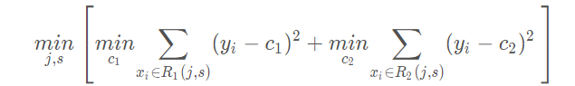

遍历变量j，对固定的切分变量j扫描切分点s，选择使得上式达到最小值的对。

### 用选定的对划分区域并决定相应的输出值

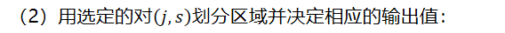

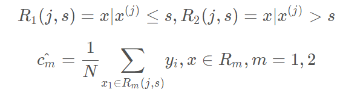

### 继续对两个子区域调用步骤（1）和（2），直至满足停止条件。

### 将输入空间划分为M 个区域 R1,R2,...RM,生成决策树：

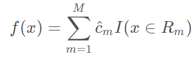

\-------------------------------------------------------------------------------------------------------------------------------------------------------------------------------------------------------------------------------------

 

## Gradient Boosting

### 拟合负梯度

梯度提升树（Grandient Boosting）是提升树（Boosting Tree）的一种改进算法，所以在讲梯度提升树之前先来说一下提升树。

先来个通俗理解：假如有个人30岁，我们首先用20岁去拟合，发现损失有10岁，这时我们用6岁去拟合剩下的损失，发现差距还有4岁，第三轮我们用3岁拟合剩下的差距，差距就只有一岁了。如果我们的迭代轮数还没有完，可以继续迭代下面，每一轮迭代，拟合的岁数误差都会减小。最后将每次拟合的岁数加起来便是模型输出的结果

### 提升树算法

（1）初始化f0(x)=0

（2）对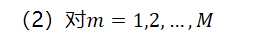

 （a）计算残差

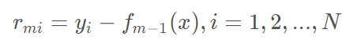

   （b）拟合残差rmi 学习一个回归树，得到hm(x) 

   （c）更新     

（3）得到回归问题提升树

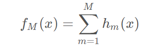

 

上面伪代码中的残差是什么？

在提升树算法中，假设我们前一轮迭代得到的强学习器是   

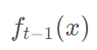

损失函数是

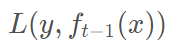

我们本轮迭代的目标是找到一个弱学习器

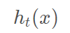

最小化本轮的损失

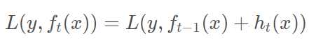

当采用平方损失函数时

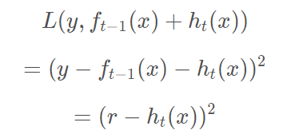

 

这里，

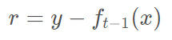

是当前模型拟合数据的残差（residual）所以，对于提升树来说只需要简单地拟合当前模型的残差。

  回到我们上面讲的那个通俗易懂的例子中，第一次迭代的残差是10岁，第二 次残差4岁……

​     当损失函数是平方损失和指数损失函数时，梯度提升树每一步优化是很简单的，但是对于一般损失函数而言，往往每一步优化起来不那么容易，针对这一问题，Friedman提出了梯度提升树算法，这是利用最速下降的近似方法，其关键是利用损失函数的负梯度作为提升树算法中的残差的近似值。

那么负梯度长什么样呢？

第t轮的第i个样本的损失函数的负梯度为：

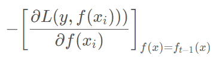

此时不同的损失函数将会得到不同的负梯度，如果选择平方损失

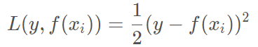

负梯度为

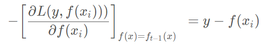

  此时我们发现GBDT的负梯度就是残差，所以说对于回归问题，我们要拟合的就是残差。

  那么对于分类问题呢？二分类和多分类的损失函数都是logloss，本文以回归问题为例进行讲解。

## GBDT算法原理

​     上面两节分别将Decision Tree和Gradient Boosting介绍完了，下面将这两部分组合在一起就是我们的GBDT了。

GBDT算法：

（1）初始化弱学习器

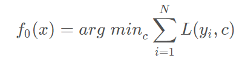

（2）对有：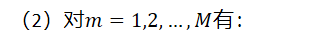

 （a）对每个样本计算负梯度，即残差

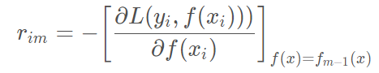

 （b）将上步得到的残差作为样本新的真实值，并将数据(xi,rim)，作为下棵树的训练数据，得到一颗新的回归树fm(x) ，其对应的叶子节点区域为Rjm,...,。其中J为回归树t的叶子节点的个数。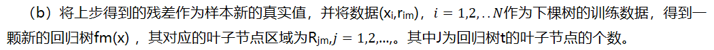

 （c）对叶子区域计算最佳拟合值

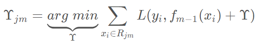

 （d）更新强学习器

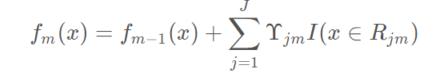

（3）得到最终学习器

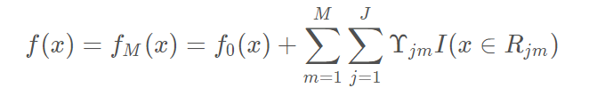

 

## 实例详解

数据介绍：

如下表所示：一组数据，特征为年龄、体重，身高为标签值。共有5条数据，前四条为训练样本，最后一条为要预测的样本。

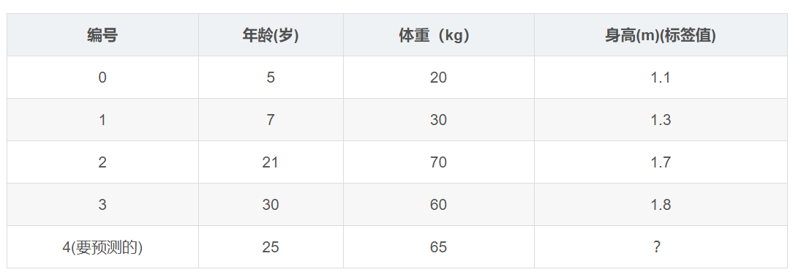

训练阶段：

参数设置：

1. 学习率：learning_rate=0.1
2. 迭代次数：n_trees=5
3. 树的深度：max_depth=3

1.初始化弱学习器:

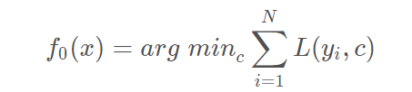

  损失函数为平方损失，因为平方损失函数是一个凸函数，直接求导，倒数等于零，得到c。

令导数等于0

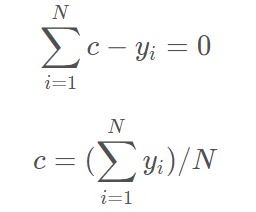

所以初始化时，c 取值为所有训练样本标签值的均值。，此时得到初始学习器f0(x)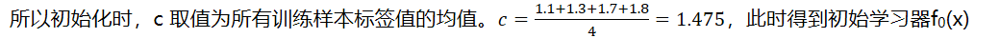

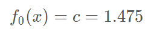

2.对迭代轮数m=1，2,…,M:

  由于我们设置了迭代次数：n_trees=5，这里的M=5 。

  计算负梯度，根据上文损失函数为平方损失时，负梯度就是残差残差，再直白一点就是 y 与上一轮得到的学习器fm−1的差值    

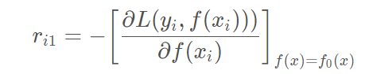

残差在下表列出：

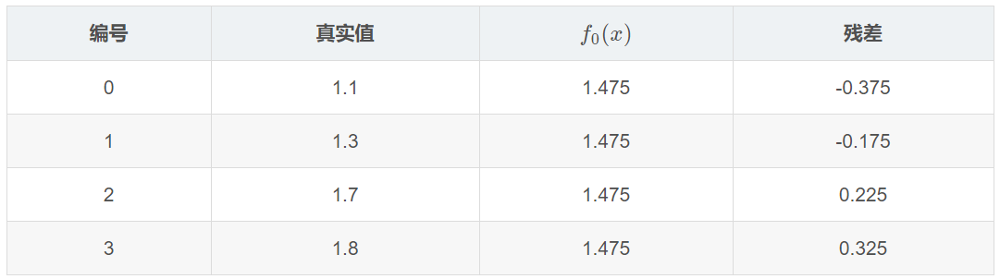

 

此时将残差作为样本的真实值来训练弱学习器f1(x) ，即下表数据

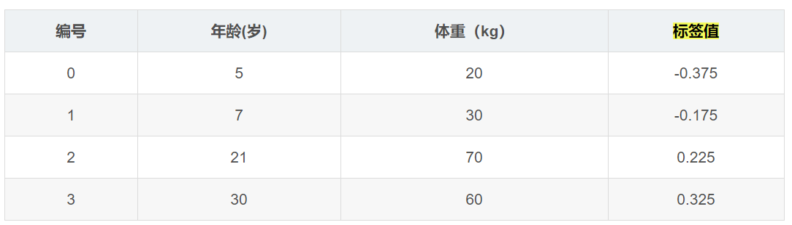

接着，寻找回归树的最佳划分节点，遍历每个特征的每个可能取值。从年龄特征的5开始，到体重特征的70结束，分别计算分裂后两组数据的平方损失（Square Error），SEl 左节点平方损失，SEr 右节点平方损失，找到使平方损失和SEsum=SEl+SEr最小的那个划分节点，即为最佳划分节点。

  例如：以年龄7为划分节点，将小于7的样本划分为到左节点，大于等于7的样本划分为右节点。左节点包括x0，右节点包括样本x1,x2,x3 ，SEl=0, SEr=0.047, SEsum=0.047，所有可能划分情况如下表所示：

 

以上划分点是的总平方损失最小为0.025有两个划分点：年龄21和体重60，所以随机选一个作为划分点，这里我们选 年龄21, 现在我们的第一棵树长这个样子：

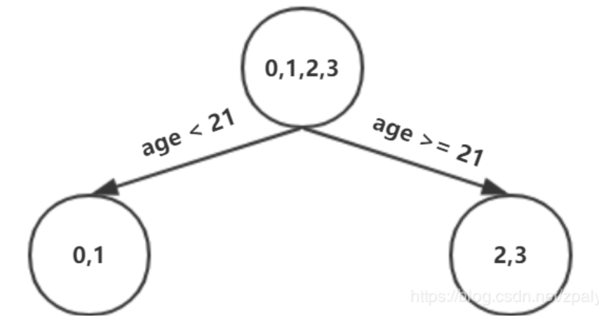

我们设置的参数中树的深度max_depth=3，现在树的深度只有2，需要再进行一次划分，这次划分要对左右两个节点分别进行划分：

对于左节点，只含有0,1两个样本，根据下表我们选择年龄7划分

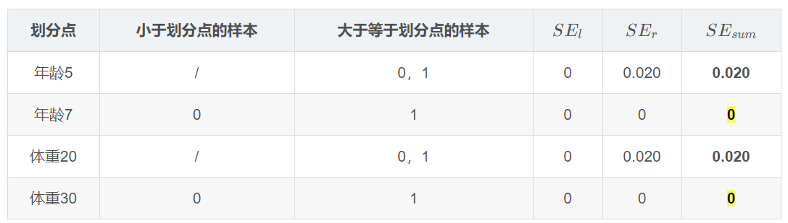

对于右节点，只含有2,3两个样本，根据下表我们选择年龄30划分（也可以选体重70）

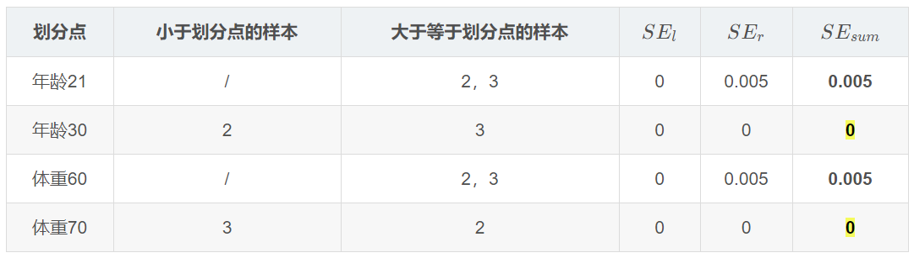

 

现在我们的第一棵树长这个样子：

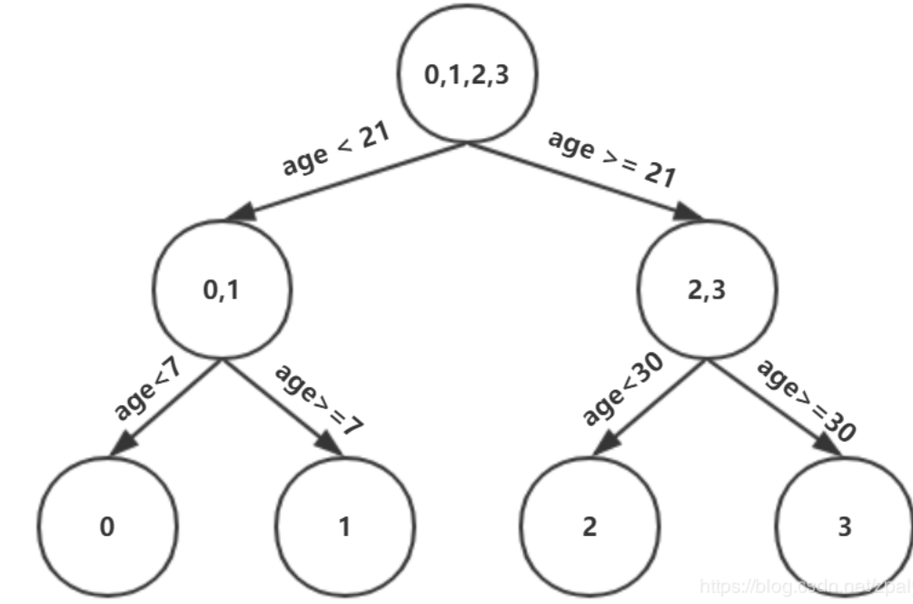

此时我们的树深度满足了设置，还需要做一件事情，给这每个叶子节点分别赋一个参数，来拟合残差。

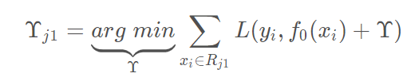

这里其实和上面初始化学习器是一个道理，平方损失，求导，令导数等于零，化简之后得到每个叶子节点的参数，其实就是标签值的均值。这个地方的标签值不是原始的 y，而是本轮要拟合的标残差 
     根据上述划分结果，为了方便表示，规定从左到右为第1,2,3,4个叶子结点

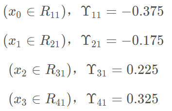

此时的树长这个样子：

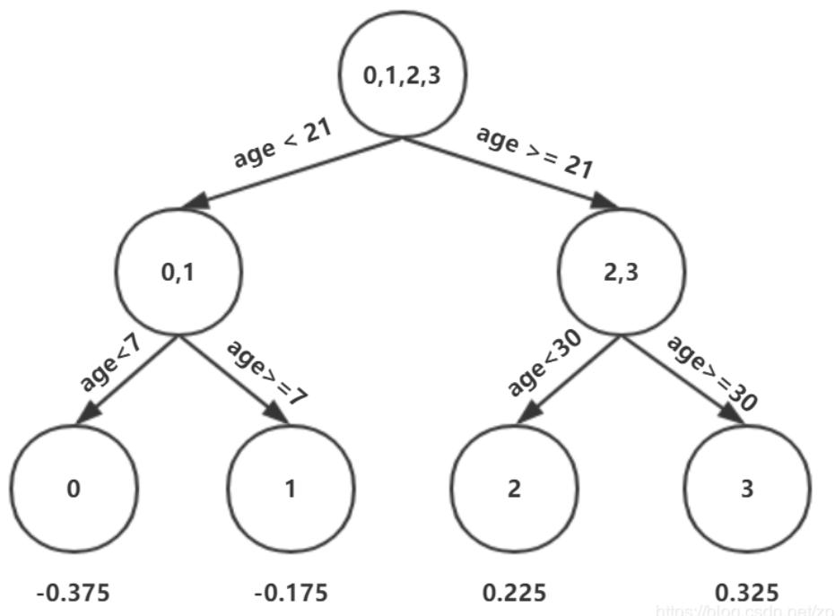

此时可更新强学习器，需要用到参数学习率：learning_rate=0.1，用lr表示

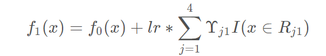

为什么要用学习率呢？这是Shrinkage的思想，如果每次都全部加上（学习率为1）很容易一步学到位导致过拟合。

重复此步骤，直到 m>5 结束，最后生成5棵树。

第一棵：

 

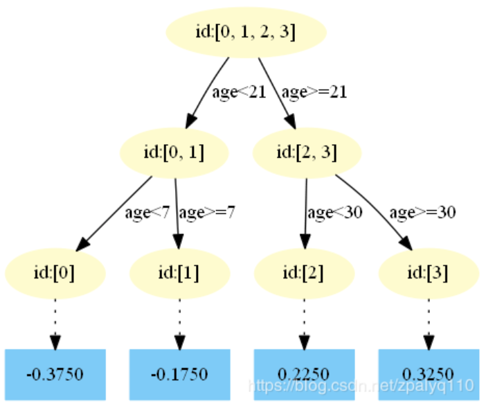

 

第二棵：

 

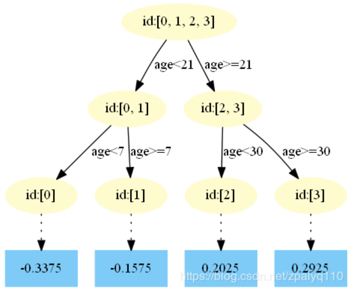

第三棵：

 

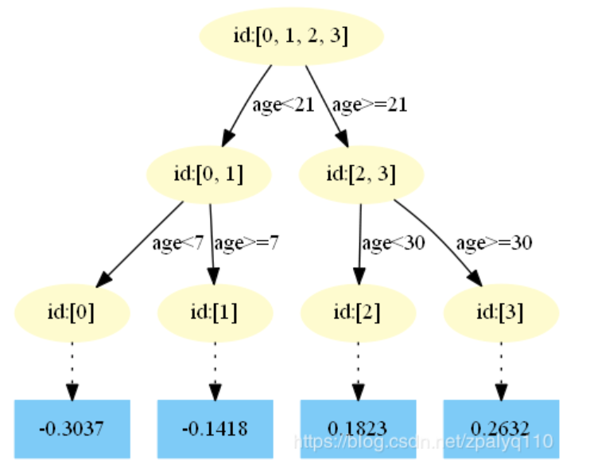

 

第四棵：

![id.[01  -0.2734  -0.1276  age<21 ages=21  id(2, 3]  age<30  id(21  o. 1640  age>=30  0.2369 ](GBDT/clip_image051.png)

 

第五棵：

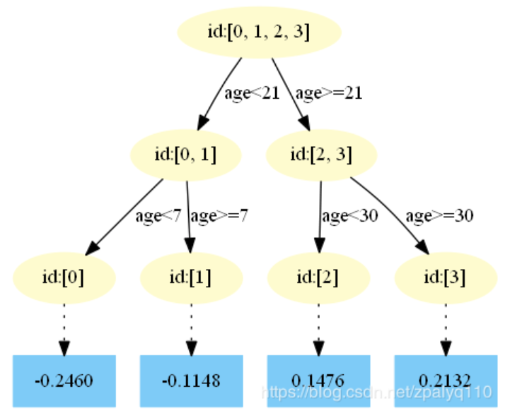

4.得到最后的强学习器：

![5  4  f (œ) f5(x) fo('œ) e R] m)  m=l j=l ](file:///C:/Users/gaoming/AppData/Local/Temp/msohtmlclip1/01/clip_image053.png)

5.预测样本4：

 在中，样本4的年龄为25，大于划分节点21岁，又小于30岁，所以被预测为0.2250。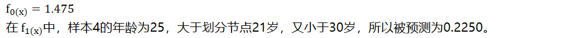

在中，样本4的…此处省略…所以被预测为0.2025

为什么是0.2025？这是根据第二颗树得到的，可以GitHub简单运行一下代码

在中，样本4的…此处省略…所以被预测为0.1823

在中，样本4的…此处省略…所以被预测为0.1640

在中，样本4的…此处省略…所以被预测为0.1476

最终预测结果：

##  参考文献

[GBDT算法原理以及实例理解](https://blog.csdn.net/zpalyq110/article/details/79527653)