# GBDT和XGBoost区别

## 牛顿法

GBDT 在函数空间中利用梯度下降法进行优化 

XGBoost 在函数空间中用牛顿法进行优化 

牛顿法看似比较陌生，在GBDT中梯度下降只是一阶泰勒公式展开，牛顿法就是二阶的泰勒公式展开，在参数空间中： 

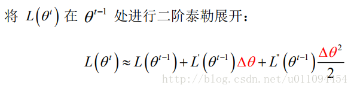

为了简化分析过程，假设参数是标量（即 只有一维），则可将一阶和二阶导数分别记为 g 和 h： 

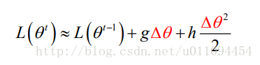

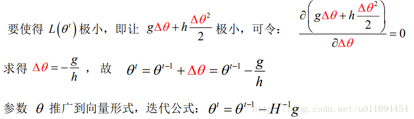

在函数空间中的牛顿法boosting与梯度boosting思想一样，只是f（x）函数变了： 

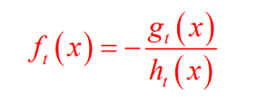

之后还是最终函数等于每次迭代的增量的累加和： 

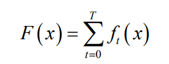

XGBOOST的目标函数

样本进行预测： 

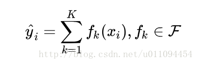

这里k是树的数量，是全部的回归树集合，而f就是其中一个回归树。

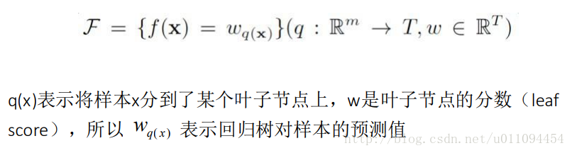

接下来看XGBOOST的目标函数， 

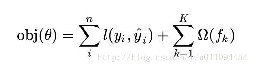

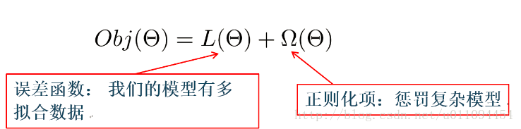

误差函数可以是square loss，logloss等，正则项可以是L1正则，L2正则等。 

将y的预测值带入： 

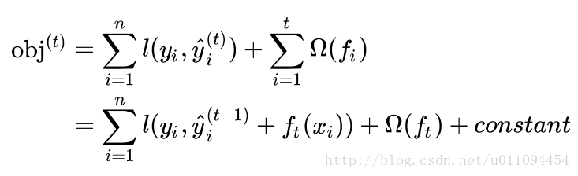

模型要学习的只有第t棵树 ,对进行二阶泰勒展开

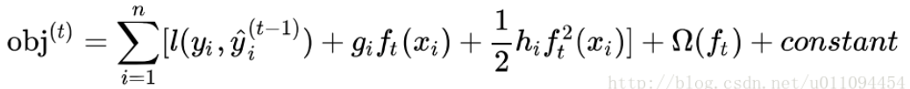

其中： 

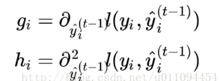

去掉其中的常数项： 

接下来讲公式的后面那个东西：正则项。

## 正则项

上面对GBDT中的分析可以知道它是没有正则项的，在XGBOOST中加入了正则项，但是正则项也不是XGBOOST首先加入的，并不是开创了先河。 

正则项有什么作用呢？简单来说就是可以是的模型不容易过拟合。正则项对每棵回归树的复杂度进行了惩罚，而复杂度可以用树的深度，内部节点个数，叶子节点个数(T)，叶节点分数(w)等来衡量。 

首先对f（x）定义为： 

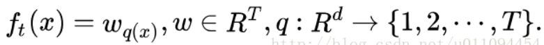

这个定义也要代入在整个目标函数中。在XGBOOST中，复杂度可以用： 

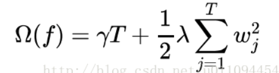

来表示，对叶子节点个数进行惩罚，相当于在训练过程中做了剪枝。

简化目标函数

带入正则项和f（x）： 

![obj  gıWq@i) + îhiW2 ] + —A w2J  .jzı  ieıj  ieıj ](file:///C:/Users/gaoming/AppData/Local/Temp/msohtmlclip1/01/clip_image018.png)

其中第一个约等于式子里： 

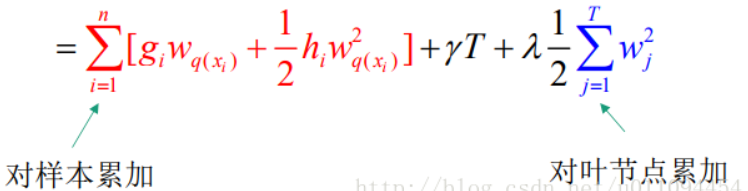

将它们统一起来，定义每个叶节点j上的样本集合： 

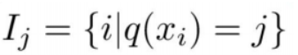

就成了后面的式子。定义: 

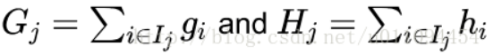

可以得到： 

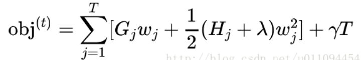

如果确定了树的结构（即q(x)确定），为了使目标函数最小，可以令其导数为0，解得每个叶节点的最优预测分数为： 

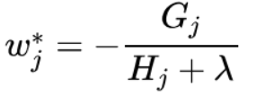

带入目标函数，得到最小损失函数，也就是我们的目标函数为： 

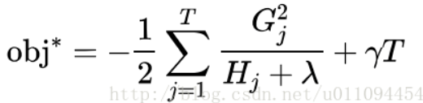

XGBOOST的打分函数

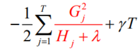

标红部分衡量了每个叶子节点对总体损失的的贡献，我们希望损失越小越好，则标红部分的值越大越好。 

Gain函数： 

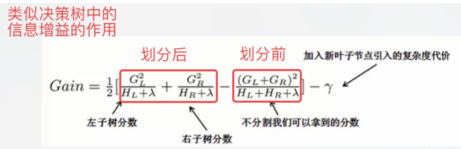

这个公式可以分解为：1）新左叶上的得分2）新右叶上的得分3）原叶上的得分4）附加叶上的正则化 ，所以当对一个叶节点分割时，计算所有候选(feature,value)对应的gain，选取gain最大的进行分割。 

## 其他区别

Shrinkage（缩减）：相当于学习速率（xgboost中的）。XGBoost在进行完一次迭代后，会将叶子节点的权重乘上该系数，主要是为了削弱每棵树的影响，让后面有更大的学习空间。实际应用中，一般把eta设置得小一点，然后迭代次数设置得大一点。（补充：传统GBDT的实现也有学习速率）

缺失值处理：XGBoost考虑了训练数据为稀疏值的情况，可以为缺失值或者指定的值指定分支的默认方向，这能大大提升算法的效率，paper提到50倍。即对于特征的值有缺失的样本，XGBoost可以自动学习出它的分裂方向。（通过枚举所有缺失值在当前节点是进入左子树，还是进入右子树更优来决定一个处理缺失值默认的方向）。
  增益最大的那个特征去做分裂，那么各个特征的增益计算就可以开多线程进行。 XGBoost工具支持并行：Boosting不是一种串行的结构吗?怎么并行的？注意XGBoost的并行不是tree粒度的并行，XGBoost也是一次迭代完才能进行下一次迭代的（第次迭代的损失函数里包含了前面次迭代的预测值）。XGBoost的并行是在特征粒度上的。我们知道，决策树的学习最耗时的一个步骤就是对特征的值进行排序（因为要确定最佳分割点），XGBoost在训练之前，预先对数据进行了排序，然后保存为block(块)结构，后面的迭代中重复地使用这个结构，大大减小计算量。这个block结构也使得并行成为了可能，在进行节点的分裂时，需要计算每个特征的增益，最终选

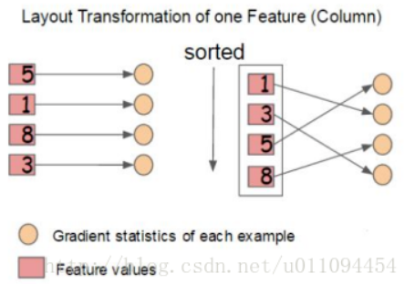

out-of-core 通过将block压缩（block      compressoin）并存储到硬盘上，并且通过将block分区到多个硬盘上（block Sharding）实现了更大的IO      读写速度，因此，因为加入了硬盘存储block读写的部分不仅仅使得xgboost处理大数据量的能力有所提升，并且通过提高IO的吞吐量使得xgboost相比一般实利用这种技术实现大数据计算的框架更快。