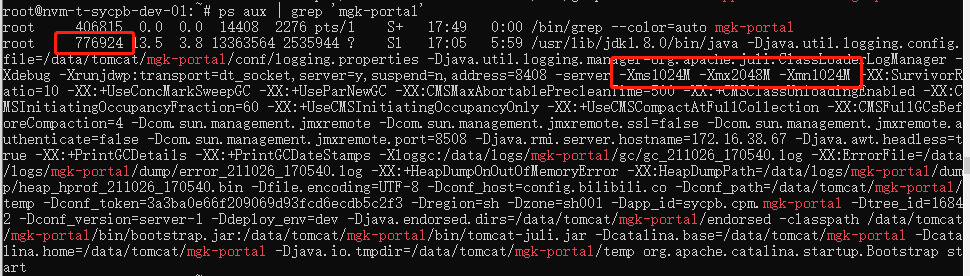
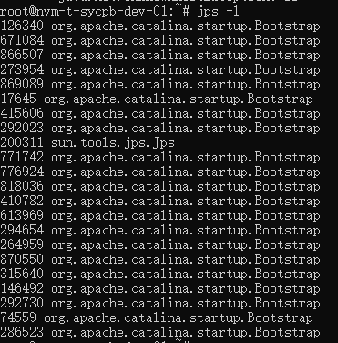
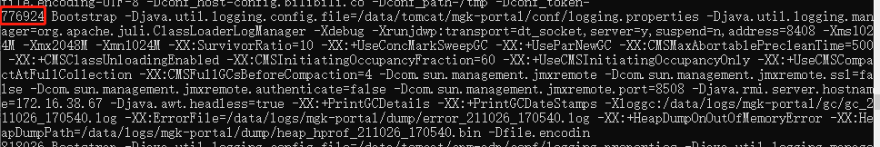
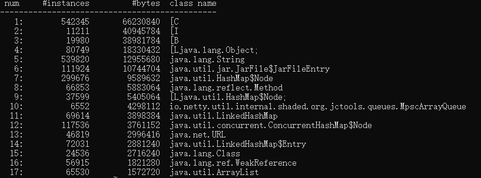
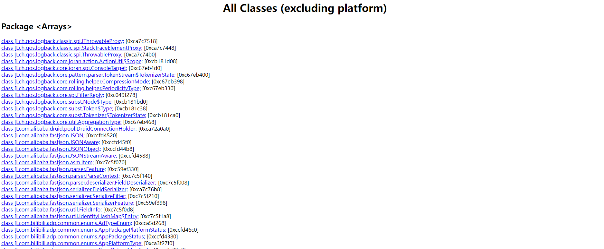

# GC问题排查

## 先检查JVM的启动参数和进程号

```bash
# project name 为项目的应用名称
ps aux | grep 'project name'
# 或者使用
ps -ef | grep project name
```



### 进程参数

```bash
/usr/lib/jdk1.8.0/bin/java -Djava.util.logging.config.file=/data/tomcat/mgk-portal/conf/logging.properties -Djava.util.logging.manager=org.apache.juli.ClassLoaderLogManager -Xdebug -Xrunjdwp:transport=dt_socket,server=y,suspend=n,address=8408 -server -Xms1024M -Xmx2048M -Xmn1024M -XX:SurvivorRatio=10 -XX:+UseConcMarkSweepGC -XX:+UseParNewGC -XX:CMSMaxAbortablePrecleanTime=500 -XX:+CMSClassUnloadingEnabled -XX:CMSInitiatingOccupancyFraction=60 -XX:+UseCMSInitiatingOccupancyOnly -XX:+UseCMSCompactAtFullCollection -XX:CMSFullGCsBeforeCompaction=4 -Dcom.sun.management.jmxremote -Dcom.sun.management.jmxremote.ssl=false -Dcom.sun.management.jmxremote.authenticate=false -Dcom.sun.management.jmxremote.port=8508 -Djava.rmi.server.hostname=172.16.38.67 -Djava.awt.headless=true -XX:+PrintGCDetails -XX:+PrintGCDateStamps -Xloggc:/data/logs/mgk-portal/gc/gc_211026_170540.log -XX:ErrorFile=/data/logs/mgk-portal/dump/error_211026_170540.log -XX:+HeapDumpOnOutOfMemoryError -XX:HeapDumpPath=/data/logs/mgk-portal/dump/heap_hprof_211026_170540.bin -Dfile.encoding=UTF-8 -Dconf_host=config.bilibili.co -Dconf_path=/data/tomcat/mgk-portal/temp -Dconf_token=3a3ba0e66f209069d93fcd6ecdb5c2f3 -Dregion=sh -Dzone=sh001 -Dapp_id=sycpb.cpm.mgk-portal -Dtree_id=16842 -Dconf_version=server-1 -Ddeploy_env=dev -Djava.endorsed.dirs=/data/tomcat/mgk-portal/endorsed -classpath /data/tomcat/mgk-portal/bin/bootstrap.jar:/data/tomcat/mgk-portal/bin/tomcat-juli.jar -Dcatalina.base=/data/tomcat/mgk-portal -Dcatalina.home=/data/tomcat/mgk-portal -Djava.io.tmpdir=/data/tomcat/mgk-portal/temp org.apache.catalina.startup.Bootstrap start
```

-Xms1024M -Xmx2048M -Xmn1024M

1. Xmx：设置JVM最大可用内存为2048M
2. Xms：设置JVM初始内存1024M
3. Xmn：设置JVM最小内存1024M

默认空余堆内存小于40%时，JVM就会增大堆直到-Xmx的最大限制；空余堆内存大于70%时，JVM会减少堆直到 -Xms的最小限制。
因此服务器一般设置-Xms、-Xmx相等以避免在每次GC 后调整堆的大小。对象的堆内存由称为垃圾回收器的自动内存管理系统回收

### 进程号

红色截图部分

776924

当然也可以使用`jps`命令，但是这个命令只能显示一些简单的信息

> 是java提供的一个显示当前所有java进程pid的命令，适合在linux/unix平台上简单察看当前java进程的一些简单情况

比如从`tomcat`启动java程序，使用`jps -l`，只能看到`tomcat`的`Bootstrap`，当一台机器上部署了多个服务器，无法区分



可以使用`jps -V`，列出详细的参数信息



## jvm工具的使用

根据进程`pid`可以执行`jvm`工具的基本查询

### jmap

比如查询进程中的大对象

```bash
# 查询进程中前20的大对象
jmap -histo:live 776924 | head -20
```



### jstack

```
jstack 776924
```

### jhat

1. `jmap -dump:format=b,file=heapdump.hprof 776924`
2. `cd /root`
3. `jhat heapdump.hprof`

浏览器打到http://ip:7000/【注意`ip`地址可访问】



其他查询可参考文档[Jvm工具](https://gaoming95.github.io/2020/07/05/Jvm%E5%B7%A5%E5%85%B7/)

# 参考文档

1. [聊聊 ps aux 和 ps -elf](https://blog.51cto.com/u_10412806/2154827)
2. [线上服务的GC问题排查，看这篇就够了](http://www.360doc.com/content/20/0512/12/58006001_911756240.shtml)
