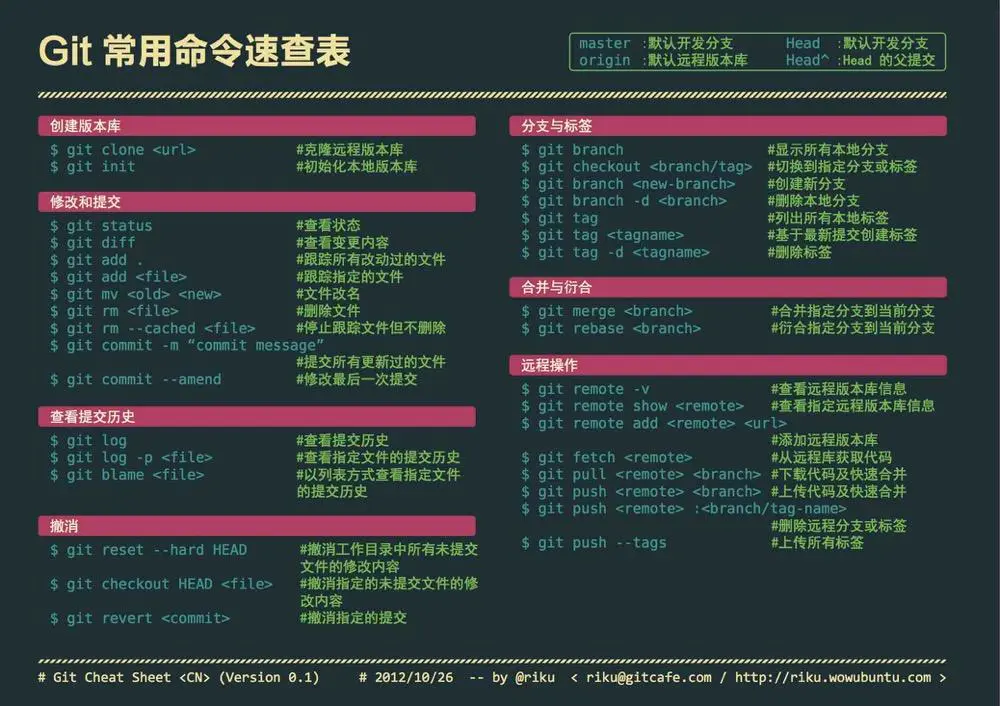

# Git基础

**速查表**



## 配置

```bash
# 显示当前的Git配置
git config --list
# 编辑git配置文件
git config -e [--global]
# 设置提交代码时的用户信息
git config [--global] user.name "[name]"
git config [--global] user.email "[email address]"
# 修改当前的project的用户名的命令
git config user.name [name];
# git修改当前的project提交邮箱的命令
git  config user.email [email address]
```

## 创建

### 创建新仓库

```bash
git init
# git add README.md // 不一定要
git commit -m "first commit"
git branch -M master
git remote add origin [url]
git push -u origin master
```

### 创建版本库 

#### 创建根目录  mkdir git

#### 将目录变成git可管理的仓库 git init

#### 把文件添加到版本库 

把文件添加到仓库 git add lalala.txt  可反复使用 添加多个文件

把文件提交到仓库 git commit -m "可以输入任意内容，最好是本次提交的说明"

#### 版本回退

查看lalala.txt文件一共有几个版本 git log git log --pretty=oneline (此时已有两个版本)

回退到版本1 git re**set** --hard HEAD^ （上一个版本是HEAD^，上上一个版本是HEAD^^，往上一百个白本写成HEAD~100）

重返版本2 git reset --hard (commit id)  (可用git reflog查看）

#### 文件管理器中删除文件 rm lalala.txt 

版本库删除 git rm git commit

版本库恢复（删错了） git checkout -- lalala.txt

### 上传已有仓库

```bash
git remote add origin [url]
git branch -M master
git push -u origin master
```

### 添加远程库

创建SSH Key  ssh-keygen -t rsa -C "youremail@example.com" 

在用户主目录里找到.ssh目录，里面有id_rsa和id_rsa.pub两个文件，这两个就是SSH Key的秘钥对，id_rsa是私钥，不能泄露出去，id_rsa.pub是公钥，可以放心地告诉任何人。

登陆GitHub，打开“Account settings”，“SSH Keys”页面  add ssh key

git remote add origin [url]

第一次把本地库的所有内容推送到远程库 git push -u origin master

把本地master分支的最新修改推送至GitHub git push origin master

### 忽略特殊文件

在Git工作区的根目录下创建一个特殊的.gitignore文件，然后把要忽略的文件名填进去，Git就会自动忽略这些文件

## 克隆

### 克隆Master

```bash
git clone [url]
```

### 克隆分支

```bash
git clone -b branchA [url]
```

## 增加/删除文件

```bash
# 添加指定文件到暂存区
git add [file1] [file2] ...
# 添加指定目录到暂存区，包括子目录
git add [dir]
# 添加当前目录的所有文件到暂存区
git add .
# 添加每个变化前，都会要求确认
# 对于同一个文件的多处变化，可以实现分次提交
git add -p
# 删除工作区文件，并且将这次删除放入暂存区
git rm [file1] [file2] ...
# 停止追踪指定文件，但该文件会保留在工作区
git rm --cached [file]
# 改名文件，并且将这个改名放入暂存区
git mv [file-original] [file-renamed]
```

## 代码提交

```bash
# 提交暂存区到仓库区
git commit -m [message]
# 提交暂存区的指定文件到仓库区
git commit [file1] [file2] ... -m [message]
# 提交工作区自上次commit之后的变化，直接到仓库区
git commit -a
# 提交时显示所有diff信息
git commit -v
# 使用一次新的commit，替代上一次提交
# 如果代码没有任何新变化，则用来改写上一次commit的提交信息
git commit --amend -m [message]
# 重做上一次commit，并包括指定文件的新变化
git commit --amend [file1] [file2] ...
```

## 分支

### 查看分支

```bash
# 列出所有本地分支
git branch
# 列出所有远程分支
git branch -r
# 列出所有本地分支和远程分支
git branch -a
```

### 创建分支

```bash
# 新建一个分支，并切换到该分支
git checkout -b feature/20200610/custom_native_landing_page
// 或者
# 新建一个分支，但依然停留在当前分支
git branch dev
git checkout dev # 切换分支
```

### 比较分支

```bash
git diff [branchA] [branchB]
git diff [branchA] [branchB] >>d:/diff/exportname.diff
```

### master改动，更新dev

```bash
git checkout master 
git pull 
git checkout dev
git merge master 
git push -u origin dev
```

### dev达到标准合并到master 

```bash
git checkout dev
git pull
git checkout master
git merge dev
git push -u origin master
```

## 查看信息

```bash
# 显示有变更的文件
git status
# 显示当前分支的版本历史
git log
# 显示commit历史，以及每次commit发生变更的文件
git log --stat
# 搜索提交历史，根据关键词
git log -S [keyword]
# 显示某个commit之后的所有变动，每个commit占据一行
git log [tag] HEAD --pretty=format:%s
# 显示某个commit之后的所有变动，其"提交说明"必须符合搜索条件
git log [tag] HEAD --grep feature
# 显示某个文件的版本历史，包括文件改名
git log --follow [file]
git whatchanged [file]
# 显示指定文件相关的每一次diff
git log -p [file]
# 显示过去5次提交
git log -5 --pretty --oneline
# 显示所有提交过的用户，按提交次数排序
git shortlog -sn
# 显示指定文件是什么人在什么时间修改过
git blame [file]
# 显示暂存区和工作区的代码差异
git diff
# 显示暂存区和上一个commit的差异
git diff --cached [file]
# 显示工作区与当前分支最新commit之间的差异
git diff HEAD
# 显示两次提交之间的差异
git diff [first-branch]...[second-branch]
# 显示今天你写了多少行代码
git diff --shortstat "@{0 day ago}"
# 显示某次提交的元数据和内容变化
git show [commit]
# 显示某次提交发生变化的文件
git show --name-only [commit]
# 显示某次提交时，某个文件的内容
git show [commit]:[filename]
# 显示当前分支的最近几次提交
git reflog
可以得到cimmit id
# 从本地master拉取代码更新当前分支：branch 一般为master
git rebase [branch]
```

## 远程同步

```bash
$ git remote update  --更新远程仓储
# 下载远程仓库的所有变动
$ git fetch [remote]
# 显示所有远程仓库
$ git remote -v
# 显示某个远程仓库的信息
$ git remote show [remote]
# 增加一个新的远程仓库，并命名
$ git remote add [shortname] [url]
# 取回远程仓库的变化，并与本地分支合并
$ git pull [remote] [branch]
# 上传本地指定分支到远程仓库
$ git push [remote] [branch]
# 强行推送当前分支到远程仓库，即使有冲突
$ git push [remote] --force
# 推送所有分支到远程仓库
$ git push [remote] --all
```

## 撤销

```bash
# 恢复暂存区的指定文件到工作区
$ git checkout [file]
# 恢复某个commit的指定文件到暂存区和工作区
$ git checkout [commit] [file]
# 恢复暂存区的所有文件到工作区
$ git checkout .
# 重置暂存区的指定文件，与上一次commit保持一致，但工作区不变
$ git reset [file]
# 重置暂存区与工作区，与上一次commit保持一致
$ git reset --hard
# 重置当前分支的指针为指定commit，同时重置暂存区，但工作区不变
$ git reset [commit]
# 重置当前分支的HEAD为指定commit，同时重置暂存区和工作区，与指定commit一致
$ git reset --hard [commit]
# 重置当前HEAD为指定commit，但保持暂存区和工作区不变
$ git reset --keep [commit]
# 新建一个commit，用来撤销指定commit
# 后者的所有变化都将被前者抵消，并且应用到当前分支
$ git revert [commit]
# 暂时将未提交的变化移除，稍后再移入
$ git stash
$ git stash pop
```

## 其他

```bash
# 生成一个可供发布的压缩包
git archive
```

## 参考文献

[git命令大全](https://www.jianshu.com/p/46ffff059092)


