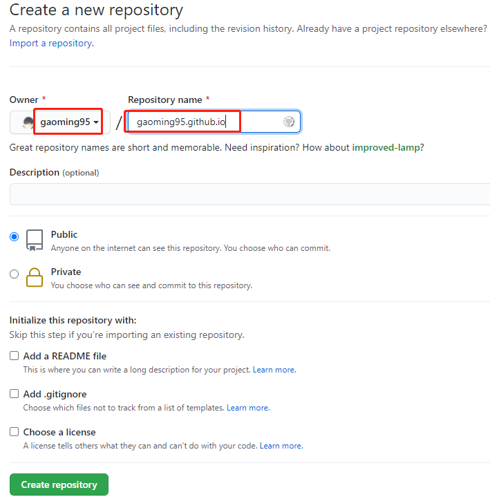
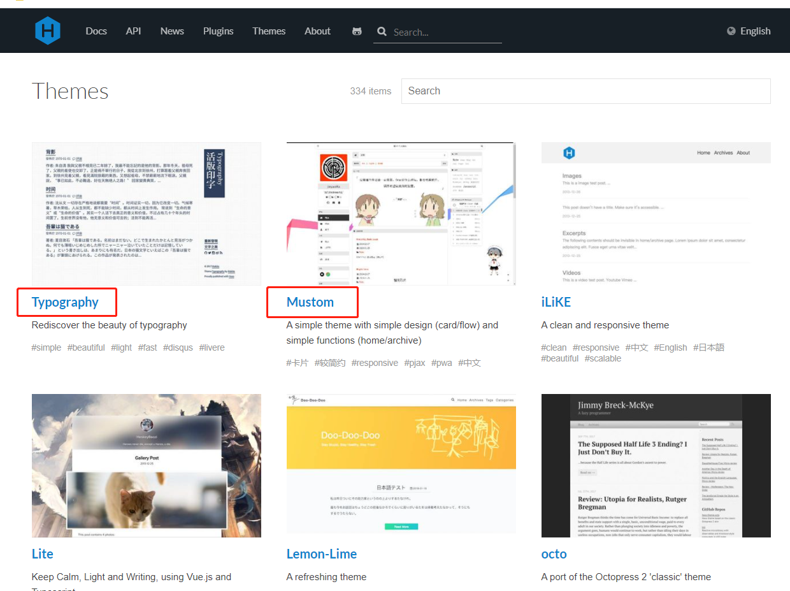
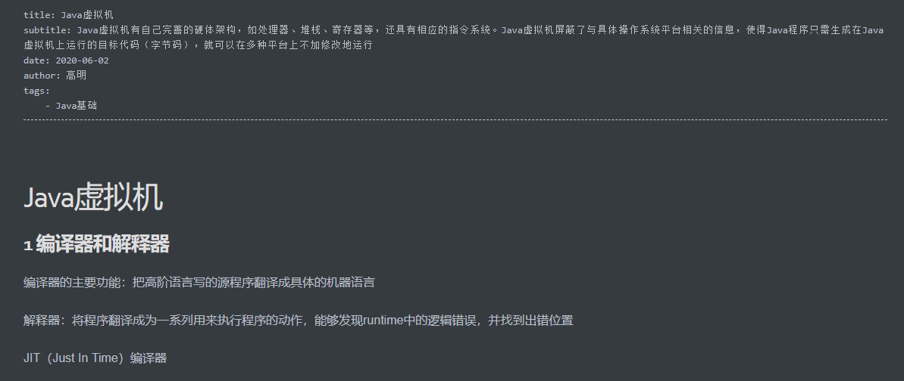
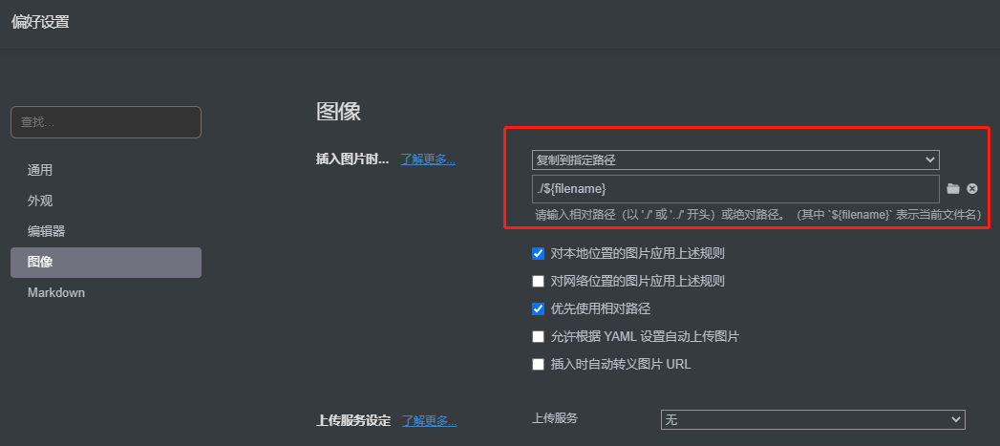
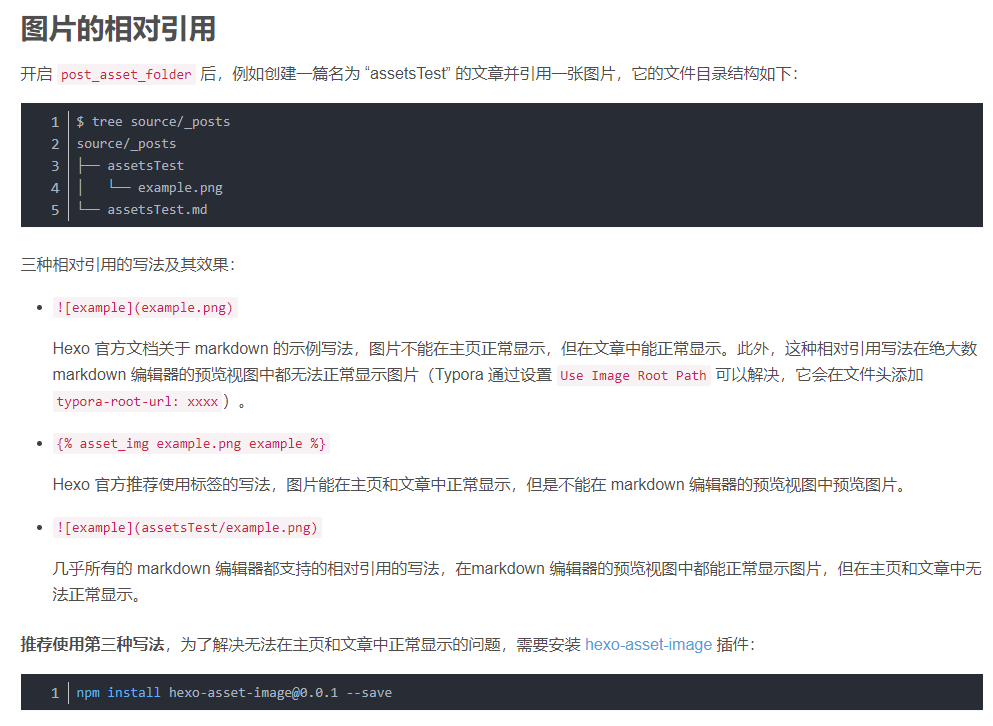
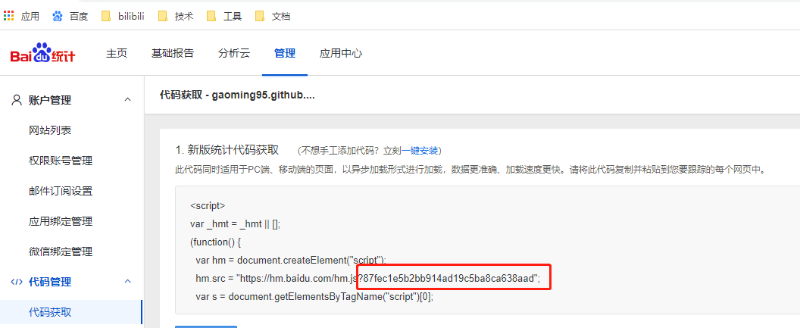
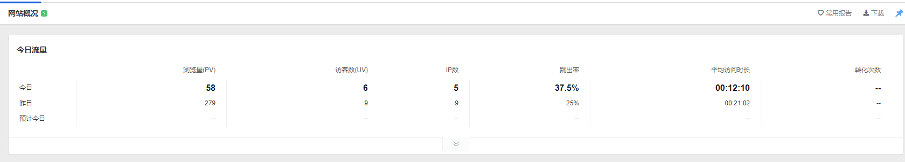
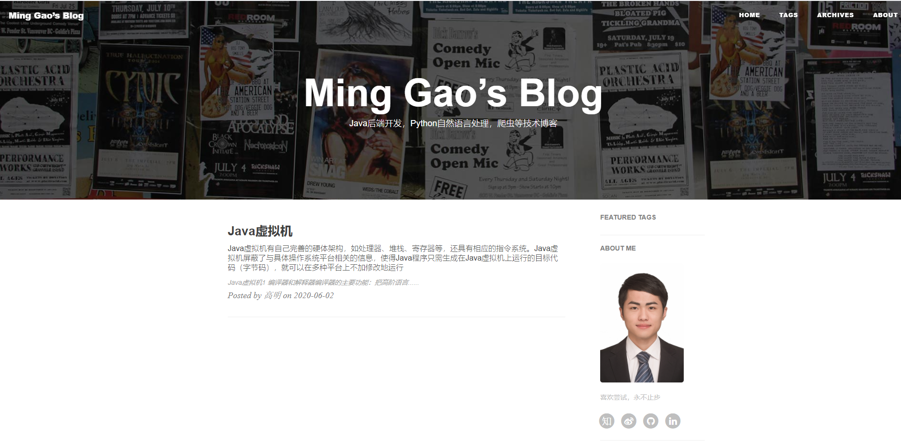

# Hexo搭建个人博客

[github地址](https://github.com/gaoming95/gaoming95.github.io/tree/origin)

[demo](https://gaoming95.github.io/)

1. 安装git
2. 安装nodeJs
3. 安装hexo
4. 配置Typora
5. 配置百度网站统计

****

## Hexo

```
# 安装 hexo
npm install -g hexo-cli
# 查看版本信息
hexo -v
```

```
# 初始化项目
hexo init blog # blog为项目名，可随意更改
# 进入项目
cd blog
# 
npm install
# hexo启动
hexo clean
hexo generate
hexo server # 本地启动
```

访问`localhost:4000`

## 配置github.io

```
# github新建仓库
gaoming95.github.io
```



其中`gaoming95`为用户名，必须配置为`***.github.io`

```
# 进入项目地址
cd blog
# 关联git仓库
git init
git remote add origin http://github.com/****.git
git push -u origin master
```

修改配置文件`/blog/_config.yml`

```
# Hexo Configuration
## Docs: https://hexo.io/docs/configuration.html
## Source: https://github.com/hexojs/hexo/

# Site
title: Ming Gao’s Blog
subtitle: Java后端开发，Python自然语言处理，爬虫等技术博客
author: 高明
language: zh-CN
timezone: Asia/Shanghai

# URL
## If your site is put in a subdirectory, set url as 'http://yoursite.com/child' and root as '/child/'
# url: https://github.com/gaoming95/gaoming95.github.io/
# root: /gaoming95.github.io/
permalink: :year/:month/:day/:title/
permalink_defaults:

# Deployment
## Docs: https://hexo.io/docs/deployment.html
deploy:
  type: git
  repo: https://github.com/gaoming95/gaoming95.github.io.git
  branch: master
```

构建发布

```
hexo clean
hexo generate
#npm install --save hexo-deployer-git
hexo deploy # 发布
```

访问 `https://github.com/gaoming95/gaoming95.github.io/`

## 增加主题

[主题列表](https://hexo.io/themes/)



选择自己喜欢的主题，点击进入代码仓库，按照`readme`进行构建，将`themes`文件夹下面的文件复制到`blog`中的`themes`

在`_config.xml`中配置

```
# Extensions
theme: huxblog
```

走到这步，可以直接`copy`主题仓库中的`_config.xml`代码，或者说如果刚构建项目而不是在已有文章和主题下更换主题，可以考虑直接使用主题仓库的代码

只需要更改`_config.xml`中关于`github.io`的配置

## 增加文章

在`blogs\source\_posts`文件下增加`**.md`文件即可，`md`文件的头可如下编辑

```
title: Java虚拟机
subtitle: Java虚拟机有自己完善的硬体架构，如处理器、堆栈、寄存器等，还具有相应的指令系统。Java虚拟机屏蔽了与具体操作系统平台相关的信息，使得Java程序只需生成在Java虚拟机上运行的目标代码（字节码），就可以在多种平台上不加修改地运行
date: 2020-06-02
author: 高明
tags:
	- Java基础
```



## 增加图片

在`_config.yml`设置`post_asset_folder: true`

开启此配置，在执行`hexo generate`时，会在同级目录下生成资源文件，如`hello.md`，会在`public`文件下生成`hello`文件夹，并在`hello`文件夹下面生成对应的`index.html`和资源文件`example.jpg`

为了方便文章编辑，修改`Typora`的偏好设置，在导入图片时自动生成同级目录

`Typora`在`md`文件中新增图片时，可直接在原位置粘贴，在偏好设置中修改文件存储方式。该方式会在目录下自动生成和`**.md`文件同名的文件夹，用以存储资源文件



此时还会存在问题，编译时地址为出现`http://**/hello/hello/example.jpg`，多了一个相对的路径，此时安装如下插件

```
# 安装插件
npm install hexo-asset-image@0.0.1 --save
```



## 开启百度的数据统计

[百度统计](https://tongji.baidu.com/sc-web)



在`_config.yml`中配置

```
# Analytics settings
# Baidu Analytics
ba_track_id: 87fec1e5b2bb914ad19c5ba8ca638aad
# Google Analytics
# ga_track_id: 'UA-49627206-1'            # Format: UA-xxxxxx-xx
# ga_domain: huangxuan.me
```

效果如下



## 成品如下



****

**【Tips】**

代码主题

```bash
 themes/huxblog/_config.yml
```

