# Java虚拟机

## 编译器和解释器

编译器的主要功能：把高阶语言写的源程序翻译成具体的机器语言

解释器：将程序翻译成为一系列用来执行程序的动作，能够发现runtime中的逻辑错误，并找到出错位置

JIT（Just In Time）编译器

编译型语言：把做好的源程序全部编译成二进制代码的可运行程序，然后，可以直接运行这个程序

解释型语言：把源程序翻译一句，然后执行一句，直至结束。

二者各有优势，当程序需要迅速启动和执行时，解释器可以首先发挥作用，省去编译的时间，立即执行；当程序运行后，随着时间的推移，编译器逐渐会返回作用，把越来越多的代码编译成本地代码后，可以获取更高的执行效率。

## HotSpot Vm

### 热点代码探测技术

把反复多次执行的代码编译成机器码，下次执行的时候就可以直接执行而不再触发解释，以提高程序的运行效率。热点代码探测对象：多次执行的方法和循环体。

JIT编译器对于经常使用的字节码（hotspot），会把包含该代码的整个方法为单位，一次性整个方法的字节码编译成本地字节码然后直接运行编译之后的机器码。

对象：1 被多次调用的方法-标准JIT编译 2 被多次调用的循环体-发生在方法的执行中，称栈上替换（OSR）

#### 方法：方法调用计数器

原则：为每个方法（甚至是代码块）建立计数器，执行次数超过阈值就认为是热点方法

计数器：相对频率，在一定的时间限度内，该方法被调用的次数，超出该时间段未达到阈值，计数器减半—热度衰减的周期成为半周期，该过程在垃圾回收顺便执行

阈值：1500 on client 10000 on server

参数设置：-XX CounterHalfLifeTime 设定半衰期周期时间，-XX CompileThreadhold 设定阈值

#### 循环体：回边计数器

在循环体中添加计数器，执行次数超过阈值就认定是向编译器提交编译请求。

回边指令：字节码中遇到控制流向后跳转的指令称为回边

参数设置：onStackRepalcePercentage 调整阈值

#### 编译过程

JVM中同时运行着两条线程

编程线程（编译器）

执行线程（解释器）

用户可以通过-XX：-BackgroundCompilcation来禁止后台编译，一旦达到JIT的编译条件，执行线程就会先进入等待状态，直到JIT编译完成后执行。

## Java 内存区域与内存溢出异常

在JVM所管理的内存中，大致分为以下几个运行时数据区域

（1）程序计数器：当前线程所执行的字节码的行号指示器

（2）虚拟机栈：Java方法执行的内存模型，用于存储局部变量表、操作数栈、动态链表和方法出口信息等

（3）本地方法栈：本地方法执行的内存模型，和虚拟机栈非常相似，其区别是本地方法栈为JVM使用到的Native方法服务

（4）堆：用于存储对象实例，是垃圾收集器管理的主要区域

（5）方法区：用于存储已被JVM加载的类信息，常量、静态变量、即时编译器编译后的代码等数据

其中，程序计数器、虚拟机栈、本地方法栈是线程私有的，堆和方法区是线程共享的

### 程序计数器

程序计数器，（Program Counter Register），它是一块较小的内存空间，它可以看作是当前线程所执行的字节码的行号指示器。

在java虚拟机的概念模型里面，字节码解释器工作时就是通过改变这个计数器的值来选取下一条需要执行的字节码指令，它是程序控制流的指示器，分支，循环，跳转，异常处理，线程恢复等基础功能都需要依赖这个计算器完成。

假设程序永远只有一个线程，并不需要程序计数器，因为沿着指令的顺序执行下去，即使是分支跳转这样的流程，跳转到指定的指令处按顺序继续执行是完全能够保证程序的执行顺序的。

JVM的多线程是通过时间片轮转算法实现的，即线程轮流切换并分配处理器执行时间。在任何一个确定的时刻，一个处理器都只会执行一条线程中的指令。也就是说，某个线程在执行过程中可能会因为时间片耗尽而被挂起，而另一个线程获取到时间片开始执行。当被挂起的线程重新获取到时间片时候，它想要从被挂起的地方继续执行，就必须知道自己执行到哪个位置。在JVM中，程序计数器就是用来记录某个线程的字节码执行位置。因此，为了线程切换能够恢复到正确的执行位置，每个线程都需要一个独立的程序计数器，即具备线程隔离的特性，各条线程之间计数器互不影响，独立存储（我们称这一类内存区域为线程私有的内存）

【注意】程序计数器记录的值分为两种情况

（1）如果线程正在执行的是一个Java方法，这个计数器记录的是正在执行的虚拟机字节码指令的地址

（2）如果正在执行的是Native方法，这个计数器值为空（Undefined）

Native方法是Java通过JNI（Java Native Interface）直接调用本地的C/C++库，可以近似的认为Native方法相当于C/C++暴露给Java的一个接口，Java通过这个接口从而调用到C/C++方法，由于该方法时通过C/C++而不是Java进行实现，因而无法产生相对应的字节码，并且C/C++执行时的内存分配是由自己语言决定的，而不是JVM决定。

【程序计数器的特点】

（1）线程隔离性（即程序计数器的内存空间时线程私有的），每个线程工作时都有属于自己的独立计数器

（2）执行Java方法时，程序计数器是有值的，且记录的是正在执行的字节码指令的地址

（3）执行Native方法时，程序计数器的值为空（Undefined）

（4）程序计数器占用内存很小，在进行JVM内存计算时，可以忽略不计

（5）程序计数器，是唯一一个在Java虚拟机规范中没有规定任何OutofMemoryError的区域。程序计数器保存的是当前执行的字节码的偏移地址。当执行到下一条指令的时候，改变的只是程序计数器保存的地址，并不需要申请新的内存来保存新的指令地址，因此，永远都不可能内存溢出。

（6）线程计数器，必须是线程被创建开始执行的时候，就要一同被创建。

Java线程总是需要以某种形式映射到OS线程上。映射模型可以是1:1（原生线程模型）、n:1（绿色线程 / 用户态线程模型）、m:n（混合模型）。以HotSpot VM的实现为例，它目前在大多数平台上都使用1:1模型，也就是每个Java线程都直接映射到一个OS线程上执行。此时，native方法就由原生平台直接执行，并不需要理会抽象的JVM层面上的“pc寄存器”概念——原生的CPU上真正的PC寄存器是怎样就是怎样。就像一个用C或C++写的多线程程序，它在线程切换的时候是怎样的，Java的native方法也就是怎样的。

### Java虚拟机栈

每一个线程都有自己的虚拟机栈，也是线程私有的，它的生命周期与线程相同，当线程被创建时，虚拟机也同时被创建；当线程被销毁时，虚拟机栈也同时被销毁。

在线程内部，每个方法被执行时都会同时创建一个栈帧（Stack Frame），用于存储局部变量表、操作数栈、动态链接、方法出口等信息。每一个方法被调用直至执行完成的过程，就对应着一个栈帧在虚拟机栈中从入栈到出栈的过程。其中，局部变量表存放着编译器可知的各种基本的数据类型（boolean、byte、char、short、int、float、long、double）、对象引用（reference类型）和returnAddress类型（指向了一条字节码指令的地址）。其中64位长度的long和double类型的数据会占用2个局部变量空间（Slot），其余的数据类型只占用1个。局部变量表所需的内存空间在编译期间完成分配，当进入一个方法时，这个方法需要在帧中分配多大的局部变量空间是完全确定的，在方法运行期间不会改变局部变量表的大小。

#### 栈与寄存器

虚拟机常见的实现方式有两种：基于栈（Stack Based）和基于寄存器（Register Based）。典型的基于栈的虚拟机有Hotspot VM，.net CLR，而典型的基于寄存器的虚拟机有Lua语言虚拟机LuaVM和Google开发的Android虚拟机DalvikVM。

两者有何不同？例如两数相加的例子a+b，Java源码如下所示：

```Java
int my_add(int a, int b) {
    return a + b;
}
```

使用Javap查看对应的字节，如下所示

```
0: iload_1 // 将 a 压入操作数栈 
1: iload_2 // 将 b 压入操作数栈 
2: iadd    // 将栈顶两个值出栈相加，然后将结果放回栈顶 
3: ireturn // 将栈顶值返回
```

实现相同功能对应的 lua 代码如下

```lua
local function my_add(a, b)
    return a + b;
end
```

使用 luac-l-l-v-s test.lua 命令查看 lua 的字节码，如下所示

```
[1] ADD       R2 R0 R1     ; R2 := R0 + R1
[2] RETURN    R2 2         ; return R2
[3] RETURN    R0 1         ; return 
```

第 1 行调用 ADD 指令将 R0 寄存器和 R1 寄存器中的值相加存储到寄存器 R2 中。第 2 行返回 R2 寄存器的值。第 3 行是 lua 的一个特殊处理，为了防止有分支漏掉了 return 语句，lua 始终在最后插入一行 return 语句。

【优缺点】基于栈和基于寄存器的指令集架构各有优缺点，具体如下所示。

基于栈的指令集架构的优点是移植性更好、指令更短、实现简单，但是不能随机访问堆栈中的元素，完成相同功能所需的指令数一般比寄存器架构多，需要频繁地入栈出栈，不利于代码优化。

基于寄存器的指令集架构的优点是速度快，可以充分利用寄存器，有利于程序做运行速度优化，但操作数需要显式指定，指令较长。

#### 栈帧

栈帧包含：局部变量表、操作数栈、动态链表

在写递归的程序时如果忘记写递归退出的条件，则会报 java.lang.StackOverflowError 异常。比如计算斐波拉契数列，它的计算公式为 f（n）=f（n-1）+f（n-2）在没有递归退出条件的情况下，很容易写出下面的代码

```java
public static int fibonacci(int n) {
    return fibonacci(n - 1) + fibonacci(n - 2);
}
```

运行上面的代码马上会报 java.lang.StackOverflowError 异常。为什么会抛这个异常呢？这就要从栈帧（Stack Frame）讲起。

什么是栈帧呢？栈帧可以理解为一个方法的运行空间。它主要由两部分构成，一部分是局部变量表，方法中定义的局部变量以及方法的参数就存放在这张表中；另一部分是操作数栈，用来存放操作数。我们知道，Java 程序编译之后就变成了一条条字节码指令，其形式类似汇编，但和汇编有不同之处：汇编指令的操作数存放在数据段和寄存器中，可栈中，当执行某条带 n 个操作数的指令时，就从栈顶取 n 个操作数，然后把指令的计算结果（如果有的话）入栈。因此，当我们说 JVM 执行引擎是基于栈的时候，其中的“栈”指的就是操作数栈。

当有一个方法被调用时，代表这个方法的栈帧入栈。当这个方法返回时，其栈帧出栈。因此，虚拟机栈中栈帧的入栈顺序就是方法调用顺序。

Hotspot JVM 是一个基于栈的虚拟机，每个线程都有一个虚拟机栈用来存储栈帧，每次方法调用都伴随着栈帧的创建、销毁。当线程请求分配的栈容量超过Java虚拟机栈允许的最大容量时，Java虚拟机将会抛出StackOverFlowError异常，可以用JVM命令行参数-Xss来指定线程栈的大小，比如-Xss：256用于将 栈的大小设置为256KB。

对比汇编指令和Java字节码指令的执行过程，比如计算1+2时，汇编指令如下：

```
mov ax, 1 ;把 1 放入寄存器 ax
add ax, 2 ;用 ax 的内容和 2 相加后存入 ax
```

而JVM的字节码指令是这样的

```
iconst_1 //把整数 1 压入操作数栈
iconst_2 //把整数 2 压入操作数栈
iadd //栈顶的两个数相加后出栈，结果入栈
```

由于操作数栈是内存空间，所以字节码指令不必担心不同机器上寄存器以及机器指令的差别，从而做到了平台无关。

注意，局部变量表中的变量不可直接使用，如需使用必须通过相关指令将其加载至操作数栈中作为操作数使用。比如有一个方法 void foo()，其中的代码为：int a = 1 + 2; int b = a + 3;，编译为字节码指令就是这样的：

```
iconst_1 //把整数 1 压入操作数栈
iconst_2 //把整数 2 压入操作数栈
iadd //栈顶的两个数出栈后相加，结果入栈；实际上前三步会被编译器优化为：iconst_3
istore_1 //把栈顶的内容放入局部变量表中索引为 1 的 slot 中，也就是 a 对应的空间中
iload_1 // 把局部变量表索引为 1 的 slot 中存放的变量值（3）加载至操作数栈
iconst_3 
iadd //栈顶的两个数出栈后相加，结果入栈
istore_2 // 把栈顶的内容放入局部变量表中索引为 2 的 slot 中，也就是 b 对应的空间中
return // 方法返回指令，回到调用点
```

需要说明的是，局部变量表以及操作数栈的容量的最大值在编译时就已经确定了，运行时不会改变。并且局部变量表的空间是可以复用的，例如，当指令的位置超出了局部变量表中某个变量 a 的作用域时，如果有新的局部变量 b 要被定义，b 就会覆盖 a 在局部变量表的空间。

看完上面的代码大家可能会有几点疑惑：什么是 slot？那些指令是什么意思？为什么 a 对应的 slot 的索引值不是从零开始的，它明明是第一个定义的变量啊？

【Slot】

首先什么是 slot？slot 是局部变量表中的空间单位，虚拟机规范中有规定，对于 32 位之内的数据，用一个 slot 来存放，如 int，short，float 等；对于 64 位的数据用连续的两个 slot 来存放，如 long，double 等。引用类型的变量 JVM 并没有规定其长度，它可能是 32 位，也有可能是 64 位的，所以既有可能占一个 slot，也有可能占两个 slot。

从 Java 语言的层面讲，静态方法和实例方法的本质区别在于是否是对象所共享的。而从 JVM 的角度来看，方法（无论静态方法还是实例方法）其实都是对象共享的，实例变量才是对象私有的。对 JVM 而言，静态方法和实例方法的本质区别在于是否需要和具体对象关联：静态方法可以通过类名来调用，它不需要和具体对象关联；而实例方法必须通过对象来进行调用，它需要和具体对象关联。那么，实例方法和具体对象是如何产生关联的呢？其实很简单，编译器在编译时会将方法接收者作为一个隐含参数传入该实例方法，这个参数在方法中有一个很熟悉的名字，叫做 “this”。之所以实例方法可以访问该类的实例变量和其它实例方法，正是因为它有 “this” 这个隐含参数。举个例子，类 A 中的某个方法 b 需要访问实例变量 x，由于实例变量是对象私有的，如果 b 是静态方法，由于它没有具体对象的引用，它并不知道该访问哪个对象的实例变量 x；如果 b 是实例方法，通过隐含参数 this 就能确定要访问的实例变量是 this.x。那么，为什么静态方法也不能调用该类的实例方法呢？本质原因也是没有 this 引用。因为调用实例方法的前提是要传入一个隐含参数，实例方法本来就有这个引用，所以能够把它作为隐含参数传入另一个实例方法；静态方法没有 this 引用，无法给实例方法提供指向方法接收者的隐含参数，因此不能调用实例方法。

如果看懂了上面说的那些，第三个问题也就迎刃而解了。因为我们定义的方法是 void foo()，它是实例方法，因此会有一个指向具体对象的隐含参数 this，this 就存放在局部变量表的第一个位置，即存放在索引为 0 的 slot 中，又由于它的作用域从方法开始一直到方法结束，因此它在局部变量表中的位置不会被其他变量覆盖，从而使得我们在方法中定义的变量只能放在局部变量表后面的位置中。需要注意的是，如果方法有参数（非隐含参数），那么参数会按顺序紧接着 this 存放在局部变量表中，由于参数作用域也是整个方法体，所以方法中定义的局部变量就只能放在参数后面了。总的来说局部变量表中变量的存放顺序为： this（如果是实例方法）=> 参数（如果有的话）=> 定义的局部变量（如果有的话）。

【JVM 字节码指令】

首先我们要理解 Java 指令的格式，Java 的指令以字节为单位，也就是一个字节代表一条指令。比如 iconst_1 就是一条指令，它占一个字节，那么自然 Java 指令不会超过 256 条。实际上 Java 指令目前定义了 200 多条。指令虽然是一个字节，但是它也可以带自己的操作数。JVM 中有这样一条指令 putstatic，其作用是给特定的的静态字段赋值。但是给哪个字段赋值呢？仅仅通过这条指令并不能说明，那么只有通过操作数来指定了。紧跟在 putstatic 后面的两个字节就是它的操作数，这个操作数是一个索引值，指向运行时常量池中该静态字段对应的符号引用。由于符号引用包含了该字段的基本信息，如所属类、简单名称以及描述符，因此 putstatic 指令就知道是给哪个类的哪个字段赋值了。

指令的操作数分两种：一种是嵌入在指令中的，通常是指令字节后面的若干个字节；另一种是存放在操作数栈中的。为了区别，我们把前者叫做嵌入式操作数，把后者叫做栈内操作数。这两者的区别是：嵌入式操作数是在编译时就已经确定的，运行时不会改变，它和指令一样存放于类文件方法表的 Code 属性中；而操作数是运行时确定的，即程序在执行过程中动态生成的。拿 putstatic 指令来说，它有一个嵌入式操作数，该操作数是一个索引值（前面已经提到），它由两个字节组成，紧跟在 putstatic 对应的字节之后；同时它还有一个栈内操作数，位于操作数栈的栈顶，这个操作数就是要赋给静态字段的值，其对应的字节数根据静态字段的类型决定。如果静态字段的类型是 short、int、boolean、char 或者 byte，那么这个操作数就必须是 int 类型，即由栈顶的 4 个字节组成；如果是 float、double 或者 long 类型，那么操作数就是相应的类型，即由栈顶的 4 个、8 个 或者 8 个 字节组成；如果静态字段是引用类型，那么这个操作数的类型也必须是引用类型，即由栈顶的 8 个字节组成。

### 本地方法栈

本地方法栈（Native Method Stacks）与虚拟机栈所发挥的作用是非常相似的，其区别不过是虚拟机栈为虚拟机执行Java方法（也就是字节码）服务，而本地方法栈则是为虚拟机使用到的Native方法服务。一个Native Method就是一个java调用非java代码的接口。一个Native Method是这样一个java的方法：该方法的实现由非java语言实现，比如C。这个特征并非java所特有，很多其它的编程语言都有这一机制，比如在C＋＋中，你可以用extern "C"告知C＋＋编译器去调用一个C的函数。

虚拟机规范中对本地方法栈中的方法使用的语言、使用方式与数据结构并没有强制规定，所以具体的虚拟机可以自由实现它。甚至有的虚拟机（比如Sun HotSpot虚拟机）直接就把本地方法栈和虚拟机栈合二为一。与虚拟机栈一样，本地方法栈区域也会抛出StackOverflowError和OutOfMemoryError异常。

对于一个运行中的Java程序而言，它可能会用到一些跟本地方法相关的数据区，当某个线程调用一个本地方法时，它就进入到一个全新的并且不再受虚拟机限制的世界。本地方法可以通过本地方法接口来访问虚拟机的运行时数据区。本地方法本质上依赖于实现，虚拟机实现的设计者们可以自由地决定使用怎样的机制来让Java程序调用本地方法。任何本地方法接口都会使用某种本地方法栈，当线程调用Java时，虚拟机会创建一个新的栈帧并压入Java栈，然而当它调用的是本地方法时，虚拟机会保持Java栈不变，不再在线程的Java栈中压入新的帧，虚拟机只是简单地动态链接并直接调用指定的本地方法。如果某个虚拟机实现的本地方法接口是使用C连接模型的话，那么它的本地方法栈就是C栈。当C程序调用一个C函数时，其栈操作都是确定的。传递给该函数的参数以某个确定的顺序压入栈，它的返回值也以确定的方式传回调用者。同样，这就是虚拟机实现中本地方法栈的行为。很可能本地方法接口需要回调Java虚拟机中的Java方法，在这种情况下，该线程会保存本地方法栈的状态并进入到另一个Java栈。

```Java
public class IHaveNatives
    {
      native public void Native1( int x ) ;
      native static public long Native2() ;
      native synchronized private float Native3( Object o ) ;
      native void Native4( int[] ary ) throws Exception ;
    } 
```

标识符Native可以与所有其他的java标识符连用，但是abstract除外，因为native暗示这些方法是有实现体的，只不过这些实现体是非java的，但是abstract却显然的指明这些方法无实现体。Native与其他Java标识符连用时，其意义同非Native Method方法并无差别。

比如native static表明这个方法可以在不产生类的实例时直接调用，上面的第三个方法用到了native synchronized，JVM在进入这个方法的实现体之前会执行同步锁机制（就像java的多线程。）一个native method方法可以返回任何java类型，包括非基本类型，而且同样可以进行异常控制。这些方法的实现体可以制一个异常并且将其抛出，这一点与java的方法非常相似。当一个native method接收到一些非基本类型时如Object或一个整型数组时，这个方法可以访问这非些基本型的内部，但是这将使这个native方法依赖于你所访问的java类的实现。有一点要牢牢记住：我们可以在一个native method的本地实现中访问所有的java特性，但是这要依赖于你所访问的java特性的实现，而且这样做远远不如在java语言中使用那些特性方便和容易。  native method的存在并不会对其他类调用这些本地方法产生任何影响，实际上调用这些方法的其他类甚至不知道它所调用的是一个本地方法。JVM将控制调用本地方法的所有细节。需要注意当我们将一个本地方法声明为final的情况。用java实现的方法体在被编译时可能会因为内联而产生效率上的提升。但是一个native final方法是否也能获得这样的好处却是值得怀疑的，但是这只是一个代码优化方面的问题，对功能实现没有影响。
 如果一个含有本地方法的类被继承，子类会继承这个本地方法并且可以用java语言重写这个方法（这个似乎看起来有些奇怪），同样的如果一个本地方法被fianl标识，它被继承后不能被重写。

【为什么要使用Native Method】

java使用起来非常方便，然而有些层次的任务用java实现起来不容易，或者我们对程序的效率很在意时，问题就来了。有时java应用需要与java外面的环境交互。这是本地方法存在的主要原因，你可以想想java需要与一些底层系统如操作系统或某些硬件交换信息时的情况。本地方法正是这样一种交流机制：它为我们提供了一个非常简洁的接口，而且我们无需去了解java应用之外的繁琐的细节。JVM支持着java语言本身和运行时库，它是java程序赖以生存的平台，它由一个解释器（解释字节码）和一些连接到本地代码的库组成。然而不管怎 样，它毕竟不是一个完整的系统，它经常依赖于一些底层（underneath在下面的）系统的支持。这些底层系统常常是强大的操作系统。通过使用本地方法，我们得以用java实现了jre的与底层系统的交互，甚至JVM的一些部分就是用C写的，还有，如果我们要使用一些java语言本身没有提供封装的操作系统的特性时，我们也需要使用本地方法。Sun的解释器是用C实现的，这使得它能像一些普通的C一样与外部交互。jre大部分是用java实现的，它也通过一些本地方法与外界交互。例如：类java.lang.Thread 的 setPriority()方法是用java实现的，但是它实现调用的是该类里的本地方法setPriority0()。这个本地方法是用C实现的，并被植入JVM内部，在Windows 95的平台上，这个本地方法最终将调用Win32 SetPriority() API。这是一个本地方法的具体实现由JVM直接提供，更多的情况是本地方法由外部的动态链接库（external dynamic link library）提供，然后被JVM调用。

【JVM执行Native Method方法】

我们知道，当一个类第一次被使用到时，这个类的字节码会被加载到内存，并且只会回载一次。在这个被加载的字节码的入口维持着一个该类所有方法描述符的list，这些方法描述符包含这样一些信息：方法代码存于何处，它有哪些参数，方法的描述符（public之类）等等。
  如果一个方法描述符内有native，这个描述符块将有一个指向该方法的实现的指针。这些实现在一些DLL文件内，但是它们会被操作系统加载到java程序的地址空间。当一个带有本地方法的类被加载时，其相关的DLL并未被加载，因此指向方法实现的指针并不会被设置。当本地方法被调用之前，这些DLL才会被加载，这是通过调用java.system.loadLibrary()实现的。

### 堆

Java堆（Java Heap）是Java虚拟机所管理的内存中最大的一块。它是被所有线程共享的一块内存区域，在虚拟机启动时创建。它就是用来存放对象实例的，几乎所有的对象实例都在这里分配内存。

堆是垃圾收集器管理的主要区域，如果从内存回收的角度看，由于现在收集器基本都是采用的分代收集算法，所以Java堆中还可以细分为：新生代和老年代；再细致一点的有Eden空间、From Survivor空间、To Survivor空间等。从内存分配的角度看，线程共享的堆中又可能划分出多个线程私有的分配缓存区（Thread Local Allocation Buffer，TLAB）。

根据Java虚拟机规范的规定，Java堆可以处于物理上不连续的内存空间中，只要逻辑上是连续的即可，就像我们的磁盘空间一样。在实现时，既可以实现成固定大小的，也可以是可扩展的，不过当前主流的虚拟机都是按照可扩展来实现的（通过-Xmx和-Xms控制）。

- Yong（新生代）1/3堆空间（复制算法）
  - Eden（8/10）
  - Survivor（2/10）
    - From（1/10）
    - To（1/10）
- Old（老年代）2/3堆空间（标记清除算法）

【参数设置】
堆的大小可以通过参数 –Xms、-Xmx 来指定
新生代 ( Young ) 与老年代 ( Old ) 的比例的值为 1:2 ( 该值可以通过参数 –XX:NewRatio 来指定 )
Edem : from : to = 8 : 1 : 1 ( 可以通过参数 –XX:SurvivorRatio 来设定 )

JVM 每次只会使用 Eden 和其中的一块 Survivor 区域来为对象服务，所以无论什么时候，总是有一块 Survivor 区域是空闲着的。因此，新生代实际可用的内存空间为 9/10 ( 即90% )的新生代空间。

几乎所有的对象实例都要再堆上分配，但随着JIT编译器的发展与逃逸分析技术逐渐成熟，栈上分配、标量替换优化技术将会导致一些微妙的变化发生，所有的对象都分配在堆上也渐渐变得不是那么“绝对”了。

#### 栈上分配

在我们的应用程序中，其实有很多的对象的作用域都不会逃逸出方法外，也就是说该对象的生命周期会随着方法的调用开始而开始，方法的调用结束而结束，对于这种对象，是不是该考虑将对象不在分配在堆空间中呢？

因为一旦分配在堆空间中，当方法调用结束，没有了引用指向该对象，该对象就需要被gc回收，而如果存在大量的这种情况，对gc来说无疑是一种负担。

因此，JVM提供了一种叫做栈上分配的概念，针对那些作用域不会逃逸出方法的对象，在分配内存时不在将对象分配在堆内存中，而是将对象属性打散后分配在栈（线程私有的，属于栈内存）上，这样，随着方法的调用结束，栈空间的回收就会随着将栈上分配的打散后的对象回收掉，不再给gc增加额外的无用负担，从而提升应用程序整体的性能。

栈上分配需要开启逃逸分析和标量替换

#### 逃逸分析

-XX:+DoEscapeAnalysis
逃逸分析的作用就是判断一个对象的作用域有没有可能逃出一个Java方法的作用域。如下面代码所示：

```java
// u对象逃出alloc的作用域，不符合栈上分配的条件
public class OnStackTest(){
    private static User u;
    public static void alloc(){
        u = new User();
    }
}
```

```Java
// u对象没有逃出alloc的作用域，符合栈上分配的条件
public class OnStackTest(){
    public static void alloc(){
        User u = new User();
    }
}
```

【标量替换】-XX：+EliminateAllocations

启动标量替换之后，允许把对象打散分配在栈上，比如User对象有属性id和name属性，在启用标量替换后，user对象的id和name属性会视为局部变量分配在栈上。

注意：逃逸分析和标量替换是栈上分配的前提，所以，在JVM参数中关闭了二者其中一个选项，栈上分配都不会生效。

#### GC堆

Java 中的堆也是 GC 收集垃圾的主要区域。GC 分为两种：Minor GC、Full GC ( 或称为 Major GC )。
Minor GC 是发生在新生代中的垃圾收集动作，所采用的是复制算法。
新生代几乎是所有 Java 对象出生的地方，即 Java 对象申请的内存以及存放都是在这个地方。Java 中的大部分对象通常不需长久存活，具有朝生夕灭的性质。
当一个对象被判定为 "死亡" 的时候，GC 就有责任来回收掉这部分对象的内存空间。新生代是 GC 收集垃圾的频繁区域。

当对象在 Eden ( 包括一个 Survivor 区域，这里假设是 from 区域 ) 出生后，在经过一次 Minor GC 后，如果对象还存活，并且能够被另外一块 Survivor 区域所容纳
( 上面已经假设为 from 区域，这里应为 to 区域，即 to 区域有足够的内存空间来存储 Eden 和 from 区域中存活的对象 )，则使用复制算法将这些仍然还存活的对象复制到另外一块 Survivor 区域 ( 即 to 区域 ) 中，然后清理所使用过的 Eden 以及 Survivor 区域 ( 即 from 区域 )，并且将这些对象的年龄设置为1，以后对象在 Survivor 区每熬过一次 Minor GC，就将对象的年龄 + 1，当对象的年龄达到某个值时 ( 默认是 15 岁，可以通过参数 -XX:MaxTenuringThreshold 来设定 )，这些对象就会成为老年代。

 -XX:MaxTenuringThreshold 

但这也不是一定的，对于一些较大的对象 ( 即需要分配一块较大的连续内存空间 ) 则是直接进入到老年代。
Full GC 是发生在老年代的垃圾收集动作，所采用的是标记-清除算法。
现实的生活中，老年代的人通常会比新生代的人 "早死"。堆内存中的老年代(Old)不同于这个，老年代里面的对象几乎个个都是在 Survivor 区域中熬过来的，它们是不会那么容易就 "死掉" 了的。因此，Full GC 发生的次数不会有 Minor GC 那么频繁，并且做一次 Full GC 要比进行一次 Minor GC 的时间更长。
另外，标记-清除算法收集垃圾的时候会产生许多的内存碎片 ( 即不连续的内存空间 )，此后需要为较大的对象分配内存空间时，若无法找到足够的连续的内存空间，就会提前触发一次 GC 的收集动作。

设置 JVM 参数为 -XX:+PrintGCDetails，使得控制台能够显示 GC 相关的日志信息

```java
public static void main(String[] args) {
    Object obj = new Object();
    System.gc();
    System.out.println();
    obj = new Object();
    obj = new Object();
    System.gc();
    System.out.println();
}
```


Full GC 信息与 Minor GC 的信息是相似的，这里就不一个一个的画出来了。
从 Full GC 信息可知，新生代可用的内存大小约为 18M，则新生代实际分配得到的内存空间约为 20M(为什么是 20M? 请继续看下面...)。老年代分得的内存大小约为 42M，堆的可用内存的大小约为 60M。可以计算出： 18432K ( 新生代可用空间 ) + 42112K ( 老年代空间 ) = 60544K ( 堆的可用空间 )
新生代约占堆大小的 1/3，老年代约占堆大小的 2/3。也可以看出，GC 对新生代的回收比较乐观，而对老年代以及方法区的回收并不明显或者说不及新生代。
并且在这里 Full GC 耗时是 Minor GC 的 22.89 倍。

```Java
/**
 * -Xms60m
 * -Xmx60m
 * -Xmn20m
 * -XX:NewRatio=2
 * -XX:SurvivorRatio=8
 * -XX:MaxPerSize=30m
 * -XX:+PrintGCDetails
 * @author gaoming
 * @date 2020/06/25
 **/
public class JVM {
    public static void main(String[] args) {
        new JVM().doTest();
    }
    public void doTest(){
        Integer M = new Integer(1024 * 1024  * 1);
        byte[] bytes = new byte[1*M];
        bytes = null;
        System.gc();
        System.out.println();
        bytes = new byte[1*M];
        bytes = new byte[1*M];
        System.gc();
        System.out.println();
    }
}
```

```
[GC (System.gc()) [PSYoungGen: 3323K->872K(18432K)] 3323K->880K(59392K), 0.0022305 secs] [Times: user=0.00 sys=0.00, real=0.00 secs] 
[Full GC (System.gc()) [PSYoungGen: 872K->0K(18432K)] [ParOldGen: 8K->660K(40960K)] 880K->660K(59392K), [Metaspace: 3145K->3145K(1056768K)], 0.0065727 secs] [Times: user=0.11 sys=0.00, real=0.01 secs] 

[GC (System.gc()) [PSYoungGen: 2703K->1184K(18432K)] 3363K->1844K(59392K), 0.0009466 secs] [Times: user=0.00 sys=0.00, real=0.00 secs] 
[Full GC (System.gc()) [PSYoungGen: 1184K->0K(18432K)] [ParOldGen: 660K->1655K(40960K)] 1844K->1655K(59392K), [Metaspace: 3184K->3184K(1056768K)], 0.0101442 secs] [Times: user=0.00 sys=0.00, real=0.01 secs] 

Heap
 PSYoungGen      total 18432K, used 819K [0x00000000fec00000, 0x0000000100000000, 0x0000000100000000)
  eden space 16384K, 5% used [0x00000000fec00000,0x00000000fecccea0,0x00000000ffc00000)
  from space 2048K, 0% used [0x00000000ffe00000,0x00000000ffe00000,0x0000000100000000)
  to   space 2048K, 0% used [0x00000000ffc00000,0x00000000ffc00000,0x00000000ffe00000)
 ParOldGen       total 40960K, used 1655K [0x00000000fc400000, 0x00000000fec00000, 0x00000000fec00000)
  object space 40960K, 4% used [0x00000000fc400000,0x00000000fc59dfa8,0x00000000fec00000)
 Metaspace       used 3204K, capacity 4496K, committed 4864K, reserved 1056768K
  class space    used 345K, capacity 388K, committed 512K, reserved 1048576K
```

IDEA J设置VM参数
VM Options

```
-Xms60m -Xmx60m -Xmn20m -XX:NewRatio=2 -XX:SurvivorRatio=8 -XX:+PrintGCDetails
```

#### TLAB

TLAB（Thread Local Allocation Buffer），即：线程本地分配缓存。这是一块线程专用的内存分配区域，TLAB占用的是Eden区的空间，在TLAB启用的情况下（默认开启），JVM会为每一个线程分配一块TLAB区域。

【为什么需要TLAB】
为了加速对象的分配，由于对象一般分配在堆上，而堆是线程共用的，因此可能会有多个线程在堆上申请空间，而每一次的对象分配都必须线程同步，会使得分配效率下降。考虑到对象分配几乎是Java中最常用的操作，因此JVM使用了TLAB这样的线程专有区域来避免多线程冲突，提高对象分配的效率。

局限性：TLAB空间一般不会太大（占用Eden区），所以大对象无法进行TLAB分配，只能直接分配到堆上。

分配策略：一个100kb的TLAB区域，如果已经使用了80kb，当需要分配一个30kb的对象时，TLAB是如何分配的呢？此时，虚拟机有两种选择：第一，废弃当前的TLAB（会浪费20kb的空间），第二，将这个30kb的对象直接分配到堆上，保留当前TLAB（当有小于20kb的对象请求TLAB分配时可以直接使用该TLAB区域）

JVM选择策略：在虚拟机内部维护一个叫refill_waste的值，当请求对象大于refill_waste时，会选择在堆中分配，反之，则会废弃当前TLAB，新建TLAB来分配对象。默认情况下，TLAB和refill_waste都是会在运行时不断调整的，使得系统的运行状态达到最优。

| 参数                         | 作用                     | 备注                                                         |
| ---------------------------- | ------------------------ | ------------------------------------------------------------ |
| -XX：+UserTLAB               | 启用TLAB                 | 默认启用                                                     |
| -XX：TLABRefillWasteFraction | 设置允许空间浪费的比例   | 默认值：64，即使用1/64的 TLAB空间大小<br />作为refill_waste的值 |
| -XX：ResizeTLAB              | 禁止系统自动调整TLAB大小 |                                                              |
| -XX：TLABSize                | 指定TLAB大小             | 单位：B                                                      |

### 方法区

方法区（Method Area）与Java堆一样，是各个线程共享的内存区域，它用于存储已被JVM加载的类信息、常量、静态变量、即时编译器编译后的代码等数据。方法区是一片连续的堆空间，通过-XX:MaxPermSize来设定永久代最大可分配空间，当JVM加载的类信息容量超过了这个值，会报OOM:PermGen错误。

对于习惯在HotSpot虚拟机上开发和部署程序的开发者来说，很多人愿意把方法区称为“永久代”（Permanent Generation），本质上两者并不等价，仅仅是因为HotSpot虚拟机的设计团队选择把GC分代收集扩展至方法区，或者说使用永久代来实现方法区而已。在JDK7的HotSpot中，已经把原本在永久代的字符串常量池移出，在JDK8的HotSpot中，已经没有永久代的存在了，而是采用了新的内存空间：元空间（Metaspace）。

JVM规范对这个区域的限制非常宽松，除了和Java堆一样不需要连续的内存和可以选择固定大小或者可扩展外，还可以选择不实现垃圾收集。相对而言，垃圾收集行为在这个区域是比较少出现的，但并不是数据进入了方法区就被一直存放。这个区域的内存回收目标主要是针对常量池的回收和对类型的卸载，一般来说这个区域的回收“成绩”比较难以令人满意，尤其是类型的卸载，条件相当苛刻，但是这部分区域的回收确实是有必要的。

java方法区包含：

#### 方法区包含内容

【虚拟机已加载的类信息】

如：1、类型信息 2、类型的常量池 3、字段信息 4、方法信息 5、类变量 6、指向类加载器的引用 7、指向Class实例的引用 8、方法表 

【运行时常量池】

方法区（Method Area）与Java堆一样，是各个线程共享的内存区域，它用于存储已经被虚拟机加载的类信息，常量，静态变量，即时编译器编译后的代码等数据。虽然Java虚拟机规范把方法区描述为堆的一个逻辑部分，但是它却有一个别名叫做Non-Heap（非堆），目的应该是与Java堆区分开来。

方法区保存着被虚拟机加载过的每一个类的信息，这些信息由类加载器在加载类的时候，从类的源文件中抽取出来，static变量信息也保存在方法区中，可以看作是将类（Class）的元数据保存在方法区中。方法区是线程共享的，当有多个线程都用到一个类的时候，而这个类还未被加载，则应该只有一个线程去加载类，让其他线程等待。方法区的大小不必是固定的，JVM可以根据应用的需要动态调整。JVM也可以允许用户和程序指定方法区的初始大小，最小和最大限制。方法区同样存在垃圾收集，因为通过用户定义的类加载器可以动态扩展Java程序，这样可能会导致一些类，不再被使用，变为垃圾，这时候需要垃圾清理。

Tips1：类型信息

【类的完整名称】（比如，java.long.String）
【类的直接父类的完整名称】（除非这个类型是interface或是java.lang.Object，两种情况下都没有父类）
【类的直接实现接口的有序列表】（因为一个类的直接实现的接口可能不止一个，因此放到一个有序列表中）
【类的修饰符】（public,abstract, final的某个子集）
（可以看作是，对一个类进行登记，这个类的名字、父亲、有没有实现接口、权限等）

Tips2：类型的常量池

jvm为每个已加载的类型都维护一个常量池。常量池就是这个类型用到的常量的一个有序集合，包括实际的常量(string, 
integer, 和floating point常量)和对类型，域和方法的符号引用。池中的数据项象数组项一样，是通过索引访问的。 
因为常量池存储了一个类型所使用到的所有类型，域和方法的符号引用，所以它在java程序的动态链接中起了核心的作用。 

每一个Class文件中，都维护着一个常量池（这个保存在类文件里面，不要与方法区运行时常量池搞混），里面存放着编译时期生成的各种字面值和符号引用，这个常量池的内容，在类加载的时候，被复制到方法区的运行时常量池中。
字面值：就是想String，基本数据类型，以及他们的包装类的值，以及final修饰的变量，简单说就是在编译期间，就可以确定下来的值。
符号引用：不同于我们说的引用，他们是对类型、域和方法的引用，类似于面向过程语言使用的前期绑定，对方法调用产生的引用，就存在这里面的数据，类似于保存在数组中，外部根据索引来获得他们。

Tips3：域信息

申明的顺序
修饰符
类型
名字

jvm必须在方法区中保存类型的所有域的相关信息以及域的声明顺序， 
域的相关信息包括： 
域名 
域类型 
域修饰符(public, private, protected,static,final   volatile, transient的某个子集) 

Tips4：方法信息

声明的顺序
修饰符
返回值类型
名字
参数列表（有序保存）
异常表（方法抛出的异常）
方法字节码（native、abstract方法除外）
操作数栈和局部变量表大小

Tips5：类变量（即static变量）

非final类变量
在java虚拟机使用一个类之前，它必须在方法区中为每一个非final类变量分配空间，非final类变量存储在定义它的类中。

final类变量
由于final的不可改变性，因此，final类变量的值在编译期间，就被确定了，因此被保存在类的常量池里面，然后在加载类的时候，复制进方法区的运行时常量池里面，final类变量存储在运行时常量池里面，每一个使用它的类保存着一个对其的引用。

Tips6：对类加载器的引用

jvm必须知道一个类型是由启动加载器加载的还是由用户类加载器加载的。如果一个类型是由用户类加载器加载的，那么jvm会将这个类加载器的一个引用作为类型信息的一部分保存在方法区中。

Tips7：对Class类的引用

jvm为每个加载的类都创建一个java.lang.Class的实例（存储在堆上）。而jvm必须以某种方式把Class的这个实例和存储在方法区中的类型数据（类的元数据）联系起来， 因此，类的元数据里面保存了一个Class对象的引用；

Tips8：方法表

为了提高访问效率，必须仔细的设计存储在方法区中的数据信息结构。除了以上讨论的结构，jvm的实现者还可以添加一些其他的数据结构，如方法表。jvm对每个加载的非虚拟类的类型信息中都添加了一个方法表，方法表是一组对类实例方法的直接引用(包括从父类继承的方法。jvm可以通过方法表快速激活实例方法。(译者：这里的方法表与C++中的虚拟函数表一样，但java方法全都 是virtual的，自然也不用虚拟二字了。正像java宣称没有 指针了，其实java里全是指针。更安全只是加了更完备的检查机制，但这都是以牺牲效率为代价的,个人认为java的设计者 始终是把安全放在效率之上的，所有java才更适合于网络开发)

举例：

```Java
class Lava { 
    private int speed = 5; // 5 kilometers per hour 
    void flow() { 
    } 
} 
class Volcano { 
    public static void main(String[] args) { 
        Lava lava = new Lava(); 
        lava.flow(); 
    } 
}
```

下面我们描述一下main()方法的第一条指令的字节码是如何被执行的。不同的jvm实现的差别很大，这里只是其中之一。
为了运行这个程序，你以某种方式把“Volcano”传给了jvm。有了这个名字，jvm找到了这个类文件(Volcano.class)并读入，它从类文件提取了类型信息并放在了方法区中，通过解析存在方法区中的字节码，jvm激活了main()方法，在执行时，jvm保持了一个指向当前类(Volcano)常量池的指针。
注意jvm在还没有加载Lava类的时候就已经开始执行了。正像大多数的jvm一样，不会等所有类都加载了以后才开始执行，它只会在需要的时候才加载。main()的第一条指令告知jvm为列在常量池第一项的类分配足够的内存。jvm使用指向Volcano常量池的指针找到第一项，发现是一个对Lava类的符号引用，然后它就检查方法区看lava是否已经被加载了。这个符号引用仅仅是类lava的完整有效名”lava“。
这里我们看到为了jvm能尽快从一个名称找到一个类，一个良好的数据结构是多么重要。这里jvm的实现者可以采用各种方法，如hash表，查找树等等。同样的算法可以用于Class类的forName()的实现。当jvm发现还没有加载过一个称为”Lava”的类，它就开始查找并加载类文件”Lava.class”。它从类文件中抽取类型信息并放在了方法区中。jvm于是以一个直接指向方法区lava类的指针替换了常量池第一项的符号引用。以后就可以用这个指针快速的找到lava类了。而这个替换过程称为常量池解析(constant pool resolution)。在这里我们替换的是一个native指针。jvm终于开始为新的lava对象分配空间了。这次，jvm仍然需要方法区中的信息。它使用指向lava数据的指针(刚才指向volcano常量池第一项的指针)找到一个lava对象究竟需要多少空间。jvm总能够从存储在方法区中的类型信息知道某类型对象需要的空间。但一个对象在不同的jvm中可能需要不同的空间，而且它的空间分布也是不同的。(译者：这与在C++中，不同的编译器也有不同的对象模型是一个道理)一旦jvm知道了一个Lava对象所要的空间，它就在堆上分配这个空间并把这个实例的变量speed初始化为缺省值0。假如lava的父对象也有实例变量，则也会初始化。当把新生成的lava对象的引用压到栈中，第一条指令也结束了。下面的指令利用这个引用激活java代码把speed变量设为初始值，5。另外一条指令会用这个引用激活Lava对象的flow()方法。

### 元空间

上面说过，HotSpot虚拟机在1.8之后已经取消了永久代，改为元空间，类的元信息被存储在元空间中。元空间没有使用堆内存，而是与堆不相连的本地内存区域。所以，理论上系统可以使用的内存有多大，元空间就有多大，所以不会出现永久代存在时的内存溢出问题。这项改造也是有必要的，永久代的调优是很困难的，虽然可以设置永久代的大小，但是很难确定一个合适的大小，因为其中的影响因素很多，比如类数量的多少、常量数量的多少等。永久代中的元数据的位置也会随着一次full GC发生移动，比较消耗虚拟机性能。同时，HotSpot虚拟机的每种类型的垃圾回收器都需要特殊处理永久代中的元数据。将元数据从永久代剥离出来，不仅实现了对元空间的无缝管理，还可以简化Full GC以及对以后的并发隔离类元数据等方面进行优化。

Metaspace由两大部分组成：Klass Metaspace和NoKlass Metaspace。

java8中继承了一些jdk7中的改变：符号引用存储在native heap中，字符串常量和静态类型变量存储在普通的堆区中，这个影响了String的intern()方法的行为，这里不做intern的详述。

而在java8中移除了永久代，新增了元空间，其实在这两者之间存储的内容几乎没怎么变化，而是在内存限制、垃圾回收等机制上改变较大。元空间的出现就是为了解决突出的类和类加载器元数据过多导致的OOM问题，而从jdk7中开始永久代经过对方法区的分裂后已经几乎只存储类和类加载器的元数据信息了，到了jdk8，元空间中也是存储这些信息，而符号引用、字符串常量等存储位置与jdk7一致，还是“分裂”的方法区。

符号引用没有存在元空间中，而是存在native heap中，这是两个方式和位置，不过都可以算作是本地内存，在虚拟机之外进行划分，没有设置限制参数时只受物理内存大小限制，即只有占满了操作系统可用内存后才OOM。

### 垃圾回收机制

我们知道在HotSpot虚拟机中存在三种垃圾回收现象，minor GC、major GC和full GC。对新生代进行垃圾回收叫做minor GC，对老年代进行垃圾回收叫做major GC，同时对新生代、老年代和永久代进行垃圾回收叫做full GC。许多major GC是由minor GC触发的，所以很难将这两种垃圾回收区分开。major GC和full GC通常是等价的，收集整个GC堆。但因为HotSpot VM发展了这么多年，外界对各种名词的解读已经完全混乱了，当有人说“major GC”的时候一定要问清楚他想要指的是上面的full GC还是major GC。

### 内存溢出异常

如果线程请求的栈深度大于虚拟机所允许的深度，将抛出StackOverflowError异常，让我们写一段代码，使其抛出该异常

```Java
/**
 * VM Args: -Xss128k
 */
public class JVMStackSOF {
    private int stackLength = 1;
    public void stackLeak() {
        stackLength++;
        stackLeak();
    }
    public static void main(String[] args) {
        JVMStackSOF sof = new JVMStackSOF();
        try {
            sof.stackLeak();
        } catch (Throwable e) {
            System.out.println("Stack length:" + sof.stackLength);
            throw e;
        }
    }
}
```

在运行之前，设置JVM的参数为-Xss128k，运行结果如下

```
Stack length:1002
Exception in thread "main" java.lang.StackOverflowError
    at OneMoreStudy.JVMStackSOF.stackLeak(JVMStackSOF.java:10)
    at OneMoreStudy.JVMStackSOF.stackLeak(JVMStackSOF.java:11)
    at OneMoreStudy.JVMStackSOF.stackLeak(JVMStackSOF.java:11)
......
```

栈的深度达到1002时，抛出了StackOverflowError异常。

如果虚拟机栈可以动态扩展，当扩展时无法申请到足够的内存时会抛出OutOfMemoryError异常，还是让我们写一段代码，使其抛出该异常：

```Java
/**
 * VM Args: -Xss2M
 */
public class JVMStackOOM {
    private void dontStop() {
        while (true) {

        }
    }

    public void stackLeakByThread() {
        while (true) {
            Thread t = new Thread(new Runnable() {
                public void run() {
                    dontStop();
                }
            });
            t.start();
        }
    }

    public static void main(String[] args) {
        JVMStackOOM oom = new JVMStackOOM();
        oom.stackLeakByThread();
    }
}
```

这段代码会创建出无限多的线程，因为Java的线程会映射系统的内核线程上，所以会造成CPU占用率100%，系统假死等现象，**请谨慎运行**。在运行之前，设置JVM的参数为-Xss2M，运行很长一段时间后结果如下：

```java
Exception in thread "main" java.lang.OutMemoryError: unable to create new native thread
    at java.lang.Thread.start0(Native Method)
    at java.lang.Thread.start(Unknown Source)
    at OneMoreStudy.JVMStackOOM.stackLeakByThread(JVMStackOOM.java:18)
    at OneMoreStudy.JVMStackOOM.main(JVMStackOOM.java:24)
```

## 垃圾回收机制

### 垃圾

没有任何引用指向的一个对象或者多个对象（循环引用）

> C语言申请内存：malloc free
>
> C++：new delete
>
> java：new 自动内存回收

自动内存回收（编程简单，系统不容易出错，手动释放内存，容易出现两种类型的问题）:

1. 忘记回收 （内存泄漏）
2. 多次回收 （非法访问）

### 判断垃圾

#### 引用计数法

在对象中添加一个引用计数器，当有地方引用这个对象的时候，引用计数器的值就加1，当引用失效的时候（变量记为null），计数器的值就减1。但Java虚拟机中没有使用这种算法，这是由于如果堆内的对象之间相互引用，就始终不会发生计数器-1，那么就不会回收。

#### 可达性分析法

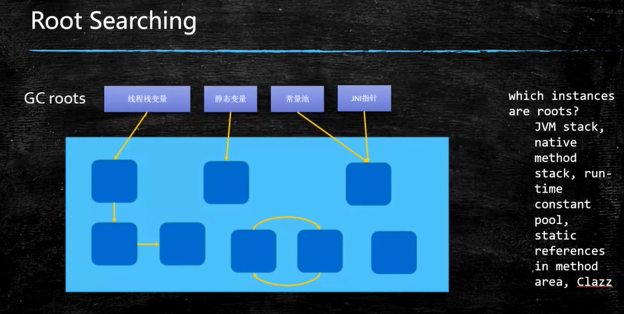

根可达算法

此算法的核心思想：通过一系列称为“GC Roots”的对象作为起始点，从这些节点开始向下搜索，搜索走过的路径称为“引用链”，当一个对象到GC Roots没有任何的引用链相连时(从GC Roots）到这个对象不可达)时，证明此对象不可用。

可作为GC Roots的对象：

1. 虚拟机栈
2. 方法区的类属性所引用的对象
3. 方法区中常量所引用的对象
4. 本地方法栈中引用的对象

线程栈变量，静态变量，常量池，JNI指针

### 垃圾回收算法


#### 标记清除算法


先标记出要回收的对象(一般使用可达性分析算法)，再去清除，但会有效率问题和空间问题:标记的空间被清除后，会造成我的内存中出现越来越多的不连续空间，当要分配一个大对象的时候，在进行寻址的要花费很多时间，可能会再一次触发垃圾回收。**位置不连续，产生碎片**

#### 复制算法

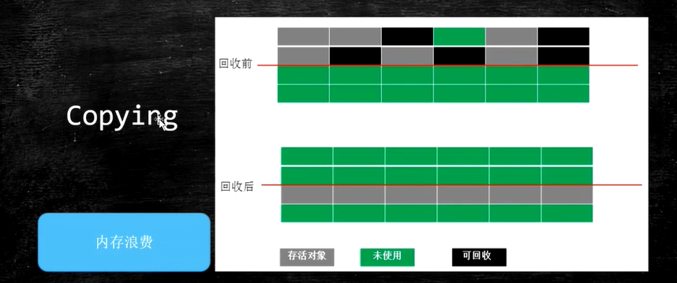

 **堆**：

- 新生代
  Eden 伊甸园
  　　Survivor 存活期
  　　Tenured Gen 老年区
- 老年代

复制算法是将可用内存按容量划分为大小相等的两块，每次只使用其中一块。当这一块的内存用完了，就将还存活着的对象复制到另外一块上面，然后再把已使用过的内存空间一次清理掉。这样使得每次都是对整个半区进行内存回收，内存分配时也就不用考虑内存碎片等复杂情况，只要移动堆顶指针，按顺序分配内存即可，实现简单，运行高效。只是这种算法的代价是将内存缩小为了原来的一半，浪费较大。
现在的商业虚拟机都采用这种收集算法来回收新生代，IBM公司的专门研究表明，新生代中的对象98%是“朝生夕死”的，所以并不需要按照1:1的比例来划分内存空间，而是将内存分为一块较大的Eden空间和两块较小的Survivor空间，每次使用Eden和其中一块Survivor。当回收时，将Eden和Survivor中还存活着的对象一次性的复制到另外一块Survivor。当回收时，将Eden和Survivor中还存活着的对象一次性的复制到另外一块Survivor空间上，最后清理掉Eden和刚才用过的Survivor空间。HotSpot虚拟机默认Eden和Survivor的大小比例是8:1，也就是每次新生代中可用内存为整个新生代容量的90%（80%+10%），只有10%的内存会被“浪费”。**没有碎片，浪费空间**

#### 标记压缩算法


对于老年代，回收的垃圾较少时，如果采用复制算法，则效率较低。标记整理算法的标记操作和“标记-清除”算法一致，后续操作不只是直接清理对象，而是在清理无用对象完成后让所有存活的对象都向一端移动，并更新引用其对象的指针。

很显然，整理这一下需要时间，所以与标记清除算法相比，这一步花费了不少时间，但从长远来看，这一步还是很有必要的。**没有碎片，效率较低**

#### 分代收集算法

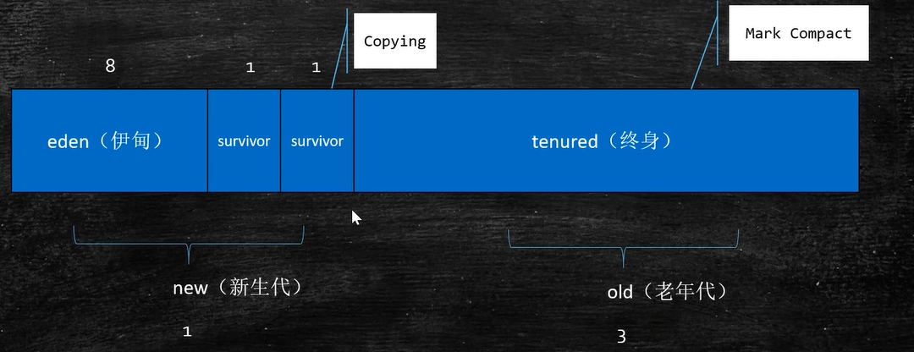

针对不同的年代进行不同算法的垃圾回收，针对新生代选择复制算法，对老年代选择标记整理算法

1. 部分垃圾回收器使用的模型
2. 新生代+老年代+永久代（1.7）/元数据区（1.8）Metaspace
   1. 永久代 元数据 -Class
   2. 永久代可以指定大小限制，永久代内存溢出。元数据区可以设置，也可以不设置，无上线，受限于物理内存
   3. 字符串常量 1.7-永久代 1.8-堆
   4. MethodArea 逻辑概念-永久代、元数据
3. 新生代 = Eden + 2个 survivor区 
   1. YGC回收之后，大部分对象被回收，活着的进行s0
   2. 再次YGC，大部分对象被回收，活着的对象eden+s0进入s1
   3. 再次YGC，大部分对象被回收，活着的对象eden+s1进入s0
   4. 年龄足够->老年代（15岁，CMS 6）
   5. s区装不下->老年代
4. 老年代
   1. 老年代满了，FGC， Full GC
5. GC Tuning
   1. 尽量减少FGC
   2. MinorGC=YGC
   3. MajorGC=FGC

### 垃圾收集器

Garbage Collectors

垃圾回收器的发展路线，是随着内存越来越大的过程而演进，从分代算法演化到不分代算法

1. Serial算法（几兆~几十兆内存）
2. Parallel算法（几个G内存）
3. CMS算法（几十个G内存）承上启下，开始并发回收 
   1. 三色标记+写屏障 黑色 灰色 白色，并发标记使用
   2. 三色标记一定会产生错标，必须要Remark
4. G1（上百G）逻辑分代，物理不分代
   1. 三色标记+SATB+写屏障
5. ZGC（上T 4T）逻辑不分代，物理不分代
   1. ColorPointers（颜色指针 着色指针）+ 读屏障
6. Shenandoah 逻辑不分代，物理不分代
   1. ColorPointers（颜色指针 着色指针）+ 写屏障
7. Epsilon 啥也不干 （调试，确认不用GC参与就能干完活）

JDK诞生 Serial追随 提高效率，诞生了PS，为了配合CMS，诞生了PN，CMS是1.4版本后期引入，CMS是里程碑式的GC，它开启了并发回收的过程，但是CMS毛病较多，因此目前没有任何一个JDK版本默认是CMS

并发垃圾回收是因为无法忍受STW

一般垃圾回收器的组合方案

1. Parallel Scavenge + Parallel Old
2. ParNew + CMS
3. Serial + Serial Old

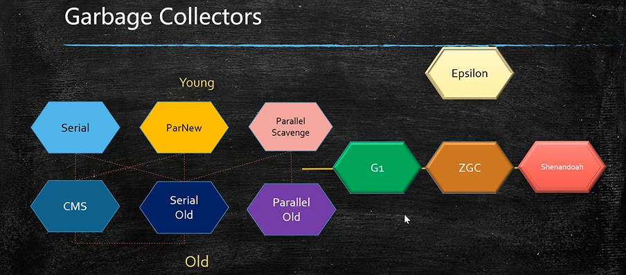

1. Serial 年轻代 串行回收 （分代回收）
2. PS 年轻代 并行回收（分代回收）
3. ParNew 年轻代 配合CMS的并行回收（分代回收）
4. SerialOld（分代回收）
5. ParallelOld（分代回收）
6. ConcurrentMarkSweep 老年代 （分代回收）并发 垃圾回收和应用程序同时运行，降低STW的时间（200ms）CMS问题比较多，所以现在没有一个版本默认是CMS，只能手工指定，CMS既然是MarkSweep，就一定会有碎片化问题，碎片达到一定程度，CMS的老年代分配对象分配不下的时候，使用SerialOld进行老年代回收。
   想象一下：
   PS+PO -> 加内存 换垃圾回收器 ->PN + CMS +SerialOld(几个小时 - 几天)
   几十个G的内存，单线程回收 -> G1 + FGC 几十个G ->上T内存的服务器ZGC
   算法：三色标记 + Incremental Update
7. G1（200ms+10ms）（概念分代）
8. ZGC（1ms）PK C++（不分代）
9. Shenandoah（不分代）
10. Eplison

1.8默认的垃圾回收器：PS+parallelOld

#### Serial 年轻代

串行回收

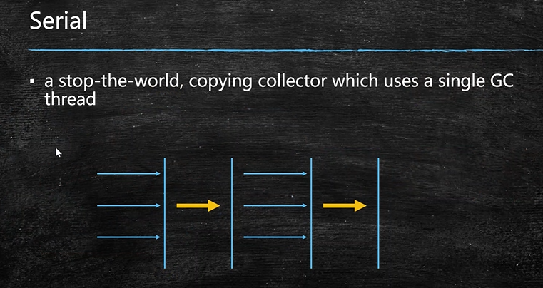

#### Parallel年轻代

并行回收


#### ParNew收集器 年轻代

配合CMS的并行回收

有一些增强,可以和CMS一起使用


#### SerialOld

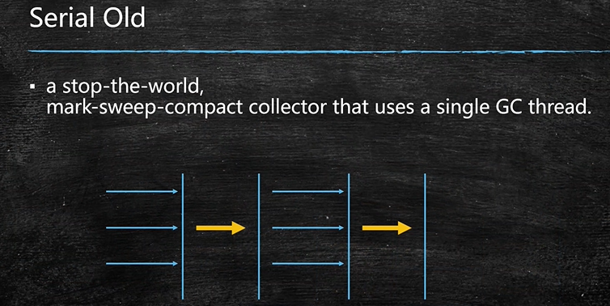

#### ParallelOld

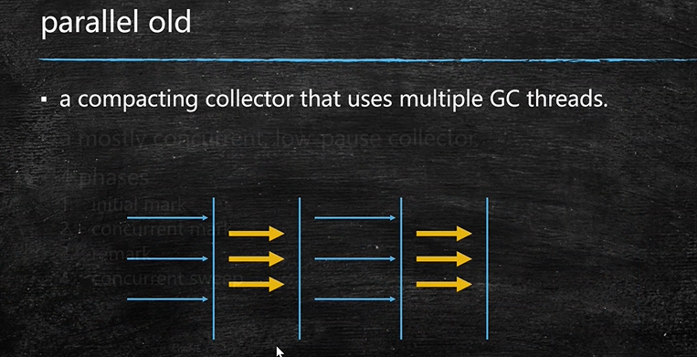

#### CMS 老年代

JDK14 放弃了

CMS（Concurrent Mark Sweep）是一款里程碑式的垃圾收集器，为什么这么说呢？因为在它之前，GC线程和用户线程是无法同时工作的，即使是Parallel Scavenge，也不过是GC时开启多个线程并行回收而已，GC的整个过程依然要暂停用户线程，即Stop The World。这带来的后果就是Java程序运行一段时间就会卡顿一会，降低应用的响应速度，这对于运行在服务端的程序是不能被接收的

**GC时为什么要暂停用户线程？**

首先，如果不暂停用户线程，就意味着期间会不断有垃圾产生，永远也清理不干净。
其次，用户线程的运行必然会导致对象的引用关系发生改变，这就会导致两种情况：漏标和错标。

1. 漏标
   原本不是垃圾，但是GC的过程中，用户线程将其引用关系修改，导致GC Roots不可达，成为了垃圾。这种情况还好一点，无非就是产生了一些浮动垃圾，下次GC再清理就好了。
2. 错标
   原本是垃圾，但是GC的过程中，用户线程将引用重新指向了它，这时如果GC一旦将其回收，将会导致程序运行错误。

针对这些问题，CMS是如何解决的呢？它是如何做到GC线程和用户线程并发工作的呢？？？

Concurrent Mark Sweep，从名字上就可以看出来，这是一款采用「标记清除」算法的垃圾收集器，它运行的示意图大概如下

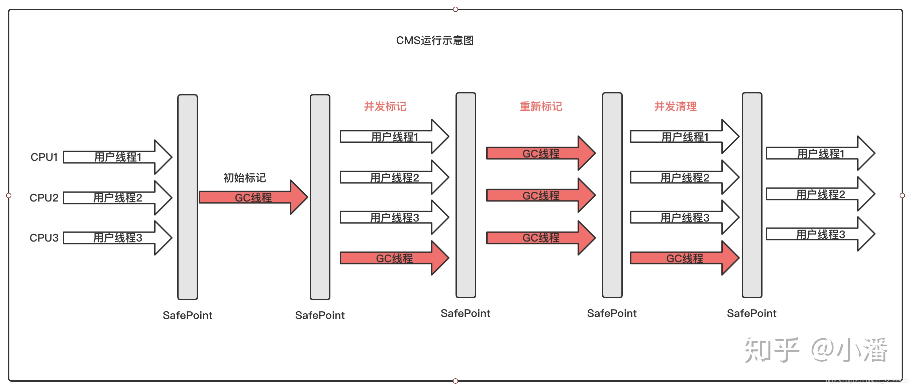

**大概可分为四个主要步骤**

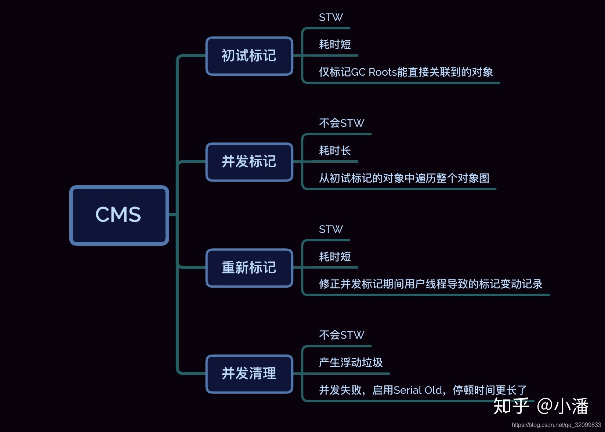

**1、初试标记**
初始标记仅仅只是标记一下GC Roots能直接关联到的对象，速度很快。初始标记的过程是需要触发STW的，不过这个过程非常快，而且初试标记的耗时不会因为堆空间的变大而变慢，是可控的，因此可以忽略这个过程导致的短暂停顿。

**2、并发标记**
并发标记就是将初始标记的对象进行深度遍历，以这些对象为根，遍历整个对象图，这个过程耗时较长，而且标记的时间会随着堆空间的变大而变长。不过好在这个过程是不会触发STW的，用户线程仍然可以工作，程序依然可以响应，只是程序的性能会受到一点影响。因为GC线程会占用一定的CPU和系统资源，对处理器比较敏感。CMS默认开启的GC线程数是：(CPU核心数+3)/4，当CPU核心数超过4个时，GC线程会占用不到25%的CPU资源，如果CPU数不足4个，GC线程对程序的影响就会非常大，导致程序的性能大幅降低。

**3、重新标记**
由于并发标记时，用户线程仍在运行，这意味着并发标记期间，用户线程有可能改变了对象间的引用关系，可能会发生两种情况：一种是原本不能被回收的对象，现在可以被回收了，另一种是原本可以被回收的对象，现在不能被回收了。针对这两种情况，CMS需要暂停用户线程，进行一次重新标记。

**4、并发清理**
重新标记完成后，就可以并发清理了。这个过程耗时也比较长，且清理的开销会随着堆空间的变大而变大。不过好在这个过程也是不需要STW的，用户线程依然可以正常运行，程序不会卡顿，不过和并发标记一样，清理时GC线程依然要占用一定的CPU和系统资源，会导致程序的性能降低。

**ConcurrentMarkSweep**

1. 初始标记
2. 并发标记（比较耗时，但是可以和工作线程一起使用，系统可以正常响应）
3. 重新标记
4. 并发清理

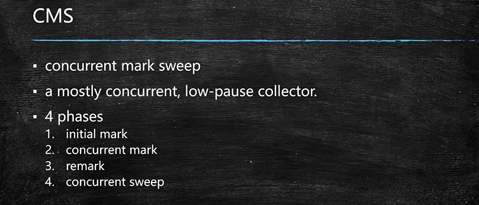

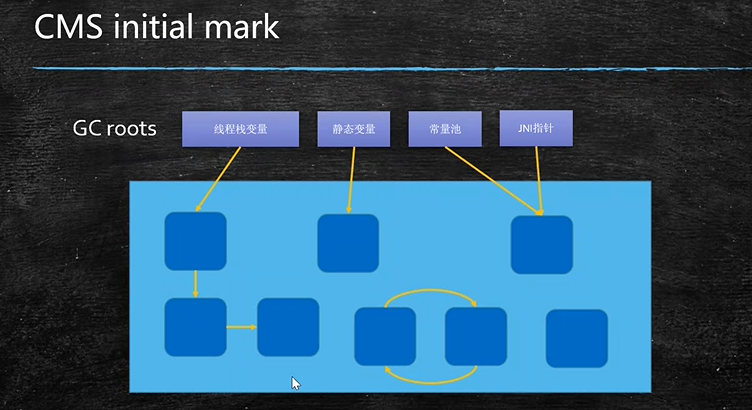

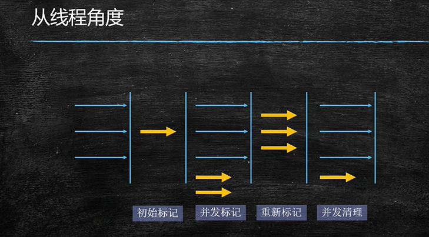

初始标记还是`STW`，但是比之前的`STW`要快，只找到GC Roots根上的对象，不继续找其他对象

尽管CMS是一款里程碑式的垃圾收集器，开启了GC线程和用户线程同时工作的先河，但是不管是哪个JDK版本，CMS从来都不是默认的垃圾收集器，究其原因，还是因为CMS不太完美，存在一些缺点

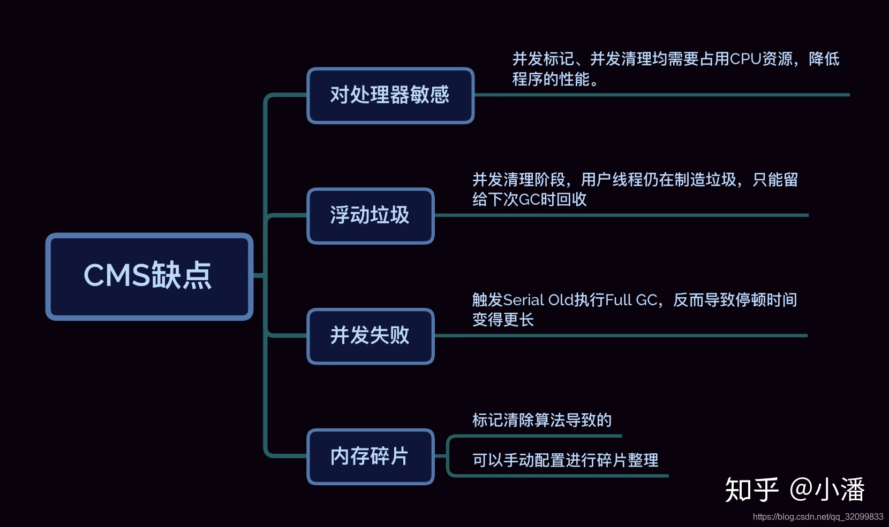

**1、对处理器敏感**
并发标记、并发清理阶段，虽然CMS不会触发STW，但是标记和清理需要GC线程介入处理，GC线程会占用一定的CPU资源，进而导致程序的性能下降，程序响应速度变慢。CPU核心数多的话还稍微好一点，CPU资源紧张的情况下，GC线程对程序的性能影响非常大。

**2、浮动垃圾**
并发清理阶段，由于用户线程仍在运行，在此期间用户线程制造的垃圾就被称为“浮动垃圾”，浮动垃圾本次GC无法清理，只能留到下次GC时再清理。

**3、并发失败**
由于浮动垃圾的存在，因此CMS必须预留一部分空间来装载这些新产生的垃圾。CMS不能像Serial Old收集器那样，等到Old区填满了再来清理。在JDK5时，CMS会在老年代使用了68%的空间时激活，预留了32%的空间来装载浮动垃圾，这是一个比较偏保守的配置。如果实际引用中，老年代增长的不是太快，可以通过`-XX：CMSInitiatingOccupancyFraction`参数适当调高这个值。到了JDK6，触发的阈值就被提升至92%，只预留了8%的空间来装载浮动垃圾。
如果CMS预留的内存无法容纳浮动垃圾，那么就会导致「并发失败」，这时JVM不得不触发预备方案，启用Serial Old收集器来回收Old区，这时停顿时间就变得更长了。

**4、内存碎片**
由于CMS采用的是「标记清除」算法，这就意味这清理完成后会在堆中产生大量的内存碎片。内存碎片过多会带来很多麻烦，其一就是很难为大对象分配内存。导致的后果就是：堆空间明明还有很多，但就是找不到一块连续的内存区域为大对象分配内存，而不得不触发一次Full GC，这样GC的停顿时间又会变得更长。
针对这种情况，CMS提供了一种备选方案，通过`-XX：CMSFullGCsBeforeCompaction`参数设置，当CMS由于内存碎片导致触发了N次Full GC后，下次进入Full GC前先整理内存碎片，不过这个参数在JDK9被弃用了

并发标记，边生产对象，边标记垃圾对象（存在问题：某个对象先删除引用，再恢复引用，会出现直接标记成了垃圾，浮动垃圾）

1. 浮动垃圾
   1. 比如 A引用指向B
   2. 第一次标记，B不是垃圾
   3. A指向B的引用被删除，B变成垃圾
   4. 后面再标记一次即可，影响不大
2. 标记失误
   1. 比如 A对象指向C，B为垃圾
   2. 第一次标记，B是垃圾
   3. A对象指向B，B不是垃圾了
   4. 存在标记失误问题
   5. 重新标记 STW，将之前的错误修正（重新标记不会出现标记失误，因为STW了）
   6. 并发清理

#### G1

Garbage First 垃圾优先，先清理垃圾最多的区域

G1有STW，也有Full GC

不再是分代回收，内存划分区域。但是区域可以专门存指定的年代（物理分代）

支持上百G内存


#### ZGC

C4 没有STW

逻辑上，物理上都不分代

Oracle JDK

#### Shenandoah

C4 没有STW

Open JDK

#### Epsilon

测试使用，不需要垃圾回收

## JVM 参数选项

| 参数                            | 备注                                                         |
| ------------------------------- | ------------------------------------------------------------ |
| -Xms                            | 初始堆大小，如-Xms256m                                       |
| -Xmx                            | 最大堆大小，如-Xmx512m                                       |
| -Xmn                            | 新生代大小。通常为 Xmx 的 1/3 或 1/4。<br />新生代 = Eden + 2 个 Survivor 空间。<br />实际可用空间为 = Eden + 1 个 Survivor，即 90% |
| -Xss                            | JDK1.5+ 每个线程堆栈大小为 1M，<br />一般来说如果栈不是很深的话， 1M 是绝对够用了的。 |
| -XX:NewRatio                    | 新生代与老年代的比例，如 –XX:NewRatio=2，<br />则新生代占整个堆空间的1/3，老年代占2/3 |
| -XX:SurvivorRatio               | 新生代中 Eden 与 Survivor 的比值。默认值为 8。<br />即 Eden 占新生代空间的 8/10，另外两个 Survivor 各占 1/10 |
| -XX:PermSize                    | 永久代(方法区)的初始大小（8.0已移除）                        |
| -XX:MaxPermSize                 | 永久代(方法区)的最大值                                       |
| -XX:+PrintGCDetails             | 打印 GC 信息                                                 |
| -XX:+HeapDumpOnOutOfMemoryError | 让虚拟机在发生内存溢出时 Dump 出当前的内存堆转储快照，<br />以便分析用 |

## JVM 调优

熟悉GC常用算法，熟悉常见的垃圾回收器，具有实际JVM调优实战经验

### 调优基本概念

1. 吞吐量：用户代码时间/（用户代码执行时间+垃圾回收时间）
2. 响应时间：STW越短，响应时间越好

所谓调优，首先确定追求什么，吞吐量优先还是响应时间优先？还是在满足一定的响应时间的情况下，要求达到多大的吞吐量

问题：

科学计算，吞吐量，数据挖掘，thrput。吞吐量优先的一般：（PS+PO）

响应时间：网站 GUI API（1.8 G1）

### 什么是调优

1. 根据需求进行JVM规划和预调优
2. 优化运行JVM运行环境（慢，卡顿）
3. 解决JVM运行过程中出现的各种问题（OOM）

### 调优从规划开始

步骤：

1. 熟悉业务场景（没有最好的垃圾回收器，只有最合适的垃圾回收器）
   1. 响应时间、停顿时间（CMS G1 ZGC）需要给用户作响应
   2. 吞吐量=用户时间/（用户时间+GC时间）[PS]
2. 选择回收器组合
3. 计算内存需求（经验值 1.5G 16G）
4. 选定CPU（越高越好）
5. 设定年代大小，升级年龄
6. 设定日志参数
   1. -Xloggc:/
   2. 或者每天产生一个日志文件


### 了解生产环境下的垃圾回收器组合

> https://docs.oracle.com/javase/8/docs/technotes/tools/unix/java.html

默认`JVM`的垃圾回收器是`PS`和`PO`

常用：

> -XX:+PrintFlagsFinal（设置值 最终生效值）
>
> -XX:PrintFlagsInitial（默认值）
>
> -XX:+PrintCommandLineFlags（命令行参数）

`JVM`命令参数分类：

> 标准命令：-开头，所有的HotSpot都支持
>
> 非标准命令：-X开头，特定版本HotSpot支持特定命令
>
> 不稳定命令：-XX开头，下个版本可能取消

java -version

java -X

java -XX:+PrintFlagsWithComments // 只有debug版本能用

java -XX:PrintFlagsInitial

java -XX:+PrintFlagsFinal

### 案例分析

风险评估程序

jstack 检测死锁

Java VisualVM（线上不可使用）

dump（线上不可使用）jmap命令，整体服务暂停，只有服务崩溃了才可以

### 常用工具

jmap jstack等

### jconsole远程连接

### VisualVm远程连接

### arthas在线排查工具

#### 为什么需要在线排查

在生产上我们经常会碰到一些不好排查的问题，例如线程安全问题，用最简单的threaddump或者heapdump不好查到问题原因，为了排查这些问题，有时我们会临时增加一些日志，比如在一些关键的函数里打印出入参，然后重新打包发布，如果打了日志还是没有找到问题，继续加日志，重新打包发布。对于上线流程复杂而且审核比较严格的公司，从改代码到上线需要层层的流转，会大大影响问题排查的jindu

#### jvm观察jvm信息

#### thread定位线程问题

#### dashboard观察系统情况

#### heapdump + jhat分析

#### jad反编译

动态代理生成类的问题定位

第三方的类（观察代码）

版本问题（确定自己最新提交的版本是不是被使用）

#### redefine 热替换

目前有些限制条件：只能改方法实现（方法已经运行完成），不能改方法名，不能改属性

m()->mm()

#### sc - search class

#### watch - watch method

#### 没有包含的功能：jmap 

## 常见问题

### 如何在堆中给对象分配内存

两种方式：指针碰撞和空闲列表。我们具体使用的哪一种，就要看我们虚拟机中使用的是什么垃圾回收机制了，如果有压缩整理，可以使用指针碰撞的分配方式。
指针碰撞：假设Java堆中内存是绝对规整的，所有用过的内存度放一边，空闲的内存放另一边，中间放着一个指针作为分界点的指示器，所分配内存就仅仅是把哪个指针向空闲空间那边挪动一段与对象大小相等的举例，这种分配方案就叫指针碰撞
空闲列表：有一个列表，其中记录中哪些内存块有用，在分配的时候从列表中找到一块足够大的空间划分给对象实例，然后更新列表中的记录，这就叫做空闲列表。

### 垃圾回收

对于一般Java程序员开发的过程中，不需要考虑垃圾回收。

- 如何判定对象为垃圾对象
  - 1 引用计数法
  - 2 可达性分析法
- 如何回收垃圾对象
  - 1 回收策略（标记清除、复制、标记整理、分代收集算法）
  - 2 常见的垃圾回收器（Serial，Parnew，Cms，G1）
- 何时回收垃圾对象

### Java对象创建过程

1. 检查类是否被加载
   如果没有，限制执行相应的类加载过程

2. 为新生对象分配内存
   如果堆中内存是规整的，采用指针碰撞。（所有用过的内存放在一边，空闲的内存放在另一边，中间放一个指针作为分界点的指示器，那么分配内存就是把指针向空闲空间挪动一段与对象相等的距离）。如果堆内内存不规整，采用空闲列表，虚拟机会维护整个列表，查看哪些内存块可以用，在分配的时候找到一块足够大的给对象实例，并更新记录

3. 初始化零值

4. 设置对象头
   这个对象是哪个类的实例，如何找到类元数据信息，对象GC分代年龄等信息，这些信息放在对象的对象头中。在HotSpot虚拟机中，对象在内存中存储的布局可以分为3块区域：对象头（Header）、 实例数据（Instance Data）和对齐填充（Padding）。 HotSpot虚拟机的对象头包括两部分信息，第一部分用于存储对象自身的运行时数据， 如哈希码（HashCode）、GC分代年龄、锁状态标志、线程持有的锁、偏向线程ID、偏向时 间戳等。对象头的另外一部分是类型指针，即对象指向它的类元数据的指针，虚拟机通过这个指 针来确定这个对象是哪个类的实例。

    初始化零值之后，虚拟机要对对象进行必要的设置，例如这个对象是哪个类的实例、如何才能找到类的元数据信息、对象的哈希码、对象的GC分代年龄等信息。这些信息存放在对象的对象头（Object Header之中。

5. 执行init方法
   把对象按照程序员的意愿进行初始化

对象头（在对象中添加一些标记字段用于增强对象功能）

### DCL要不要加volatile问题

要加，指令重排序问题

### 对象在内存中的存储布局

对象与数组的不同

### 对象头具体包括什么

markword

classpointer

synchronized信息

### 对象怎么定位

直接，间接

### 对象怎么分配

栈上-线程本地-Eden-Old

### Object o = new Object()在内存中占用多少字节

16个字节

markword 8字节 跟JVM系统的位数相关

class pointer 压缩4字节，不压缩 8字节

instance data 0 字节

padding 4字节

```java
Object o = new Object();
synchronized (o){
    System.out.println(ClassLayout.parseInstance(o).toPrintable());
}
```

```
java.lang.Object object internals:
 OFFSET  SIZE   TYPE DESCRIPTION                               VALUE
      0     4        (object header)                           68 f5 3f 02 (01101000 11110101 00111111 00000010) (37746024)
      4     4        (object header)                           00 00 00 00 (00000000 00000000 00000000 00000000) (0)
      8     4        (object header)                           e5 01 00 20 (11100101 00000001 00000000 00100000) (536871397)
     12     4        (loss due to the next object alignment)
Instance size: 16 bytes
Space losses: 0 bytes internal + 4 bytes external = 4 bytes total
```

****

string 4字节

int 4字节

boolean 1字节

### 为什么hotspot不使用C++对象来代表java对象

oop_class

### Class对象是在堆还是在方法区

### Java解决并发问题的方法

#### CAS（compare and swap）

虚拟机采用CAS配上失败重试的方法保证更新操作的原子性来对分配内存空间的动作进行同步处理

#### 本地线程分配缓冲（TLAB）

把内存分配的动作按照线程划分在不同的空间之中进行，即每个线程在Java堆中预先分配一小块内存

### 对象出生到消亡


1. 栈上分配
2. 进入Eden区
3. 一次垃圾回收 Eden，存活进入s1
4. 二次垃圾回收 Eden + s1，存活进入s2
5. 三次垃圾回收 Eden + s2，存活进入s1
6. ......
7. 15/6次垃圾回收进入Old

GC回收器：

1. PS + PO 15
2. CMS 6
3. G1 6

#### 总结

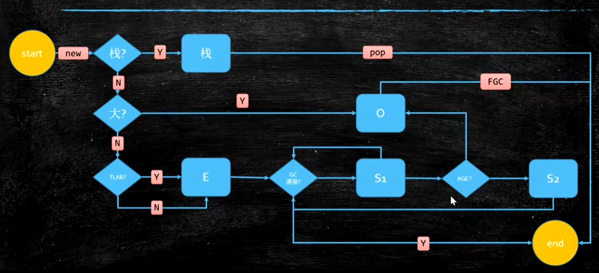

### YGC  和  FGC 的概念

#### YGC

1. Young GC Minor GC
2. Eden区不足

#### FGC

1. Full GC Major GC
2. Old空间不足
3. System.gc()

多数情况下，对老年代进行回收，会同时回收年轻代

#### 对象何时进入老年代

超过 XX:MaxTenuringThreshold 指定次数（YGC）

1. Parallel Scavenge 15
2. CMS 6
3. G1 15

动态年龄

s1 -> s2超过50%

把年龄最大的放入Old

### CMS和G1的异同

### G1什么时候引发Full GC

### 说一个最熟悉的垃圾回收算法

### 吞吐量优先和响应时间优先的回收器有哪些

### 怎么判断内存泄露

### 讲一下CMS的流程

### 为什么压缩指针超过32G失效

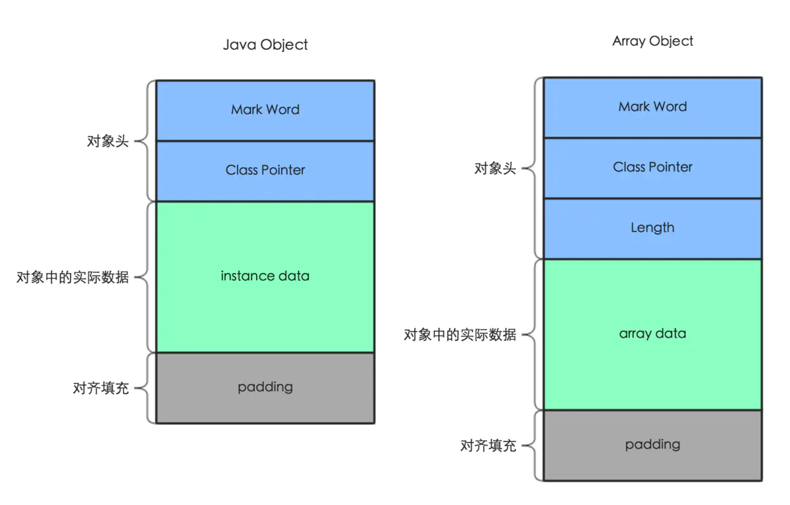

32位操作系统可以寻址到多大内存 答：4g 因为 2^32=4 * 1024 * 1024=4g

64位呢？答：近似无穷大

64位过长，给我们寻址带宽和对象内引用造成了负担

对象头中的`Class Pointer`默认占8个字节，开启-XX:+UseCompressedOops后，为了节省空间压缩为4个字节，4*8=32位表示可寻址4G个对象，在内存空间小于32G时，可以通过编码、解码方式进行优化，使得jvm可以支持更大的内存配置。当堆内存大于32G时，压缩指针参数会失效，会强制使用64位(即8字节)来对java对象寻址

java对象8字节对齐 ，所以是4*8=32G

就是说之前4G寻址访问 0 1 2 .... 4G

8字节对齐 0 8 16 .... 32G

### 为什么ZGC管理4T的内存


### 什么是内存泄漏

### GC调优有经验吗? 一般出现GC问题你是怎么解决的

### ThreadLocal有没有内存泄漏的问题

### G1两个Region不是连续的,而且之间还有可达的引用,我现在要回收一个,另一个怎么处理

### 讲一下JVM堆内存管理(对象分配过程)

### CMS的并发预处理和并发可中断预处理

### 多大的对象会直接扔到老年代

### 用一句话说明你的JVM水平很牛

## 参考文献

[为什么JVM开启指针压缩后支持的最大堆内存是32G?](https://www.zhihu.com/question/365436606)

[CMS与三色标记算法](https://zhuanlan.zhihu.com/p/340530051)

[什么是STW以及CMS和G1优缺点？](https://zhuanlan.zhihu.com/p/223353014)


