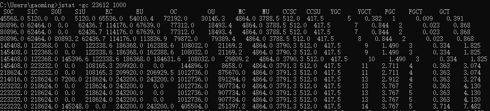
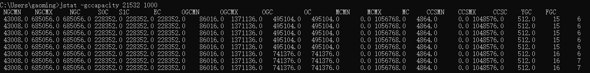
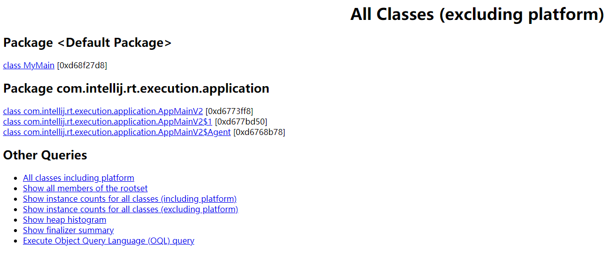

# Jvm 工具

## jps

`Java Virtual Machine Process Status Tool`

`jps`是`java`提供的一个显示当前所有`java`进程`pid`的命令，适合在`linux/unix`平台上查看当前`java`进程的一些简单情况。

很多人都是用过`unix`系统里面的`ps`命令，这个命令主要是用来显示当前系统的进程情况，有哪些进程以及进程`id`

`jps`也是一样，它的作用是显示当前系统的`java`进程情况以及进程`id`，可以通过它查看到底启动了多少个`java`进程（因为每一个`java`程序都会独占一个`java`虚拟机实例）

```bash
C:\Users\gaoming>jps
1664 Launcher
17156
21220 Jps
21896 Launcher
# 显示进程id以及进程

C:\Users\gaoming>jps localhost
1664 Launcher
17156
11512 Jps
21896 Launcher
# 远程

C:\Users\gaoming>jps 127.0.0.1
RMI Registry not available at 127.0.0.1:1099
Connection refused to host: 127.0.0.1; nested exception is:
        java.net.ConnectException: Connection refused: connect
# 远程未开启
```

【常用参数】

**`-q`** 只显示`pid`，不显示`class`名称，`jar`文件名和传递给`main`方法的参数

```bash
C:\Users\gaoming>jps -q
1664
8416
17156
21896
```

**`-m`** 输出传递给`main`方法的参数，在嵌入式`jvm`上可能是`null`

```bash
C:\Users\gaoming>jps -m
23040
760 MyMain
6876 Jps -m
```

**`-l`** 输出应用程序`main class`的完整`package`名或者应用程序的`jar`文件完整路径名

```bash
C:\Users\gaoming>jps -l
23040
5332 org.jetbrains.jps.cmdline.Launcher
12988 MyMain
21580 sun.tools.jps.Jps
```

**`-v`** 输出传递给`JVM`的参数

```bash
C:\Users\gaoming>jps -v
22024 MyMain -Xms256m -javaagent:D:\IDEAJ\IntelliJ IDEA 2020.1.2\lib\idea_rt.jar=57090:D:\IDEAJ\IntelliJ IDEA 2020.1.2\bin -Dfile.encoding=UTF-8
2020.1.2\bin -Dfile.encoding=UTF-8
```

**`-V`** 隐藏输出传递给`JVM`的参数

```bash
C:\Users\gaoming>jps -V
23040
19300 Jps
3268 MyMain
19720 Launcher
```

## jstack

用于生成`java`虚拟机当前时刻的线程快照（一般称为`threaddump`或`javacore`文件），线程快照就是当前虚拟机内每一条线程正在执行的方法堆栈的集合，生成线程快照的主要目的就是定位线程出现长时间停顿的原因，如线程间死锁，死循环，请求外部资源导致的长时间等待等都是导致线程长时间停顿的原因。

【常用参数】

**`F`** : 当正常输出的请求不被响应时，强制输出线程堆栈

**`-l`** ： 除堆栈外，显示关于锁的附加信息

**`-m`**：如果调用到本地方法的话，可以显示C/C++的堆栈

【`jstack`主要用来查看某个`java`进程内的线程堆栈信息】

1. `jps` 查看`java`进程`pid`（或者使用`top`命令）（查看cpu占用高进程）
2. `top -Hp pid` 找出该进程内最耗费`cpu`的线程（`top -H -p 17850`）（查看cpu占用高线程）
3. `printf "%x\n" 1787` 得到十六进制值为`6fb`
4. `jstack pid > file.log` 通过`jstack` 把该进程的所有线程堆栈打印到`file.log`中
5. `vi file.log` 打开文件搜索 `6fb` 找到具体出问题的代码

【`jstack`检测死锁】

死锁代码

```java
import lombok.SneakyThrows;
import java.util.concurrent.locks.Lock;
import java.util.concurrent.locks.ReentrantLock;
import static java.lang.Thread.sleep;
/**
 * @file: LockExample
 * @author: gaoming
 * @date: 2021/04/29
 * @version: 1.0
 * @description:
 **/
public class LockExample {
    private static Lock lock1 = new ReentrantLock();
    private static Lock lock2 = new ReentrantLock();
    public static void lockExample() {
        Thread t1 = new Thread(new Runnable() {
            @SneakyThrows
            @Override
            public void run() {
                lock1.lock();
                sleep(1000);
                lock2.lock();
            }
        });
        Thread t2 = new Thread(new Runnable() {
            @SneakyThrows
            @Override
            public void run() {
                lock2.lock();
                sleep(1000);
                lock1.lock();
            }
        });
        t1.start();
        t2.start();
    }
    public static void main(String[] args) {
        lockExample();
    }
}
```

```bash
C:\Users\gaoming>jps
20256 Launcher
21088 Launcher
23040
21796 LockExample
23512 Jps
21580 RemoteMavenServer36
```

```bash
C:\Users\gaoming>jstack 21796
2021-04-29 17:02:06
Full thread dump Java HotSpot(TM) 64-Bit Server VM (25.60-b23 mixed mode):
```

```java
Found one Java-level deadlock:
=============================
"Thread-1":
  waiting for ownable synchronizer 0x00000000d68fa990, (a java.util.concurrent.locks.ReentrantLock$NonfairSync),
  which is held by "Thread-0"
"Thread-0":
  waiting for ownable synchronizer 0x00000000d68fa9c0, (a java.util.concurrent.locks.ReentrantLock$NonfairSync),
  which is held by "Thread-1"
Java stack information for the threads listed above:
===================================================
"Thread-1":
        at sun.misc.Unsafe.park(Native Method)
        - parking to wait for  <0x00000000d68fa990> (a java.util.concurrent.locks.ReentrantLock$NonfairSync)
        at java.util.concurrent.locks.LockSupport.park(LockSupport.java:175)
        at java.util.concurrent.locks.AbstractQueuedSynchronizer.parkAndCheckInterrupt(AbstractQueuedSynchronizer.java:836)
        at java.util.concurrent.locks.AbstractQueuedSynchronizer.acquireQueued(AbstractQueuedSynchronizer.java:870)
        at java.util.concurrent.locks.AbstractQueuedSynchronizer.acquire(AbstractQueuedSynchronizer.java:1199)
        at java.util.concurrent.locks.ReentrantLock$NonfairSync.lock(ReentrantLock.java:209)
        at java.util.concurrent.locks.ReentrantLock.lock(ReentrantLock.java:285)
        at LockExample$2.run(LockExample.java:37)
        at java.lang.Thread.run(Thread.java:745)
"Thread-0":
        at sun.misc.Unsafe.park(Native Method)
        - parking to wait for  <0x00000000d68fa9c0> (a java.util.concurrent.locks.ReentrantLock$NonfairSync)
        at java.util.concurrent.locks.LockSupport.park(LockSupport.java:175)
        at java.util.concurrent.locks.AbstractQueuedSynchronizer.parkAndCheckInterrupt(AbstractQueuedSynchronizer.java:836)
        at java.util.concurrent.locks.AbstractQueuedSynchronizer.acquireQueued(AbstractQueuedSynchronizer.java:870)
        at java.util.concurrent.locks.AbstractQueuedSynchronizer.acquire(AbstractQueuedSynchronizer.java:1199)
        at java.util.concurrent.locks.ReentrantLock$NonfairSync.lock(ReentrantLock.java:209)
        at java.util.concurrent.locks.ReentrantLock.lock(ReentrantLock.java:285)
        at LockExample$1.run(LockExample.java:27)
        at java.lang.Thread.run(Thread.java:745)
Found 1 deadlock.
```

## jstat

`jstat`是`JDK`自带的一个轻量级小工具，全称`Java Virtual Machine statistics monitoring tool`，它位于`java`的`bin`目录下，主要利用`jvm`内建的指令对`java`应用程序的资源和性能进行实时的命令行的监控，包括了对`Heap Size`和垃圾回收状况的监控。可见，`jstat`是轻量级的，专门针对`jvm`的工具，非常适用

`jstat`工具特别强大，有众多的可选项，详细查看堆内各个部分的使用量，以及加载类的数量。使用时，需加上查看进程的进程`id`，和所选参数，常见的参数有：

```bash
C:\Users\gaoming>jstat -options
-class
-compiler
-gc
-gccapacity
-gccause
-gcmetacapacity
-gcnew
-gcnewcapacity
-gcold
-gcoldcapacity
-gcutil
-printcompilation
```

```bash
class（类加载器）监视类装载、卸载数量、总空间及类装载所耗费的时间
compiler（JIT）输出JIT编译器编译过的方法、耗时等信息
gc（GC堆状态）监视Java堆状况，包括Eden区、2个Survivor区、老年代、永久代等的容量
gccapacity（各区大小）监视内容与-gc基本相同，但输出主要关注Java堆各个区域使用到的最大和最小空间
gccause（最近一次gc统计和原因）与-gcutil功能一样，但是会额外输出导致上一次GC产生的原因
gcnew（新区统计）监视新生代GC的状况
gcnewcapacity（新区大小）监视内容与-gcnew基本相同，输出主要关注使用到的最大和最小空间
gcold（老区统计）监视老年代GC的状况
gcoldcapacity（老区大小）监视内容与——gcold基本相同，输出主要关注使用到的最大和最小空间
gcmetacapacity（原空间大小）输出元空间使用到的最大和最小空间
gcutil（gc统计汇总）监视内容与-gc基本相同，但输出主要关注已使用空间占总空间的百分比
printcompilation (HotSpot编译统计)输出已经被JIT编译的方法
```

****

**`class`** 显示加载`class`的数量，及所占空间等信息

```bash
C:\Users\gaoming>jstat -class 5288
Loaded  Bytes  Unloaded  Bytes     Time
   619  1247.5        0     0.0       0.23
```

| 显示列名 | 具体描述                 |
| -------- | ------------------------ |
| Loaded   | 装载的类的数量           |
| Bytes    | 装载类所占用的字节数     |
| Unloaded | 卸载类的数量             |
| Bytes    | 卸载类的字节数           |
| Time     | 装载和卸载类所花费的时间 |

****

**`compiler`** 显示`VM`实时编译的数量等信息

```bash
C:\Users\gaoming>jstat -compiler 17100
Compiled Failed Invalid   Time   FailedType FailedMethod
     107      0       0     0.08          0
```

| 显示列明     | 具体描述                           |
| ------------ | ---------------------------------- |
| Compiled     | 编译任务执行数量                   |
| Failed       | 编译任务执行失败数量               |
| Invalid      | 编译任务执行失效数量               |
| Time         | 编译任务消耗时间                   |
| FailedType   | 最后一个编译失败任务的类型         |
| FailedMethod | 最后一个编译失败任务所在的类及方法 |

****

**`gc`** 可以显示`gc`的信息，查看`gc`的次数，及时间

```
C:\Users\gaoming>jstat -gc 23612 1000
 S0C    S1C    S0U    S1U      EC       EU        OC         OU       MC     MU    CCSC   CCSU   YGC     YGCT    FGC    FGCT     GCT
 
 45568.0 5120.0  0.0   5120.0 65536.0  54010.4   72192.0    30145.3   4864.0 3788.5 512.0  417.5       5    0.382   1      0.009    0.391
```



| 显示列名 | 具体描述                                              |
| -------- | ----------------------------------------------------- |
| S0C      | 年轻代中第一个survivor（幸存区）的容量 (字节)         |
| S1C      | 年轻代中第二个survivor（幸存区）的容量 (字节)         |
| S0U      | 年轻代中第一个survivor（幸存区）目前已使用空间 (字节) |
| S1U      | 年轻代中第二个survivor（幸存区）目前已使用空间 (字节) |
| EC       | 年轻代中Eden（伊甸园）的容量 (字节)                   |
| EU       | 年轻代中Eden（伊甸园）目前已使用空间 (字节)           |
| OC       | Old代的容量 (字节)                                    |
| OU       | Old代目前已使用空间 (字节)                            |
| MC       | 方法区大小                                            |
| MU       | 方法区目前已使用空间 (字节)                           |
| CCSC     | 压缩类空间大小                                        |
| CCSU     | 压缩类空间使用大小                                    |
| YGC      | 年轻代垃圾回收次数                                    |
| YGCT     | 年轻代垃圾回收消耗时间                                |
| FGC      | 从应用程序启动到采样时old代(全gc)gc次数               |
| FGCT     | 从应用程序启动到采样时old代(全gc)gc所用时间(s)        |
| GCT      | 从应用程序启动到采样时gc用的总时间(s)                 |

****

**`gccapacity`** 可以显示，`VM`内存中三代`（young,old,perm）`对象的使用和占用大小

```bash
C:\Users\gaoming>jstat -gccapacity 21532 1000
 NGCMN    NGCMX     NGC     S0C   S1C       EC      OGCMN      OGCMX       OGC         OC       MCMN     MCMX      MC     CCSMN    CCSMX     CCSC    YGC    FGC
 
 43008.0 685056.0 685056.0 228352.0 228352.0 228352.0    86016.0  1371136.0   495104.0   495104.0      0.0 1056768.0   4864.0      0.0 1048576.0    512.0     15     6
```



| 显示列名 | 具体描述                                      |
| -------- | --------------------------------------------- |
| NGCMN    | 年轻代(young)中初始化(最小)的大小(字节)       |
| NGCMX    | 年轻代(young)的最大容量 (字节)                |
| NGC      | 年轻代(young)中当前的容量 (字节)              |
| S0C      | 年轻代中第一个survivor（幸存区）的容量 (字节) |
| S1C      | 年轻代中第二个survivor（幸存区）的容量 (字节) |
| EC       | 年轻代中Eden（伊甸园）的容量 (字节)           |
| OGCMN    | old代中初始化(最小)的大小 (字节)              |
| OGCMX    | old代的最大容量(字节)                         |
| OGC      | old代当前新生成的容量 (字节)                  |
| OC       | Old代的容量 (字节)                            |
| MCMN     | 元空间最小容量                                |
| MCMX     | 元空间最大容量                                |
| MC       | 元空间容量                                    |
| CCSMN    | 最小压缩类空间大小                            |
| CCSMX    | 最大压缩类空间大小                            |
| CCSC     | 压缩类空间大小                                |
| YGC      | 从应用程序启动到采样时年轻代中gc次数          |
| FGC      | 从应用程序启动到采样时old代(全gc)gc次数       |

****

**`gcutil`** 统计`gc`信息

```bash
C:\Users\gaoming>jstat -gcutil 14940 1000
  S0     S1     E      O      M     CCS    YGC     YGCT    FGC    FGCT     GCT
100.00   0.00 100.00  95.04  77.91  81.54     12    1.616     4    0.284    1.900
```

| 显示列名 | 具体描述                                                     |
| -------- | ------------------------------------------------------------ |
| S0       | 年轻代中第一个survivor（幸存区）已使用的占当前容量百分比     |
| S1       | 年轻代中第二个survivor（幸存区）已使用的占当前容量百分比     |
| E        | 年轻代中Eden（伊甸园）已使用的占当前容量百分比               |
| O        | old代已使用的占当前容量百分比                                |
| M        | 元空间已使用的占当前容量百分比                               |
| CCS      | （Compressed Class Space）压缩类空间已使用的占当前容量百分比 |
| YGC      | 从应用程序启动到采样时年轻代中gc次数                         |
| YGCT     | 从应用程序启动到采样时年轻代中gc所用时间(s)                  |
| FGC      | 从应用程序启动到采样时old代(全gc)gc次数                      |
| FGCT     | 从应用程序启动到采样时old代(全gc)gc所用时间(s)               |
| GCT      | 从应用程序启动到采样时gc用的总时间(s)                        |

****

**`gcnew`** 年轻代对象的信息

```bash
C:\Users\gaoming>jstat -gcnew 17696
S0C    S1C    S0U    S1U   TT MTT  DSS      EC       EU     YGC     YGCT
45568.0 5120.0    0.0 5120.0  6  15 45568.0  65536.0  54010.4      5    0.377
```

| 显示列名 | 具体描述                                              |
| -------- | ----------------------------------------------------- |
| S0C      | 年轻代中第一个survivor（幸存区）的容量 (字节)         |
| S1C      | 年轻代中第二个survivor（幸存区）的容量 (字节)         |
| S0U      | 年轻代中第一个survivor（幸存区）目前已使用空间 (字节) |
| S1U      | 年轻代中第二个survivor（幸存区）目前已使用空间 (字节) |
| TT       | 持有次数限制                                          |
| MTT      | 最大持有次数限制                                      |
| DSS      | 当前需要survivor(幸存区)的容量 (字节)                 |
| EC       | 年轻代中Eden（伊甸园）的容量 (字节)                   |
| EU       | 年轻代中Eden（伊甸园）目前已使用空间 (字节)           |
| YGC      | 从应用程序启动到采样时年轻代中gc次数                  |
| YGCT     | 从应用程序启动到采样时年轻代中gc所用时间(s)           |

****

**`gcnewcapacity`**  年轻代对象的信息及其占用量

```bash
C:\Users\gaoming>jstat -gcnewcapacity 8016
NGCMN      NGCMX       NGC      S0CMX     S0C     S1CMX     S1C       ECMX        EC      YGC   FGC
43008.0   685056.0   562176.0 228352.0 138240.0 228352.0 120832.0   684032.0   186880.0     9     3
```

| 显示列名 | 具体描述                                          |
| -------- | ------------------------------------------------- |
| NGCMN    | 新生代最小容量                                    |
| NGCMX    | 新生代最大容量                                    |
| NGC      | 新生代当前容量                                    |
| S0CMX    | 年轻代中第一个survivor（幸存区）的最大容量 (字节) |
| S0C      | 年轻代中第一个survivor（幸存区）的容量 (字节)     |
| S1CMX    | 年轻代中第二个survivor（幸存区）的最大容量 (字节) |
| S1C      | 年轻代中第二个survivor（幸存区）的容量 (字节)     |
| ECMX     | 年轻代中Eden（伊甸园）的最大容量 (字节)           |
| EC       | 年轻代中Eden（伊甸园）的容量 (字节)               |
| YGC      | 从应用程序启动到采样时年轻代中gc次数              |
| FGC      | 从应用程序启动到采样时old代(全gc)gc次数           |

**`gcold`** `old`代对象的信息

```bash
C:\Users\gaoming>jstat -gcold 19428
MC       MU      CCSC     CCSU       OC          OU       YGC    FGC    FGCT     GCT
4864.0   3789.7    512.0    417.5    325632.0    162083.3     11     4    2.215    4.275
```

| 显示列名 | 具体描述                                       |
| -------- | ---------------------------------------------- |
| MC       | 元空间的容量 (字节)                            |
| MU       | 元空间已经使用的容量 (字节)                    |
| CCSC     | 压缩类空间大小                                 |
| CCSU     | 压缩类已使用空间大小                           |
| OC       | Old代的容量 (字节)                             |
| OU       | Old代已经使用的容量 (字节)                     |
| YGC      | 从应用程序启动到采样时年轻代中gc次数           |
| FGC      | 从应用程序启动到采样时old代(全gc)gc次数        |
| FGCT     | 从应用程序启动到采样时old代(全gc)gc所用时间(s) |
| GCT      | 从应用程序启动到采样时gc用的总时间(s)          |

****

**`gcoldcapacity`**  `old`代对象的信息及其占用量

```bash
C:\Users\gaoming>jstat -gcoldcapacity 2596
OGCMN       OGCMX        OGC         OC       YGC   FGC    FGCT     GCT
86016.0   1371136.0    301056.0    301056.0    12     5    2.763    5.146
```

| 显示列名 | 具体描述                                       |
| -------- | ---------------------------------------------- |
| OGCMN    | 老年代最小容量                                 |
| OGCMX    | 老年代最大容量                                 |
| OGC      | 当前老年代大小                                 |
| OC       | 当前老年代大小                                 |
| YGC      | 从应用程序启动到采样时年轻代中gc次数           |
| FGC      | 从应用程序启动到采样时old代(全gc)gc次数        |
| FGCT     | 从应用程序启动到采样时old代(全gc)gc所用时间(s) |
| GCT      | 从应用程序启动到采样时gc用的总时间(s)          |

****

**`gcmetacapacity`** 元空间的信息及其占用量

```bash
C:\Users\gaoming>jstat -gcmetacapacity 17644
MCMN       MCMX        MC       CCSMN      CCSMX       CCSC     YGC   FGC    FGCT     GCT
0.0  1056768.0     4864.0        0.0  1048576.0      512.0     7     2    0.019    0.783
```

| 显示列名 | 具体描述                                       |
| -------- | ---------------------------------------------- |
| MCMN     | 元空间最小容量                                 |
| MCMX     | 元空间最大容量                                 |
| MC       | 元空间容量                                     |
| CCSMN    | 压缩类空间最小容量                             |
| CCSMX    | 压缩类空间最大容量                             |
| CCSC     | 压缩类空间容量                                 |
| YGC      | 从应用程序启动到采样时年轻代中gc次数           |
| FGC      | 从应用程序启动到采样时old代(全gc)gc次数        |
| FGCT     | 从应用程序启动到采样时old代(全gc)gc所用时间(s) |
| GCT      | 从应用程序启动到采样时gc用的总时间(s)          |

****

**`printcompilation`** 当前`VM`执行的信息

```bash
C:\Users\gaoming>jstat -printcompilation 19768 1000
Compiled  Size  Type Method
106     84    1    java/util/ArrayList grow
```

| 显示列名 | 具体描述                                                     |
| -------- | ------------------------------------------------------------ |
| Compiled | 编译任务的数目                                               |
| Size     | 方法生成的字节码的大小                                       |
| Type     | 编译类型                                                     |
| Method   | 类名和方法名用来标识编译的方法。类名使用/做为一个命名空间分隔符。方法名是给定类中的方法。上述格式是由-XX:+PrintComplation选项进行设置的 |

## jinfo

`jinfo`主要用于打印配置信息，包括命令行参数、系统变量。极少数的情况下，我们可以用其来修改命令行参数。

`jinfo`可用于打印和动态修改虚拟机参数，也可以打印系统参数。功能强大，但使用方式却很简单。另外，相对于`jstat`、`jstack`来说，`jinfo`的用法要简单很多

```bash
jinfo -options
-flag <name>         用于打印虚拟机标记参数的值，name表示虚拟机标记参数的名称
-flag [+|-]<name>    to enable or disable the named VM flag
-flag <name>=<value> to set the named VM flag to the given value
-flags               to print VM flags
-sysprops            to print Java system properties
<no option>          to print both of the above
-h | -help           to print this help message
```

```
C:\Users\gaoming>jinfo 24812
Attaching to process ID 24812, please wait...
Debugger attached successfully.
Server compiler detected.
JVM version is 25.60-b23
Java System Properties:

java.runtime.name = Java(TM) SE Runtime Environment
java.vm.version = 25.60-b23
sun.boot.library.path = D:\Java\jdk1.8\jre\bin
java.vendor.url = http://java.oracle.com/
java.vm.vendor = Oracle Corporation
path.separator = ;
file.encoding.pkg = sun.io
java.vm.name = Java HotSpot(TM) 64-Bit Server VM
sun.os.patch.level =
sun.java.launcher = SUN_STANDARD
user.script =
user.country = CN
user.dir = D:\Project\mymavenproject
java.vm.specification.name = Java Virtual Machine Specification
java.runtime.version = 1.8.0_60-b27
java.awt.graphicsenv = sun.awt.Win32GraphicsEnvironment
os.arch = amd64
java.endorsed.dirs = D:\Java\jdk1.8\jre\lib\endorsed
line.separator =

java.io.tmpdir = C:\Users\gaoming\AppData\Local\Temp\
java.vm.specification.vendor = Oracle Corporation
user.variant =
os.name = Windows 10
sun.jnu.encoding = GBK
java.library.path = D:\Java\jdk1.8\bin;C:\WINDOWS\Sun\Java\bin;C:\WINDOWS\system32;C:\WINDOWS;D:\Anaconda;D:\Anaconda\Library\mingw-w64\bin;D:\Anaconda\Library\usr\bin;D:\Anaconda\Library\bin;D:\Anaconda\Scripts;C:\WINDOWS\system32;C:\WINDOWS;C:\WINDOWS\System32\Wbem;C:\WINDOWS\System32\WindowsPowerShell\v1.0\;C:\WINDOWS\System32\OpenSSH\;C:\Program Files\dotnet\;D:\Java\jdk1.8\bin;D:\Java\jdk1.8\jre\bin;D:\Maven\bin;D:\apache-tomcat-8.5.55\lib;D:\apache-tomcat-8.5.55\bin;C:\Program Files\Microsoft SQL Server\130\Tools\Binn\;C:\Program Files\Microsoft SQL Server\Client SDK\ODBC\170\Tools\Binn\;C:\Program Files\MySQL\MySQL Server 8.0\bin;D:\TortoiseGit\bin;D:\Erlang\erl-23.0\bin;D:\RabbitMQ\rabbitmq_server-3.8.6\sbin;D:\Redis;D:\Aapt;D:\NodeJs\;C:\ProgramData\chocolatey\bin;D:\Go\bin;D:\Git\cmd;D:\Git\bin;C:\Program Files\MySQL\MySQL Shell 8.0\bin\;C:\Users\gaoming\AppData\Local\Microsoft\WindowsApps;;D:\Pycharm\PyCharm 2020.1.2\bin;;C:\Users\gaoming\AppData\Roaming\npm;D:\VScode\Microsoft VS Code\bin;C:\Users\gaoming\go\bin;D:\IDEAgo\GoLand 2020.2.3\bin;;.
java.specification.name = Java Platform API Specification
java.class.version = 52.0
sun.management.compiler = HotSpot 64-Bit Tiered Compilers
os.version = 10.0
user.home = C:\Users\gaoming
user.timezone = Asia/Shanghai
java.awt.printerjob = sun.awt.windows.WPrinterJob
file.encoding = UTF-8
java.specification.version = 1.8
user.name = gaoming
java.class.path = D:\Java\jdk1.8\jre\lib\charsets.jar;D:\Java\jdk1.8\jre\lib\deploy.jar;D:\Java\jdk1.8\jre\lib\ext\access-bridge-64.jar;D:\Java\jdk1.8\jre\lib\ext\cldrdata.jar;D:\Java\jdk1.8\jre\lib\ext\dnsns.jar;D:\Java\jdk1.8\jre\lib\ext\jaccess.jar;D:\Java\jdk1.8\jre\lib\ext\jfxrt.jar;D:\Java\jdk1.8\jre\lib\ext\localedata.jar;D:\Java\jdk1.8\jre\lib\ext\nashorn.jar;D:\Java\jdk1.8\jre\lib\ext\sunec.jar;D:\Java\jdk1.8\jre\lib\ext\sunjce_provider.jar;D:\Java\jdk1.8\jre\lib\ext\sunmscapi.jar;D:\Java\jdk1.8\jre\lib\ext\sunpkcs11.jar;D:\Java\jdk1.8\jre\lib\ext\zipfs.jar;D:\Java\jdk1.8\jre\lib\javaws.jar;D:\Java\jdk1.8\jre\lib\jce.jar;D:\Java\jdk1.8\jre\lib\jfr.jar;D:\Java\jdk1.8\jre\lib\jfxswt.jar;D:\Java\jdk1.8\jre\lib\jsse.jar;D:\Java\jdk1.8\jre\lib\management-agent.jar;D:\Java\jdk1.8\jre\lib\plugin.jar;D:\Java\jdk1.8\jre\lib\resources.jar;D:\Java\jdk1.8\jre\lib\rt.jar;D:\Project\mymavenproject\target\classes;C:\Users\gaoming\.m2\repository\org\projectlombok\lombok\1.16.16\lombok-1.16.16.jar;C:\Users\gaoming\.m2\repository\org\mongodb\mongo-java-driver\3.1.0\mongo-java-driver-3.1.0.jar;C:\Users\gaoming\.m2\repository\com\kennycason\kumo-core\1.22\kumo-core-1.22.jar;C:\Users\gaoming\.m2\repository\com\kennycason\kumo-api\1.22\kumo-api-1.22.jar;C:\Users\gaoming\.m2\repository\org\slf4j\slf4j-api\1.7.25\slf4j-api-1.7.25.jar;C:\Users\gaoming\.m2\repository\org\jsoup\jsoup\1.11.3\jsoup-1.11.3.jar;C:\Users\gaoming\.m2\repository\commons-io\commons-io\2.4\commons-io-2.4.jar;C:\Users\gaoming\.m2\repository\org\apache\commons\commons-lang3\3.4\commons-lang3-3.4.jar;C:\Users\gaoming\.m2\repository\com\github\davidmoten\rtree\0.8.6\rtree-0.8.6.jar;C:\Users\gaoming\.m2\repository\com\github\davidmoten\guava-mini\0.1.1\guava-mini-0.1.1.jar;C:\Users\gaoming\.m2\repository\io\reactivex\rxjava\1.3.8\rxjava-1.3.8.jar;C:\Users\gaoming\.m2\repository\com\kennycason\kumo-tokenizers\1.22\kumo-tokenizers-1.22.jar;C:\Users\gaoming\.m2\repository\org\languagetool\language-en\2.5\language-en-2.5.jar;C:\Users\gaoming\.m2\repository\org\languagetool\languagetool-core\2.5\languagetool-core-2.5.jar;C:\Users\gaoming\.m2\repository\commons-lang\commons-lang\2.6\commons-lang-2.6.jar;C:\Users\gaoming\.m2\repository\net\java\dev\jna\jna\4.0.0\jna-4.0.0.jar;C:\Users\gaoming\.m2\repository\org\carrot2\morfologik-fsa\1.9.0\morfologik-fsa-1.9.0.jar;C:\Users\gaoming\.m2\repository\org\carrot2\morfologik-speller\1.9.0\morfologik-speller-1.9.0.jar;C:\Users\gaoming\.m2\repository\org\carrot2\morfologik-stemming\1.9.0\morfologik-stemming-1.9.0.jar;C:\Users\gaoming\.m2\repository\net\sourceforge\segment\segment\1.4.2\segment-1.4.2.jar;C:\Users\gaoming\.m2\repository\org\apache\tika\tika-core\1.4\tika-core-1.4.jar;C:\Users\gaoming\.m2\repository\org\apache\opennlp\opennlp-tools\1.5.3\opennlp-tools-1.5.3.jar;C:\Users\gaoming\.m2\repository\org\apache\opennlp\opennlp-maxent\3.0.3\opennlp-maxent-3.0.3.jar;C:\Users\gaoming\.m2\repository\edu\washington\cs\knowitall\opennlp-tokenize-models\1.5\opennlp-tokenize-models-1.5.jar;C:\Users\gaoming\.m2\repository\edu\washington\cs\knowitall\opennlp-postag-models\1.5\opennlp-postag-models-1.5.jar;C:\Users\gaoming\.m2\repository\edu\washington\cs\knowitall\opennlp-chunk-models\1.5\opennlp-chunk-models-1.5.jar;C:\Users\gaoming\.m2\repository\org\languagetool\language-zh\2.5\language-zh-2.5.jar;C:\Users\gaoming\.m2\repository\com\googlecode\ictclas4j\ictclas4j\1.0.1\ictclas4j-1.0.1.jar;C:\Users\gaoming\.m2\repository\com\google\code\cjftransform\1.0.1\cjftransform-1.0.1.jar;C:\Users\gaoming\.m2\repository\org\icepdf\os\icepdf-core\6.2.2\icepdf-core-6.2.2.jar;C:\Users\gaoming\.m2\repository\org\bouncycastle\bcprov-jdk15on\1.54\bcprov-jdk15on-1.54.jar;C:\Users\gaoming\.m2\repository\org\bouncycastle\bcprov-ext-jdk15on\1.54\bcprov-ext-jdk15on-1.54.jar;C:\Users\gaoming\.m2\repository\org\bouncycastle\bcpkix-jdk15on\1.54\bcpkix-jdk15on-1.54.jar;C:\Users\gaoming\.m2\repository\org\apache\pdfbox\pdfbox\2.0.22\pdfbox-2.0.22.jar;C:\Users\gaoming\.m2\repository\org\apache\pdfbox\fontbox\2.0.22\fontbox-2.0.22.jar;C:\Users\gaoming\.m2\repository\commons-logging\commons-logging\1.2\commons-logging-1.2.jar;D:\IDEAJ\IntelliJ IDEA 2020.1.2\lib\idea_rt.jar
java.vm.specification.version = 1.8
sun.arch.data.model = 64
sun.java.command = MyMain
java.home = D:\Java\jdk1.8\jre
user.language = zh
java.specification.vendor = Oracle Corporation
awt.toolkit = sun.awt.windows.WToolkit
java.vm.info = mixed mode
java.version = 1.8.0_60
java.ext.dirs = D:\Java\jdk1.8\jre\lib\ext;C:\WINDOWS\Sun\Java\lib\ext
sun.boot.class.path = D:\Java\jdk1.8\jre\lib\resources.jar;D:\Java\jdk1.8\jre\lib\rt.jar;D:\Java\jdk1.8\jre\lib\sunrsasign.jar;D:\Java\jdk1.8\jre\lib\jsse.jar;D:\Java\jdk1.8\jre\lib\jce.jar;D:\Java\jdk1.8\jre\lib\charsets.jar;D:\Java\jdk1.8\jre\lib\jfr.jar;D:\Java\jdk1.8\jre\classes
java.vendor = Oracle Corporation
file.separator = \
java.vendor.url.bug = http://bugreport.sun.com/bugreport/
sun.io.unicode.encoding = UnicodeLittle
sun.cpu.endian = little
sun.desktop = windows
sun.cpu.isalist = amd64

VM Flags:
Non-default VM flags: -XX:CICompilerCount=4 -XX:InitialHeapSize=132120576 -XX:MaxHeapSize=2105540608 -XX:MaxNewSize=701497344 -XX:MinHeapDeltaBytes=524288 -XX:NewSize=44040192 -XX:OldSize=88080384 -XX:+UseCompressedClassPointers -XX:+UseCompressedOops -XX:+UseFastUnorderedTimeStamps -XX:-UseLargePagesIndividualAllocation -XX:+UseParallelGC
Command line:  -javaagent:D:\IDEAJ\IntelliJ IDEA 2020.1.2\lib\idea_rt.jar=60148:D:\IDEAJ\IntelliJ IDEA 2020.1.2\bin -Dfile.encoding=UTF-8
```

****

**`flag`** 用于打印虚拟机标记参数的值，`name`表示虚拟机标记参数的名称

```
C:\Users\gaoming>jinfo -flag PrintGC 15188
-XX:-PrintGC
```

****

**`-flag [+|-] <name>`** 用于开启或关闭虚拟机标记参数。`+`表示开启，`-`表示关闭

```bash
C:\Users\gaoming>jinfo -flag PrintGC 24776
-XX:-PrintGC

C:\Users\gaoming>jinfo -flag +PrintGC 24776

C:\Users\gaoming>jinfo -flag -PrintGC 24776
```

```bash
 [GC (Allocation Failure)  1119463K->1120174K(1563136K), 0.7722217 secs]
[Full GC (Ergonomics)  1120174K->1119462K(1827840K), 7.1903174 secs]
[Full GC (Ergonomics)  1599214K->1599214K(1827840K), 4.9806748 secs]
[Full GC (Ergonomics)  1599216K->1599216K(1827840K), 4.9033626 secs]
[Full GC (Ergonomics)  1599217K->1599217K(1827840K), 4.7496258 secs]
```

****

**`-flag <name>=<value>`** 用于设置虚拟机标记参数，但并不是每个参数都可以被动态修改的

```bash
C:\Users\gaoming>jinfo -flag HeapDumpPath 24776
-XX:HeapDumpPath=

C:\Users\gaoming>jinfo -flag HeapDumpPath=C:\error.hprof 24776

C:\Users\gaoming>jinfo -flag HeapDumpPath 24776
-XX:HeapDumpPath=C:\error.hprof

C:\Users\gaoming>jinfo -flag loggc=gc2.log 15888
Exception in thread "main" com.sun.tools.attach.AttachOperationFailedException: flag 'loggc' cannot be changed

        at sun.tools.attach.WindowsVirtualMachine.execute(WindowsVirtualMachine.java:117)
        at sun.tools.attach.HotSpotVirtualMachine.executeCommand(HotSpotVirtualMachine.java:261)
        at sun.tools.attach.HotSpotVirtualMachine.setFlag(HotSpotVirtualMachine.java:234)
        at sun.tools.jinfo.JInfo.flag(JInfo.java:134)
        at sun.tools.jinfo.JInfo.main(JInfo.java:81)
```

****

**`-flags`** 打印虚拟机参数。什么是虚拟机参数呢？如`-XX:NewSize,-XX:OldSize`等就是虚拟机参数

```bash
C:\Users\gaoming>jinfo -flags 24612
Attaching to process ID 24612, please wait...
Debugger attached successfully.
Server compiler detected.
JVM version is 25.60-b23
Non-default VM flags: -XX:CICompilerCount=4 -XX:InitialHeapSize=132120576 -XX:MaxHeapSize=2105540608 -XX:MaxNewSize=701497344 -XX:MinHeapDeltaBytes=524288 -XX:NewSize=44040192 -XX:OldSize=88080384 -XX:+UseCompressedClassPointers -XX:+UseCompressedOops -XX:+UseFastUnorderedTimeStamps -XX:-UseLargePagesIndividualAllocation -XX:+UseParallelGC
Command line:  -javaagent:D:\IDEAJ\IntelliJ IDEA 2020.1.2\lib\idea_rt.jar=54627:D:\IDEAJ\IntelliJ IDEA 2020.1.2\bin -Dfile.encoding=UTF-8
```

****

**`-sysprops`**  打印系统参数

```bash
C:\Users\gaoming>jinfo -sysprops 24612
Attaching to process ID 24612, please wait...
Debugger attached successfully.
Server compiler detected.
JVM version is 25.60-b23
java.runtime.name = Java(TM) SE Runtime Environment
java.vm.version = 25.60-b23
sun.boot.library.path = D:\Java\jdk1.8\jre\bin
java.vendor.url = http://java.oracle.com/
java.vm.vendor = Oracle Corporation
path.separator = ;
file.encoding.pkg = sun.io
java.vm.name = Java HotSpot(TM) 64-Bit Server VM
sun.os.patch.level =
sun.java.launcher = SUN_STANDARD
user.script =
user.country = CN
user.dir = D:\Project\mymavenproject
java.vm.specification.name = Java Virtual Machine Specification
java.runtime.version = 1.8.0_60-b27
java.awt.graphicsenv = sun.awt.Win32GraphicsEnvironment
os.arch = amd64
java.endorsed.dirs = D:\Java\jdk1.8\jre\lib\endorsed
line.separator =

java.io.tmpdir = C:\Users\gaoming\AppData\Local\Temp\
java.vm.specification.vendor = Oracle Corporation
user.variant =
os.name = Windows 10
sun.jnu.encoding = GBK
java.library.path = D:\Java\jdk1.8\bin...
java.specification.name = Java Platform API Specification
java.class.version = 52.0
sun.management.compiler = HotSpot 64-Bit Tiered Compilers
os.version = 10.0
user.home = C:\Users\gaoming
user.timezone = Asia/Shanghai
java.awt.printerjob = sun.awt.windows.WPrinterJob
file.encoding = UTF-8
java.specification.version = 1.8
user.name = gaoming
java.class.path = D:\Java\jdk1.8\jre\lib\charsets.jar...
java.vm.specification.version = 1.8
sun.arch.data.model = 64
sun.java.command = MyMain
java.home = D:\Java\jdk1.8\jre
user.language = zh
java.specification.vendor = Oracle Corporation
awt.toolkit = sun.awt.windows.WToolkit
java.vm.info = mixed mode
java.version = 1.8.0_60
java.ext.dirs = D:\Java\jdk1.8\jre\lib\ext;C:\WINDOWS\Sun\Java\lib\ext
sun.boot.class.path = D:\Java\jdk1.8\jre\lib\resources.jar...
java.vendor = Oracle Corporation
file.separator = \
java.vendor.url.bug = http://bugreport.sun.com/bugreport/
sun.io.unicode.encoding = UnicodeLittle
sun.cpu.endian = little
sun.desktop = windows
sun.cpu.isalist = amd64
```

****

## jmap 

命令`jmap`是一个多功能的命令。它可以生成 `java` 程序的 `dump` 文件， 也可以查看堆内对象示例的统计信息、查看 `ClassLoader` 的信息以及 `finalizer` 队列

```bash
C:\Users\gaoming>jmap -help
Usage:
    jmap [option] <pid>
        (to connect to running process)
    jmap [option] <executable <core>
        (to connect to a core file)
    jmap [option] [server_id@]<remote server IP or hostname>
        (to connect to remote debug server)

where <option> is one of:
    <none>               to print same info as Solaris pmap
    -heap                to print java heap summary
    -histo[:live]        to print histogram of java object heap; if the "live"
                         suboption is specified, only count live objects
    -clstats             to print class loader statistics
    -finalizerinfo       to print information on objects awaiting finalization
    -dump:<dump-options> to dump java heap in hprof binary format
                         dump-options:
                           live         dump only live objects; if not specified,
                                        all objects in the heap are dumped.
                           format=b     binary format
                           file=<file>  dump heap to <file>
                         Example: jmap -dump:live,format=b,file=heap.bin <pid>
    -F                   force. Use with -dump:<dump-options> <pid> or -histo
                         to force a heap dump or histogram when <pid> does not
                         respond. The "live" suboption is not supported
                         in this mode.
    -h | -help           to print this help message
    -J<flag>             to pass <flag> directly to the runtime system
```

| 名称                         | 描述                                                         |
| ---------------------------- | ------------------------------------------------------------ |
| option                       | 选项参数                                                     |
| pid                          | 需要打印配置信息的进程ID                                     |
| executable                   | 产生核心dump的Java可执行文件                                 |
| core                         | 需要打印配置信息的核心文件                                   |
| server-id                    | 可选的唯一id，如果相同的远程主机上运行了多台调试服务器，用此选项参数标识服务器 |
| remote server IP or hostname | 远程调试服务器的IP地址或主机名                               |

```bash
no option:           查看进程的内存映像信息,类似 Solaris pmap 命令
heap:                显示Java堆详细信息
histo[:live]：       显示堆中对象的统计信息
clstats：            打印类加载器信息
finalizerinfo：      显示在F-Queue队列等待Finalizer线程执行finalizer方法的对象
dump:<dump-options>：生成堆转储快照
F：                  当-dump没有响应时，使用-dump或者-histo参数. 在这个模式下,live子参数无效.
help：               打印帮助信息
J<flag>：            指定传递给运行jmap的JVM的参数
```

****

**`no option`** 查看进程的内存映像信息,类似 `Solaris pmap` 命令

使用不带选项参数的`jmap`打印共享对象映射，将会打印目标虚拟机中加载的每个共享对象的起始地址、映射大小以及共享对象文件的路径全称。这与`Solaris`的`pmap`工具比较相似

```bash
C:\Users\gaoming>jmap 19052
Attaching to process ID 19052, please wait...
Debugger attached successfully.
Server compiler detected.
JVM version is 25.60-b23
0x00000000739f0000      140K    D:\Java\jdk1.8\jre\bin\instrument.dll
...
```

****

**`heap`** 显示Java堆详细信息

打印一个堆的摘要信息，包括使用的`GC`算法、堆配置信息和各内存区域内存使用信息

显示`Java`堆详细信息，如使用哪种回收器、参数配置、分代状况等。只在`Linux/Solaris`平台下有效

```bash
C:\Users\gaoming>jmap -heap 25372
Attaching to process ID 25372, please wait...
Debugger attached successfully.
Server compiler detected.
JVM version is 25.60-b23

using thread-local object allocation.
Parallel GC with 8 thread(s)

Heap Configuration:
   MinHeapFreeRatio         = 0
   MaxHeapFreeRatio         = 100
   MaxHeapSize              = 2105540608 (2008.0MB)
   NewSize                  = 44040192 (42.0MB)
   MaxNewSize               = 701497344 (669.0MB)
   OldSize                  = 88080384 (84.0MB)
   NewRatio                 = 2
   SurvivorRatio            = 8
   MetaspaceSize            = 21807104 (20.796875MB)
   CompressedClassSpaceSize = 1073741824 (1024.0MB)
   MaxMetaspaceSize         = 17592186044415 MB
   G1HeapRegionSize         = 0 (0.0MB)

Heap Usage:
PS Young Generation
Eden Space:
   capacity = 33554432 (32.0MB)
   used     = 8213512 (7.833015441894531MB)
   free     = 25340920 (24.16698455810547MB)
   24.47817325592041% used
From Space:
   capacity = 5242880 (5.0MB)
   used     = 0 (0.0MB)
   free     = 5242880 (5.0MB)
   0.0% used
To Space:
   capacity = 5242880 (5.0MB)
   used     = 0 (0.0MB)
   free     = 5242880 (5.0MB)
   0.0% used
PS Old Generation
   capacity = 88080384 (84.0MB)
   used     = 0 (0.0MB)
   free     = 88080384 (84.0MB)
   0.0% used

3169 interned Strings occupying 259840 bytes.
```

****

**`histo:live`** 显示堆中对象的统计信息

显示堆中对象统计信息，包括类、实例数量和合计容量

```bash
C:\Users\gaoming>jmap -histo 24660

 num     #instances         #bytes  class name
----------------------------------------------
   1:          2021        3689112  [B
   2:           688        2726488  [I
   3:          8904        1123648  [C
   4:          6447         154728  java.lang.String
   5:          1389          84392  [Ljava.lang.Object;
   6:           701          79992  java.lang.Class
   7:           848          33920  java.util.TreeMap$Entry
   8:           699          27960  java.util.LinkedHashMap$Entry
   9:          1119          26856  java.util.LinkedList$Node
  10:           456          22120  [Ljava.lang.String;
  11:           497          15904  java.util.HashMap$Node
  12:            51          14736  [Ljava.util.HashMap$Node;
  13:           457          14624  java.io.File
  14:           494          11856  java.lang.StringBuilder
  15:           183          11712  java.net.URL
  16:           146          10512  java.lang.reflect.Field
  17:           400           9600  java.lang.StringBuffer
```

其中包括每个`Java`类、对象数量、内存大小(单位：字节)、完全限定的类名。打印的虚拟机内部的类名称将会带有一个`*`前缀。如果指定了`live`子选项，则只计算活动的对象

```bash
C:\Users\gaoming>jmap -histo:live 880

 num     #instances         #bytes  class name
----------------------------------------------
   1:          5004         507264  [C
   2:           576         244160  [B
   3:         10009         240216  java.util.LinkedList$Node
   4:          4843         116232  java.lang.String
   5:           667         100704  [Ljava.lang.Object;
   6:           701          79992  java.lang.Class
   7:           848          33920  java.util.TreeMap$Entry
   8:           699          27960  java.util.LinkedHashMap$Entry
   9:           427          19048  [Ljava.lang.String;
  10:           495          15840  java.util.HashMap$Node
```

****

**`clastats`** 打印类加载器信息

`-clstats`是`-permstat`的替代方案，在`JDK8`之前，`-permstat`用来打印类加载器的数据
 打印`Java`堆内存的永久保存区域的类加载器的智能统计信息。对于每个类加载器而言，它的名称、活跃度、地址、父类加载器、它所加载的类的数量和大小都会被打印。此外，包含的字符串数量和大小也会被打印

以`ClassLoader`为统计口径显示永久代内存状态。只在`Linux/Solaris`平台下有效

```bash
C:\Users\gaoming>jmap -clstats 2656
Attaching to process ID 2656, please wait...
Debugger attached successfully.
Server compiler detected.
JVM version is 25.60-b23
finding class loader instances ..done.
computing per loader stat ..done.
please wait.. computing liveness.................................................................................................done.
class_loader    classes bytes   parent_loader   alive?  type

<bootstrap>     615     1147548   null          live    <internal>
0x00000000d83d8378      0       0       0x00000000d8318498      live    java/util/ResourceBundle$RBClassLoader@0x00000001000667a0
0x00000000d8318498      28      86958   0x00000000d83187c8      live    sun/misc/Launcher$AppClassLoader@0x000000010000f688
0x00000000d83187c8      0       0         null          live    sun/misc/Launcher$ExtClassLoader@0x000000010000fa30

total = 4       643     1234506     N/A         alive=4, dead=0     N/A
```

****

**`finalizerinfo`** 打印等待终结的对象信息

显示在`F-Queue`中等待`Finalizer`线程执行`finalize()`方法的对象。只在`Linux/Solaris`平台下有效

```bash
C:\Users\gaoming>jmap -finalizerinfo 4824
Attaching to process ID 4824, please wait...
Debugger attached successfully.
Server compiler detected.
JVM version is 25.60-b23
Number of objects pending for finalization: 0
```

`Number of objects pending for finalization: 0` 说明当前`F-QUEUE`队列中并没有等待`Fializer`线程执行`final`

****

**`dump:<dump-options>`** 生成堆转储快照dump文件

生成`Java`堆转储快照。格式为：`-dump:[live,]format=b,file=<filename>`，其中`live`子参数说明是否只`dump`出存活的对象

以`hprof`二进制格式转储`Java`堆到指定`filename`的文件中。`live`子选项是可选的。如果指定了`live`子选项，堆中只有活动的对象会被转储。想要浏览`heap dump`，你可以使用`jhat`(`Java`堆分析工具)读取生成的文件

````
这个命令执行，JVM会将整个heap的信息dump写入到一个文件，heap如果比较大的话，就会导致这个过程比较耗时，并且执行的过程中为了保证dump的信息是可靠的，所以会暂停应用， 线上系统慎用。
````

```bash
C:\Users\gaoming>jmap -dump:format=b,file=heapdump.hprof 4824
Dumping heap to C:\Users\gaoming\heapdump.hprof ...
Heap dump file created
```

**`-F`**当虚拟机进程对`-dump`选项没有响应时，可使用这个选项强制生成`dump`快照。只在`Linux/Solaris`平台下有效

## jhat

`jhat`也是`jdk`内置的工具之一。主要是用来分析`java`堆的命令，可以将堆中的对象以`html`的形式显示出来，包括对象的数量，大小等等，并支持**对象查询语言**

使用`jmap`等方法生成`java`的堆文件后，使用其进行分析

### 生成快照文件

```bash
C:\Users\gaoming>jmap -dump:format=b,file=heapdump.hprof 7712
Dumping heap to C:\Users\gaoming\heapdump.hprof ...
Heap dump file created
```

### jhat

```bash
C:\Users\gaoming>jhat heapdump.hprof
Reading from heapdump.hprof...
Dump file created Sat May 01 13:56:33 CST 2021
Snapshot read, resolving...
Resolving 28171 objects...
Chasing references, expect 5 dots.....
Eliminating duplicate references.....
Snapshot resolved.
Started HTTP server on port 7000
Server is ready.
```

### http://localhost:7000/



支持`OQL`语句

`OQL`是用于查询`Java`堆的类`SQL`查询语言。`OQL`允许过滤/选择从`Java`堆中获取的信息。虽然HAT已经支持预定义的查询，例如“显示类`X`的所有实例”，但`OQL`增加了更多的灵活性。`OQL`基于`JavaScript`表达式语言

```sql
select <JavaScript expression to select>
[ from [instanceof] <class name> <identifier>
[ where <JavaScript boolean expression to filter> ] ]
```

> (1)class name是java类的完全限定名，如：java.lang.String, java.util.ArrayList, [C是char数组, [Ljava.io.File是java.io.File[]，依此类推
> (2)类的完全限定名不足以唯一的辨识一个类，因为不同的ClassLoader载入的相同的类，它们在JVM中是不同类型的
> (3)instanceof表示也查询某一个类的子类，如果不明确instanceof，则只精确查询class name指定的类
> (4)from和where子句都是可选的
> (5)可以使用obj.field_name语法访问Java字段，并且可以使用array [index]语法访问数组元素

【Example】

查询长度大于等于`100`的字符串

```sql
select s from java.lang.String s where s.value.length >= 100
```

查询长度大于等于`256`的`int`数组

```sql
select a from [I a where a.length >= 256
select a from int[] a where a.length >= 256
```

显示与正则表达式匹配的字符串的内容

```sql
select s.value.toString() from java.lang.String s 
where /java/.test(s.value.toString())
# /java/ 修改成你的正则表达式，如/^MyClass$/ 就会匹配MyClass这个字符串
```

显示所有`ClassLoader`类的名称

```sql
select classof(cl).name from instanceof java.lang.ClassLoader cl
```

显示由给定`id`字符串标识的`Class`的实例

```sql
select o from instanceof 0x741012748 o
# 请注意，0x741012748是类的ID（在会话中）。通过查看该类页面中显​​示的id可以找到它
```

【问答】

**实际生活中不常用。原因如下：**

```
1 一是一般不会在部署应用程序的服务器上直接分析
堆转储快照， 即使可以这样做， 也会尽量将堆转储快照文件复制到其他机器[1]上进行分析， 因为分析工作是一个耗时而且极为耗费硬件资源的过程， 既然都要在其他机器上进行， 就没有必要再受命令行工具的限制了
2 另外一个原因是jhat的分析功能相对来说比较简陋， 后文将会介绍到的VisualVM， 以及专业用于分析堆转储快照文件的Eclipse Memory Analyzer、 IBM HeapAnalyzer[2]等工具， 都能实现比jhat更强大专业的分析功能
```

