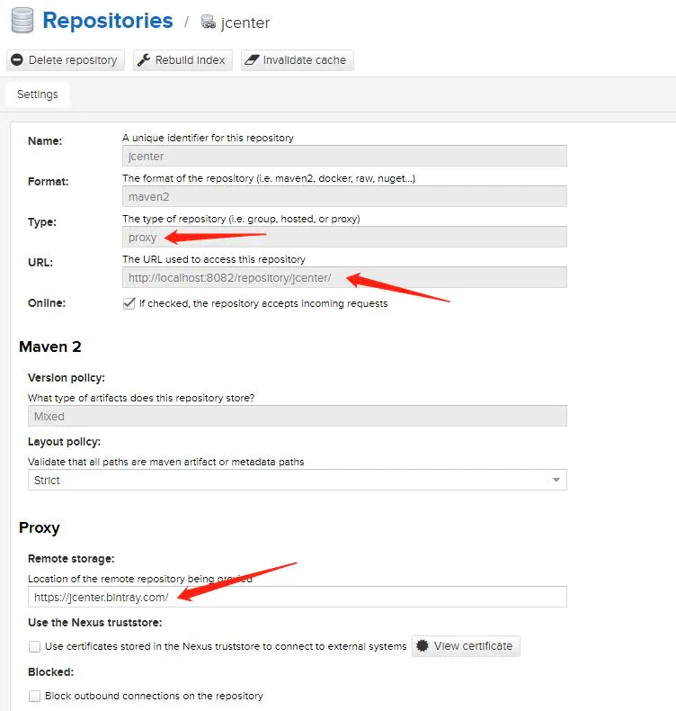
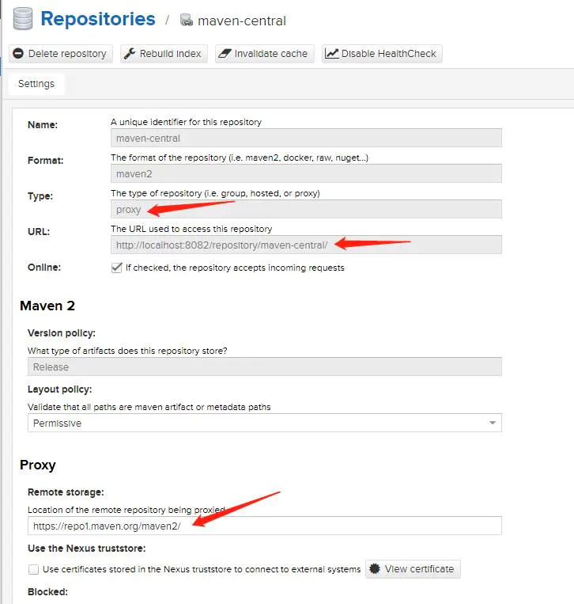
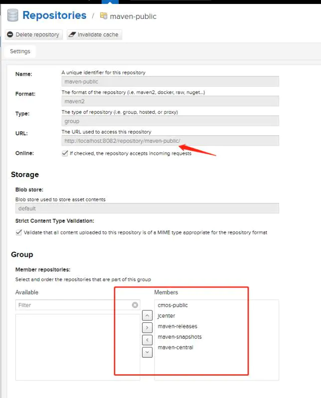
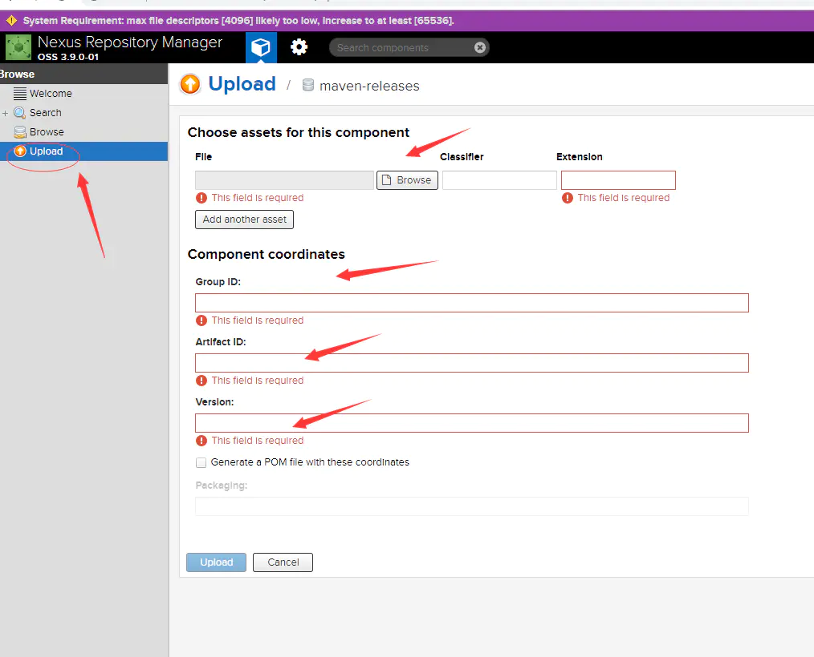

## Nexus

搭建Nexus私服的主要目的是为了解决工作组上组件之间的jar包依赖管理，特别是基础架构部门的jar包要共享出来，就需要把jar包deploy发布到nexus私服上

### 安装Nexus

#### 准备工作：

1. 找一台linux系统的虚拟机服务器，系统centos 7
2. jdk1.8
3. nexus-3.9.0-01-unix.tar.gz
4. 客户端安装了maven

#### 下载与安装

1 下载安装包，上传并解压安装包

xshell工具将安装包上传服务器：/usr/local/nexus目录

2 执行解压

```
tar -xzvf nexus-3.9.0-01-unix.tar.gz
```

3 修改配置

可以在nexus-default.properties文件中（位于/nexus-3.9.0-01/etc/目录下）修改web访问端口等信息，默认为8081端口，防火墙放行8081端口

4 启动

执行：

```
cd nexus-3.9.0-01/bin
./nexus run 
```

5 检验是否安装成功

打开浏览器，访问：http://ip地址:8081/

默认用户名admin，默认密码为 admin123

到此，Nexus安装完成

### 配置Nexus

#### 私服的工作原理


找依赖包的流程：首先在本地仓库中找，如果没有命中，那么就找远程私服；远程私服的查找规则同样是先找host属性的私有库，然后再去找proxy属性的远程仓库，可以配置多个proxy

#### Nexus仓库类型介绍

默认安卓有以下这几个仓库，在控制台也可以修改远程仓库的地址，第三方仓库等

1. hosted（宿主仓库库）：存放开发的jar包（正式版本，测试版本）
2. proxy（代理仓库）：代理中央仓库库，Apache下测试版本的jar包
3. group（组仓库）：使用时连接组仓库，包含Hosted（宿主仓库）和Proxy（代理仓库）

如上图所示，maven-public就我创建的组仓库。以及还创建了3个代理仓库，如下




**2、maven中央仓库：[https://repo1.maven.org/maven2/](https://links.jianshu.com/go?to=https%3A%2F%2Frepo1.maven.org%2Fmaven2%2F)**



最后建立组仓库maven-public，如下。



组仓库中包含了jcenter、maven-central、本地maven-releases，本地maven-snapshots。

** 至此，Nexus基本就这么配置好了，主要在Group组中配置一个代理私服。

### 配置下载依赖setting.xml

```xml
<mirror>
  <id>nexus-myself</id>
  <!--*指的是访问任何仓库都使用我们的私服-->
  <mirrorOf>*</mirrorOf>
  <name>Nexus myself</name>
  <url>http://192.168.124.29:8081/repository/maven-public/</url>
</mirror>
```

【全局配置下载依赖】

在maven的setting.xml文件中配置私服配置，这种方式配置后所有本地使用该配置的maven项目中pom文件都无需配置私服下载相关配置

```xml
<profiles>
  <profile>
     <id>mycof</id>
        <repositories>
        <!-- 私有库地址-->
          <repository>
          <id>nexus</id>
          <url>http://192.168.124.29:8081/repository/maven-public/</url>
          <releases>
            <enabled>true</enabled>
          </releases>
          <snapshots>
            <enabled>true</enabled>
          </snapshots>
        </repository>
      </repositories>      
      <pluginRepositories>
        <!--插件库地址-->
        <pluginRepository>
          <id>nexus</id>
          <url>http://192.168.124.29:8081/repository/maven-public/</url>
          <releases>
            <enabled>true</enabled>
          </releases>
          <snapshots>
            <enabled>true</enabled>
           </snapshots>
        </pluginRepository>
      </pluginRepositories>
    </profile> 
```

单独项目下载依赖，即在pom文件中配置，这种配置是修改单个项目的pom文件，无需修改maven的setting配置

```xml
<!--激活profile-->
<activeProfiles>
  <activeProfile>mycof</activeProfile>
</activeProfiles>
```

*建议使用全局的setting配置，一个项目组共用一个maven的setting配置，项目中就无需配置下载相关的私服仓库配置*

### 上传jar包配置

对于中央仓库没有的jar包，需要我们自己将jar包发布到私服中去，其中jar包主要分为两类，
 一类是本地自己开发供给项目组其余同事使用，这种直接配置项目的pom文件和maven的setting文件，之后deploy发布即可发布到；
 另一类是第三方jar包，可以直接使用web页面上传并设置对应GAV即可；

本地maven开发的项目上传配置

1 maven的setting文件配置

这里要配置上传用户及仓库信息，这里直接使用了admin用户，在mexus2.x中还内置了一个deployment/deployment123用户，在3.x该用户被移除了，这里可以自己配置角色和用户，我就直接使用admin用户了

```xml
<servers>
    <server>  
        <id>maven-releases</id>  
        <username>admin</username>  
        <password>admin123</password>  
    </server>  
    <server>  
        <id>maven-snapshots</id>  
        <username>admin</username>  
        <password>admin123</password>  
    </server>
</servers>
```

2 项目中的pom文件配置

```xml
<distributionManagement>
    <repository>
        <id>maven-releases</id>
        <name>Nexus Release Repository</name>
        <url>http://192.168.124.29:8081/repository/maven-releases/</url>
    </repository>
    <snapshotRepository>
        <id>maven-snapshots</id>
        <name>Nexus Snapshot Repository</name>
        <url>http://192.168.124.29:8081/repository/maven-snapshots/</url>
    </snapshotRepository>
</distributionManagement>
```

这个也没有用

3 执行maven的deploy命令

【注意】

这里只有Snapshot的仓库上传成功，Release仓库并没有上传成功，这是因为版本号名称结尾有SNAPSHOT，默认以这个结尾是不会上传到Release仓库去的，去除就会上传到Release仓库且不会上传到快照仓库

Release仓库默认不支持重复发布，[可配置](https://links.jianshu.com/go?to=https%3A%2F%2Fwww.cnblogs.com%2Fyangshaoxiang%2Fp%2F8807657.html%23%23%23web%E7%95%8C%E9%9D%A2)

注意setting中server标签下的id要和pom文件中仓库配置的id相同，即指定上传到哪个仓库

### 第三方jar包上传

对于第三方jar包的上传采用nexus提供的web界面上传，上传成功后需要使用该jar包的话，依赖中填写自定义的GAV即可

