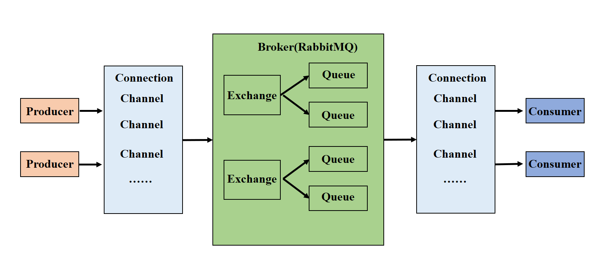
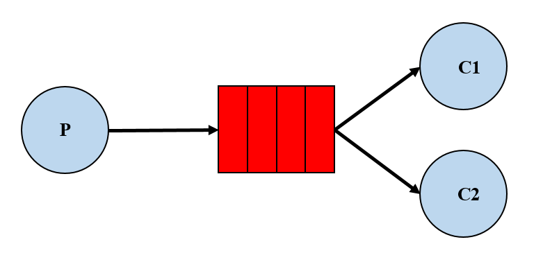
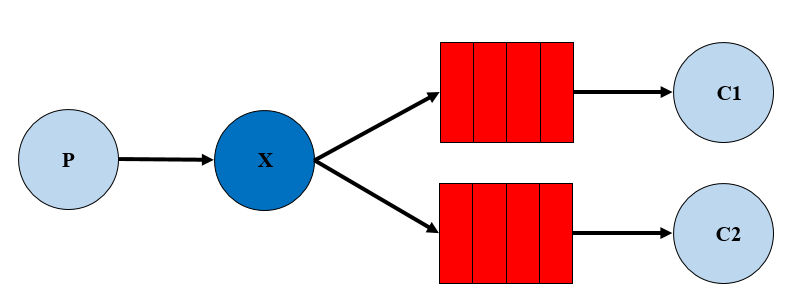
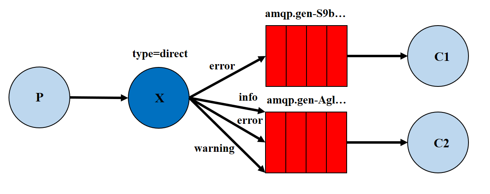
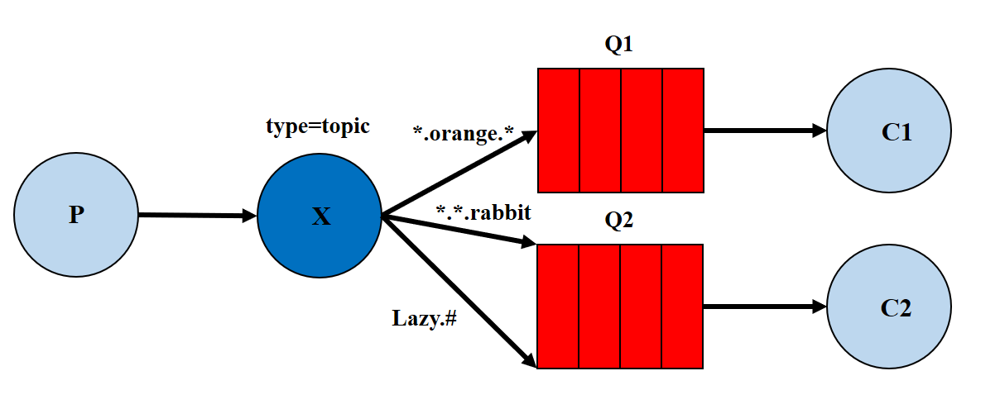
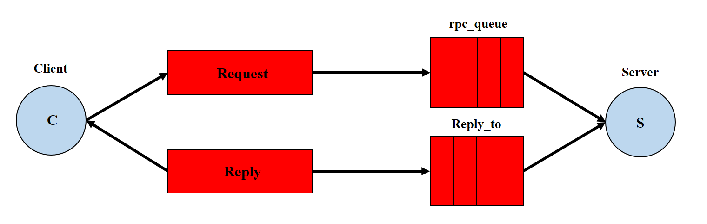
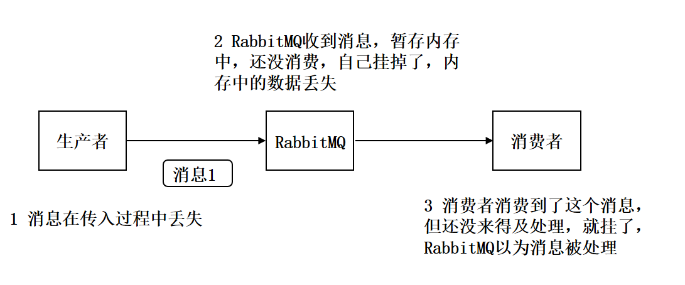
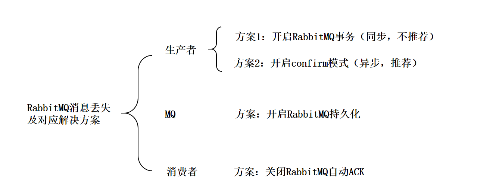

# RabbitMQ

`RabbitMQ`是一个开源的消息代理和队列服务器，用来通过普通协议在不同的应用之间共享数据(跨平台跨语言)。`RabbitMQ`是使用`Erlang`语言编写，并且基于`AMQP（Advanced Message Queue）`协议实现，它是一种应用程序之间的通信方法。

**【为什么使用消息队列】**

1. 异步
2. 解耦
3. 削峰

**【市场上还有哪些消息队列】**

`ActiveMQ`

`RabbitMQ`

`ZeroMQ`

`kafka`

`MetaMQ`

`RocketMQ`

`Redis`

## RabbitMq

**【为什么使用`RabbitMq`】**

`RabbitMq`的优势

**`可靠性(Reliablity)：`**使用了一些机制来保证可靠性，比如持久化、传输确认、发布确认。

**`灵活的路由(Flexible Routing)：`**在消息进入队列之前，通过`Exchange`来路由消息。对于典型的路由功能，`Rabbit`已经提供了一些内置的`Exchange`来实现。针对更复杂的路由功能，可以将多个`Exchange`绑定在一起，也通过插件机制实现自己的`Exchange`。

**`消息集群(Clustering)：`**多个`RabbitMQ`服务器可以组成一个集群，形成一个逻辑`Broker`。

**`高可用(Highly Avaliable Queues)：`**队列可以在集群中的机器上进行镜像，使得在部分节点出问题的情况下队列仍然可用。

**`多种协议(Multi-protocol)：`**支持多种消息队列协议，如`STOMP`、`MQTT`等。

**`多种语言客户端(Many Clients)：`**几乎支持所有常用语言，比如`Java`、`.NET`、`Ruby`等。

**`管理界面(Management UI)：`**提供了易用的用户界面，使得用户可以监控和管理消息`Broker`的许多方面。

**`跟踪机制(Tracing)：`**如果消息异常，`RabbitMQ`提供了消息的跟踪机制，使用者可以找出发生了什么。

**`插件机制(Plugin System)：`**提供了许多插件，来从多方面进行扩展，也可以编辑自己的插件。

### 工作原理



**【组成部分说明】**

1. `Broker`：消息队列服务进程，此进程包括两个部分：`Exchange`和`Queue`
2. `Exchange`：消息队列交换机，按一定的规则将消息路由转发到某个队列，对消息进行过滤
3. `Queue`：消息队列，存储消息的队列，消息到达队列并转发给指定的消费方
4. `Producer`：消息生产者，即生产方客户端，生产方客户端将消费发到`MQ`
5. `Consumer`：消息消费者，即消费方客户端，接受`MQ`转发的消息

**【消息发布接收流程】**

1. 发送消息
   1. 生产者和`Broker`建立`TCP`连接
   2. 生产者和`Broker`建立通道
   3. 生产者通过通道将消息发送`Broker`，由`Exchange`将消息进行转发
   4. `Exchange`将消息转发到指定的`Queue`（队列）
2. 接收消息
   1. 消费者和`Broker`建立`TCP`连接
   2. 消费者和`Broker`建立通道
   3. 消费者监听指定的`Queue`（队列）
   4. 当有消息到达`Queue`时`Broker`默认将消息推送给消费者
   5. 消费者接收到消息

### 参数说明

> `durable`：是否持久化，如果持久化，`mq`重启后队列还在
> `autoDeleted`：自动删除，队列不在使用时是否自动删除此队列，如果将此参数设置为`true`就可以实现临时队列（队列不用就自动删除）
> `arguments`：设置一个队列的扩展参数，比如：可设置存活时间等

> `routingKey`：路由`key`，交换机根据路由`key`来将消息转发到指定的队列，如果使用默认交换机，`routingKey`设置为队列名称，如果使用发布订阅模式，设置为空串

> `AcknowledgeMode`：`None`、`Manual`、`Auto`
> `deliveryTag` ：消息`id`，`mq`在`channel`中用来标识消息的`id`，可用于确认消息已经接收

> `fanout`：对应的`rabbitmq`的工作模式是 `publish/subscribe`
> `direct`：对应`Routing`的工作模式
> `topic`：对应`Topic`的工作模式
> `headers`：对应`headers`工作模式

### 工作模式

#### `Work queues` 工作队列



`work queues`由多个消费者共同消费同一个队列中的消息，它的特点如下：

1. 一个生产者将消息发给一个队列
2. 多个消费者共同监听一个队列的消息
3. 消息不能被重复消费
4. `rabbit`采用轮询的方式将消息平均发送给消费者

#### `Publish/Subscribe` 发布订阅



发布订阅模式

1. 一个生产者将消息发给交换机
2. 与交换机绑定的有多个队列，每个消费者监听自己的队列
3. 生产者将消息发给交换机，由交换机将消息转发到绑定此交换机的每个队列，每个绑定交换机的队列都将接收到消息
4. 如果消息发给没有绑定队列的交换机上，消息将丢失

#### `Routing` 路由



**模式**

1. 一个交换机绑定多个队列，每个队列设置`routingKey`，并且一个队列可以设置多个`routingKey`
2. 每个消费者监听自己的队列
3. 生产者将消息发给交换机，发送消息时需要指定`routingKey`的值，交换机来判断该`routingKey`的值和哪个队列的`routingKey`相等，如果相等则将消息转发给该队列

**Routing模式和Publish/subscribe模式的区别**

1. `Publish/subscribe`模式在绑定交换机时不需要指定`routingKey`，消息会发送到每个绑定交换机的队列
2. `Routing`模式要求队列在绑定交换机时要指定`routingKey`（这就是队列`routingKey`），发送消息将消息发送到和`routingKey`的值相等的队列中。如上图所示，每个队列可以指定多个`routingKey`，如果发送消息时指定

#### `Topics` 通配符 



**模式**

1. 一个交换机可以绑定多个队列，每个队列可以设置一个都或多个带通配符的`routingKey`
2. 生产者将消息发给交换机，交换机根据`routingKey`的值来匹配队列，匹配时采用通配符方式，匹配成功的将消息转发到指定的队列

**Topiche Routing的区别**

`Topics`和`Routing`的基本原理相同，即：生产者将消息发给交换机，交换机根据`routingKey`将消息转发给与`routingKey`匹配的队列

不同之处：`routingKey`是匹配方式，`Routing`模式是相等匹配，`topics`模式是通配符匹配

> `#`：匹配一个或者多个词，比如`inform.#`可以匹配`inform.sms`、`inform.email`、`inform.email.sms`
>
> `*`：只能匹配一个词，比如`inform.*` 可以匹配`inform.sms`、`inform.email`

```bash
inform.#.sms.#
inform.#.email.#
```

```bash
inform.sms
inform.email
inform.sms.email
```

#### `Header Header`转发器

`header`模式与`routing`不同的地方在于，`header`模式取消`routingkey`，使用`header`中的`key/value`（键值对）匹配队列

> 案例：
> 根据用户的通知设置去通知用户，设置接收`Email`的用户只接收`Email`，设置接收SMS的用户只接收`SMS`，设置两种通知类型都接收的则两种通知都有效

**生产者**

```java
Map<String, Object> headers_email = new HashTable<String, Object>();
headers_email.put("inform_email", "email");
Map<String, Object> headers_sms = new HashTable<String, Object>();
headers_sms.put("inform_sms", "sms");

channel.quereBind(QUEUE_INFORM_EMAIL, EXCHANGE_HEADERS_INFORM, "", headers_email)
channel.quereBind(QUEUE_INFORM_SMS, EXCHANGE_HEADERS_INFORM, "", headers_sms)
```

**通知**

```java
String message = "email inform to user" + i;
Map<String, Object> headers = new HashTable<String, Object>;
headers.put("inform_email", "email"); // 匹配email通知消费者绑定的header
// headers.put("inform_sms", "sms"); // 匹配sms通知消费者绑定的header，如果设置两个，就会匹配两个
AMQP.BasicProperties.Builder properties = new AMQP.BasicProperties.Builder();
properties.headers(headers);
// email 通知
channel.basicPublish(EXCHANGE_HEADERS_INFORM, "", properties.build(), message.getBytes())
```


#### `RPC` 远程过程调用



`RPC`即客户端远程调用服务器的方法，使用`MQ`可以实现`RPC`的异步调用，基于`Direct`交换机实现，流程如下：

1. 客户端既是生产者又是消费者，向`RPC`请求队列发送`RPC`调用消息，同时监听`RPC`响应队列
2. 服务端监听`RPC`请求队列的消息，收到消息后执行服务端的方法，得到方法返回的结果
3. 服务端将`RPC`方法的结果发送到`RPC`响应队列

### 面试问题

#### 什么是RabbitMQ

`RabbitMQ`是一款开源的，`Erlang`编写的，基于`AMQP`协议的，消息中间件

#### 为什么使用RabbitMQ

异步、解耦、削峰

#### RabbitMQ有什么优缺点

优点：解耦、异步、削峰

缺点：降低了系统的稳定性：本来系统运行好好的，现在你非要加入个消息队列进去，那消息队列挂了，你的系统不是呵呵了。因此，系统可用性会降低；增加了系统的复杂性：加入了消息队列，要多考虑很多方面的问题，比如：一致性问题、如何保证消息不被重复消费、如何保证消息可靠性传输等。因此，需要考虑的东西更多，复杂性增大。

#### 如何保证RabbitMQ的高可用

`rabbitMQ`对于高可用是基于主从的方式进行实现. 其有三种工作模式: 单机模式、普通集群模式、镜像集群模式

单机模式：生产不可能使用

普通集群模式：普通集群模式，意思就是在多台机器上启动多个 `RabbitMQ` 实例，每个机器启动一个。你**创建的 `queue`，只会放在一个 `RabbitMQ` 实例上**，但是每个实例都同步 `queue` 的元数据（元数据可以认为是 `queue` 的一些配置信息，通过元数据，可以找到 `queue` 所在实例）。你消费的时候，实际上如果连接到了另外一个实例，那么那个实例会从 queue 所在实例上拉取数据过来。这种方式确实很麻烦，也不怎么好，**没做到所谓的分布式**，就是个普通集群。因为这导致你要么消费者每次随机连接一个实例然后拉取数据，要么固定连接那个 `queue` 所在实例消费数据，前者有**数据拉取的开销**，后者导致**单实例性能瓶颈**。而且如果那个放 `queue` 的实例宕机了，会导致接下来其他实例就无法从那个实例拉取，如果你**开启了消息持久化**，让 `RabbitMQ` 落地存储消息的话，**消息不一定会丢**，得等这个实例恢复了，然后才可以继续从这个 `queue` 拉取数据

镜像集群模式：这种模式，才是所谓的 `RabbitMQ` 的高可用模式。跟普通集群模式不一样的是，在镜像集群模式下，你创建的 `queue`，无论元数据还是 `queue` 里的消息都会**存在于多个实例上**，就是说，每个 `RabbitMQ` 节点都有这个 `queue` 的一个**完整镜像**，包含 queue 的全部数据的意思。然后每次你写消息到 `queue` 的时候，都会自动把**消息同步**到多个实例的 `queue` 上。那么**如何开启这个镜像集群模式**呢？其实很简单，`RabbitMQ` 有很好的管理控制台，就是在后台新增一个策略，这个策略是**镜像集群模式的策略**，指定的时候是可以要求数据同步到所有节点的，也可以要求同步到指定数量的节点，再次创建 `queue` 的时候，应用这个策略，就会自动将数据同步到其他的节点上去了。这样的话，好处在于，你任何一个机器宕机了，没事儿，其它机器（节点）还包含了这个 `queue` 的完整数据，别的 `consumer` 都可以到其它节点上去消费数据。坏处在于，第一，这个性能开销也太大了吧，消息需要同步到所有机器上，导致网络带宽压力和消耗很重！第二，这么玩儿，不是分布式的，就**没有扩展性可言**了，如果某个 `queue` 负载很重，你加机器，新增的机器也包含了这个 `queue` 的所有数据，并**没有办法线性扩展**你的 `queue`。

#### 如何保证RabbitMQ不被重复消费

先说为什么会重复消费：正常情况下，消费者在消费消息的时候，消费完毕后，会发送一个确认消息给消息队列，消息队列就知道该消息被消费了，就会将该消息从消息队列中删除。但是因为网络传输等等故障，确认信息没有传送到消息队列，导致消息队列不知道自己已经消费过该消息了，再次将消息分发给其他的消费者。针对以上问题，一个解决思路是：保证消息的唯一性，就算是多次传输，不要让消息的多次消费带来影响；保证消息等幂性；

> - 比如你拿个数据要写库，你先根据主键查一下，如果这数据都有了，你就别插入了，`update` 一下好吧。
> - 比如你是写 `Redis`，那没问题了，反正每次都是 `set`，天然幂等性。
> - 比如你不是上面两个场景，那做的稍微复杂一点，你需要让生产者发送每条数据的时候，里面加一个全局唯一的 `id`，类似订单 `id` 之类的东西，然后你这里消费到了之后，先根据这个 `id` 去比如 `Redis` 里查一下，之前消费过吗？如果没有消费过，你就处理，然后这个 `id` 写 `Redis`。如果消费过了，那你就别处理了，保证别重复处理相同的消息即可。
> - 比如基于数据库的唯一键来保证重复数据不会重复插入多条。因为有唯一键约束了，重复数据插入只会报错，不会导致数据库中出现脏数据

#### 如何保证RabbitMQ消息的可靠传输



**【生产者丢失数据】**

生产者将数据发送到 `RabbitMQ` 的时候，可能数据就在半路给搞丢了，因为网络问题啥的，都有可能

此时可以选择用 RabbitMQ 提供的事务功能，就是生产者**发送数据之前**开启 RabbitMQ 事务 `channel.txSelect` ，然后发送消息，如果消息没有成功被 RabbitMQ 接收到，那么生产者会收到异常报错，此时就可以回滚事务 `channel.txRollback` ，然后重试发送消息；如果收到了消息，那么可以提交事务 `channel.txCommit` 。

```java
// 开启事务
channel.txSelect
try {
    // 这里发送消息
} catch (Exception e) {
    channel.txRollback

    // 这里再次重发这条消息
}

// 提交事务
channel.txCommit
```

但是问题是，`RabbitMQ` 事务机制（同步）一搞，基本上**吞吐量会下来，因为太耗性能**

所以一般来说，如果你要确保说写 `RabbitMQ` 的消息别丢，可以开启 `confirm` 模式，在生产者那里设置开启 `confirm` 模式之后，你每次写的消息都会分配一个唯一的 `id`，然后如果写入了 RabbitMQ 中，RabbitMQ 会给你回传一个 `ack` 消息，告诉你说这个消息 ok 了。如果 `RabbitMQ` 没能处理这个消息，会回调你的一个 `nack` 接口，告诉你这个消息接收失败，你可以重试。而且你可以结合这个机制自己在内存里维护每个消息 `id` 的状态，如果超过一定时间还没接收到这个消息的回调，那么你可以重发。

事务机制和 `confirm` 机制最大的不同在于，**事务机制是同步的**，你提交一个事务之后会**阻塞**在那儿，但是 `confirm` 机制是**异步**的，你发送个消息之后就可以发送下一个消息，然后那个消息 `RabbitMQ` 接收了之后会异步回调你的一个接口通知你这个消息接收到了。

所以一般在生产者这块**避免数据丢失**，都是用 `confirm` 机制的。

**【RabbitMQ丢失数据】**

就是 `RabbitMQ` 自己弄丢了数据，这个你必须**开启 `RabbitMQ` 的持久化**，就是消息写入之后会持久化到磁盘，哪怕是 `RabbitMQ` 自己挂了，**恢复之后会自动读取之前存储的数据**，一般数据不会丢。除非极其罕见的是，`RabbitMQ` 还没持久化，自己就挂了，**可能导致少量数据丢失**，但是这个概率较小。

设置持久化有**两个步骤**：

- 创建 `queue` 的时候将其设置为持久化

这样就可以保证 `RabbitMQ` 持久化 `queue` 的元数据，但是它是不会持久化 `queue` 里的数据的。

- 第二个是发送消息的时候将消息的 `deliveryMode` 设置为 2

就是将消息设置为持久化的，此时 `RabbitMQ` 就会将消息持久化到磁盘上去。

必须要同时设置这两个持久化才行，`RabbitMQ` 哪怕是挂了，再次重启，也会从磁盘上重启恢复 `queue`，恢复这个 `queue` 里的数据。

注意，哪怕是你给 `RabbitMQ` 开启了持久化机制，也有一种可能，就是这个消息写到了 `RabbitMQ` 中，但是还没来得及持久化到磁盘上，结果不巧，此时 `RabbitMQ` 挂了，就会导致内存里的一点点数据丢失。

所以，持久化可以跟生产者那边的 `confirm` 机制配合起来，只有消息被持久化到磁盘之后，才会通知生产者 `ack` 了，所以哪怕是在持久化到磁盘之前，`RabbitMQ` 挂了，数据丢了，生产者收不到 `ack` ，你也是可以自己重发的。

**【消费端丢失数据】**

`RabbitMQ` 如果丢失了数据，主要是因为你消费的时候，**刚消费到，还没处理，结果进程挂了**，比如重启了，那么就尴尬了，`RabbitMQ` 认为你都消费了，这数据就丢了。

这个时候得用 RabbitMQ 提供的 `ack` 机制，简单来说，就是你必须关闭 RabbitMQ 的自动 `ack` ，可以通过一个 `api` 来调用就行，然后每次你自己代码里确保处理完的时候，再在程序里 `ack` 一把。这样的话，如果你还没处理完，不就没有 `ack` 了？那 RabbitMQ 就认为你还没处理完，这个时候 `RabbitMQ` 会把这个消费分配给别的 consumer 去处理，消息是不会丢的。



#### 如何保证RabbitMQ消息的顺序性

`RabbitMQ`保证消息的顺序性，就是拆分多个 `queue`，每个 `queue` 对应一个 `consumer`（消费者），就是多一些 `queue` 而已，确实是麻烦点；或者就一个 `queue` 但是对应一个 `consumer`，然后这个 `consumer` 内部用内存队列做排队，然后分发给底层不同的 `worker` 来处理。

#### 你们公司生产环境用的消息中间件

`ActiveMQ`是老牌的消息中间件，国内很多公司过去运用的还是非常广泛的，功能很强大。

但是问题在于没法确认ActiveMQ可以支撑互联网公司的高并发、高负载以及高吞吐的复杂场景，在国内互联网公司落地较少。而且使用较多的是一些传统企业，用ActiveMQ做异步调用和系统解耦。

****

`RabbitMQ`，他的好处在于可以支撑高并发、高吞吐、性能很高，同时有非常完善便捷的后台管理界面可以使用。

另外，他还支持集群化、高可用部署架构、消息高可靠支持，功能较为完善。

而且经过调研，国内各大互联网公司落地大规模`RabbitMQ`集群支撑自身业务的`case`较多，国内各种中小型互联网公司使用`RabbitMQ`的实践也比较多。

除此之外，`RabbitMQ`的开源社区很活跃，较高频率的迭代版本，来修复发现的`bug`以及进行各种优化，因此综合考虑过后，公司采取了`RabbitMQ`。

但是`RabbitMQ`也有一点缺陷，就是他自身是基于`erlang`语言开发的，所以导致较为难以分析里面的源码，也较难进行深层次的源码定制和改造，毕竟需要较为扎实的`erlang`语言功底才可以。

****

`RocketMQ`，是阿里开源的，经过阿里的生产环境的超高并发、高吞吐的考验，性能卓越，同时还支持分布式事务等特殊场景。

而且`RocketMQ`是基于`Java`语言开发的，适合深入阅读源码，有需要可以站在源码层面解决线上生产问题，包括源码的二次开发和改造。

****

`Kafka`提供的消息中间件的功能明显较少一些，相对上述几款`MQ`中间件要少很多。

但是`Kafka`的优势在于专为超高吞吐量的实时日志采集、实时数据同步、实时数据计算等场景来设计。

因此`Kafka`在大数据领域中配合实时计算技术（比如`Spark Streaming、Storm、Flink`）使用的较多。但是在传统的`MQ`中间件使用场景中较少采用

|            | ActiveMQ                                                | RabbitMQ                                                     | RocketMQ                                                     | Kafka                                                        | ZeroMQ               |
| ---------- | ------------------------------------------------------- | ------------------------------------------------------------ | ------------------------------------------------------------ | ------------------------------------------------------------ | -------------------- |
| 单机吞吐量 | 比RabbitMQ低                                            | 2.6w/s（消息做持久化）                                       | 11.6w/s                                                      | 17.3w/s                                                      | 29w/s                |
| 开发语言   | Java                                                    | Erlang                                                       | Java                                                         | Scala/Java                                                   | C                    |
| 主要维护者 | Apache                                                  | Mozilla/Spring                                               | Alibaba                                                      | Apache                                                       | iMatix，创始人已去世 |
| 成熟度     | 成熟                                                    | 成熟                                                         | 开源版本不够成熟                                             | 比较成熟                                                     | 只有C、PHP等版本成熟 |
| 订阅形式   | 点对点(p2p)、广播（发布-订阅）                          | 提供了4种：direct, topic ,Headers和fanout。fanout就是广播模式 | 基于topic/messageTag以及按照消息类型、属性进行正则匹配的发布订阅模式 | 基于topic以及按照topic进行正则匹配的发布订阅模式             | 点对点(p2p)          |
| 持久化     | 支持少量堆积                                            | 支持少量堆积                                                 | 支持大量堆积                                                 | 支持大量堆积                                                 | 不支持               |
| 顺序消息   | 不支持                                                  | 不支持                                                       | 支持                                                         | 支持                                                         | 不支持               |
| 性能稳定性 | 好                                                      | 好                                                           | 一般                                                         | 较差                                                         | 很好                 |
| 集群方式   | 支持简单集群模式，比如’主-备’，对高级集群模式支持不好。 | 支持简单集群，'复制’模式，对高级集群模式支持不好。           | 常用 多对’Master-Slave’ 模式，开源版本需手动切换Slave变成Master | 天然的‘Leader-Slave’无状态集群，每台服务器既是Master也是Slave | 不支持               |
| 管理界面   | 一般                                                    | 较好                                                         | 一般                                                         | 无                                                           | 无                   |


## 安装

### 安装 Erlang

环境变量

`ERLANG_HOME`

`Path：%ERLANG_HOME%\bin`

### 安装 RabbitMQ

环境变量

`RABBITMQ_SERVER`

`Path：%RABBITMQ_SERVER%\sbin`

### 安装 rabbitmq_management

```
rabbitmq-plugins list
rabbitmq-plugins enable rabbitmq_management
```

输入`http://localhost:15672`

`username:guest`
`password:guest`

## SpringBoot 快速集成 RabbitMq

### rabbitmq配置

```java
@Configuration
public class RabbitMQConfig {
    @Value("${rabbitmq.queue.sendMessage}")
    private String sendMessageQueueName;

    @Bean
    public Queue queue() {
        return new Queue(sendMessageQueueName);
    }
}
```

### sender 发送消息

```java
@Component
public class Sender {
    @Value("${rabbitmq.queue.sendMessage}")
    private String sendMessageQueueName;

    @Autowired
    private AmqpAdmin amqpAdmin;
    @Autowired
    private AmqpTemplate amqpTemplate;

    public void send() {
        amqpTemplate.convertAndSend(sendMessageQueueName, "foo");
    }
}
```

### listener 监听消息

```java
@Component
public class Listener {
    @RabbitListener(queues = "sendMessage1")
    public void process(@Payload String content) {
        System.out.println("this is listener:" + content);
    }
}
```

### application.properties

```properties
spring.rabbitmq.host=localhost
spring.rabbitmq.port=5672
spring.rabbitmq.username=guest
spring.rabbitmq.password=guest
spring.rabbitmq.listener.direct.acknowledge-mode=none
rabbitmq.queue.sendMessage=sendMessage1
```

## SpringBoot 集成 RabbitMq

[项目](https://github.com/gaoming95/rtz-learn/tree/master/rtz-rabbitmq)

### 引入依赖

```xml
<dependency>
    <groupId>org.springframework.boot</groupId>
    <artifactId>spring-boot-starter-amqp</artifactId>
</dependency>

<dependency>
    <groupId>org.projectlombok</groupId>
    <artifactId>lombok</artifactId>
</dependency>

<dependency>
    <groupId>com.alibaba</groupId>
    <artifactId>fastjson</artifactId>
    <version>1.2.70</version>
</dependency>
```

### RabbitMqConfig

```java
@Configuration
public class RabbitMQConfig {
    @Value("${rabbitmq.corePoolSize}")
    private Integer corePoolSize;
    @Value("${rabbitmq.maxPoolSize}")
    private Integer maxPoolSize;
    @Value("${rabbitmq.concurrency}")
    private String concurrency;
    @Value("${rabbitmq.queueCapacity}")
    private Integer queueCapacity;
    @Value("${rabbitmq.keepAliveSeconds}")
    private Integer keepAliveSeconds;

    @Bean(name = "mqExecutor")
    public ThreadPoolTaskExecutor mqExecutor() {
        ThreadPoolTaskExecutor executor = new ThreadPoolTaskExecutor();
        executor.setCorePoolSize(corePoolSize);
        executor.setMaxPoolSize(maxPoolSize);
        executor.setQueueCapacity(queueCapacity);
        executor.setKeepAliveSeconds(keepAliveSeconds);
        return executor;
    }

    @Bean
    public SimpleMessageListenerContainer ServiceNameListenerContainer(
            ConnectionFactory connectionFactory,
            MessageConverter messageConverter,
            @Qualifier("serviceNameQueue") Queue queue,
            @Qualifier("mqExecutor") Executor executor,
            @Qualifier("serviceNameListener") ChannelAwareMessageListener messageListener
    ){
        return defaultMessageListenerContainer(connectionFactory, messageConverter, queue, executor, messageListener);
    }

    private SimpleMessageListenerContainer defaultMessageListenerContainer(
            ConnectionFactory connectionFactory,
            MessageConverter messageConverter,
            Queue queue,
            Executor executor,
            ChannelAwareMessageListener messageListener) {
        SimpleMessageListenerContainer container = new SimpleMessageListenerContainer();
        container.setConnectionFactory(connectionFactory);
        container.setAcknowledgeMode(AcknowledgeMode.MANUAL);
        container.setTaskExecutor(executor);
        container.setConcurrency(concurrency);
//        container.setMessageConverter(messageConverter);
        container.setQueues(queue);
        container.setMessageListener(messageListener);
        return container;
    }
}
```

### 配置监听

```java
@Component
@Slf4j
public class ServiceNameListener implements ChannelAwareMessageListener {

    @Autowired
    private FastJsonMessageConverter messageConverter;

    @Override
    public void onMessage(Message message, Channel channel) throws Exception {
        log.info("do some service, message is {}", message);
        long deliveryTag = message.getMessageProperties().getDeliveryTag();
        String key = message.getMessageProperties().getReceivedRoutingKey();
        System.out.println(key);
        ServiceNameMessage msg;

        try {
            msg = messageConverter.fromMessage(message, ServiceNameMessage.class);
        } catch (Exception e) {
            log.error("ServiceName: message params error ", e);
            channel.basicReject(deliveryTag, false);
            return;
        }

        try {
            this.processServiceName(msg);
            channel.basicAck(deliveryTag, false);
        } catch (Exception e) {
            log.error("Service Name failed with msg={}, error is {}", msg, e);
            channel.basicReject(deliveryTag, false);
        }
    }

    private void processServiceName(ServiceNameMessage msg) {
        // 处理消息
        System.out.println("消息处理完成");
    }
}
```

### 配置处理器

```java
@Component
@Slf4j
public class ServiceNameHandler extends AbstractMqMessageHandler<ServiceNameMessage> {

    @Autowired
    @Qualifier("serviceNameExchange")
    private FanoutExchange exchange;

    @Override
    public void convertAndSend(ServiceNameMessage msg) {
        Assert.isTrue(messageValidate(msg), "非法消息不可发送");
        this.sendMsgWithRetry(msg, exchange.getName(), "s");
    }

    @Override
    public Boolean messageValidate(ServiceNameMessage msg) {
        log.info("messageValid with message={}", msg);
        return msg != null && msg.getAccountId() != null && msg.getGoodId() != null;
    }
}
```

### application.properties

```properties
spring.rabbitmq.host=localhost
spring.rabbitmq.port=5672
spring.rabbitmq.username=guest
spring.rabbitmq.password=guest
#spring.rabbitmq.virtual-host=test

rabbitmq.concurrency=5
rabbitmq.corePoolSize=50
rabbitmq.maxPoolSize=100
rabbitmq.queueCapacity=100
rabbitmq.keepAliveSeconds=60

rabbitmq.queue.service_name=queue_service_name
rabbitmq.exchange.service_name=exchange_service_name
```

