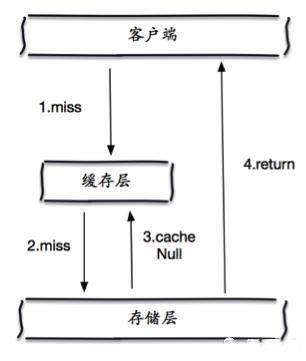

# Redis

## Spring Redis

配置信息

```java
@Configuration
@ComponentScan
public class RedissonConfig {
    @Value("${redis.cluster.nodes}")
    private String redisNodes;

    @Value("${redis.timeout}")
    private Integer timeout;
    @Value("${redis.maxIdle}")
    private Integer redisMaxIdle;

    @Value("${redis.minIdle}")
    private Integer redisMinIdle;

    @Bean(destroyMethod = "shutdown")
    RedissonClient redisson() throws IOException {
        Config config = new Config();
        config.useClusterServers()
                .setMasterConnectionPoolSize(redisMaxIdle)
                .setMasterConnectionMinimumIdleSize(redisMinIdle)
                .setConnectTimeout(timeout)
                .addNodeAddress(redisNodes.split(","));
        return Redisson.create(config);
    }
}
```

应用

```java
@Autowired
private RedisTemplate<String, String> stringRedisTemplate;
```

插入

```java
stringRedisTemplate.opsForValue().set(pageIdRedisKey, JSON.toJSONString(pageConfig), LANDING_PAGE_EXPIRE_TIME_IN_REDIS, TimeUnit.MINUTES);
```

查询

```java
String pageConfigString = stringRedisTemplate.opsForValue().get(pageIdRedisKey);
```

## Redis缓存穿透和缓存雪崩

作为一个内存数据库，redis也总是避免不了有各种问题

https://www.jianshu.com/p/2104d11ee0a2

### 缓存穿透

缓存穿透

用户想要查询一个数据，发现redis内存数据库中没有，也就是缓存没有命中，于是向持久层数据库查询。发现也没有，于是本次查询失败，但用户很多时候，缓存都没有命中，于是都去请求持久层数据库，这就会给持久层造成很多的压力，这时候就相当于出现了缓存穿透。

这里需要注意和缓存击穿的区别，缓存击穿，是指一个key非常热点，在不停地扛着大并发，大并发集中对这一个点进行访问，当这个key在失效的瞬间，持续的大并发就穿透缓存，直接请求数据库，就像在一个屏障上凿开了一个洞。为了避免缓存穿透有很多解决方案：

#### 布隆过滤器

布隆过滤器是一种数据结构，比较巧妙地概率型数据结构，特点是高效地插入和查询，可以用来告诉你“某样东西一定存在或者可能存在”，相比于传统地List、Set、Map等数据结构，它更高效、占用空间更少，但是缺点是其返回的结果是概率性的，而不是确切的。

布隆过滤器是一个bit向量或者说bit数组


如果我们要映射一个值到布隆过滤器，我们需要使用多个不同的哈希函数生成多个哈希值，并对每个生成的哈希值指向的bit位置1，例如针对值”baidu“和三个不同的哈希函数分别生成了哈希值1、4、7，则上图转变为


例如我们再存储一个值”tencent“，如果哈希函数返回3、4、8的话，图继续变为


值得注意的是，4这个bit位由于两个值的哈希函数都返回了这个bit位，因此它被覆盖了。现在我们如果想查询”dianping“这个值是否存在，哈希函数返回了1、5、8三个值，结果我们发现5这个bit上的值为0，说明没有任何一个值映射到这个bit位上，因此我们可以确定说“dianping”这个值不存在，而当我们需要查询”百度“这个值是否存在的话，那么哈希函数会返回1，4，7，然后我们发现这三个位置上的值均为1，那我们可以说”baidu“这个值存在了吗？答案是不可以，只能是”百度这个值可能存在“

因为随着增加的值越来越多，被置为1的bit位也会越来越多，这样某个值即使没有被存储过，但是万一哈希函数返回的三个bit位都被其他值置为1，那么程序还是会判断这个值存在

传统的布隆过滤器并不支持删除操作。但是名为 Counting Bloom filter 的变种可以用来测试元素计数个数是否绝对小于某个阈值，它支持元素删除

【如何选择哈希函数和布隆过滤器长度】

过小的布隆过滤器很快所有的bit位均为1，那么查询很快都会返回可能存在，起不到过滤的作用，布隆过滤器越长，其误报率越小。

另外，哈希函数的个数需要权衡，个数越多则布隆过滤器bit位置1的速度越快，且布隆过滤器的效率越低，但是如果太少的话，那误报率会变高，如何选择合适业务的k和m值？


```
m = - \frac {n\ln p} {{{\ln}^2 2}}
k=\frac m n \ln 2
```

k为哈希函数个数，m为布隆过滤器长度，n为插入的元素个数，p为误报率

#### 缓存空对象

当存储层不命中后，即使返回的是空对象，也将其缓存起来，同时会设置一个过期时间，之后再访问这个数据将会从缓存中获取，保存了后端数据源



但是这种方法会存在两个问题：

1 如果空值能够被缓存起来，这就意味着缓存需要更多的空间存储更多的键，因为这当中可能会有很多的空值的键

2 即使对空值设置了过期时间，还是会存在缓存层和存储层的数据会有一段时间窗口的不一致，这对于需要保持一致性的业务产生影响

### 缓存雪崩

缓存雪崩是指，缓存层出现了错误，不能正常工作了。于是所有的请求都会达到存储层，存储层的调用量会暴增，造成存储层也会挂掉的情况。

#### redis高可用

既然redis有可能挂掉，那多增设几台redis，这样一台挂掉之后，其他的还可以继续工作，其实就是搭建redis集群

#### 限流降级

这个解决方案的思想，在缓存失效后，通过加锁或者消息队列来控制读数据库写缓存的线程数量。比如对某个key只允许 一个线程查询数据和写缓存，其他线程等待

#### 数据预热

数据预热的含义就是在部署之前，我们先把可能的数据先预先访问一遍，这样部门可能大量访问的数据就会加载到缓存中，在即将发生大并发访问前手动触发加载缓存不同的key，设置不同的过期时间，让缓存失效的时间点尽量均匀。

## Redis热数据

redis内存数据集大小上升到一定大小的时候，就会施行数据淘汰策略

redis提供了6种数据淘汰策略：

1. volitile-lru：从已设置过期时间的数据集（server.db[i].expires）中挑选最近最少使用的数据淘汰
2. volatile-ttl：从已设置过期时间的数据集（server.db[i].expires）中挑选将要过期的数据淘汰
3. volatile-random：从已设置过期时间的数据集（server.db[i].expries）中任意选择数据淘汰
4. allkeys-lru：从数据集（server.db[i].dict）中挑选最近最少使用的数据淘汰
5. allkeys-random：从数据集（server.db[i].dict）中任意选择数据淘汰
6. no-enviction（驱逐）：禁止驱逐数据

****

## redis的持久化方式RDB和AOF的区别

Redis的缓存都存放在内存中，如果没有配置持久化，redis重启后的数据就全丢失了，于是需要开始redis的持久化功能，将数据保存在磁盘上，当redis重启后数据就全丢失了。于是需要开始redis的持久化功能，将数据保存在磁盘上，当redis重启后，可以从磁盘中恢复数据。

redis提供两种方式进行持久化，一种是RDB持久化（原理是将Redis在内存中的数据库记录定时dump到磁盘上的RDB持久化），另外一种是AOF持久化（原理是将Redis的操作日志以追加的方式写入文件）。

区别：

RDB持久化是指在指定的时间间隔内将内存中的数据集快照写入磁盘，实际操作过程中是fork一个子进程，先将数据集写入临时文件，写入成功后，再替换之前的文件，用二进制压缩存储。


AOF持久化以日志的形式记录服务器所处理的每一个写、删除操作，查询操作不会记录，以文本的方式记录，可以打开文件看到详细的操作记录。


二者优缺点：

#### RDB存在哪些优势？

（1）一旦采取这种方式，那么你的整个redis数据库将只包含一个文件，这对于文件备份而言是非常完美的。比如：你可以打算每个小时归档一次最近24小时的数据，同时还要每天归档一次最近30天的数据。通过这样的备份策略，一旦系统出现灾难性故障，我们可以非常容易的进行恢复

（2）对于灾难恢复而言，RDB时非常不错的选择。因为我们可以非常轻松的将一个单独的文件压缩后再转移到其他存储介质上

（3）性能最大化，对于Redis的服务进程而言，在开始持久化时，它唯一需要做的只是fork一个子进程，之后再由子进程完成这些持久化的工作，这样就可以极大的避免服务进程执行IO操作

（4）相比于AOF机制，如果数据集很大，RDB的启动效率就会更高

#### RDB存在哪些劣势

（1）如果你想保证数据的高可用性，即最大限度避免数据丢失，那么RDB不是一个很好的选择。因为系统一旦在定时持久化之前出现宕机现象，此前没有来得及写入磁盘的数据都将丢失。

（2）由于RDB是通过fork子进程来协助完成数据持久化工作的，因此，如果当数据集较大时，可能会导致整个服务器停止服务几百毫秒，甚至一秒钟。

#### AOF有哪些优势

（1）该机制可以带来更高的数据安全性，即数据持久性。Redis中提供了3种同步策略，即每秒同步，每修改同步和不同步。事实上，每秒同步也是异步完成的，其效率也是非常高的，所差的是一旦系统出现宕机现象，那么这一秒钟之内修改的数据将会丢失。而每修改同步，我们可以将其视为同步持久化，即每次发生的数据变化都会被立即记录到磁盘中。可以预见，这种方式在效率上是最低的

（2）由于该机制对日志文件的写入操作采用的是append模式，因此在写入过程中即使出现宕机现象，也不会破坏日志文件中已经存在的内容。然而如果我们本次操作只是写入了一半数据就出现了系统崩溃问题，不用担心，在Redis下一次启动之前，我们可以通过redis-check-aof工具来帮助我们解决数据一致性的问题。

（3）如果日志过大，Redis可以自动启用rewrite机制。即Redis以append模式不断的将修改数据写入到老的磁盘文件中，同时Redis还会创建一个新的文件用于记录此期间有哪些修改命令被执行。因此在进行rewrite切换时可以更好的保证数据安全性。

（4）AOF包含一个格式清晰、易于理解的日志文件用于记录所有的修改操作。事实上，我们也可以通过该文件完成数据的重建。

#### AOF的劣势

（1） 对于相同数量的数据集而言，AOF文件通常要大于RDB文件。RDB 在恢复大数据集时的速度比 AOF 的恢复速度要快。

（2）根据同步策略的不同，AOF在运行效率上往往会慢于RDB。总之，每秒同步策略的效率是比较高的，同步禁用策略的效率和RDB一样高效。

（3）二者选择的标准，就是看系统是愿意牺牲一些性能，换取更高的缓存一致性（aof），还是愿意写操作频繁的时候，不启用备份来换取更高的性能，待手动运行save的时候，再做备份（rdb）。rdb这个就更有些 eventually consistent的意思了。不过生产环境其实更多都是二者结合使用的。

