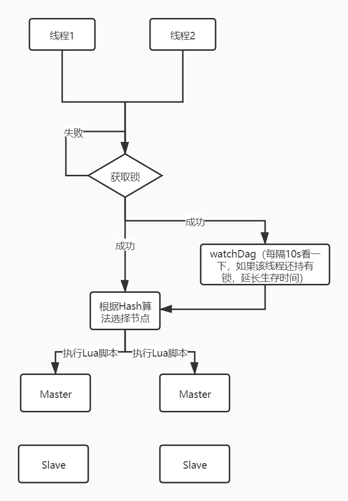
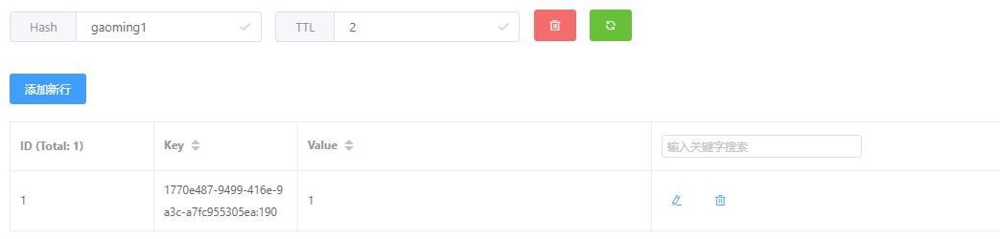
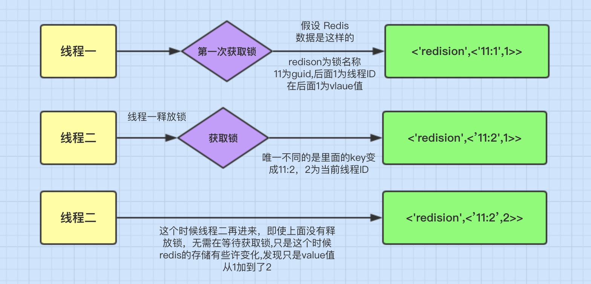

# Redisson

[redisson](https://github.com/redisson/redisson/)

## redisson原理

### 高效分布式锁

当我们在设计分布式锁的时候，应该考虑分布式锁至少满足一些条件，同时考虑如何高效的设计分布式锁

1. 互斥

   在分布式高并发的条件下，需要保证同一时刻只能有一个线程获得锁

2. 防止死锁

   在分布式高并发的条件下，比如有个线程获得锁的同时，还没有来得及去释放锁，就因为系统故障或者其他原因使得它无法执行释放锁的命令，导致其他线程都无法获得锁，造成死锁，所以分布式非常有必要设置锁的有效时间，确保系统出现故障后，在一定时间内能够主动去释放锁，避免造成死锁的情况

3. 性能

   对于访问量大的共享资源，需要考虑减少锁的等待时间，避免导致大量线程阻塞

   所以在锁的设计上，需要考虑

   1 **锁的颗粒度要尽量小**，比如你要通过锁来减库存，那这个锁的名称你可以设置成是商品的ID,而不是任取名称。这样这个锁只对当前商品有效,锁的颗粒度小

   2 **锁的范围尽量小**，比如只要锁2行代码就可以解决问题的，那就不要去锁10行代码了

4. 重入

   我们知道`ReentrantLock`是可重入锁，那它的特点就是：同一个线程可以重复拿到同一个资源的锁。重入锁非常有利于资源的高效利用

### Redisson原理分析



#### 加锁机制

线程去获取锁，获取成功：执行`Lua`脚本，保存数据到`redis`数据库

线程去获取锁，获取失败：一直通过`while`循环尝试获取锁，获取成功后，执行`Lua`脚本，保存数据到`redis`数据库

#### watch dog

`watch dog` 自动延期机制，在一个分布式环境下，加入一个线程获得锁后，突然服务器宕机了，那么这个时候在一定时间后这个锁会自动释放，可以设置锁的有效时间（不设置默认`30s`），这样的目的主要是防止死锁的发生

但是在实际的开发中存在下面一种情况：

```java
//设置锁1秒过去
redissonLock.lock("redisson", 1);
/**
 * 业务逻辑需要咨询2秒
*/
redissonLock.release("redisson");

/**
 * 线程1 进来获得锁后，线程一切正常并没有宕机，但它的业务逻辑需要执行2秒，这就会有个问题，在 线程1 执行1秒后，这个锁就自动过期了，
 * 那么这个时候 线程2 进来了。那么就存在 线程1和线程2 同时在这段业务逻辑里执行代码，这当然是不合理的。
 * 而且如果是这种情况，那么在解锁时系统会抛异常，因为解锁和加锁已经不是同一线程了，具体后面代码演示。
*/
```

所以这个时候，`watchdog`就出现了，它的作用就是线程1的业务还没有执行完，时间就过了，线程1还想持有锁的话，就会启动一个`watch dog`的后台线程，不断的延长锁key的生存时间

【`Note`】正常这个`watch dog`线程是不启动的，还有就是这个`watchdog`启动后对整体性能也会有一定的影响，所以不建议开启`watchdog`

#### Lua脚本

如果业务逻辑复杂的话，通过封装在`Lua`脚本中发送给`redis`，而且`redis`是单线程的，这样就保证这段复杂业务逻辑执行的原子性

#### 可重入加锁机制

redis存储锁的数据类型是Hash类型

Hash数据类型的key值包含了当前线程信息



这里表面数据类型是`Hash`类型，`Hash`类型相当于我们`java`的 `<key,<key1,value>>` 类型，这里`hash key`是为`getLock`的参数`name`

它的有效期还有`2`秒，我们再来看里们的`key`值为`18c9d8bf-c83d-4976-80c5-c6980acc3f15:165`它的组成是:

`UUid` + 当前线程的`ID`。后面的`value`是就和可重入加锁有关



`Redis`分布式锁会有个缺陷，就是在`Redis`哨兵模式下:

`客户端1` 对某个`master节点`写入了`redisson`锁，此时会异步复制给对应的 `slave`节点。但是这个过程中一旦发生 `master`节点宕机，主备切换，`slave`节点从变为了 `master`节点。

这时`客户端2` 来尝试加锁的时候，在新的`master`节点上也能加锁，此时就会导致多个客户端对同一个分布式锁完成了加锁。

这时系统在业务语义上一定会出现问题，**导致各种脏数据的产生**。

`缺陷`在哨兵模式或者主从模式下，如果 master实例宕机的时候，可能导致多个客户端同时完成加锁

### 源码解析

#### getLock

```java
@Autowired
private RedissonClient redissonClient;
RLock lock = redissonClient.getLock(objId + lockSuffix);
```

```java
public RLock getLock(String name) {
    return new RedissonLock(this.connectionManager.getCommandExecutor(), name);
}
```

```java
public RedissonLock(CommandAsyncExecutor commandExecutor, String name) {
    super(commandExecutor, name);
    this.commandExecutor = commandExecutor;
    this.id = commandExecutor.getConnectionManager().getId();
    this.internalLockLeaseTime = commandExecutor.getConnectionManager().getCfg().getLockWatchdogTimeout();
    this.entryName = this.id + ":" + name;
}
```

`getLock`方法接收`name`参数，返回一个`RedissonLock`对象，并对其进行初始化

#### tryLock

```java
isSuccess = lock.tryLock(5, 5, TimeUnit.SECONDS);
```

`tryLock`接收三个参数，分别是`waitTime`（等待时间），`leaseTime`（锁失效时间）和`TimeUnit`（时间单位）

```java
 public boolean tryLock(long waitTime, long leaseTime, TimeUnit unit) throws InterruptedException {
        long time = unit.toMillis(waitTime);
        long current = System.currentTimeMillis();
        final long threadId = Thread.currentThread().getId();
        Long ttl = this.tryAcquire(leaseTime, unit, threadId); // 加锁
        if (ttl == null) {
            return true;
        } else {
        }
 }
```

```java
private Long tryAcquire(long leaseTime, TimeUnit unit, long threadId) {
    return (Long)this.get(this.tryAcquireAsync(leaseTime, unit, threadId));
}
```

```java
private <T> RFuture<Long> tryAcquireAsync(long leaseTime, TimeUnit unit, final long threadId) {
    if (leaseTime != -1L) {
        return this.tryLockInnerAsync(leaseTime, unit, threadId, RedisCommands.EVAL_LONG); // 
    } else {
        RFuture<Long> ttlRemainingFuture = this.tryLockInnerAsync(this.commandExecutor.getConnectionManager().getCfg().getLockWatchdogTimeout(), TimeUnit.MILLISECONDS, threadId, RedisCommands.EVAL_LONG);
        ttlRemainingFuture.addListener(new FutureListener<Long>() {
            public void operationComplete(Future<Long> future) throws Exception {
                if (future.isSuccess()) {
                    Long ttlRemaining = (Long)future.getNow();
                    if (ttlRemaining == null) {
                        RedissonLock.this.scheduleExpirationRenewal(threadId);
                    }

                }
            }
        });
        return ttlRemainingFuture;
    }
}
```

```java
<T> RFuture<T> tryLockInnerAsync(long leaseTime, TimeUnit unit, long threadId, RedisStrictCommand<T> command) {
    this.internalLockLeaseTime = unit.toMillis(leaseTime);
    return this.commandExecutor.evalWriteAsync(this.getName(), LongCodec.INSTANCE, command, "if (redis.call('exists', KEYS[1]) == 0) then redis.call('hset', KEYS[1], ARGV[2], 1); redis.call('pexpire', KEYS[1], ARGV[1]); return nil; end; if (redis.call('hexists', KEYS[1], ARGV[2]) == 1) then redis.call('hincrby', KEYS[1], ARGV[2], 1); redis.call('pexpire', KEYS[1], ARGV[1]); return nil; end; return redis.call('pttl', KEYS[1]);", Collections.singletonList(this.getName()), new Object[]{this.internalLockLeaseTime, this.getLockName(threadId)});
}
```

```java
public <T, R> RFuture<R> evalWriteAsync(String key, Codec codec, RedisCommand<T> evalCommandType, String script, List<Object> keys, Object... params) {
    NodeSource source = this.getNodeSource(key);
    return this.evalAsync(source, false, codec, evalCommandType, script, keys, params);
}
```

```java
protected <V, R> void async(boolean readOnlyMode, final NodeSource source, Codec codec, final RedisCommand<V> command, final Object[] params, RPromise<R> mainPromise, int attempt, final boolean ignoreRedirect, final RFuture<RedisConnection> connFuture) {
    CommandAsyncService.this.sendCommand(details, connection);
}
```

### 常见问题

#### 锁未被释放

```java
try {
} catch (Exception e){
} finally {
   lock.unlock(); // 记得释放锁
}
```

#### B的锁被A给释放了

基于`Redis`会出现，记得带一个`value`，标识不同的线程

基于`Redisson`的不会，因为加锁的记录的`key`带有`threadId`

#### 数据库事务超时

#### 锁过期了，业务还没执行完

同样是`redis`分布式锁过期，而业务逻辑没执行完的场景，不过，这里换一种思路想问题，**把`redis`锁的过期时间再弄长点不就解决了吗？**

那还是有问题，我们可以在加锁的时候，手动调长`redis`锁的过期时间，可这个时间多长合适？业务逻辑的执行时间是不可控的，调的过长又会影响操作性能。

`redisson`会有一个`watch dog`，每个`10s`会查看一下

#### redis主从复制的坑

## 快速使用

```xml
<dependency>
    <groupId>org.redisson</groupId>
    <artifactId>redisson</artifactId>
    <version>3.4.3</version>
</dependency>
```

```
redis.default.nodes[0]=127.0.0.1:7080
redis.default.nodes[1]=127.0.0.1:7081
redis.default.connectionTimeout=100
redis.default.soTimeout=100
redis.default.maxAttempts=2
redis.default.pool.maxTotal=100
redis.default.pool.maxIdle=20
redis.default.pool.minIdle=1
```

```java
@Configuration
@ComponentScan
public class RedissonConfig {
    @Bean(name = "redissonRedisProperties")
    @ConfigurationProperties("redis.default")
    public RedisProperties defaultRedisProperties() {
        return new RedisProperties();
    }
    @Bean(value = "redissonClient", destroyMethod = "shutdown")
    RedissonClient redisson(@Qualifier("redissonRedisProperties") RedisProperties redisProperties) throws IOException {
        Config config = new Config();
        config.useClusterServers()
                .setMasterConnectionPoolSize(redisProperties.getMaxIdle())
                .setMasterConnectionMinimumIdleSize(redisProperties.getMinIdle())
                .setConnectTimeout(redisProperties.getConnectionTimeout())
                .addNodeAddress(redisProperties.getNodes().stream().map(n -> "redis://" + n).toArray(String[]::new));
        return Redisson.create(config);
    }
}
```

```java
@Service
@Slf4j
public class DpaBaseService {

    @Autowired
    private RedissonClient redissonClient;

    public RLock getLock(Object objId, String lockSuffix) {
        RLock lock = redissonClient.getLock(objId + lockSuffix);
        boolean isSuccess;
        try {
            isSuccess = lock.tryLock(5, 5, TimeUnit.SECONDS);
            log.info(System.currentTimeMillis() + "isSuccess: " + isSuccess + "---getLock----" + Thread.currentThread().getName());
        } catch (InterruptedException e) {
            log.error("rLock.tryLock.e", e);
            isSuccess = false;
            log.info(System.currentTimeMillis() + "---getLock false----" + Thread.currentThread().getName());
            Thread.currentThread().interrupt();
        }
        Assert.isTrue(isSuccess, "资源正在被其他人编辑，请稍后重试");
        return lock;
    }
}
```

```java
RLock lock = dpaBaseService.getLock(blackDpaDto.getId(), Constants.BLACK_DPA_LOCK_PREFIX);
try {
    return blackDpaServiceDelegate.updateBlackDpa(operator, blackDpaDto);
} finally {
    log.info(System.currentTimeMillis() + "---update black dpa unLock----");
    lock.unlock();
}
```

## 参考文档

[Redisson基本用法](https://www.cnblogs.com/cjsblog/p/11273205.html)

[Redisson实现分布式锁(1)---原理](https://www.cnblogs.com/qdhxhz/p/11046905.html)

[redis 分布式锁的 5个坑，真是又大又深](https://blog.csdn.net/xinzhifu1/article/details/105652903)