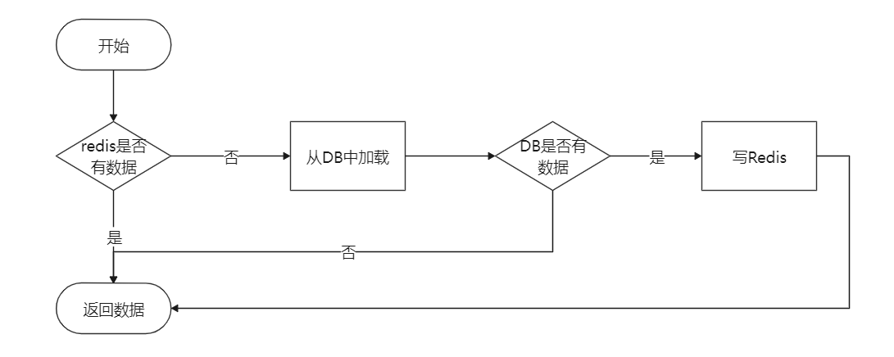

# Redis缓存一致性

在高并发的业务场景下，数据库大多数情况都是用户并发访问最薄弱的环节。所以，就需要使用`redis`做一个缓冲操作，让请求先访问到`redis`，而不是直接访问`Mysql`等数据库。这样可以大大缓解数据库的压力。具体业务流程如下

读取缓存步骤一般没有什么问题，但是一旦涉及到数据更新：数据库和缓存更新，就容易出现缓存和数据库间的数据一致性问题。不管是先写数据库，再删除缓存；还是先删除缓存，再写库，都有可能出现数据不一致的情况。举个例子：

1. 如果删除了缓存Redis，还没有来得及写库MySQL，另一个线程就来读取，发现缓存为空，则去数据库中读取数据写入缓存，此时缓存中为脏数据。
2. 如果先写了库，在删除缓存前，写库的线程宕机了，没有删除掉缓存，则也会出现数据不一致情况。

## 更新缓存还是让缓存失效

更新缓存表示数据不但会写入到数据库，还会同步更新缓存； 而让缓存失效是表示只更新数据库中的数据，然后删除缓存中对应的key。那么这两种方式怎么去选择？这块有一个衡量的指标。

1. 如果更新缓存的代价很小，那么可以先更新缓存，这个代价很小的意思是我不需要很复杂的计算去获得最新的余额数字。
2. 如果是更新缓存的代价很大，意味着需要通过多个接口调用和数据查询才能获得最新的结果，那么可以先淘汰缓存。淘汰缓存以后后续的请求如果在缓存中找不到，自然去数据库中检索

## 先操作数据库还是先操作缓存

当客户端发起事务类型请求时，假设我们以让缓存失效作为缓存的的处理方式，那么又会存在两个情况，

1. 先更新数据库再让缓存失效
2. 先让缓存失效，再更新数据库

前面我们讲过，更新数据库和更新缓存这两个操作，是无法保证原子性的，所以我们需要根据当前业务的场景的容忍性来选择。也就是如果出现不一致的情况下，哪一种更新方式对业务的影响最小，就先执行影响最小的方案

## 最终一致性的解决方案

## 参考文献

[如何保持mysql和redis中数据的一致性？ - 潇湘夜雨的回答 - 知乎](https://www.zhihu.com/question/319817091/answer/847067246)

