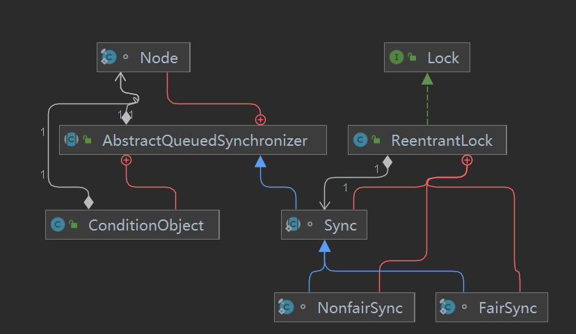
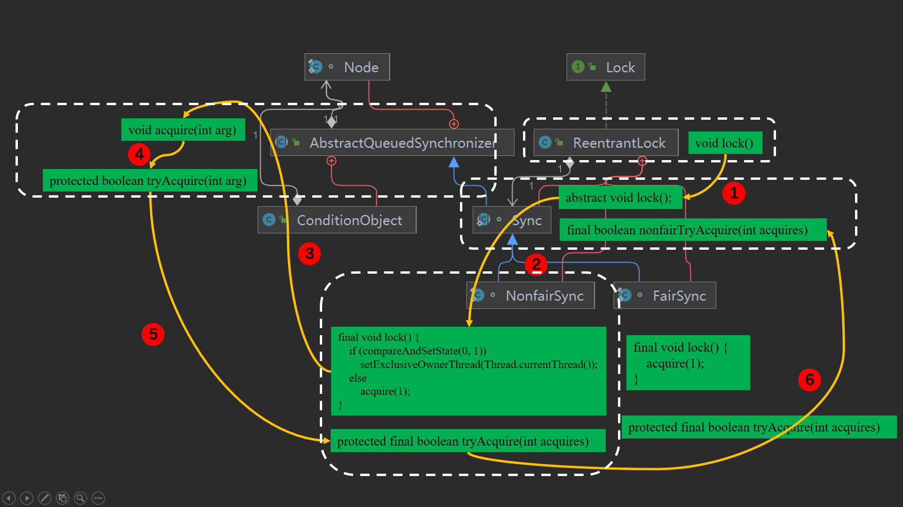
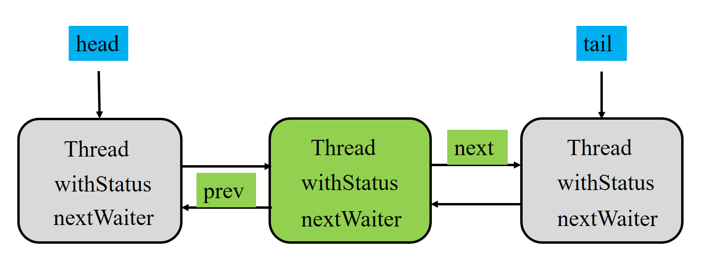
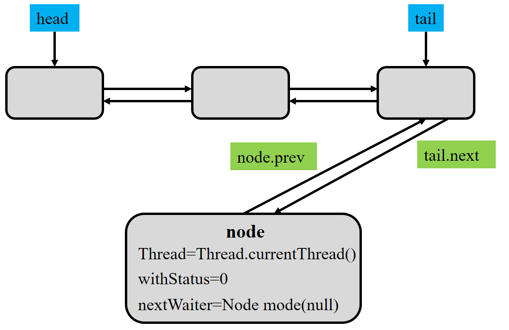

# ReentrantLock源码解析

`ReentrantLock`位于`java.util.concurrent.locks`包下面

`java`可重入锁



## demo

```java
import java.util.concurrent.locks.ReentrantLock;
public class Main {
    static class ThreadDemo extends Thread {
        ReentrantLock lock;
        public ThreadDemo(ReentrantLock lock) {
            this.lock = lock;
        }
        @Override
        public void run() {
            lock.lock();
            try {
                for (int i = 0; i < 3; i++) {
                    System.out.println(Thread.currentThread().getName() + "do something");
                    sleep(2000);
                }
            } catch (InterruptedException e) {
                e.printStackTrace();
            } finally {
                lock.unlock();
            }
        }
    }
    public static void main(String[] args) {
        ReentrantLock lock = new ReentrantLock();
        ThreadDemo thread1 = new ThreadDemo(lock);
        ThreadDemo thread2 = new ThreadDemo(lock);
        thread1.start();
        thread2.start();
    }
}
```

```
Thread-0do something
Thread-0do something
Thread-0do something
Thread-1do something
Thread-1do something
Thread-1do something
```

## method

### lock

#### 调用流程



1. `ReentrantLock`的`lock`方法调用其内部类`Sync`的抽象方法`lock`

2. `Sync`有两个子类，`NonfairSync`和`FairSync`（同时也是`ReentrantLock`的内部类），其分别代表公平同步和非公平同步，由`ReentrantLock`初始化时传参决定（`fair=false/true`），默认是非公平锁，由`NonfairSync`来实现`lock`方法。

   `NonfairSync`的`lock`方法进入一个逻辑判断`compareAndSetState`

3. 在不满足条件的情况下，会调用`AbstractQueuedSynchronizer`的`acquire`方法，（`NonfairSync`继承`Sync`，而`Sync`继承`AbstractQueuedSynchronizer`）

4. `AbstractQueuedSynchronizer`中的`acquire`方法调用`tryAcquire`方法

5. `tryAcquire`方法由子类重写，因而调用子类`NonfairSync`的具体实现

6. `NonfairSync`的`tryAcquire`调用`sync`的`nonfairTryAcquire`方法

#### Nonfair和Fair

```java
ReentrantLock lock = new ReentrantLock(true); // 公平锁
ReentrantLock lock = new ReentrantLock(false); // 非公平锁
ReentrantLock lock = new ReentrantLock(); // 非公平锁
```

```java
public ReentrantLock(boolean fair) {
    sync = fair ? new FairSync() : new NonfairSync();
}
```

根据初始化的参数`fair`，就决定了内部类`Sync`的实例

#### compareAndSetState

`NonfairSync`的`lock`方法进入一个逻辑判断`compareAndSetState`

```java
// Performs lock. Try immediate barge, backing up to normal acquire on failure.
final void lock() {
    if (compareAndSetState(0, 1))
        setExclusiveOwnerThread(Thread.currentThread());
    else
        acquire(1);
}
```

****

`compareAndSetState`是`AbstractQueuedSynchronizer`里面的方法，（`NonfairSync`是`Sync`的子类，`Sync`是`AbstractQueuedSynchronizer`的子类）

```java
protected final boolean compareAndSetState(int expect, int update) {
    // See below for intrinsics setup to support this
    return unsafe.compareAndSwapInt(this, stateOffset, expect, update);
}
```

`AbstractQueuedSynchronizer`里面执行了`unsafe`的`compareAndSwapInt`，这实际上是`CAS`操作

```java
public final native boolean compareAndSwapInt(Object var1, long var2, int var4, int var5);
```

这里共有4个参数

1. object：就是将要修改的值的对象
2. offect：对象在内存中偏移量为`offset`处的值,就是要修改的数据的值在内存中的偏移量，结合`object + offect`找到要修改的值.
3. expect：期望内存中的值，就是拿这个值和 `object + offect`值进行比较；如果相同则修改，返回`true`，否则返回`false`，等下次修改
4. update：如果上一步对比相等，则将这个值赋值给`object + offect`值，然后返回`true`

因而实际上，`AbstractQueuedSynchronizer`的`compareAndSetState`方法，尝试对当前对象`AbstractQueuedSynchronizer`，里面内存偏移量为`stateOffset`的执行`CAS`操作，而`stateOffset`偏移量代表什么值？

****

```java
private static final Unsafe unsafe = Unsafe.getUnsafe();
private static final long stateOffset;
private static final long headOffset;
private static final long tailOffset;
private static final long waitStatusOffset;
private static final long nextOffset;
static {
    try {
        stateOffset = unsafe.objectFieldOffset
            (AbstractQueuedSynchronizer.class.getDeclaredField("state"));
        headOffset = unsafe.objectFieldOffset
            (AbstractQueuedSynchronizer.class.getDeclaredField("head"));
        tailOffset = unsafe.objectFieldOffset
            (AbstractQueuedSynchronizer.class.getDeclaredField("tail"));
        waitStatusOffset = unsafe.objectFieldOffset
            (Node.class.getDeclaredField("waitStatus"));
        nextOffset = unsafe.objectFieldOffset
            (Node.class.getDeclaredField("next"));

    } catch (Exception ex) { throw new Error(ex); }
}
```

在`AbstractQueuedSynchronizer`中，`stateOffset`实际上代表了`state`的内存偏移地址

```java
// The synchronization state.
private volatile int state;
```

****

```java
// Performs lock. Try immediate barge, backing up to normal acquire on failure.
final void lock() {
    if (compareAndSetState(0, 1))
        setExclusiveOwnerThread(Thread.currentThread());
    else
        acquire(1);
}
```

因而在上面代码中，加锁过程实际上是先对`AbstractQueuedSynchronizer`中的`State`先进行`CAS`操作，从`0`变成`1`，如果成功，则执行`setExclusiveOwnerThread(Thread.currentThread());`操作，否则进行`acquire(1);`操作

****

```java
private transient Thread exclusiveOwnerThread;

/**
 * Sets the thread that currently owns exclusive access.
 * A {@code null} argument indicates that no thread owns access.
 * This method does not otherwise impose any synchronization or
 * {@code volatile} field accesses.
 * @param thread the owner thread
 */
protected final void setExclusiveOwnerThread(Thread thread) {
    exclusiveOwnerThread = thread;
}
```

设置**互斥锁的拥有线程**(**ExclusiveOwnerThread**)为当前线程

#### acquire(arg)

```java
public final void acquire(int arg) {
    if (!tryAcquire(arg) &&
        acquireQueued(addWaiter(Node.EXCLUSIVE), arg))
        selfInterrupt();
}
```

#### tryAcquire(arg)

```java
protected boolean tryAcquire(int arg) {
    throw new UnsupportedOperationException();
}
```

`AbstractQueuedSynchronizer`中没有实现`tryAcquire`，或者说直接抛出异常，由子类实现

```java
protected final boolean tryAcquire(int acquires) {
    return nonfairTryAcquire(acquires);
}
```

子类`NonfairSync`重写了父类`AbstractQueuedSynchronizer`的`tryAcquire`方法

```java
protected final boolean tryAcquire(int acquires) {
    return nonfairTryAcquire(acquires);
}
```

****

```java
final boolean nonfairTryAcquire(int acquires) {
    final Thread current = Thread.currentThread();
    int c = getState();
    if (c == 0) {
        if (compareAndSetState(0, acquires)) {
            setExclusiveOwnerThread(current);
            return true;
        }
    }
    else if (current == getExclusiveOwnerThread()) {
        int nextc = c + acquires;
        if (nextc < 0) // overflow
            throw new Error("Maximum lock count exceeded");
        setState(nextc);
        return true;
    }
    return false;
}
```

非公平锁的获取过程

1. 先获取当前线程
2. 获取`AbstractQueuedSynchronizer`的`State`，`State`为0表示该锁未被占用，`State`为1表示锁被占用
3. 如果`State=0`，还是执行`CAS`操作，尝试将`State`从`0`改成`1`，如果成功则将当前线程设置为互斥锁的拥有线程
4. 如果`State!=0`，但是当前线程等于互斥锁的拥有线程，将State设置为` c + acquires`，即`State+1`(`acquires = 1`)
5. 否则加锁失败

#### acquireQueued

```java
public final void acquire(int arg) {
    if (!tryAcquire(arg) &&
        acquireQueued(addWaiter(Node.EXCLUSIVE), arg))
        selfInterrupt();
}
```

```java
acquireQueued(addWaiter(Node.EXCLUSIVE), arg)
```

`static final Node EXCLUSIVE = null;`查看`addWaiter`方法

```java
/* Creates and enqueues node for current thread and given mode.
 * Params:
 * mode – Node.EXCLUSIVE for exclusive, Node.SHARED for shared
 * Returns:
 * the new node
 */
private Node addWaiter(Node mode) {
    Node node = new Node(Thread.currentThread(), mode);
    // Try the fast path of enq; backup to full enq on failure
    Node pred = tail;
    if (pred != null) {
        node.prev = pred;
        if (compareAndSetTail(pred, node)) {
            pred.next = node;
            return node;
        }
    }
    enq(node);
    return node;
}
```

1. 为当前线程和给定模式创建并排队节点
2. `mode`：`Node.EXCLUSIVE`是排他的， `Node.SHARED`是共享的
3. 返回新的节点

****

##### Node

```java
static final class Node {
    /** Marker to indicate a node is waiting in shared mode */
    static final Node SHARED = new Node();
    /** Marker to indicate a node is waiting in exclusive mode */
    static final Node EXCLUSIVE = null;

    /** waitStatus value to indicate thread has cancelled */
    static final int CANCELLED =  1;
    /** waitStatus value to indicate successor's thread needs unparking */
    static final int SIGNAL    = -1;
    /** waitStatus value to indicate thread is waiting on condition */
    static final int CONDITION = -2;
    /**
         * waitStatus value to indicate the next acquireShared should
         * unconditionally propagate
         */
    static final int PROPAGATE = -3;

    /**
         * Status field, taking on only the values:
         *   SIGNAL:     The successor of this node is (or will soon be)
         *               blocked (via park), so the current node must
         *               unpark its successor when it releases or
         *               cancels. To avoid races, acquire methods must
         *               first indicate they need a signal,
         *               then retry the atomic acquire, and then,
         *               on failure, block.
         *   CANCELLED:  This node is cancelled due to timeout or interrupt.
         *               Nodes never leave this state. In particular,
         *               a thread with cancelled node never again blocks.
         *   CONDITION:  This node is currently on a condition queue.
         *               It will not be used as a sync queue node
         *               until transferred, at which time the status
         *               will be set to 0. (Use of this value here has
         *               nothing to do with the other uses of the
         *               field, but simplifies mechanics.)
         *   PROPAGATE:  A releaseShared should be propagated to other
         *               nodes. This is set (for head node only) in
         *               doReleaseShared to ensure propagation
         *               continues, even if other operations have
         *               since intervened.
         *   0:          None of the above
         *
         * The values are arranged numerically to simplify use.
         * Non-negative values mean that a node doesn't need to
         * signal. So, most code doesn't need to check for particular
         * values, just for sign.
         *
         * The field is initialized to 0 for normal sync nodes, and
         * CONDITION for condition nodes.  It is modified using CAS
         * (or when possible, unconditional volatile writes).
         */
    volatile int waitStatus;

    /**
         * Link to predecessor node that current node/thread relies on
         * for checking waitStatus. Assigned during enqueuing, and nulled
         * out (for sake of GC) only upon dequeuing.  Also, upon
         * cancellation of a predecessor, we short-circuit while
         * finding a non-cancelled one, which will always exist
         * because the head node is never cancelled: A node becomes
         * head only as a result of successful acquire. A
         * cancelled thread never succeeds in acquiring, and a thread only
         * cancels itself, not any other node.
         */
    volatile Node prev;

    /**
         * Link to the successor node that the current node/thread
         * unparks upon release. Assigned during enqueuing, adjusted
         * when bypassing cancelled predecessors, and nulled out (for
         * sake of GC) when dequeued.  The enq operation does not
         * assign next field of a predecessor until after attachment,
         * so seeing a null next field does not necessarily mean that
         * node is at end of queue. However, if a next field appears
         * to be null, we can scan prev's from the tail to
         * double-check.  The next field of cancelled nodes is set to
         * point to the node itself instead of null, to make life
         * easier for isOnSyncQueue.
         */
    volatile Node next;

    /**
         * The thread that enqueued this node.  Initialized on
         * construction and nulled out after use.
         */
    volatile Thread thread;

    /**
         * Link to next node waiting on condition, or the special
         * value SHARED.  Because condition queues are accessed only
         * when holding in exclusive mode, we just need a simple
         * linked queue to hold nodes while they are waiting on
         * conditions. They are then transferred to the queue to
         * re-acquire. And because conditions can only be exclusive,
         * we save a field by using special value to indicate shared
         * mode.
         */
    Node nextWaiter;

    /**
         * Returns true if node is waiting in shared mode.
         */
    final boolean isShared() {
        return nextWaiter == SHARED;
    }

    /**
         * Returns previous node, or throws NullPointerException if null.
         * Use when predecessor cannot be null.  The null check could
         * be elided, but is present to help the VM.
         *
         * @return the predecessor of this node
         */
    final Node predecessor() throws NullPointerException {
        Node p = prev;
        if (p == null)
            throw new NullPointerException();
        else
            return p;
    }

    Node() {    // Used to establish initial head or SHARED marker
    }

    Node(Thread thread, Node mode) {     // Used by addWaiter
        this.nextWaiter = mode;
        this.thread = thread;
    }

    Node(Thread thread, int waitStatus) { // Used by Condition
        this.waitStatus = waitStatus;
        this.thread = thread;
    }
}
```

排除一些常数的定义

```java
static final class Node {
    volatile int waitStatus;
    volatile Node prev;
    volatile Node next;
    volatile Thread thread;
    Node nextWaiter;
    Node() {    // Used to establish initial head or SHARED marker
    }
    Node(Thread thread, Node mode) {     // Used by addWaiter
        this.nextWaiter = mode;
        this.thread = thread;
    }
    Node(Thread thread, int waitStatus) { // Used by Condition
        this.waitStatus = waitStatus;
        this.thread = thread;
    }
}
```

`Node`本质上是双向链表的`Node`定义，其前指针`prev`，后指针`next`，里面维护了两个`value`，分别是`waitStatus`和`thread`，在构造函数中用到



****

##### addWaiter

因而在`addWaiter`方法中

```java
private Node addWaiter(Node mode) {
    //初始化节点,设置关联线程和模式(独占 or 共享)
    Node node = new Node(Thread.currentThread(), mode);
    // Try the fast path of enq; backup to full enq on failure
    // // 获取尾节点引用
    Node pred = tail;
    // 尾节点不为空,说明队列已经初始化过
    if (pred != null) {
        node.prev = pred;
        // 设置新节点为尾节点
        if (compareAndSetTail(pred, node)) {
            pred.next = node;
            return node;
        }
    }
    // 尾节点为空,说明队列还未初始化,需要初始化head节点并入队新节点
    enq(node);
    return node;
}
```

1. 先构造了一个`Node`，并将当前线程进行初始化，并指定`Node.EXCLUSIVE`，设置关联线程和模式(独占 or 共享)
2. 获取尾节点引用
3. 尾节点不为空，说明队列已经初始化过，因而将`node`节点的前指针指向`tail`，并用`CAS`的方式，将`tail`的后指针指向`Node`
4. 尾节点为空，说明队列还未初始化，需要初始化head节点并入队新节点

**【链表已经初始化】**



**【链表未初始化】**

1. 如果队尾节点仍为空
   1. `CAS`将当前的`Node`节点作为头节点，初始化链表
2. 如果队尾节点不为空
   1. 将`node`节点的前指针指向链表的队尾tail节点
   2. 用`CAS`的方式将`node`挂在链表的尾节点上

```java
private Node enq(final Node node) {
    for (;;) {
        Node t = tail;
        // 如果队尾节点仍为空，说明还未初始化
        if (t == null) { // Must initialize
            // CAS将当前的Node节点作为头节点，初始化链表
            if (compareAndSetHead(new Node()))
                tail = head;
        } else {
            // 如果队尾节点不为空，说明已经初始化结束
            // 将node节点的前指针指向链表的队尾tail节点
            node.prev = t;
            // 用CAS的方式将node挂在链表的尾节点上
            if (compareAndSetTail(t, node)) {
                t.next = node;
                return t;
            }
        }
    }
}
```

##### acquireQueued

**不断自旋尝试获取同步状态(锁)，获取不成功，则找安全点休息**

通过`tryAcquire()`和`addWaiter()`，该线程获取资源失败，已经被放入等待队列尾部了。线程一步：**进入等待状态休息，直到其他线程彻底释放资源后唤醒自己，拿到资源再执行**

在`acquire`方法中，调用`acquireQueued`方法，`acquireQueued`方法的参数是`addWaiter(Node.EXCLUSIVE), arg)`

`addWaiter(Node.EXCLUSIVE), arg)`方法是将当前线程封装在`Node`节点中，如果`AQS`维护的线程链表为空，就将该`Node`节点作为头节点，如果线程链表不为空，就将该节点放在链表的尾节点``tail`中

`addWaiter(Node.EXCLUSIVE), arg)`返回的就是`Node`节点

```java
public final void acquire(int arg) {
    if (!tryAcquire(arg) &&
        acquireQueued(addWaiter(Node.EXCLUSIVE), arg))
        selfInterrupt();
}
```

`acquireQueued`方法接收当前线程的`Node`节点

```java
/**
 * Acquires in exclusive uninterruptible mode for thread already in
 * queue. Used by condition wait methods as well as acquire.
 * @param node the node
 * @param arg the acquire argument
 * @return {@code true} if interrupted while waiting
 */
// 已在队列中的线程以独占不间断模式获取。用于条件等待方法和获取
final boolean acquireQueued(final Node node, int arg) {
    boolean failed = true; // //标记是否成功拿到资源
    try {
        boolean interrupted = false; // 标记等待过程中是否被中断过
        // 死循环 又是一个“自旋”！
        for (;;) {
            // 获得该node的前置节点
            final Node p = node.predecessor();
            // 如果前置节点已经是头节点了，并且尝试获取锁成功
            // 帮助理解：如果前置节点是head，表示之前的节点就是正在运行的线程，表示是第一个排队的（一般讲队列中第一个是正在处理的，可以想象买票的过程，第一个人是正在买票(处理中)，第二个才是真正排队的人）；那么再去tryAcquire尝试获取锁，如果获取成功，说明此时前置线程已经运行结束，则将head设置为当前节点返回
            // 如果前驱是head，即该结点已成老二，那么便有资格去尝试获取资源
            if (p == head && tryAcquire(arg)) {
                // 设置头节点为自己 拿到资源后，将head指向该结点。所以head所指的标杆结点，就是当前获取到资源的那个结点或null
                setHead(node);
                // 之前的前置节点的next为空，帮助GC setHead中node.prev已置为null，此处再将head.next置为null，就是为了方便GC回收以前的head结点。也就意味着之前拿完资源的结点出队了
                p.next = null; // help GC
                failed = false; // 成功获取资源
                return interrupted; // //返回等待过程中是否被中断过
            }
            // 前置节点非头节点或者加锁失败
            // shouldParkAfterFailedAcquire将前置node设置为需要被挂起，注意这里的waitStatus是针对当前节点来说的，即是前置node的ws指的是下一个节点的状态
            // parkAndCheckInterrupt /挂起线程 park()
            if (shouldParkAfterFailedAcquire(p, node) &&
                parkAndCheckInterrupt())
                interrupted = true; // 如果等待过程中被中断过，哪怕只有那么一次，就将interrupted标记为true
        }
    } finally {
        if (failed)
            // 如果等待过程中没有成功获取资源（如timeout，或者可中断的情况下被中断了），那么取消结点在队列中的等待
            cancelAcquire(node);
    }
}
// 看到因为是死循环，所以当执行到parkAndCheckInterrupt()时，当前线程被挂起，等到某一天被unpark继续执行，这个时候已经是对头的第二个节点了，那么就会进入if (p == head && tryAcquire(arg))逻辑获取到锁并结束循环
```

##### predecessor

获取`node`的前置节点

```java
final Node predecessor() throws NullPointerException {
    Node p = prev;
    if (p == null)
        throw new NullPointerException();
    else
        return p;
}
```

##### shouldParkAfterFailedAcquire

如果前驱结点的状态不是`SIGNAL`，那么自己就不能安心去休息，需要去找个安心的休息点，同时可以再尝试下看有没有机会轮到自己拿号

```java
// pred 是 node 的前置节点
private static boolean shouldParkAfterFailedAcquire(Node pred, Node node) {
    // 获取前置节点pred的waitStatus
    int ws = pred.waitStatus;
    // waitStatus值，指示后续线程需要uppark的话，返回true
    if (ws == Node.SIGNAL)
        // ws = -1
        // 前驱节点已经设置了SIGNAL，闹钟已经设好，现在我可以安心睡觉（阻塞）了。
        // 如果前驱变成了head，并且head的代表线程exclusiveOwnerThread释放了锁，
        // 就会来根据这个SIGNAL来唤醒自己
        // 如果已经告诉前驱拿完号后通知自己一下，那就可以安心休息了
        /*
         * This node has already set status asking a release
         * to signal it, so it can safely park.
         */
        return true;
    // waitStatus值 > 0 实际上ws = 1 表示线程将被取消
    if (ws > 0) {
        /*
         * Predecessor was cancelled. Skip over predecessors and
         * indicate retry.
        */
        // 发现传入的前驱的状态大于0，即CANCELLED。说明前驱节点已经因为超时或响应了中断，而取消了自己。所以需要跨越掉这些CANCELLED节点，直到找到一个<=0的节点
        // 如果前驱放弃了，那就一直往前找，直到找到最近一个正常等待的状态，并排在它的后边
        // 注意：那些放弃的结点，由于被自己“加塞”到它们前边，它们相当于形成一个无引用链，稍后就会被GC回收
        do {
            // pred的前置指针设置为node的前置指针，也就是prev线程被取消了
            // 并且将pred设置为pred的prev
            // 总的来说，就是想删除pred节点 head<=>pred<=>node
            // 因此将head设置为node的前置节点
            // 再将pred指针指向head
            node.prev = pred = pred.prev;
        } while (pred.waitStatus > 0);
        // pred再指向node
        pred.next = node;
    } else {
        // ws = 0 or -3 or -2
        /*
         * waitStatus must be 0 or PROPAGATE.  Indicate that we
         * need a signal, but don't park yet.  Caller will need to
         * retry to make sure it cannot acquire before parking.
        */
        // 进入这个分支，ws只能是0或PROPAGATE。CAS设置ws为SIGNAL
        // 如果前驱正常，那就把前驱的状态设置成SIGNAL，告诉它拿完号后通知自己一下。有可能失败，人家说不定刚刚释放完呢
        compareAndSetWaitStatus(pred, ws, Node.SIGNAL);
    }
    return false;
}
```

```java
/** waitStatus value to indicate thread has cancelled */
static final int CANCELLED =  1;
/** waitStatus value to indicate successor's thread needs unparking */
// // waitStatus值，指示后续线程需要uppark
static final int SIGNAL    = -1;
/** waitStatus value to indicate thread is waiting on condition */
static final int CONDITION = -2;
/**
 * waitStatus value to indicate the next acquireShared should
 * unconditionally propagate
*/
static final int PROPAGATE = -3;
```

`Node`结点是对每一个等待获取资源的线程的封装，其包含了需要同步的线程本身及其等待状态，如是否被阻塞、是否等待唤醒、是否已经被取消等。变量`waitStatus`则表示当前`Node`结点的等待状态，共有`5`种取值`CANCELLED`、`SIGNAL`、`CONDITION`、`PROPAGATE`、`0`

1. **`CANCELLED`**(1)：表示当前结点已取消调度。当`timeout`或被中断（响应中断的情况下），会触发变更为此状态，进入该状态后的结点将不会再变化。
2. **`SIGNAL`**(-1)：表示后继结点在等待当前结点唤醒。后继结点入队时，会将前继结点的状态更新为`SIGNAL`。
3. **`CONDITION`**(-2)：表示结点等待在`Condition`上，当其他线程调用了`Condition`的`signal()`方法后，`CONDITION`状态的结点将**从等待队列转移到同步队列中**，等待获取同步锁。
4. **`PROPAGATE`**(-3)：共享模式下，前继结点不仅会唤醒其后继结点，同时也可能会唤醒后继的后继结点。
5. **`0`**：新结点入队时的默认状态。

##### parkAndCheckInterrupt

如果线程找好安全休息点后，那就可以安心去休息了。此方法就是让线程去休息，真正进入等待状态

```java
/**
 * Convenience method to park and then check if interrupted
 *
 * @return {@code true} if interrupted
 */
private final boolean parkAndCheckInterrupt() {
    LockSupport.park(this); // 调用park()使线程进入waiting状态
    return Thread.interrupted(); // 如果被唤醒，查看自己是不是被中断的
}
```

##### cancelAcquire

```java
private void cancelAcquire(Node node) {
    // Ignore if node doesn't exist
    if (node == null)
        return;

    node.thread = null;

    // Skip cancelled predecessors
    Node pred = node.prev;
    while (pred.waitStatus > 0)
        node.prev = pred = pred.prev;

    // predNext is the apparent node to unsplice. CASes below will
    // fail if not, in which case, we lost race vs another cancel
    // or signal, so no further action is necessary.
    Node predNext = pred.next;

    // Can use unconditional write instead of CAS here.
    // After this atomic step, other Nodes can skip past us.
    // Before, we are free of interference from other threads.
    node.waitStatus = Node.CANCELLED;

    // If we are the tail, remove ourselves.
    if (node == tail && compareAndSetTail(node, pred)) {
        compareAndSetNext(pred, predNext, null);
    } else {
        // If successor needs signal, try to set pred's next-link
        // so it will get one. Otherwise wake it up to propagate.
        int ws;
        if (pred != head &&
            ((ws = pred.waitStatus) == Node.SIGNAL ||
             (ws <= 0 && compareAndSetWaitStatus(pred, ws, Node.SIGNAL))) &&
            pred.thread != null) {
            Node next = node.next;
            if (next != null && next.waitStatus <= 0)
                compareAndSetNext(pred, predNext, next);
        } else {
            unparkSuccessor(node);
        }

        node.next = node; // help GC
    }
}
```

##### selfInterrupt

```java
static void selfInterrupt() {
    Thread.currentThread().interrupt();
}
```

##### 小结

1. 结点进入队尾后，检查状态，找到安全休息点；
2. 调用`park()`进入`waiting`状态，等待`unpark()`或`interrupt()`唤醒自己；
3. 被唤醒后，看自己是不是有资格能拿到号。如果拿到，`head`指向当前结点，并返回从入队到拿到号的整个过程中是否被中断过；如果没拿到，继续流程1

#### 小结

```java
public final void acquire(int arg) {
    if (!tryAcquire(arg) &&
        acquireQueued(addWaiter(Node.EXCLUSIVE), arg))
        selfInterrupt();
}
```

1. 调用`tryAcquire()`尝试直接去获取资源，如果成功则直接返回
2. 没成功，则`addWaiter()`将该线程加入等待队列的尾部，并标记为独占模式
3. `acquireQueued()`使线程在等待队列中休息，有机会时（轮到自己，会被`unpark()`）会去尝试获取资源。获取到资源后才返回。如果在整个等待过程中被中断过，则返回`true`，否则返回`false`
4. 如果线程在等待过程中被中断过，它是不响应的。只是获取资源后才再进行自我中断`selfInterrupt()`，将中断补上


## 参考文档

[AQS源码解析（1）acquireQueued](https://www.jianshu.com/p/dcbcea767d69)

[Java并发之AQS详解](https://www.cnblogs.com/waterystone/p/4920797.html)

