# Restricted Boltzmann Machines

## Structure

每个 x 乘以一个独立的权重，然后相加后再加一个偏置项，最后将结果传递到激活函数来产生输出

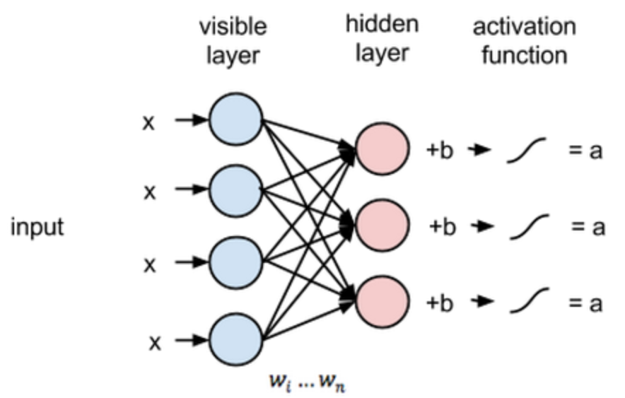

## Reconstructions

在重建阶段，第一个隐藏层的激活状态变成了反向传递过程中的输入。它们与每个连接边相同的权重相乘，就像 x 在前向传递的过程中随着权重调节一样。这些乘积的和在每个可见节点处又与可见层的偏置项相加，这些运算的输出就是一次重建，也就是对原始输入的一个逼近。这可以通过下图表达:

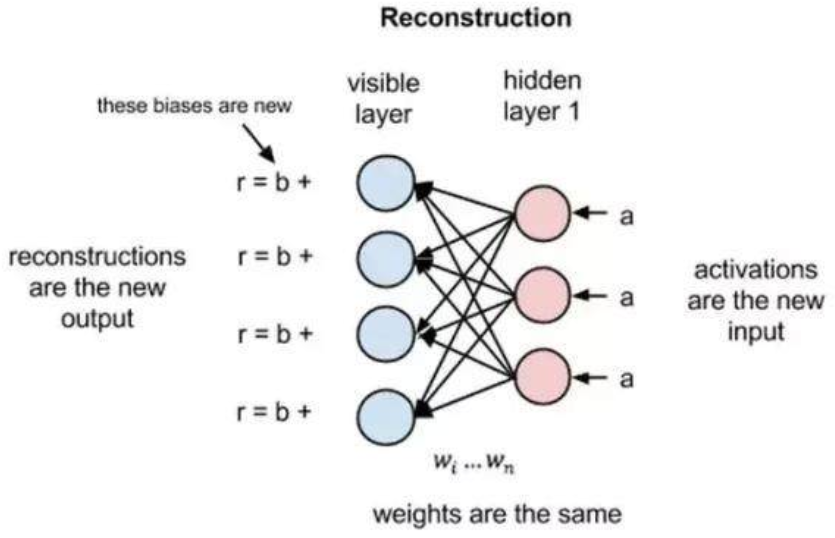

在前向传递过程中，给定权重的情况下 RBM 会使用输入来预测节点的激活值，或者输出的概率 x:p(a|x; w)。但是在反向传播的过程中，当激活值作为输入并输出原始数据的重建或者预测时，RBM 尝试在给定激活值 a 的情况下估计输入 x 的概率，它具有与前向传递过程中相同的权重参数。这第二个阶段可以被表达为 p(x|a; w)。

​    这两个概率估计将共同得到关于输入 x 和激活值 a 的联合概率分布，或者 p(x, a)。重建与回归有所不同，也不同于分类。回归基于很多输入来估计一个连续值，分类预测出离散的标签以应用在给定的输入样本上，而重建是在预测原始输入的概率分布。

​    这种重建被称之为生成学习，它必须跟由分类器执行的判别学习区分开来。判别学习将输入映射到标签上，有效地在数据点与样本之间绘制条件概率。若假设 RBM 的输入数据和重建结果是不同形状的正态曲线，它们只有部分重叠。

​    为了衡量输入数据的预测概率分布和真实分布之间的距离，RBM 使用 KL 散度来度量两个分布的相似性。KL 散度测量的是两条曲线的非重叠区域或者说发散区域，RBM 的优化算法尝试最小化这些区域，所以当共享权重与第一个隐藏层的激活值相乘时就可以得出原始输入的近似。图的左边是一组输入的概率分布 p 及其重构分布 q，图的右侧是它们的差的积分。

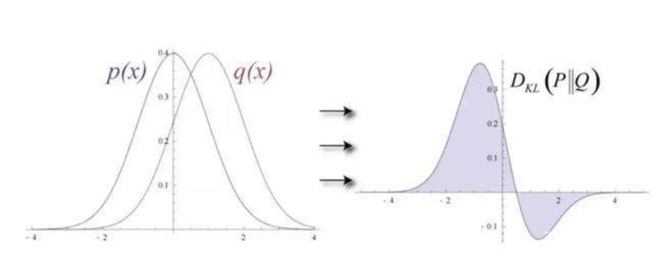

 迭代地根据它们产生的误差来调节权重，RBM 学会了逼近原始数据。你可以说权重在慢慢地反映输入数据的结构，并通过隐藏层的激活值进行编码，学习过程就像两个概率分布在逐步重合。

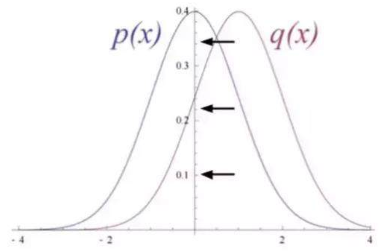

## Skip-gram

在许多自然语言处理任务中，许多单词表达是由他们的tf-idf分数决定的。即使这些分数告诉我们一个单词在一个文本中的相对重要性，但是他们并没有告诉我们单词的语义。Word2vec是一类神经网络模型——在给定无标签的语料库的情况下，为语料库中的单词产生一个能表达语义的向量。这些向量通常是有用的：

- 通过词向量来计算两个单词的语义相似性
- 对某些监督型NLP任务如文本分类，语义分析构造特征

### skip-gram模型

在详细介绍skip-gram模型前，我们先来了解下训练数据的格式。skip-gram模型的输入是一个单词wI，它的输出是wI的上下文wO,1,...,wO,C，上下文的窗口大小为C。举个例子，这里有个句子“I drive my car to the store”。我们如果把”car”作为训练输入数据，单词组{“I”, “drive”, “my”, “to”, “the”, “store”}就是输出。所有这些单词，我们会进行one-hot编码。skip-gram模型图如下所示： 

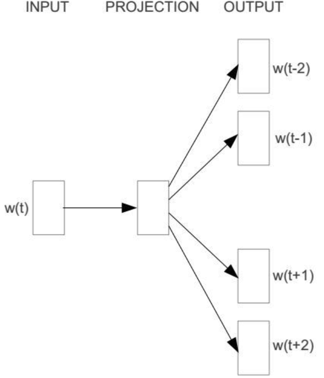

### 前向传播

接下来我们来看下skip-gram神经网络模型，skip-gram的神经网络模型是从前馈神经网络模型改进而来，说白了就是在前馈神经网络模型的基础上，通过一些技巧使得模型更有效。我们先上图，看一波skip-gram的神经网络模型

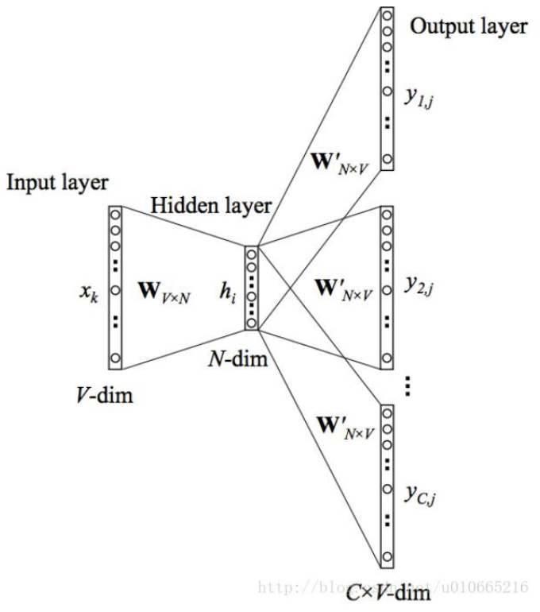

在上图中，输入向量x代表某个单词的one-hot编码，对应的输出向量{y1,…,yC}。输入层与隐藏层之间的权重矩阵W的第i行代表词汇表中第i个单词的权重。**接下来重点来了**：这个权重矩阵W就是我们需要学习的目标（同W′），因为这个权重矩阵包含了词汇表中所有单词的权重信息。上述模型中，每个输出单词向量也有个N×V维的输出向量W′。最后模型还有N个结点的隐藏层，我们可以发现隐藏层节点hi的输入就是输入层输入的加权求和。因此由于输入向量x是one-hot编码，那么只有向量中的非零元素才能对隐藏层产生输入。因此对于输入向量x其中xk=1并且xk′=0,k≠k′′。所以隐藏层的输出只与权重矩阵第k行相关，从数学上证明如下： 

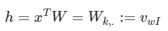

注意因为输入是one-hot编码，所以这里是不需要使用激活函数的。同理，模型输出结点C×V的输入也是由对应输入结点的加权求和计算得到： 

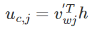

 

其实从上图我们也看到了输出层中的每个单词都是共享权重的，因此我们有uc,j=uj。最终我们通过softmax函数产生第C个单词的多项式分布。 

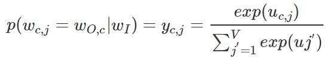

说白了，这个值就是第C个输出单词的第j个结点的概率大小。

### 通过BP（反向传播）算法及随机梯度下降来学习权重

前面我讲解了skip-gram模型的输入向量及输出的概率表达，以及我们学习的目标。接下来我们详细讲解下学习权重的过程。第一步就是定义损失函数，这个损失函数就是输出单词组的条件概率，一般都是取对数，如下所示： 

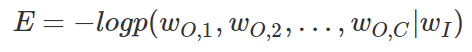

 

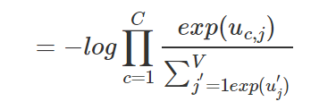

接下来就是对上面的概率求导，具体推导过程可以去看BP算法，我们得到输出权重矩阵W′W′的更新规则： 

 

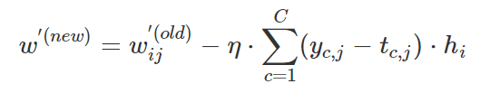

同理权重WW的更新规则如下： 

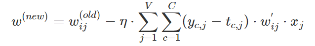

从上面的更新规则，我们可以发现，每次更新都需要对整个词汇表求和，因此对于很大的语料库来说，这个计算复杂度是很高的。于是在实际应用中，[Google的Mikolov](http://arxiv.org/pdf/1310.4546.pdf)等人提出了分层softmax及负采样可以使得计算复杂度降低很多。

[Word2Vec教程 - Skip-Gram模型](https://blog.csdn.net/layumi1993/article/details/72866235)

### Skip-thought vectors

本文旨在提出一个通用的无监督句子表示模型，借鉴了word2vec中skip-gram模型，通过一句话来预测这句话的上一句和下一句。本文的模型被称为skip-thoughts，生成的向量称为skip-thought vector。模型采用了当下流行的端到端框架，通过搜集了大量的小说作为训练数据集，将得到的模型中encoder部分作为feature extractor，可以给任意句子生成vector。

当然，这里存在一个很大的问题是，如果测试数据中有未登录词，如何表示这个未登录词？针对这个问题，本文提出了一种词汇表扩展的方法来解决这个问题。首先，介绍本文的模型，参考下图来理解：

![e-e0S>  home  could  see  the  cat  the  This  steps  got  was  This  back  strange  was  home  back  strange  Figure 1: The skip-thoughts model. Given a tuple (Si—l, Si, Si+l) of contiguous sentences, with Si  the i-th sentence of a book, the sentence Si is encoded and tries to reconstruct the previous sentence  Si—l and next sentence Si+l. In this example, the input is the sentence triplet I got back home. I  could see the cat on the steps. This was strange. Unattached arrows are connected to the encoder  output. Colors indicate which components share parameters. (eos) is the end of sentence token. ](Restricted Boltzmann Machines/clip_image001-163634186973614.png)

模型分为两个部分，一个是encoder，一个是两个decoder，分别decode出当前句子的上一句和下一句。encoder-decoder框架已经介绍过太多次了，这里不再赘述。本文采用了GRU-RNN作为encoder和decoder，encoder部分的最后一个词的hidden state作为decoder的输入来生成词。这里用的是最简单的网络结构，并没有考虑复杂的多层网络、双向网络等提升效果。decoder部分也只是一个考虑了encoder last hidden state的语言模型，并无其他特殊之处，只是有两个decoder，是一个one maps two的情况，但计算方法一样。模型中的目标函数也是两个部分，一个来自于预测下一句，一个来自于预测上一句。如下式：

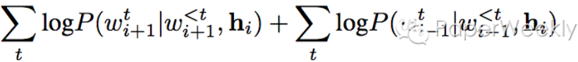 