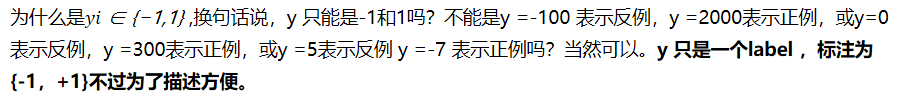
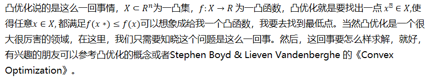

# SVM

## SVM由线性分类开始

在这之前，假设读者们对线性分类模型和向量矩阵求导有大概的了解。

给定训练样本集, 线性分类器基于训练样本D 在二维空间中找到一个超平面来分开二类样本。当然，这样的超平面有很多。

但我们可以直观感受到，这根红色线代表的超平面抗“扰动”性最好。这个超平面离直线两边的数据的间隔最大，对训练集的数据的局限性或噪声有最大的“容忍”能力。

在这里，这个**超平面**可以用函数表示。 当等于0的时候，x便是位于超平面

上的点，而f(x)大于0的点对应 y=1 的数据点，小于0的点对应y=-1的点。

为什么是,换句话说，y 只能是-1和1吗？不能是y =-100 表示反例，y =2000表示正例，或y=0表示反例，y =300表示正例，或y =5表示反例 y =-7 表示正例吗？当然可以。**y 只是一个label ，标注为{-1，+1}不过为了描述方便。**

若y=0表示反例，y=300表示正例，只不过分正类的标准变为

不妨令：

为什么可以这么令呢？我们知道，所谓的支持向量，就是使得上式等号成立，即最靠近两条虚边界线的向量。那么，不难理解当的值大于+1，或小于-1的时候，就更加支持“样本的分类”了。为什么要这么令呢？还是为了计算方便。接着往下看，你一定能悟到这么令的原因。

 

我们可以计算得到空间中任意样本点x xx到超平面的距离为：

为什么呢？

如图所示，有： (简单平面几何)

又有： ，代入上式，求得：因为yi∈{−1,1},两个异类支持向量到超平面的距离之和（也称为“间隔”）可表示为：

等价于：

由此我们得到了SVM的**基本型**。

 

## 凸优化

我们可以看到，上面的基本型目标函数是二次的，约束条件是线性的，这是一个**凸二次**规划问题。可以直接用现成的优化计算包求解。但若利用“对偶问题”来求解，会更高效。

###  啥是凸？什么是凸优化？

凸优化说的是这么一回事情，为一凸集，为一凸函数，凸优化就是要找出一点使得任意都满足可以想象成给我一个凸函数，我要去找到最低点。当然凸优化是一个很大很厉害的领域，在这里，我们只需要知晓这个问题是这么一回事。然后，这回事要怎么样求解，就好，有兴趣的朋友可以参考凸优化的概念或者Stephen Boyd & Lieven Vandenberghe 的《Convex Optimization》。

 

### 为啥叫二次规划问题呢

据了解（其实就是知道），目标函数和约束条件都为变量的线性函数，叫做-----线性规划问题。

目标函数为变量的二次函数和约束条件为变量的线性函数，叫做-----二次规划问题。

目标函数和约束条件都为非线性函数，叫做-----非线性规划问题。

 

## 对偶问题

对于

为了后面的描述方便，记这个式子为（1）式。

 

使用**拉格朗日乘子法**可以得到其“对偶问题”。

这是拉格朗日对偶性，即，通过给每一个约束条件加上一个拉格朗日乘子。然后定义出拉格朗日函数，通过拉格朗日函数将约束条件融合进目标函数中。目的是，**只需要通过一个目标函数包含约束条件，便可以清楚解释问题。**

 

比如对（1）式每一个约束（共有m个约束，，添加拉格朗日乘子,则整个问题的拉格朗日函数可写为：

为什么使用这样的拉格朗日乘子，又为何这样构建？这实际上是因为我们的目标函数是不等式约束，解这样的二次规划问题，我们选择用KKT条件，而KKT条件需要这样的一个约束最终我们便通过KKT条件来产生原问题的对偶问题。

同样的，将上面这个式子记为（2）式。

 

可以看到，由于这样，但凡有约束条件之一不满足，如。只有约束条件均满足的时候，L有最优值，为所以优化等价于优化当然，要满足约束条件。

 

于是，我们的目标函数可以表示为：

满足一定条件下，等价于（注意，这个满足一定条件，是指满足KKT条件）

后者把最小和最大的位置交换，这样使得运算方便起来。

 

## KKT条件

什么是KKT条件？其实在这之前，本文有稍微有提到过。在这里正式介绍一下。

**KKT条件**是一个线性规划问题能**有最优解的**充分和必要条件。

一般地，一个最优化数学模型可以表示成如下形式：

而这个最优化数学模型的最优解须满足的条件，即KKT条件为：

于是我们的整个问题转化为

对求最小

再对求最大。

 

对于第一步，先令对求偏导为0，可得：

将此两个式子带入（2）式消去。便得到了（1）式的对偶问题。

类比来看，我们的目标函数没有的等式约束。

于是，上面的过程，需要满足的KKT条件是

我们看到，对于任意样本，总有或者 .若，则由

知, 则此对应的向量不会对 的确定有任何影响。而 时，必有 ，此时对应的向量在最大间隔的边缘上（一开始示意图的虚线上），即是支持向量。这也说明，最终模型的确定，只与支持向量有关。

 

接下来，怎么求呢？

 

## 对于LR与SVM的异同

### 相同点

1. LR和SVM都是分类算法
2. LR和SVM都是监督学习算法
3. LR和SVM都是判别模型
4. 如果不考虑核函数，LR和SVM都是线性分类算法，也就是说他们的分类决策面都是线性的

说明:LR也是可以用核函数的.但LR通常不采用核函数的方法.(计算量太大)

### LR和SVM不同点

#### LR采用log损失，SVM采用合页(hinge)损失

逻辑回归的损失函数：

支持向量机的目标函数:

逻辑回归方法基于概率理论，假设样本为1的概率可以用sigmoid函数来表示，然后通过极大似然估计的方法估计出参数的值(基于统计的,其损失函数是人为设定的凸函数) 。支持向量机基于几何间隔最大化原理，认为存在最大几何间隔的分类面为最优分类面.(有严格的推导)

 

#### LR对异常值敏感，SVM对异常值不敏感(抗燥能力,SVM要强)

支持向量机只考虑局部的边界线附近的点，而逻辑回归考虑全局（远离的点对边界线的确定也起作用，虽然作用会相对小一些）。LR模型找到的那个超平面，是尽量让所有点都远离他，而SVM寻找的那个超平面，是只让最靠近中间分割线的那些点尽量远离，即只用到那些支持向量的样本。

 

支持向量机改变非支持向量样本并不会引起决策面的变化：

逻辑回归中改变任何样本都会引起决策面的变化：

LR则受所有数据点的影响，如果数据不同类别strongly unbalance，一般需要先对数据做balancing。

 

#### 计算复杂度不同。对于海量数据，SVM的效率较低，LR效率比较高

1. 当样本较少，特征维数较低时，SVM和LR的运行时间均比较短，SVM较短一些。准确率的话，LR明显比SVM要高
2. 当样本稍微增加些时，SVM运行时间开始增长，但是准确率赶超了LR。SVM时间虽长，但在接收范围内
3. 当数据量增长到20000时，特征维数增长到200时，SVM的运行时间剧烈增加，远远超过了LR的运行时间。但是准确率却和LR相差无几。(这其中主要原因是大量非支持向量参与计算,造成SVM的二次规划问题)

#### 对非线性问题的处理方式不同，LR主要靠特征构造，必须组合交叉特征，特征离散化

SVM也可以这样，还可以通过kernel(因为只有支持向量参与核计算,计算复杂度不高)。(由于可以利用核函数,。SVM则可以通过对偶求解高效处理。LR则在特征空间维度很高时，表现较差。)

#### SVM的损失函数就自带正则

损失函数中的项，这就是为什么SVM是结构风险最小化算法的原因！！！而LR必须另外在损失函数上添加正则项！！！

 

关于正则化:

给定一个数据集，一旦完成Linear SVM的求解，所有数据点可以被归成两类

1. 一类是落在对应分界平面外并被正确分类的点，比如落在正分界左侧的正样本或落在负分界右侧的负样本
2. 第二类是落在gap里或被错误分类的点

假设一个数据集已经被Linear SVM求解，那么往这个数据集里面增加或者删除更多的一类点并不会改变重新求解的Linear SVM平面。这就是它区分与LR的特点，下面我们在看看LR

值得一提的是求解LR模型过程中，每一个数据点对分类平面都是有影响的，它的影响力远离它到分类平面的距离指数递减。换句话说，LR的解是受数据本身分布影响的。在实际应用中，如果数据维度很高，LR模型都会配合参数的L1 regularization

要说有什么本质区别，那就是两个模型对数据和参数的敏感程度不同，Linear SVM比较依赖penalty的系数和数据表达空间的测度，而（带正则项的）LR比较依赖对参数做L1 regularization的系数。但是由于他们或多或少都是线性分类器，所以实际上对低维度数据overfitting的能力都比较有限，相比之下对高维度数据，LR的表现会更加稳定，为什么呢？

因为Linear SVM在计算margin有多“宽”的时候是依赖数据表达上的距离测度(可以理解为度量标准,即在什么样的标准上计算gap的大小)的，换句话说如果这个测度不好（badly scaled，这种情况在高维数据尤为显著），所求得的所谓Large margin就没有意义了，这个问题即使换用kernel trick（比如用Gaussian kernel）也无法完全避免。所以使用Linear SVM之前一般都需要先对数据做normalization，(这里的normalization是对数据的归一化,注意区分之前的LR在类别不平衡的时候做的balancing)而求解LR（without regularization）时则不需要或者结果不敏感。

同时会有：feature scaling会使得gradient descent的收敛更好。

如果不归一化，各维特征的跨度差距很大，目标函数就会是“扁”的：

 

（图中椭圆表示目标函数的等高线，两个坐标轴代表两个特征）

这样feature scaling之后，在进行梯度下降的时候，梯度的方向就会偏离最小值的方向，走很多弯路。

如果归一化了，那么目标函数就“圆”了：

每一步梯度的方向都基本指向最小值，可以大踏步地前进。

## 参考文献

[支持向量机（SVM）从入门到放弃再到掌握](https://blog.csdn.net/b285795298/article/details/81977271)