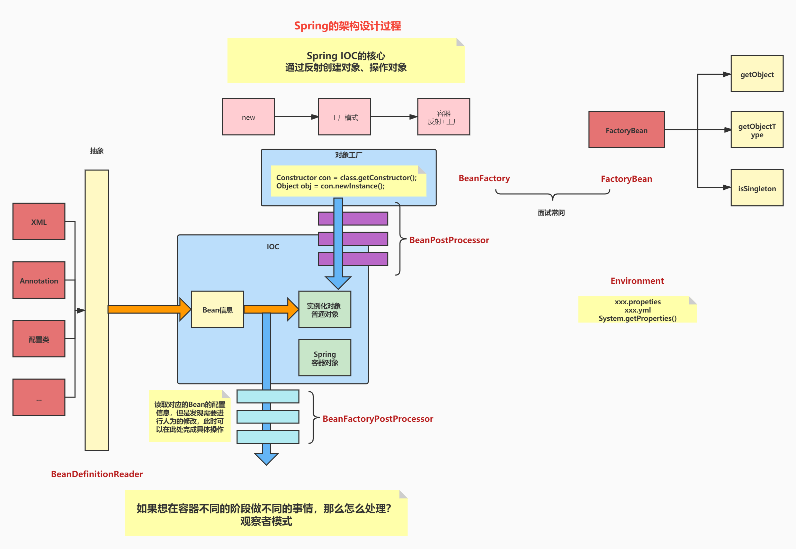
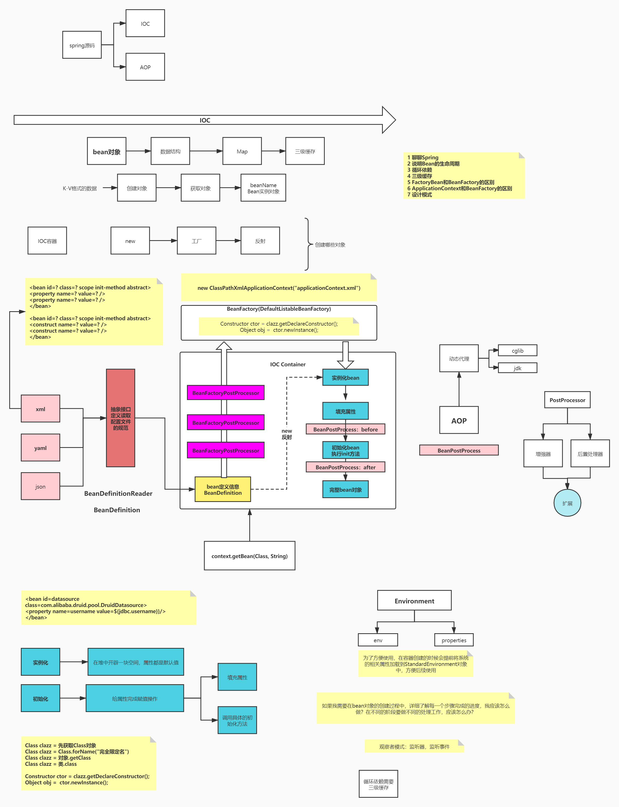
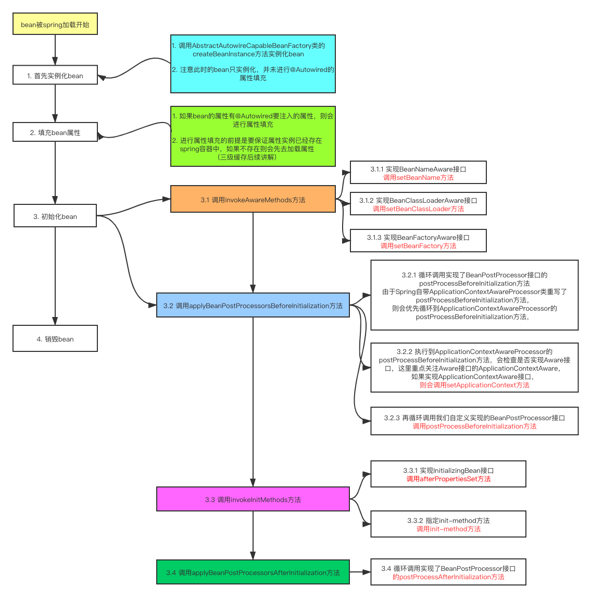
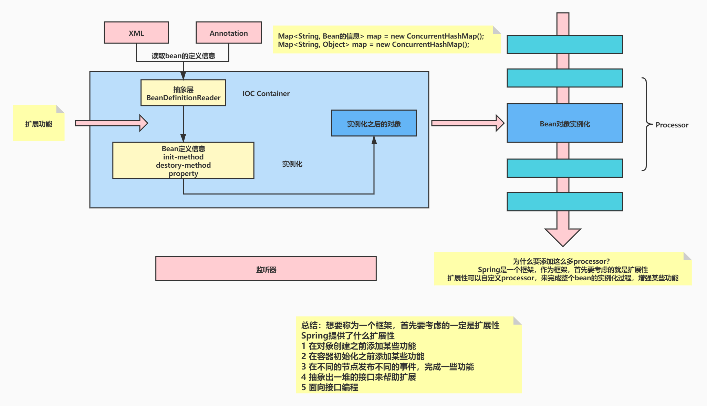
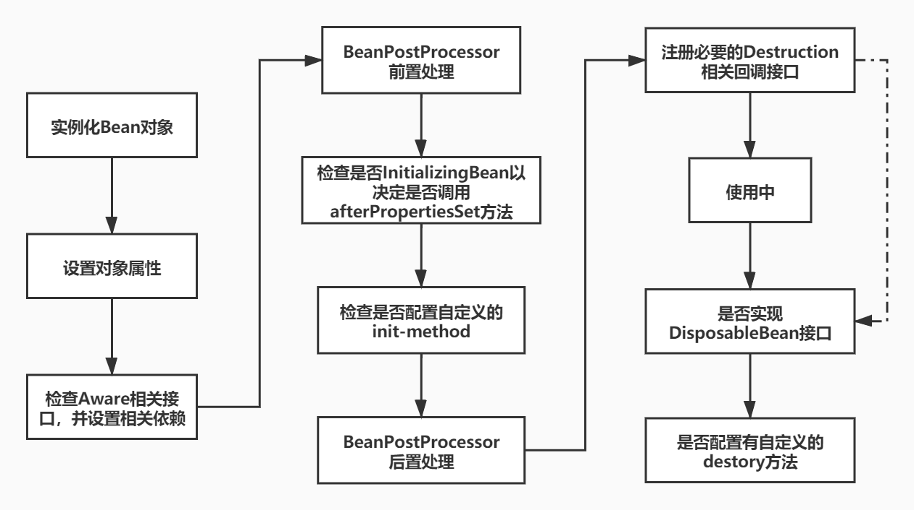

# Spring

Spring框架是由于软件开发的复杂性而创建的。Spring使用的是基本的JavaBean来完成以前只可能由EJB完成的事情。然而，Spring的用途不仅仅限于服务器端的开发。从简单性、可测试性和松耦合性角度而言，绝大部分Java应用都可以从Spring中受益。

## Spring源码解析

```java
@Override
public void refresh() throws BeansException, IllegalStateException {
    synchronized (this.startupShutdownMonitor) {
        StartupStep contextRefresh = this.applicationStartup.start("spring.context.refresh");

        // Prepare this context for refreshing.
        prepareRefresh();

        // Tell the subclass to refresh the internal bean factory.
        ConfigurableListableBeanFactory beanFactory = obtainFreshBeanFactory();

        // Prepare the bean factory for use in this context.
        prepareBeanFactory(beanFactory);

        try {
            // Allows post-processing of the bean factory in context subclasses.
            postProcessBeanFactory(beanFactory);

            StartupStep beanPostProcess = this.applicationStartup.start("spring.context.beans.post-process");
            // Invoke factory processors registered as beans in the context.
            // 事件
            invokeBeanFactoryPostProcessors(beanFactory);

            // Register bean processors that intercept bean creation.
            registerBeanPostProcessors(beanFactory);
            beanPostProcess.end();

            // Initialize message source for this context.
            initMessageSource();

            // Initialize event multicaster for this context.
            // h
            initApplicationEventMulticaster();

            // Initialize other special beans in specific context subclasses.
            onRefresh();

            // Check for listener beans and register them.
            registerListeners();

            // Instantiate all remaining (non-lazy-init) singletons.
            finishBeanFactoryInitialization(beanFactory);

            // Last step: publish corresponding event.
            finishRefresh();
        }

        catch (BeansException ex) {
            if (logger.isWarnEnabled()) {
                logger.warn("Exception encountered during context initialization - " +
                            "cancelling refresh attempt: " + ex);
            }

            // Destroy already created singletons to avoid dangling resources.
            destroyBeans();

            // Reset 'active' flag.
            cancelRefresh(ex);

            // Propagate exception to caller.
            throw ex;
        }

        finally {
            // Reset common introspection caches in Spring's core, since we
            // might not ever need metadata for singleton beans anymore...
            resetCommonCaches();
            contextRefresh.end();
        }
    }
}
```

### prepareRefresh

> Prepare this context for refreshing, setting its startup date and active flag as well as performing any initialization of property sources.

```java
protected void prepareRefresh() {
    // Switch to active.
    this.startupDate = System.currentTimeMillis();
    this.closed.set(false);
    this.active.set(true);

    if (logger.isDebugEnabled()) {
        if (logger.isTraceEnabled()) {
            logger.trace("Refreshing " + this);
        }
        else {
            logger.debug("Refreshing " + getDisplayName());
        }
    }

    // Initialize any placeholder property sources in the context environment.
    initPropertySources();

    // Validate that all properties marked as required are resolvable:
    // see ConfigurablePropertyResolver#setRequiredProperties
    getEnvironment().validateRequiredProperties();

    // Store pre-refresh ApplicationListeners...
    if (this.earlyApplicationListeners == null) {
        this.earlyApplicationListeners = new LinkedHashSet<>(this.applicationListeners);
    }
    else {
        // Reset local application listeners to pre-refresh state.
        this.applicationListeners.clear();
        this.applicationListeners.addAll(this.earlyApplicationListeners);
    }

    // Allow for the collection of early ApplicationEvents,
    // to be published once the multicaster is available...
    this.earlyApplicationEvents = new LinkedHashSet<>();
}
```

监听器，`earlyApplicationListeners`

### obtainFreshBeanFactory

> This implementation performs an actual refresh of this context's underlying bean factory, shutting down the previous bean factory (if any) and initializing a fresh bean factory for the next phase of the context's lifecycle.

```java
protected final void refreshBeanFactory() throws BeansException {
    // 如果已经有bean工厂，销毁并关闭
    if (hasBeanFactory()) {
        destroyBeans();
        closeBeanFactory();
    }
    try {
        // 创建工厂 DefaultListableBeanFactory
        DefaultListableBeanFactory beanFactory = createBeanFactory();
        beanFactory.setSerializationId(getId());
        customizeBeanFactory(beanFactory);
        loadBeanDefinitions(beanFactory);
        this.beanFactory = beanFactory;
    }
    catch (IOException ex) {
        throw new ApplicationContextException("I/O error parsing bean definition source for " + getDisplayName(), ex);
    }
}
```

### prepareBeanFactory

> Configure the factory's standard context characteristics, such as the context's ClassLoader and post-processors.
> Params:
> beanFactory – the BeanFactory to configure

```java
protected void prepareBeanFactory(ConfigurableListableBeanFactory beanFactory) {
    // Tell the internal bean factory to use the context's class loader etc.
    beanFactory.setBeanClassLoader(getClassLoader());
    if (!shouldIgnoreSpel) {
        beanFactory.setBeanExpressionResolver(new StandardBeanExpressionResolver(beanFactory.getBeanClassLoader()));
    }
    beanFactory.addPropertyEditorRegistrar(new ResourceEditorRegistrar(this, getEnvironment()));

    // Configure the bean factory with context callbacks.
    beanFactory.addBeanPostProcessor(new ApplicationContextAwareProcessor(this));
    beanFactory.ignoreDependencyInterface(EnvironmentAware.class);
    beanFactory.ignoreDependencyInterface(EmbeddedValueResolverAware.class);
    beanFactory.ignoreDependencyInterface(ResourceLoaderAware.class);
    beanFactory.ignoreDependencyInterface(ApplicationEventPublisherAware.class);
    beanFactory.ignoreDependencyInterface(MessageSourceAware.class);
    beanFactory.ignoreDependencyInterface(ApplicationContextAware.class);
    beanFactory.ignoreDependencyInterface(ApplicationStartupAware.class);

    // BeanFactory interface not registered as resolvable type in a plain factory.
    // MessageSource registered (and found for autowiring) as a bean.
    beanFactory.registerResolvableDependency(BeanFactory.class, beanFactory);
    beanFactory.registerResolvableDependency(ResourceLoader.class, this);
    beanFactory.registerResolvableDependency(ApplicationEventPublisher.class, this);
    beanFactory.registerResolvableDependency(ApplicationContext.class, this);

    // Register early post-processor for detecting inner beans as ApplicationListeners.
    beanFactory.addBeanPostProcessor(new ApplicationListenerDetector(this));

    // Detect a LoadTimeWeaver and prepare for weaving, if found.
    if (!NativeDetector.inNativeImage() && beanFactory.containsBean(LOAD_TIME_WEAVER_BEAN_NAME)) {
        beanFactory.addBeanPostProcessor(new LoadTimeWeaverAwareProcessor(beanFactory));
        // Set a temporary ClassLoader for type matching.
        beanFactory.setTempClassLoader(new ContextTypeMatchClassLoader(beanFactory.getBeanClassLoader()));
    }

    // Register default environment beans.
    if (!beanFactory.containsLocalBean(ENVIRONMENT_BEAN_NAME)) {
        beanFactory.registerSingleton(ENVIRONMENT_BEAN_NAME, getEnvironment());
    }
    if (!beanFactory.containsLocalBean(SYSTEM_PROPERTIES_BEAN_NAME)) {
        beanFactory.registerSingleton(SYSTEM_PROPERTIES_BEAN_NAME, getEnvironment().getSystemProperties());
    }
    if (!beanFactory.containsLocalBean(SYSTEM_ENVIRONMENT_BEAN_NAME)) {
        beanFactory.registerSingleton(SYSTEM_ENVIRONMENT_BEAN_NAME, getEnvironment().getSystemEnvironment());
    }
    if (!beanFactory.containsLocalBean(APPLICATION_STARTUP_BEAN_NAME)) {
        beanFactory.registerSingleton(APPLICATION_STARTUP_BEAN_NAME, getApplicationStartup());
    }
}
```

### postProcessBeanFactory

> Modify the application context's internal bean factory after its standard initialization. All bean definitions will have been loaded, but no beans will have been instantiated yet. This allows for registering special BeanPostProcessors etc in certain ApplicationContext implementations.
> Params:
> beanFactory – the bean factory used by the application context

```java
protected void postProcessBeanFactory(ConfigurableListableBeanFactory beanFactory) {
}
```

### invokeBeanFactoryPostProcessors

> Instantiate and invoke all registered BeanFactoryPostProcessor beans, respecting explicit order if given.
> Must be called before singleton instantiation.

```java
protected void invokeBeanFactoryPostProcessors(ConfigurableListableBeanFactory beanFactory) {
    PostProcessorRegistrationDelegate.invokeBeanFactoryPostProcessors(beanFactory, getBeanFactoryPostProcessors());

    // Detect a LoadTimeWeaver and prepare for weaving, if found in the meantime
    // (e.g. through an @Bean method registered by ConfigurationClassPostProcessor)
    if (!NativeDetector.inNativeImage() && beanFactory.getTempClassLoader() == null && beanFactory.containsBean(LOAD_TIME_WEAVER_BEAN_NAME)) {
        beanFactory.addBeanPostProcessor(new LoadTimeWeaverAwareProcessor(beanFactory));
        beanFactory.setTempClassLoader(new ContextTypeMatchClassLoader(beanFactory.getBeanClassLoader()));
    }
}
```

### registerBeanPostProcessors

> Instantiate and register all BeanPostProcessor beans, respecting explicit order if given.
> Must be called before any instantiation of application beans.

```java
protected void registerBeanPostProcessors(ConfigurableListableBeanFactory beanFactory) {
    PostProcessorRegistrationDelegate.registerBeanPostProcessors(beanFactory, this);
}
```

### initMessageSource

> Initialize the MessageSource. Use parent's if none defined in this context.

```java
protected void initMessageSource() {
		ConfigurableListableBeanFactory beanFactory = getBeanFactory();
		if (beanFactory.containsLocalBean(MESSAGE_SOURCE_BEAN_NAME)) {
			this.messageSource = beanFactory.getBean(MESSAGE_SOURCE_BEAN_NAME, MessageSource.class);
			// Make MessageSource aware of parent MessageSource.
			if (this.parent != null && this.messageSource instanceof HierarchicalMessageSource) {
				HierarchicalMessageSource hms = (HierarchicalMessageSource) this.messageSource;
				if (hms.getParentMessageSource() == null) {
					// Only set parent context as parent MessageSource if no parent MessageSource
					// registered already.
					hms.setParentMessageSource(getInternalParentMessageSource());
				}
			}
			if (logger.isTraceEnabled()) {
				logger.trace("Using MessageSource [" + this.messageSource + "]");
			}
		}
		else {
			// Use empty MessageSource to be able to accept getMessage calls.
			DelegatingMessageSource dms = new DelegatingMessageSource();
			dms.setParentMessageSource(getInternalParentMessageSource());
			this.messageSource = dms;
			beanFactory.registerSingleton(MESSAGE_SOURCE_BEAN_NAME, this.messageSource);
			if (logger.isTraceEnabled()) {
				logger.trace("No '" + MESSAGE_SOURCE_BEAN_NAME + "' bean, using [" + this.messageSource + "]");
			}
		}
	}
```

### initApplicationEventMulticaster

> Initialize the ApplicationEventMulticaster. Uses SimpleApplicationEventMulticaster if none defined in the context.
> See Also:
> SimpleApplicationEventMulticaster

```java
protected void initApplicationEventMulticaster() {
    ConfigurableListableBeanFactory beanFactory = getBeanFactory();
    if (beanFactory.containsLocalBean(APPLICATION_EVENT_MULTICASTER_BEAN_NAME)) {
        this.applicationEventMulticaster =
            beanFactory.getBean(APPLICATION_EVENT_MULTICASTER_BEAN_NAME, ApplicationEventMulticaster.class);
        if (logger.isTraceEnabled()) {
            logger.trace("Using ApplicationEventMulticaster [" + this.applicationEventMulticaster + "]");
        }
    }
    else {
        this.applicationEventMulticaster = new SimpleApplicationEventMulticaster(beanFactory);
        beanFactory.registerSingleton(APPLICATION_EVENT_MULTICASTER_BEAN_NAME, this.applicationEventMulticaster);
        if (logger.isTraceEnabled()) {
            logger.trace("No '" + APPLICATION_EVENT_MULTICASTER_BEAN_NAME + "' bean, using " +
                         "[" + this.applicationEventMulticaster.getClass().getSimpleName() + "]");
        }
    }
}
```

### onRefresh

> Template method which can be overridden to add context-specific refresh work. Called on initialization of special beans, before instantiation of singletons.
> This implementation is empty.
> Throws:
> BeansException – in case of errors
> See Also:
> refresh()

```java
protected void onRefresh() throws BeansException {
    // For subclasses: do nothing by default.
}
```

### registerListeners

> Add beans that implement ApplicationListener as listeners. Doesn't affect other listeners, which can be added without being beans.

```java
protected void registerListeners() {
    // Register statically specified listeners first.
    for (ApplicationListener<?> listener : getApplicationListeners()) {
        getApplicationEventMulticaster().addApplicationListener(listener);
    }

    // Do not initialize FactoryBeans here: We need to leave all regular beans
    // uninitialized to let post-processors apply to them!
    String[] listenerBeanNames = getBeanNamesForType(ApplicationListener.class, true, false);
    for (String listenerBeanName : listenerBeanNames) {
        getApplicationEventMulticaster().addApplicationListenerBean(listenerBeanName);
    }

    // Publish early application events now that we finally have a multicaster...
    Set<ApplicationEvent> earlyEventsToProcess = this.earlyApplicationEvents;
    this.earlyApplicationEvents = null;
    if (!CollectionUtils.isEmpty(earlyEventsToProcess)) {
        for (ApplicationEvent earlyEvent : earlyEventsToProcess) {
            getApplicationEventMulticaster().multicastEvent(earlyEvent);
        }
    }
}
```

### finishBeanFactoryInitialization

> Finish the initialization of this context's bean factory, initializing all remaining singleton beans.

```java
protected void finishBeanFactoryInitialization(ConfigurableListableBeanFactory beanFactory) {
    // Initialize conversion service for this context.
    if (beanFactory.containsBean(CONVERSION_SERVICE_BEAN_NAME) &&
        beanFactory.isTypeMatch(CONVERSION_SERVICE_BEAN_NAME, ConversionService.class)) {
        beanFactory.setConversionService(
            beanFactory.getBean(CONVERSION_SERVICE_BEAN_NAME, ConversionService.class));
    }

    // Register a default embedded value resolver if no BeanFactoryPostProcessor
    // (such as a PropertySourcesPlaceholderConfigurer bean) registered any before:
    // at this point, primarily for resolution in annotation attribute values.
    if (!beanFactory.hasEmbeddedValueResolver()) {
        beanFactory.addEmbeddedValueResolver(strVal -> getEnvironment().resolvePlaceholders(strVal));
    }

    // Initialize LoadTimeWeaverAware beans early to allow for registering their transformers early.
    String[] weaverAwareNames = beanFactory.getBeanNamesForType(LoadTimeWeaverAware.class, false, false);
    for (String weaverAwareName : weaverAwareNames) {
        getBean(weaverAwareName);
    }

    // Stop using the temporary ClassLoader for type matching.
    beanFactory.setTempClassLoader(null);

    // Allow for caching all bean definition metadata, not expecting further changes.
    beanFactory.freezeConfiguration();

    // Instantiate all remaining (non-lazy-init) singletons.
    beanFactory.preInstantiateSingletons();
}
```

### finishRefresh

> Finish the refresh of this context, invoking the LifecycleProcessor's onRefresh() method and publishing the ContextRefreshedEvent.

```java
protected void finishRefresh() {
    // Clear context-level resource caches (such as ASM metadata from scanning).
    clearResourceCaches();

    // Initialize lifecycle processor for this context.
    initLifecycleProcessor();

    // Propagate refresh to lifecycle processor first.
    getLifecycleProcessor().onRefresh();

    // Publish the final event.
    publishEvent(new ContextRefreshedEvent(this));

    // Participate in LiveBeansView MBean, if active.
    if (!NativeDetector.inNativeImage()) {
        LiveBeansView.registerApplicationContext(this);
    }
}
```






## Spring核心



### IOC

`Inversion of Control`，控制反转

`IOC`也叫依赖注入(`DI`)

核心：反射 

```java
@Retention(RetentionPolicy.RUNTIME)
@Target(ElementType.FIELD) 
@Inherited
@Documented
public @interface AutoWired {
}
```

```java
UserController userController = new UserController();
Class<? extends UserController> aClass = userController.getClass();
Stream.of(aClass.getDeclaredFields()).forEach(field -> {
    AutoWired annotation = field.getAnnotation(AutoWired.class);
    if (annotation != null) {
        field.setAccessible(true);
        Class<?> type = field.getType();
        try {
            Object o = type.newInstance();
            field.set(userController, o);
        } catch (InstantiationException e) {
            e.printStackTrace();
        } catch (IllegalAccessException e) {
            e.printStackTrace();
        }
    }
});
```



### AOP

## 面试题

### 谈谈SpringIOC的理解，原理和实现

**控制反转**：理论思想，原来的对象是由使用者来进行控制，有了`Spring`之后，可以把整个对象交给`Spring`来帮我们进行管理

​				`DI`：依赖注入，把对应的属性的值注入到具体的对象中，`@Autowired`，`populateBean`完成属性的注入

**容器**：存储对象，使用`map`结构进行储存，再`spring`中一半存在三级缓存，`singletonObjects`存放完成的`bean`对象

​				整个`bean`的声明周期，从创建到使用到销毁的过程都是由容器来管理（`bean`的声明周期）

**分**：

1. 一般聊`IOC`容器的时候要涉及到容器的创建过程（`beanFactory`， `DefaultListableBeanFactory`），向`bean`工厂中设置一些参数（`BeanPostProcessor`，`Aware`接口的子类）等等属性
2. 加载解析`bean`对象，准备要创建的bean对象的定义对象`beanDefinition`（`xml`，或者注解的解析过程）
3. `beanFactoryPostProcessor`的处理，此处是扩展点，`PlaceholderConfigureSupport`，`ConfiguationClassPostProcessor`
4. `BeanPostProcessor`的注册功能，方便后续对bean对象完成具体的扩展功能
5. 通过反射的方式将`BeanDefinition`对象实例化成具体的`bean`对象
6. `bean`对象的初始化过程（填充属性，调用`aware`子类的方法，调用`BeanPostProcessor`前置处理方法，调用`init-method`方法，调用`BeanPostProcessor`的后置处理方法）
7. 生成完整的`bean`对象，通过`getBean`方法可以直接获取
8. 销毁过程

面试官，这是我对`IOC`的整体理解，包含了一些详细的处理过程，您看一下有什么问题，可以指点我一下

具体的细节我记得不太清了，但是`spring`中的`bean`都是通过反射的方式生成的，同时其中包含很多的扩展点，比如最常用的对`BeanFactory`的扩展，对`bean`的扩展，我们公司在这方面的使用是比较多的，除此之外

### 谈谈spring IOC的底层实现

底层实现：工作原理、过程、数据结构、流程、设计模式、设计思想

反射，工厂，设计模式，关键的几个方法名

`createBeanFactory`、`getBean`、`doGetBean`、`createBean`、`doCreateBean`、`createBeanInstance`（`getDeclaredConstructor`，`newInstance`）、`populateBean`

1. 先通过`createBeanFactory`创建出一个`Bean`工厂（`DefaultListBaleBeanFactory`）
2. 开始循环创建对象、因为容器中的`bean`默认都是单例的，所以优先通过`getBean`，`doGetBean`从容器中查找，找不到的话
3. 通过`createBean`，`doCreateBean`方法，以反射的方式创建对象，一般情况下使用的是无参的构造方法（`getDeclaredConstructor`，`newInstance`）
4. 进行对象的属性填充`populateBean`
5. 进行其他的初始化操作（`initalizingBean`）

### 描述一下bean的生命周期

背图

在表述的时候，不要只说图中的关键点，要学会扩展

1. 实例化`bean`：反射的方式生成对象
2. 填充`bean`的属性：`populateBean`()，循环依赖的问题（三级缓存）
3. 调用`aware`接口相关的方法：`invokeAwareMethod`（完成`BeanName`，`BeanFactory`，`BeanClassLoader`对象的属性设置）
4. 调用`BeanPostProcessor`中的前置处理方法：使用比较多的有（`ApplicationContextPostProcessor`，设置`ApplicationContext`，`Environment`，`ResourceLoader`，`EmbeddValueResolver`等对象）
5. 调用`initmethod`方法：`invokeinitmethod`，判断是否实现了`initiaizingBean`接口，如果有，调用`afterPropertiesSet`方法，没有就不调用
6. 调用`BeanPostProcessor`的后置处理方法：`spring`的`AOP`就是在此处实现的，`AbstractAutoProxyCreator`，注册`Destuction`相关的回调接口：钩子函数
7. 获取到完成的对象，可以通过`getBean`的方式来进行对象的获取
8. 销毁流程，1：判断是否实现了`DispoableBean`接口 2：调用`destroyMethod`方法



### Spring是如何解决循环依赖的问题

三级缓存，提前暴露对象，`aop`

总：什么是循环依赖问题，`A`依赖`B`，`B`依赖`A`

分：先说明`Bean`的创建过程：实例化、初始化

1. 先创建`A`对象，实例化`A`对象，此时`A`对象中的`b`属性为空，填充属性`b`
2. 从容器中查找对象，如果找到了，直接赋值（不存在循环依赖问题），找不到直接创建`B`对象
3. 实例化`B`对象，此时`B`对象中的`a`属性为空，填充属性`a`
4. 从容器中查找`A`对象，找不到，直接创建

形成闭环原因

此时，会发现A对象是存在的，只不过此时的A对象不是一个完成的状态，只完成了实例化但是未完成初始化

如果在程序调用过程中，拥有了某个对象的引用，能否在后期给他完成赋值操作，可以优先把非完成状态的对象优先赋值，等待后续操作来完成赋值，相当于提前暴露了某个不完整对象的引用，所以解决问题的核心在于实例化和初始化分开操作，这也是解决循环依赖问题的关键

当所有的对象都完成实例化和初始化操作之后，还要把完整对象放到容器中，此时在容器中存在对象的几个状态，完成实例化但未完成初始化，完成状态，因为都在容器中，所以要使用不同的`map`进行存储，此时就有了一级缓存和二级缓存。如果一级缓存中有了，那么二级缓存中就不会存在同名的对象，因为他们的查找顺序是`1，2，3`这样的方式来查找的。

一级缓存中放的是完整对象，二级缓存中放的是非完整对象

为什么需要三级缓存？三级缓存的`value`类型是`ObjectFactory`，是一个函数式接口，存在的意义是保证在整个容器的运行过程中同名的`bean`对象只有一个

如果一个对象需要被代理，或者说需要生成代理对象，那么要先生成一个普通对象

普通对象和代理对象是不能同时出现在容器中的，因此当一个对象需要被代理的时候，就要使用代理对象覆盖掉之前的普通对象，在实际调用过程中，是没有办法确定什么时候对象被调用，所以就要求当某个对象被调用的时候，优先判断次对象是否需要被代理，类似一种回调机制的实现，因此传入`lambda`表达式的时候，可以通过`lambda`表达式来执行对象的覆盖过程，`getEarlyBeanReference()`

因此，所有的`bean`对象在创建的时候都要优先放到三级缓存中，在后续的使用过程中，如果需要被代理则返回代理对象，如果不需要被代理，则直接返回普通对象

#### 缓存的放置时间和删除时间

三级缓存：`createBeanInstance`之后：`addSingletonFactory`

二级缓存：第一次从三级缓存中确定对象是代理对象还是普通对象的时候，同时删除三级缓存：`getSingleton`

一级缓存：生成完整对象之后放到一级缓存，删除二级三级缓存：`addSingleton`

### BeanFactory和FactoryBean有什么区别

相同点：都是用来创建`bean`对象的

不同点：使用`BeanFactory`创建对象的时候，必须要遵守严格的生命周期流程，如果想简单的自定义某个对象的创建，同时创建完成的对象想交给`spring`来管理，那么就需要实现`FactoryBean`接口了

​	`isSingleton`：是否是单例对象

​	`getObjectType`：获取返回对象的类型

​	`getObject`：自定义创建对象的过程（new，反射，动态代理）

`BeanFactory`是个`Factory`，也就是`IOC`容器或对象工厂，`FactoryBean`是个`Bean`。在`Spring`中，所有的`Bean`都是由`BeanFactory`(也就是`IOC`容器)来进行管理的。但对`FactoryBean`而言，这个`Bean`不是简单的`Bean`，而是一个能生产或者修饰对象生成的工厂`Bean`,它的实现与设计模式中的工厂模式和修饰器模式类似。

****

`BeanFactory`是个`Factory`，也就是`IOC`容器或对象工厂，`FactoryBean`是个`Bean`。在`Spring`中，所有的`Bean`都是由`BeanFactory`(也就是`IOC`容器)来进行管理的。但对`FactoryBean`而言，这个`Bean`不是简单的`Bean`，而是一个能生产或者修饰对象生成的工厂`Bean`,它的实现与设计模式中的工厂模式和修饰器模式类似

#### BeanFactory

`BeanFactory`定义了`IOC`容器的最基本形式，并提供了`IOC`容器应遵守的的最基本的接口，也就是`Spring IOC`所遵守的最底层和最基本的编程规范。在`Spring`代码中，`BeanFactory`只是个接口，并不是`IOC`容器的具体实现，但是`Spring`容器给出了很多种实现，如`DefaultListableBeanFactory`、`XmlBeanFactory`、`ApplicationContext`等，都是附加了某种功能的实现

```java
package org.springframework.beans.factory;  
import org.springframework.beans.BeansException;  
public interface BeanFactory {  
    String FACTORY_BEAN_PREFIX = "&";  
    Object getBean(String name) throws BeansException;  
    <T> T getBean(String name, Class<T> requiredType) throws BeansException;  
    <T> T getBean(Class<T> requiredType) throws BeansException;  
    Object getBean(String name, Object... args) throws BeansException;  
    boolean containsBean(String name);  
    boolean isSingleton(String name) throws NoSuchBeanDefinitionException;  
    boolean isPrototype(String name) throws NoSuchBeanDefinitionException;  
    boolean isTypeMatch(String name, Class<?> targetType) throws NoSuchBeanDefinitionException;  
    Class<?> getType(String name) throws NoSuchBeanDefinitionException;  
    String[] getAliases(String name);  
}   
```

#### FactoryBean

一般情况下，`Spring`通过反射机制利用`<bean>`的`class`属性指定实现类实例化`Bean`，在某些情况下，实例化`Bean`过程比较复杂，如果按照传统的方式，则需要在`<bean>`中提供大量的配置信息。配置方式的灵活性是受限的，这时采用编码的方式可能会得到一个简单的方案。`Spring`为此提供了一个`org.springframework.bean.factory.FactoryBean`的工厂类接口，用户可以通过实现该接口定制实例化`Bean`的逻辑。
`FactoryBean`接口对于`Spring`框架来说占用重要的地位，`Spring`自身就提供了70多个`FactoryBean`的实现。它们隐藏了实例化一些复杂`Bean`的细节，给上层应用带来了便利。从`Spring3.0`开始，`FactoryBean`开始支持泛型，即接口声明改为`FactoryBean<T>`的形式

```java
package org.springframework.beans.factory;  
public interface FactoryBean<T> {  
    T getObject() throws Exception;  
    Class<?> getObjectType();  
    boolean isSingleton();  
}  
```

在该接口中还定义了以下3个方法：

1. `T getObject()`：返回由`FactoryBean`创建的`Bean`实例，如果`isSingleton()`返回true，则该实例会放到`Spring`容器中单实例缓存池中；
2. `boolean isSingleton()`：返回由`FactoryBean`创建的`Bean`实例的作用域是`singleton`还是`prototype`；
3. `Class<T> getObjectType()`：返回`FactoryBean`创建的`Bean`类型。

当配置文件中`<bean>`的`class`属性配置的实现类是`FactoryBean`时，通过`getBean()`方法返回的不是`FactoryBean`本身，而是`FactoryBean#getObject()`方法所返回的对象，相当于`FactoryBean#getObject()`代理了`getBean()`方法。
例：如果使用传统方式配置下面`Car`的`<bean>`时，Car的每个属性分别对应一个`<property>`元素标签

```java
public class Car { 
    private int maxSpeed ;  
    private String brand ;  
    private double price ;  
    public int getMaxSpeed ()   {  
        return this.maxSpeed ;  
    }  
    public void setMaxSpeed (int maxSpeed)   {  
        this.maxSpeed = maxSpeed;  
    }  
    public  String getBrand ()   {  
        return this.brand ;  
    }  
    public void setBrand (String brand )   {  
        this.brand = brand;  
    }  
    public double getPrice ()   {  
        return this.price ;  
    }  
    public void setPrice (double price )   {  
        this.price = price;  
    }  
}
```

如果用`FactoryBean`的方式实现就灵活点，下例通过逗号分割符的方式一次性的为`Car`的所有属性指定配置值

```java

public class CarFactoryBean implements FactoryBean<Car> {
    private String carInfo;

    public Car getObject() throws Exception {
        Car car = new Car();
        String[] infos = carInfo.split(",");
        car.setBrand(infos[0]);
        car.setMaxSpeed(Integer.valueOf(infos[1]));
        car.setPrice(Double.valueOf(infos[2]));
        return car;
    }

    public Class<Car> getObjectType() {
        return Car.class;
    }

    public boolean isSingleton() {
        return false;
    }

    public String getCarInfo() {
        return this.carInfo;
    }

    // 接受逗号分割符设置属性信息
    public void setCarInfo(String carInfo) {
        this.carInfo = carInfo;
    }
}
```

有了这个`CarFactoryBean`后，就可以在配置文件中使用下面这种自定义的配置方式配置`CarBean`了：

```xml
<bean id="car"class="com.baobaotao.factorybean.CarFactoryBean"
P:carInfo="法拉利,400,2000000"/>
```

当调用`getBean("car")`时，`Spring`通过反射机制发现`CarFactoryBean`实现了`FactoryBean`的接口，这时`Spring`容器就调用接口方法`CarFactoryBean#getObject()`方法返回。如果希望获取`CarFactoryBean`的实例，则需要在使用`getBean(beanName)`方法时在`beanName`前显示的加上`"&"`前缀：如`getBean("&car")`;

### Spring中用到的设计模式

单例模式：bean默认都是单例的

原型模式：指定作用域未`prototype`

工厂模式：`BeanFactory`

模板方法：`postProcessBeanFactory` `onRefresh` `initPropertyValue`

策略模式：`XmlBeanDeifnitionReader`，`PropertiesBeanDefinitionReader`

观察者模式：`listener`，`event`，`multicast`

适配器模式：`Adapter`

装饰者模式：`BeanWapper`

责任链模式：使用`aop`的时候会先生成一个拦截器链

代理模式：动态代理

委托者模式：`delegate`

### Spring的AOP的底层原理

动态代理

`aop`是`ioc`的一个扩展功能，先有的`ioc`，再有`aop`，只是在`ioc`的整个流程中新增的一个扩展点而已：`BeanPostProcessor`

总：`aop`概念，应用场景，动态代理

分：`bean`的创建过程中有一个步骤可以对`bean`进行扩展实现，`aop`本身就是一个扩展功能，所以在`BeanPostProcessor`的后置处理方法中来实现

1. 代理对象的创建过程（`advice`、切面、切点）
2. 通过`jdk`或者`cglib`的方式生成代理对象
3. 在执行方法调用的时候，会调用到生成的字节码文件中，直接对找到`DynamicAdvisoredInterceptor`的`intercept`方法，从此方法开始执行
4. 根据之前定义好的通知来生成拦截器链
5. 从拦截器链中依次获取每一个通知开始执行，在执行过程中，为了方便找到下一个通知是哪个，会有一个`InvocationInterceptor`的对象，找的时候是从`-1`的位置依次开始查找并执行

### Spring的事务是如何回滚的

`spring`的事务管理是如何实现的

总：`spring`的事务是由`aop`来实现的，首先要生成具体的代理对象，然后按照`aop`的整套流程来执行具体的操作逻辑，正常情况要通过通知来完成核心功能，但是事务不是通过通知来实现的，而是通过一个`TransactionInterceptor`来实现的，然后调用`invoke`来实现具体逻辑

分：

1. 先做准备工作，解析各个方法上事务相关的属性，根据具体的属性来判断是否开启新事务
2. 当需要开启的时候，获取数据库连接，关闭自动提交功能，开启事务
3. 执行具体的`sql`逻辑操作
4. 在操作过程中，如果执行失败了，那么会通过`completeTransactionAfterThrowing`看来完成事务的回滚操作，回滚的具体逻辑是通过`doRollBack`方法来实现的，实现的时候也是要先获取连接对象，通过连接对象来回滚
5. 如果执行过程中没有任何意外情况发生，那么通过`commitTransactionAfterReturning`来完成事务的提交操作，提交的具体逻辑是通过`doCimmit`方法实现的，实现的时候也是要先获取连接对象，通过连接对象来提交
6. 当事务执行完毕需要清除相关的事务信息`cleanupTransaction`

如果想要聊的更加细致，需要了解`TransactionInfo`和`TransactionStatus`

### 谈一下spring的事务传播

传播特性有几种？7种

`Required`，`Requires_new`，`nested`，`Support`，`Not_support`，`Never`，`Mandatory`

某一个事务嵌套另一个事务的时候怎么办

`A`方法调用`B`方法，`AB`方法都有事务，并且传播特性不同，那么`A`如果有异常，`B`怎么办，`B`如果有异常，`A`怎么办

总：事务的传播特性指的是不同的嵌套过程种，事务应该如何进行处理，是用同一个事务还是不同的事务，当出现异常的时候会回滚还是提交，两个方法之前的相关影响，在日常工作中，使用比较多的是`required`，`requireds_new`，`nested`

分：

1. 先说事务的不同分类，可以分为三类：支持当前事务，不支持当前事务，嵌套事务
2. 如果外层方法是`required`，内层方法是`required`，`requireds_new`，`nested`
3. 如果外层方法是`requireds_new`，内层方法是`required`，`requireds_new`，`nested`
4. 如果外层方法是`nested`，内层方法是`required`，`requireds_new`，`nested`

核心处理逻辑非常简单

1. 判断内外方法是否是同一个事务
   1. 是：异常统一在外层方法处理
   2. 不是：内层方法有可能影响到外层方法，但是外层方法是不会影响内层方法的（大致可以这么理解，个别情况除外`nested`）

## 参考文献

[Spring学习(二十八)-ApplicationListener原理](https://blog.csdn.net/weixin_43549578/article/details/86558738)

