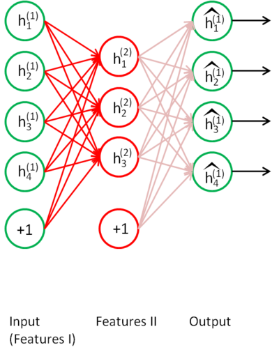
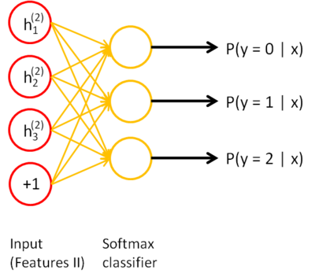

# Stackend Autoencoders

## Overview

上图是一个栈式自编码算法模型，属于无监督学习。栈式自编码神经网络是一个由多层自编码器组成的神经网络，其前一层自编码器的输出作为其后一层自编码器的输入。通过将重构的x与输入的x相减来计算误差。 

​    encoder部分从原始2000维特征降至50维（根据实际情况，自定义特征数），有三个隐层，每一层都是提取的高维特征，最后一层作为降维后的特征可用作分类和回归。decoder部分输出重构的x，通过调整encoder和decoder的参数，使得重构误差最小。

## Tranining

一种比较好的获取栈式自编码神经网络参数的方法是采用逐层贪婪训练法进行训练。即先利用原始输入来训练网络的第一层，得到其参数 W1,b1；然后网络第一层将原始输入转化成为由隐藏单元激活值组成的向量（假设该向量为A），接着把A作为第二层的输入，继续训练得到第二层的参数 W2,b2; 最后，对后面的各层同样采用的策略，即将前层的输出作为下一层输入的方式依次训练。

​    对于上述训练方式，在训练每一层参数的时候，会固定其它各层参数保持不变。所以，如果想得到更好的结果，在上述预训练过程完成之后，可以通过反向传播算法同时调整所有层的参数以改善结果，这个过程称为微调。

​    实际上，使用逐层贪婪训练方法将参数训练到快要收敛时，应该使用微调。反之，如果直接在随机化的初始权重上使用微调，那么会得到不好的结果，因为参数会收敛到局部最优。

​    如果你只对以分类为目的的微调感兴趣，那么惯用的做法是丢掉栈式自编码网络的“解码”层，直接把最后一个隐藏层的输出作为特征输入到softmax分类器进行分类，这样，分类器（softmax）的分类错误的梯度值就可以直接反向传播给编码层

## Concrete example

假设你想要训练一个包含两个隐含层的栈式自编码网络，用来进行MNIST手写数字分类。 首先，你需要用原始输入 x(k) 训练第一个自编码器，它能够学习得到原始输入的一阶特征表示h(1)(k)（如下图所示）。

接着，你需要把原始数据输入到上述训练好的稀疏自编码器中，对于每一个输入 x(k)都可以得到它对应的一阶特征表示$$h^{(1)(k)}$$。然后你再用这些一阶特征作为另一个稀疏自编码器的输入，使用它们来学习二阶特征 $$h^{(2)(k)}$$。（如下图所示）

同样，再把一阶特征输入到刚训练好的第二层稀疏自编码器中，得到每个$$h^{(1)(k)}$$对应的二阶特征激活值$$h^{(2)(k)}$$。接下来，你可以把这些二阶特征作为softmax分类器的输入，训练得到一个能将二阶特征映射到数字标签的模型。

如下图所示，最终，你可以将这三层结合起来构建一个包含两个隐藏层和一个最终softmax分类器层的栈式自编码网络，这个网络能够如你所愿地对MNIST数字进行分类。

