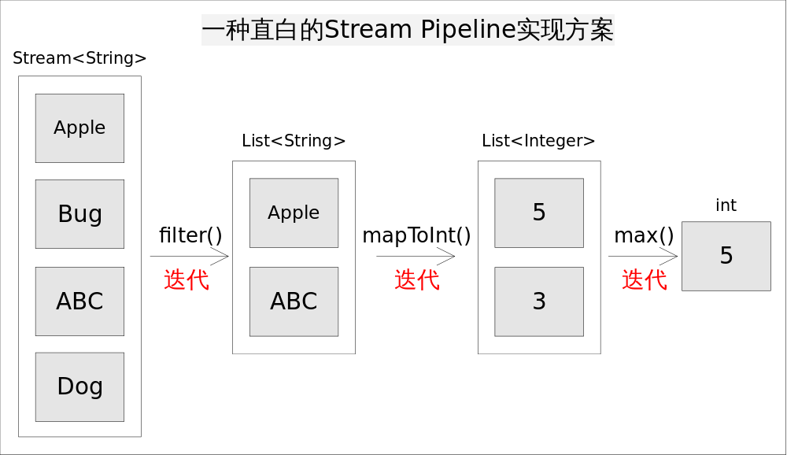
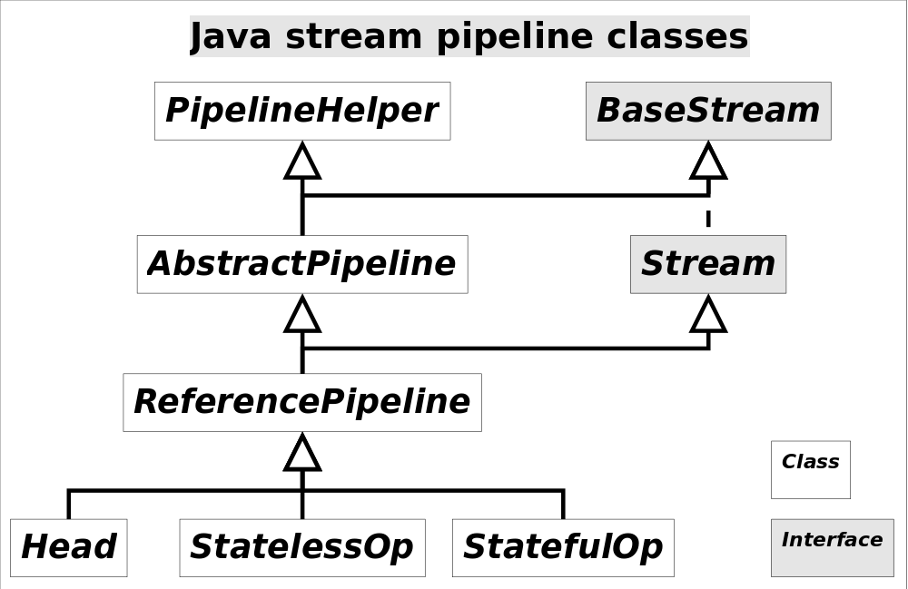

# Stream流常规用法

`JDK8`对`Stream`接口的定义，`Stream`接口继承`BaseStream`接口

```java
public interface Stream<T> extends BaseStream<T, Stream<T>> 
```

`BaseStream`接口定义

```java
public interface BaseStream<T, S extends BaseStream<T, S>> extends AutoCloseable
```

## BaseStream接口

> Base interface for streams, which are sequences of elements supporting sequential and parallel aggregate operations.

```
BaseStream是流的基本接口，它支持顺序和并行聚合操作的元素序列。
```

```java
// demo 用法：计算红色的权重和
int sum = widgets.stream().filter(w -> w.getColor() == RED).mapToInt(w -> w.getWeight()).sum();
```

`BaseStream`接口定义了`7`个接口方法，重写了`AutoCloseable`的`close`方法

```java
Iterator<T> iterator(); // 流迭代器
Spliterator<T> spliterator(); // 流拆分器
boolean isParallel(); // 如果要执行终端操作，则返回此流是否并行执行
S sequential(); // 返回一个顺序流。 如果流已经是顺序的，返回自身
S parallel(); // 返回一个并行流。 如果流已经是并行的，返回自身
S unordered(); // 返回一个无序流。 如果流已经是无序的，返回自身
S onClose(Runnable closeHandler); // 返回具有附加关闭处理程序的等效流。 关闭处理程序在流上调用 close 方法时运行，并按添加顺序执行。
void close(); // 继承AutoCloseable接口，override方法
```

## Stream接口

### Stream

> A sequence of elements supporting sequential and parallel aggregate operations.
>
> 支持顺序和并行聚合操作的元素序列

```
Stream（流）是一个来自数据源的元素队列并支持聚合操作
1 元素是特定类型的对象，形成一个队列。Java中的Stream并不会存储元素，而是按需计算
2 数据源 流的俩元，可以是集合，数组，I/O channel，产生器generator等
3 聚合操作 类似于SQL语句一样的操作，比如filter, map, reduce, find, match, sorted等

和以前的Collection操作不同，Stream操作还有两个基础的特征

Pipeling: 中间操作都会返回流对象本身，这样多个操作可以串联成一个管道，如同流式风格(fluent style), 这样做可以对操作进行优化，比如延迟执行(laziness)和短路(short-circuiting)

内部迭代：以前对集合遍历都是通过Iterator或者For-Each的方式，显式的在集合外部进行迭代，这叫做外部迭代。Stream提供了内部迭代的方式，通过访问者模式(Visitor)实现
```

为了执行计算，流操作被组合成一个流管道。一个流管道由一个源（可能是一个数组，一个集合，一个生成器函数，一个`I/O`通道等），零个或多个中间操作（将一个流转换为另一个流，例如`filter`和终端操作（产生结果，如`count`或者`forEach`））

除了`Stream`这种**对象引用**流，还有一些特殊流`IntStream`，`LongStream`，`DoubleStream`等。


图中4种*stream*接口继承自`BaseStream`，其中`IntStream, LongStream, DoubleStream`对应三种基本类型（`int, long, double`，注意不是包装类型），`Stream`对应所有剩余类型的*stream*视图。为不同数据类型设置不同*stream*接口，可以

1. 提高性能
2. 增加特定接口函数

你可能会奇怪为什么不把`IntStream`等设计成`Stream`的子接口？毕竟这接口中的方法名大部分是一样的。答案是这些方法的名字虽然相同，但是返回类型不同，如果设计成父子接口关系，这些方法将不能共存，因为Java不允许只有返回类型不同的方法重载

虽然大部分情况下*stream*是容器调用`Collection.stream()`方法得到的，但*stream*和*collections*有以下不同

- **无存储**。*stream*不是一种数据结构，它只是某种数据源的一个视图，数据源可以是一个数组，Java容器或I/O channel等。
- **为函数式编程而生**。对*stream*的任何修改都不会修改背后的数据源，比如对*stream*执行过滤操作并不会删除被过滤的元素，而是会产生一个不包含被过滤元素的新*stream*。
- **惰式执行**。*stream*上的操作并不会立即执行，只有等到用户真正需要结果的时候才会执行。
- **可消费性**。*stream*只能被“消费”一次，一旦遍历过就会失效，就像容器的迭代器那样，想要再次遍历必须重新生成

对*stream*的操作分为为两类，**中间操作(\*intermediate operations\*)和结束操作(\*terminal operations\*)**，二者特点是：

1. **中间操作总是会惰式执行**，调用中间操作只会生成一个标记了该操作的新*stream*，仅此而已。
2. **结束操作会触发实际计算**，计算发生时会把所有中间操作积攒的操作以*pipeline*的方式执行，这样可以减少迭代次数。计算完成之后*stream*就会失效。

`Stream API`中大量使用`Lambda`表达式作为回调方法，但这并不是关键。理解Stream我们更关心的是另外两个问题：流水线和自动并行。使用`Stream`或许很容易写入如下形式的代码：

```java
int longestStringLengthStartingWithA
        = strings.stream()
              .filter(s -> s.startsWith("A"))
              .mapToInt(String::length)
              .max();
```

上述代码求出以字母*`A`*开头的字符串的最大长度，一种直白的方式是为每一次函数调用都执一次迭代，这样做能够实现功能，但效率上肯定是无法接受的。类库的实现着使用流水线（*Pipeline*）的方式巧妙的避免了多次迭代，其基本思想是在一次迭代中尽可能多的执行用户指定的操作。

| Stream操作分类                      |                              |                                                              |
| ----------------------------------- | ---------------------------- | ------------------------------------------------------------ |
| 中间操作(`Intermediate operations`) | 无状态(`Stateless`)          | `unordered() filter() map() mapToInt() mapToLong() mapToDouble() flatMap() flatMapToInt() flatMapToLong() flatMapToDouble() peek()` |
|                                     | 有状态(`Stateful`)           | `distinct() sorted() sorted() limit() skip()`                |
| 结束操作(`Terminal operations`)     | 非短路操作                   | `forEach() forEachOrdered() toArray() reduce() collect() max() min() count()` |
|                                     | 短路操作(`short-circuiting`) | `anyMatch() allMatch() noneMatch() findFirst() findAny()`    |

`Stream`上的所有操作分为两类：中间操作和结束操作，中间操作只是一种标记，只有结束操作才会触发实际计算。中间操作又可以分为无状态的(*Stateless*)和有状态的(*Stateful*)，无状态中间操作是指元素的处理不受前面元素的影响，而有状态的中间操作必须等到所有元素处理之后才知道最终结果，比如排序是有状态操作，在读取所有元素之前并不能确定排序结果；结束操作又可以分为短路操作和非短路操作，短路操作是指不用处理全部元素就可以返回结果，比如*找到第一个满足条件的元素*。之所以要进行如此精细的划分，是因为底层对每一种情况的处理方式不同。

区分中间操作和结束操作最简单的方法，就是看方法的返回值，返回值为*stream*的大都是中间操作，否则是结束操作

### Stream的实现原理



仍然考虑上述求最长字符串的程序，一种直白的流水线实现方式是为每一次函数调用都执一次迭代，并将处理中间结果放到某种数据结构中（比如数组，容器等）。具体说来，就是调用`filter()`方法后立即执行，选出所有以*A*开头的字符串并放到一个列表`list1`中，之后让list1传递给`mapToInt()`方法并立即执行，生成的结果放到`list2`中，最后遍历list2找出最大的数字作为最终结果。程序的执行流程如如所示：

这样做实现起来非常简单直观，但有两个明显的弊端：

1. 迭代次数多。迭代次数跟函数调用的次数相等
2. 频繁产生中间结果。每次函数调用都产生一次中间结果，存储开销无法接受

这些弊端使得效率底下，根本无法接受。如果不使用Stream API我们都知道上述代码该如何在一次迭代中完成，大致是如下形式：

```java
int longest = 0;
for(String str : strings){
    if(str.startsWith("A")){// 1. filter(), 保留以A开头的字符串
        int len = str.length();// 2. mapToInt(), 转换成长度
        longest = Math.max(len, longest);// 3. max(), 保留最长的长度
    }
}
```

采用这种方式我们不但减少了迭代次数，也避免了存储中间结果，显然这就是流水线，因为我们把三个操作放在了一次迭代当中。只要我们事先知道用户意图，总是能够采用上述方式实现跟Stream API等价的功能，但问题是Stream类库的设计者并不知道用户的意图是什么。如何在无法假设用户行为的前提下实现流水线，是类库的设计者要考虑的问题

### Stream流水线解决方案

我们大致能够想到，应该采用某种方式记录用户每一步的操作，当用户调用结束操作时将之前记录的操作叠加到一起在一次迭代中全部执行掉。沿着这个思路，有几个问题需要解决：

1. 用户的操作如何记录？
2. 操作如何叠加？
3. 叠加之后的操作如何执行？
4. 执行后的结果（如果有）在哪里？

#### 操作如何记录



注意这里使用的是**操作(`operation`)**一词，指的是**`Stream`中间操作**的操作，很多`Stream`操作会需要一个回调函数（`Lambda`表达式），因此一个完整的操作是**`数据来源，操作，回调函数`**构成的三元组。`Stream`中使用`Stage`的概念来描述一个完整的操作，并用某种实例化后的`PipelineHelper`来代表`Stage`，将具有先后顺序的各个`Stage`连到一起，就构成了整个流水线。跟`Stream`相关类和接口的继承关系图示。

还有`IntPipeline`, `LongPipeline`, `DoublePipeline`没在图中画出，这三个类专门为三种基本类型（不是包装类型）而定制的，跟`ReferencePipeline`是并列关系。图中`Head`用于表示第一个`Stage`，即调用调用诸如`Collection.stream()`方法产生的`Stage`，很显然这个`Stage`里不包含任何操作；`StatelessOp`和`StatefulOp`分别表示无状态和有状态的`Stage`，对应于无状态和有状态的中间操作。

Stream流水线组织结构示意图如下：


图中通过`Collection.stream()`方法得到`Head`也就是`stage0`，紧接着调用一系列的中间操作，不断产生新的`Stream`。**这些`Stream`对象以双向链表的形式组织在一起，构成整个流水线，由于每个`Stage`都记录了前一个`Stage`和本次的操作以及回调函数，依靠这种结构就能建立起对数据源的所有操作**。这就是`Stream`记录操作的方式。

#### 操作如何叠加

以上只是解决了操作记录的问题，要想让流水线起到应有的作用我们需要一种将所有操作叠加到一起的方案。你可能会觉得这很简单，只需要从流水线的`head`开始依次执行每一步的操作（包括回调函数）就行了。这听起来似乎是可行的，但是你忽略了前面的`Stage`并不知道后面`Stage`到底执行了哪种操作，以及回调函数是哪种形式。换句话说，只有当前`Stage`本身才知道该如何执行自己包含的动作。这就需要有某种协议来协调相邻`Stage`之间的调用关系。

这种协议由`Sink`接口完成，`Sink`接口包含的方法如下表所示：

| 方法名                            | 作用                                                         |
| --------------------------------- | ------------------------------------------------------------ |
| `void begin(long size)`           | 开始遍历元素之前调用该方法，通知`Sink`做好准备               |
| `void end()`                      | 所有元素遍历完成之后调用，通知`Sink`没有更多的元素了         |
| `boolean cancellationRequested()` | 是否可以结束操作，可以让短路操作尽早结束                     |
| `void accept(T t)`                | 遍历元素时调用，接受一个待处理元素，并对元素进行处理。`Stage`把自己包含的操作和回调方法封装到该方法里，前一个`Stage`只需要调用当前`Stage.accept(T t)`方法就行了 |

有了上面的协议，相邻`Stage`之间调用就很方便了，每个`Stage`都会将自己的操作封装到一个`Sink`里，前一个`Stage`只需调用后一个`Stage`的`accept()`方法即可，并不需要知道其内部是如何处理的。当然对于有状态的操作，`Sink`的`begin()`和`end()`方法也是必须实现的。比如`Stream.sorted()`是一个有状态的中间操作，其对应的`Sink.begin()`方法可能创建一个乘放结果的容器，而accept()方法负责将元素添加到该容器，最后`end()`负责对容器进行排序。对于短路操作，`Sink.cancellationRequested()`也是必须实现的，比如`Stream.findFirst()`是短路操作，只要找到一个元素，`cancellationRequested()`就应该返回`true`，以便调用者尽快结束查找。`Sink`的四个接口方法常常相互协作，共同完成计算任务。**实际上Stream API内部实现的的本质，就是如何重载Sink的这四个接口方法**。

有了`Sink`对操作的包装，`Stage`之间的调用问题就解决了，执行时只需要从流水线的`head`开始对数据源依次调用每个`Stage`对应的`Sink.{begin(), accept(), cancellationRequested(), end()}`方法就可以了。一种可能的`Sink.accept()`方法流程是这样的：

```java
void accept(U u){
    1. 使用当前Sink包装的回调函数处理u
    2. 将处理结果传递给流水线下游的Sink
}
```

`Sink`接口的其他几个方法也是按照这种[处理->转发]的模型实现。下面我们结合具体例子看看`Stream`的中间操作是如何将自身的操作包装成`Sink`以及`Sink`是如何将处理结果转发给下一个`Sink`的。先看`Stream.map()`方法：

```java
// Stream.map()，调用该方法将产生一个新的Stream
public final <R> Stream<R> map(Function<? super P_OUT, ? extends R> mapper) {
    ...
    return new StatelessOp<P_OUT, R>(this, StreamShape.REFERENCE,
                                 StreamOpFlag.NOT_SORTED | StreamOpFlag.NOT_DISTINCT) {
        @Override /*opWripSink()方法返回由回调函数包装而成Sink*/
        Sink<P_OUT> opWrapSink(int flags, Sink<R> downstream) {
            return new Sink.ChainedReference<P_OUT, R>(downstream) {
                @Override
                public void accept(P_OUT u) {
                    R r = mapper.apply(u);// 1. 使用当前Sink包装的回调函数mapper处理u
                    downstream.accept(r);// 2. 将处理结果传递给流水线下游的Sink
                }
            };
        }
    };
}
```

上述代码看似复杂，其实逻辑很简单，就是将回调函数`mapper`包装到一个`Sink`当中。由于`Stream.map()`是一个无状态的中间操作，所以`map()`方法返回了一个`StatelessOp`内部类对象（一个新的`Stream`），调用这个新`Stream`的`opWripSink()`方法将得到一个包装了当前回调函数的`Sink`。

再来看一个复杂一点的例子。`Stream.sorted()`方法将对`Stream`中的元素进行排序，显然这是一个有状态的中间操作，因为读取所有元素之前是没法得到最终顺序的。抛开模板代码直接进入问题本质，`sorted()`方法是如何将操作封装成`Sink`的呢？`sorted()`一种可能封装的`Sink`代码如下：

```java
// Stream.sort()方法用到的Sink实现
class RefSortingSink<T> extends AbstractRefSortingSink<T> {
    private ArrayList<T> list;// 存放用于排序的元素
    RefSortingSink(Sink<? super T> downstream, Comparator<? super T> comparator) {
        super(downstream, comparator);
    }
    @Override
    public void begin(long size) {
        ...
        // 创建一个存放排序元素的列表
        list = (size >= 0) ? new ArrayList<T>((int) size) : new ArrayList<T>();
    }
    @Override
    public void end() {
        list.sort(comparator);// 只有元素全部接收之后才能开始排序
        downstream.begin(list.size());
        if (!cancellationWasRequested) {// 下游Sink不包含短路操作
            list.forEach(downstream::accept);// 2. 将处理结果传递给流水线下游的Sink
        }
        else {// 下游Sink包含短路操作
            for (T t : list) {// 每次都调用cancellationRequested()询问是否可以结束处理。
                if (downstream.cancellationRequested()) break;
                downstream.accept(t);// 2. 将处理结果传递给流水线下游的Sink
            }
        }
        downstream.end();
        list = null;
    }
    @Override
    public void accept(T t) {
        list.add(t);// 1. 使用当前Sink包装动作处理t，只是简单的将元素添加到中间列表当中
    }
}
```

上述代码完美的展现了`Sink`的四个接口方法是如何协同工作的：

1. 首先`beging()`方法告诉`Sink`参与排序的元素个数，方便确定中间结果容器的的大小；
2. 之后通过`accept()`方法将元素添加到中间结果当中，最终执行时调用者会不断调用该方法，直到遍历所有元素；
3. 最后`end()`方法告诉`Sink`所有元素遍历完毕，启动排序步骤，排序完成后将结果传递给下游的`Sink`；
4. 如果下游的`Sink`是短路操作，将结果传递给下游时不断询问下游`cancellationRequested()`是否可以结束处理

#### 叠加之后的操作如何执行


`Sink`完美封装了`Stream`每一步操作，并给出了[处理->转发]的模式来叠加操作。这一连串的齿轮已经咬合，就差最后一步拨动齿轮启动执行。是什么启动这一连串的操作呢？也许你已经想到了启动的原始动力就是结束操作(`Terminal Operation`)，一旦调用某个结束操作，就会触发整个流水线的执行。

结束操作之后不能再有别的操作，所以结束操作不会创建新的流水线阶段(`Stage`)，直观的说就是流水线的链表不会在往后延伸了。结束操作会创建一个包装了自己操作的`Sink`，这也是流水线中最后一个`Sink`，这个`Sink`只需要处理数据而不需要将结果传递给下游的`Sink`（因为没有下游）。对于`Sink`的[处理->转发]模型，结束操作的`Sink`就是调用链的出口。

我们再来考察一下上游的`Sink`是如何找到下游`Sink`的。一种可选的方案是在`PipelineHelper`中设置一个`Sink`字段，在流水线中找到下游`Stage`并访问`Sink`字段即可。但`Stream`类库的设计者没有这么做，而是设置了一个`Sink AbstractPipeline.opWrapSink(int flags, Sink downstream)`方法来得到`Sink`，该方法的作用是返回一个新的包含了当前`Stage`代表的操作以及能够将结果传递给`downstream`的`Sink`对象。为什么要产生一个新对象而不是返回一个`Sink`字段？这是因为使用`opWrapSink()`可以将当前操作与下游`Sink`（上文中的`downstream`参数）结合成新`Sink`。试想只要从流水线的最后一个`Stage`开始，不断调用上一个`Stage`的`opWrapSink()`方法直到最开始（不包括`stage0`，因为`stage0`代表数据源，不包含操作），就可以得到一个代表了流水线上所有操作的`Sink`，用代码表示就是这样：

```java
// AbstractPipeline.wrapSink()
// 从下游向上游不断包装Sink。如果最初传入的sink代表结束操作，
// 函数返回时就可以得到一个代表了流水线上所有操作的Sink。
final <P_IN> Sink<P_IN> wrapSink(Sink<E_OUT> sink) {
    ...
    for (AbstractPipeline p=AbstractPipeline.this; p.depth > 0; p=p.previousStage) {
        sink = p.opWrapSink(p.previousStage.combinedFlags, sink);
    }
    return (Sink<P_IN>) sink;
}
```

现在流水线上从开始到结束的所有的操作都被包装到了一个`Sink`里，执行这个`Sink`就相当于执行整个流水线，执行`Sink`的代码如下：

```java
// AbstractPipeline.copyInto(), 对spliterator代表的数据执行wrappedSink代表的操作。
final <P_IN> void copyInto(Sink<P_IN> wrappedSink, Spliterator<P_IN> spliterator) {
    ...
    if (!StreamOpFlag.SHORT_CIRCUIT.isKnown(getStreamAndOpFlags())) {
        wrappedSink.begin(spliterator.getExactSizeIfKnown());// 通知开始遍历
        spliterator.forEachRemaining(wrappedSink);// 迭代
        wrappedSink.end();// 通知遍历结束
    }
    ...
}
```

上述代码首先调用`wrappedSink.begin()`方法告诉`Sink`数据即将到来，然后调用`spliterator.forEachRemaining()`方法对数据进行迭代（`Spliterator`是容器的一种迭代器，[参阅](https://github.com/CarpenterLee/JavaLambdaInternals/blob/master/3-Lambda and Collections.md#spliterator)），最后调用`wrappedSink.end()`方法通知`Sink`数据处理结束。逻辑如此清晰。

#### 执行后的结果在哪里

最后一个问题是流水线上所有操作都执行后，用户所需要的结果（如果有）在哪里？首先要说明的是不是所有的Stream结束操作都需要返回结果，有些操作只是为了使用其副作用(*Side-effects*)，比如使用`Stream.forEach()`方法将结果打印出来就是常见的使用副作用的场景（事实上，除了打印之外其他场景都应避免使用副作用），对于真正需要返回结果的结束操作结果存在哪里呢？

> 特别说明：副作用不应该被滥用，也许你会觉得在Stream.forEach()里进行元素收集是个不错的选择，就像下面代码中那样，但遗憾的是这样使用的正确性和效率都无法保证，因为Stream可能会并行执行。大多数使用副作用的地方都可以使用[归约操作](http://www.cnblogs.com/CarpenterLee/p/5-Streams API(II).md)更安全和有效的完成。

```java
// 错误的收集方式
ArrayList<String> results = new ArrayList<>();
stream.filter(s -> pattern.matcher(s).matches())
      .forEach(s -> results.add(s));  // Unnecessary use of side-effects!
// 正确的收集方式
List<String>results =
     stream.filter(s -> pattern.matcher(s).matches())
             .collect(Collectors.toList());  // No side-effects!
```

回到流水线执行结果的问题上来，需要返回结果的流水线结果存在哪里呢？这要分不同的情况讨论，下表给出了各种有返回结果的Stream结束操作。

| 返回类型   | 对应的结束操作                      |
| ---------- | ----------------------------------- |
| `boolean`  | `anyMatch() allMatch() noneMatch()` |
| `Optional` | `findFirst() findAny()`             |
| 归约结果   | `reduce() collect()`                |
| 数组       | `toArray()`                         |

1. 对于表中返回`boolean`或者`Optional`的操作（`Optional`是存放 一个 值的容器）的操作，由于值返回一个值，只需要在对应的`Sink`中记录这个值，等到执行结束时返回就可以了。
2. 对于归约操作，最终结果放在用户调用时指定的容器中（容器类型通过[收集器](http://www.cnblogs.com/CarpenterLee/p/5-Streams API(II).md#收集器)指定）。`collect(), reduce(), max(), min()`都是归约操作，虽然max()和`min()`也是返回一个`Optional`，但事实上底层是通过调用[reduce()](http://www.cnblogs.com/CarpenterLee/p/5-Streams API(II).md#多面手reduce)方法实现的。
3. 对于返回是数组的情况，毫无疑问的结果会放在数组当中。这么说当然是对的，但在最终返回数组之前，结果其实是存储在一种叫做*`Node`*的数据结构中的。`Node`是一种多叉树结构，元素存储在树的叶子当中，并且一个叶子节点可以存放多个元素。这样做是为了并行执行方便。

### Stream创建

最常用的创建`Stream`有两种途径：

1. 通过`Stream`接口的静态工厂方法（注意：`Java8`里面接口可以带静态方法）
2. 通过`Collection`接口的默认方法：`stream()`，把一个`Collection`对象转成`Stream`

> **stream()** − 为集合创建串行流
>
> **parallelStream()** − 为集合创建并行流

**使用Stream静态方法来创建Stream**

1. `of`方法：有两个`overload`方法，一个接受可变长参数，一个接受单一值
2. `generator`方法：生成无限长度的`Stream`，其元素的生成是通过给定的`Supplier`（这个接口可以看成一个对象的工厂，每次调用返回一个给定类型的对象）
3. `iterate`方法：也是生成无限长度的`Stream`，和`generator`不同的是，其元素的生成是重复对给定的种子值(`seed`)调用用户指定函数来生成的。其中包含的元素可以认为是：`seed`，`f(seed)`,`f(f(seed))`无限循环

```java
Stream.iterate(1, item -> item + 1).limit(10).forEach(System.out::println); // limit
```

```java
// 数组
Arrays.stream(arr).forEach(System.out::println);
// List
Arrays.asList(arr).stream().forEach(System.out::println);
// generator
Stream.generate(() -> new Random().nextInt(10)).limit(10);
```

### 转换Stream

转换`Stream`其实就是把一个`Stream`通过某些行为转换成一个新的`Stream`。`Stream`接口中定义了几个常用的转换方法

1. `distinct`：对于`Stream`中包含的元素进行去重操作（去重逻辑依赖元素的`equals`方法），新生成的`Stream`中没有重复的元素
2. `filter`：对于`Stream`中包含的元素使用给定的过滤函数进行过滤操作，新生成的`Stream`只包含符合条件的元素
3. `map`：对于Stream中包含的元素使用给定的转换函数进行转换操作，新生成的`Stream`只包含转换生成的元素。这个方法有三个原始类型的变种方法，分别是：`mapToInt`，`mapToLong`和`mapToDouble`。这三个方法也比较好理解，比如`mapToInt`就是把原始`Stream`转换成一个新的`Stream`，这个新生成的`Stream`中的元素都是`int`类型。之所以会有这三个变种方法，可以免除自动装箱/拆箱的额外消耗。
4. `flatMap`：和`map`类型，不同的是其每个元素转换得到的是`Stream`对象，会把`Stream`中的元素压缩到父集合中
5. `peek`：生成一个包含原`Stream`的所有元素的新的`Stream`，同时会提供一个消费函数（`Consumer`实例），新`Stream`每个元素被消费的时候都会执行给定的消费函数
6. `limit`：对一个`Stream`进行截断操作，获取其前`N`个元素，如果原`Stream`中包含的元素个数小于`N`，那就获取其所有的元素
7. `skip`：返回一个丢弃原`Stream`的前`N`个元素后剩下元素组成的新`Stream`，如果原`Stream`中包含的元素个数小于`N`，那么返回空`Stream`

### Reduce Stream

> A reduction operation (also called a fold) takes a sequence of input elements and combines them into a single summary result by repeated application of a combining operation, such as finding the sum or maximum of a set of numbers, or accumulating elements into a list. The streams classes have multiple forms of general reduction operations, called reduce() and collect(), as well as multiple specialized reduction forms such as sum(), max(), or count().

汇聚操作（也称为折叠）接口一个元素序列作为输入，反复使用某个合并操作，把序列中的元素合并成一个汇总的结果。比如查找一个数字列表的总和或者最大值，或者把这些数字累积成一个`List`对象。`Stream`接口有一些通用的汇聚操作，比如`reduce()`和`collect()`；也有一些特定用途的汇聚操作，比如`sum()`，`max()`，`count()`。`sum`方法不是所有的`Stream`对象都有的，只有`IntStream`，`LongStream`和`DoubleStream`才有

1. 可变汇聚：把输入的元素累积到一个可变的容器中，比如`Collection`或者`StringBuilder`
2. 其他汇聚：除去可变汇聚剩下的，一般都不是通过反复修改某个可变对象，而是通过把前一次的汇聚结果当成下一次的入参，反复如此。比如`reduce`，`count`，`allMatch`

#### **可变汇聚**

可变汇聚对应的只有一个方法：`collect`，它可以把`Stream`中的元素收集到一个结果容器中（比如`Collection`）：

```java
<R> R collect(Supplier<R> supplier, BiConsumer<R, ? super T> accumulator, BiConsumer<R, R> combiner);
```

`Supplier supplier`是一个工厂函数，用来生成一个新的容器；`BiConsumer accumulator`也是一个函数，用来把`Stream`中的元素添加到结果容器中；`BiConsumer combiner`还是一个函数，用来把中间状态的多个结果容器合并成为一个（并发的时候会用到）。

#### **其他汇聚**

**reduce**

```java
List<Integer> ints = Lists.newArrayList(1, 2, 3, 4, 5, 6, 7, 8, 9, 10);
System.out.println("ints sum is:" + ints.stream().reduce(Integer::sum).orElse(0));
```

可以看到`reduce`方法接受一个函数，这个函数有两个参数，第一个参数是上次函数执行的返回值（也称为中间结果），第二个参数是`stream`中的元素，这个函数把这两个值相加，得到的和会被赋值给下次执行这个函数的第一个参数。要注意的是：**第一次执行的时候第一个参数的值是`Stream`的第一个元素，第二个参数是`Stream`的第二个元素**。这个方法返回值类型是`Optional`，这是`Java8`防止出现`NPE`的一种可行方法

```java
List<Integer> ints = Lists.newArrayList(1, 2, 3, 4, 5, 6, 7, 8, 9, 10);
System.out.println("ints sum is:" + ints.stream().reduce(100, Integer::sum));
```

它允许用户提供一个循环计算的初始值，如果`Stream`为空，就直接返回该值。而且这个方法不会返回`Optional`，因为其不会出现`null`值

**count**

获取`Stream`中元素的个数

```java
List<Integer> ints = Lists.newArrayList(1, 2, 3, 4, 5, 6, 7, 8, 9, 10);
System.out.println("ints count is:" + ints.stream().map(c -> c).count());
```

`allMatch`：是不是`Stream`中的所有元素都满足给定的匹配条件

`anyMatch`：`Stream`中是否存在任何一个元素满足匹配条件

`findFirst`: 返回`Stream`中的第一个元素，如果`Stream`为空，返回空`Optional`

`noneMatch`：是不是`Stream`中的所有元素都不满足给定的匹配条件

`max`和`min`：使用给定的比较器（`Operator`），返回`Stream`中的最大|最小值

****

## Lazy

> 懒操作：对于会消耗较多资源的对象，使用延迟初始化是比较好的选择。这不仅能够节省一些资源，同事能够加快对象的创建速度，从而从整体上提升性能。但是对于一个对象的延迟初始化，需要注意的一点就是这些实现细节不应该暴露给用户，即用户能够按照正常的操作流程来使用该对象。

```java
public synchronized Heavy getHeavy() {
    if(heavy == null) {
        heavy = new Heavy();
    }
    return heavy;
}
```

### Lazy Evaluation

`Lazy Evaluation`（延迟求值）

延迟求值的主要目的是减少需要执行的代码量来提高执行速度

其实`Java`语言中有一些地方已经应用了延迟求值的概念，比如对逻辑表达式的求值

在执行`fn1() || fn2()`时，当`fn1()`返回`true`的时候，`fn2()`是不会被执行的。同样的，在执行`fn1()&&fn2()`时，当`fn1()`返回`false`的时候，`fn2()`是不会被执行的。这就是大家熟知的短路(`Short-circuiting`)操作。

然而对于方法调用，在发生实际调用前所传入的参数都会被求值，即使某些参数在方法中根本就没有被用到。因此这就造成了潜在的性能浪费，我们可以使用`Lambda`表达式来进行改进。

当参数列表中有`Lambda`表达式和方法引用时，这种类型的参数只有在真正地需要被使用时才会由`Java`编译器求值，我们可以利用这一点来实现延迟求值。`Java 8`中新添加的`Stream`类型的许多方法都实现了延迟求值。比如`filter`方法接受的`Predicate`函数接口，并不一定会被集合中的所有元素调用。因此，我们可以考虑将方法的参数冲构成函数接口来实现延迟求值。

### Eager求值

```java
public class Evaluation {
    public static boolean evaluate(final int value) {
        System.out.println("evaluating ..." + value);
        simulateTimeConsumingOp(2000);
        return value > 100;
    }

    public static void eagerEvaluator(
        final boolean input1, final boolean input2) {
        System.out.println("eagerEvaluator called...");
        System.out.println("accept?: " + (input1 && input2));
    }
    //...
}
eagerEvaluator(evaluate(1), evaluate(2));
// evaluating ...1
// evaluating ...2
// eagerEvaluator called...
// accept?: false
```

以上代码中，虽然希望使用短路操作来得到最后的结果(`input1 && input2`)，但是已经晚了。在对参数进行求值的时候，`input1`和`input2`的值实际上就已经被确认了，从上面的输出可以看出这一点。这段代码会执行至少`4`秒，显然这不是最优解。

### 延迟求值的设计

如果我们知道方法中的某些参数可能不会被用到，那么就可以对它们进行重构，将它们替换成函数接口来实现延迟求值。比如上述代码中使用了短路操作，说明`input2`的求值也许是不必要的，这是可以将它替换成`Supplier`接口

```java
public static void lazyEvaluator(
    final Supplier<Boolean> input1, final Supplier<Boolean> input2) {
    System.out.println("lazyEvaluator called...");
    System.out.println("accept?: " + (input1.get() && input2.get()));
}
```

替换成`Supplier`类型的函数接口后，只有在调用它的`get`方法，才会真正执行求值操作。那么上述的短路操作就有意义了，当`input1.get()`返回的是`false`，`input2.get()`根本就不会被调用

```java
lazyEvaluator(() -> evaluate(1), () -> evaluate(2));

// lazyEvaluator called...
// evaluating ...1
// accept?: false
```

此时的执行时间只有`2`秒多一点，比之前的4秒而言，性能提高了接近100%。在某些参数不被需要的场合下，借助`Lambda`表达式或者方法引用来实现哪些参数确实能够增加性能，但是也使得代码稍微的复杂了一点，但是为了性能的提升这些代价也是值得的。

### Stream懒操作

`Stream`有两种类型的方法：

1. 中间操作（`Intermediate Operation`）
2. 结束操作（`Terminal Operation`）

`Stream`之所以懒在于每次在使用`Stream`时，都会连接多个中间操作，并在最后附上一个结束操作。像`map()`和`filter()`这样的方法是中间操作，在调用它们时，会立即返回另一个`Stream`对象。而对于`reduce()`及`findFirst()`这样的方法，它们是结束操作，在调用它们时才会在执行真正的操作来获取需要的值。

****

## Example

### 数据

```java
@Builder
@Data
@AllArgsConstructor
@NoArgsConstructor
public class Person {
    private Integer id;
    private String name;
    private Integer room;
    private List<String> tags;
}
```

```java
Person person1 = Person.builder().id(1).name("11").room(1).tags(Lists.newArrayList("111", "aaa")).build();
Person person2 = Person.builder().id(2).name("22").room(1).tags(Lists.newArrayList("222", "bbb")).build();
Person person3 = Person.builder().id(3).name("33").room(1).tags(Lists.newArrayList("333", "ccc")).build();
Person person4 = Person.builder().id(4).name("44").room(2).tags(Lists.newArrayList("444", "ddd")).build();
Person person5 = Person.builder().id(5).name("55").room(2).tags(Lists.newArrayList("555", "eee")).build();
Person person6 = Person.builder().id(6).name("66").room(2).tags(Lists.newArrayList("666", "fff")).build();

List<Person> personList = Lists.newArrayList(person1, person2, person3, person4, person5, person6);
```

### collect

```java
List<Integer> ids = personList.parallelStream().map(Person::getId).collect(Collectors.toList());
// 收集某个字段的值 [1, 2, 3, 4, 5, 6]
```

```java
// {1=Person(id=1, name=11, room=1, tags=[111, aaa]),
// 2=Person(id=2, name=22, room=1, tags=[222, bbb]),
// 3=Person(id=3, name=33, room=1, tags=[333, ccc]),
// 4=Person(id=4, name=44, room=2, tags=[444, ddd]),
// 5=Person(id=5, name=55, room=2, tags=[555, eee]),
// 6=Person(id=6, name=66, room=2, tags=[666, fff])}
Map<Integer, Person> keyMap = personList.stream().collect(Collectors.toMap(Person::getId, c -> c));

// 该方法必须保证数据不可重复，如果重复会报异常
Exception in thread "main" java.lang.IllegalStateException: Duplicate key Person(id=1, name=11, room=1, tags=[111, aaa])
    at java.util.stream.Collectors.lambda$throwingMerger$114(Collectors.java:133)
    at java.util.HashMap.merge(HashMap.java:1245)
    at java.util.stream.Collectors.lambda$toMap$172(Collectors.java:1320)
    at java.util.stream.ReduceOps$3ReducingSink.accept(ReduceOps.java:169)
    at java.util.ArrayList$ArrayListSpliterator.forEachRemaining(ArrayList.java:1374)
    at java.util.stream.AbstractPipeline.copyInto(AbstractPipeline.java:481)
    at java.util.stream.AbstractPipeline.wrapAndCopyInto(AbstractPipeline.java:471)
    at java.util.stream.ReduceOps$ReduceOp.evaluateSequential(ReduceOps.java:708)
    at java.util.stream.AbstractPipeline.evaluate(AbstractPipeline.java:234)
    at java.util.stream.ReferencePipeline.collect(ReferencePipeline.java:499)
    at Test.main(Test.java:65)
    
personList.add(Person.builder().id(1).name("11").room(1).tags(Lists.newArrayList("111", "aaa")).build());
Map<Integer, Person> repeat = personList.stream().collect(Collectors.toMap(Person::getId, c -> c));
```

### distinct

```java
List<Integer> distinctRooms = personList.stream().map(Person::getRoom).distinct().collect(Collectors.toList());
// 收集某个字段去重 [1, 2]
```

```java
personList.add(Person.builder().id(1).name("11").room(1).tags(Lists.newArrayList("111", "aaa")).build());
List<Person> distinctPerson = personList.stream().distinct().collect(Collectors.toList());
// distinct基于对象的equals方法，实现去重
```

### max\min\sum\average

```java
long sum = personList.stream().mapToInt(Person::getId).sum();
double average = personList.stream().mapToInt(Person::getId).average().orElse(0.0);
int max = personList.stream().mapToInt(Person::getId).max().orElse(0);
int min = personList.stream().mapToInt(Person::getId).min().orElse(0);
```

### groupby

```java
// {1=[Person(id=1, name=11, room=1, tags=[111, aaa]), Person(id=2, name=22, room=1, tags=[222, bbb]), Person(id=3, name=33, room=1, tags=[333, ccc])],

// 2=[Person(id=4, name=44, room=2, tags=[444, ddd]), Person(id=5, name=55, room=2, tags=[555, eee]), Person(id=6, name=66, room=2, tags=[666, fff])]}

Map<Integer, List<Person>> roomMap = personList.stream().collect(Collectors.groupingBy(Person::getRoom));
```

```java
// 分组之后再次流处理
// {1=[1], 2=[2], 3=[3], 4=[4], 5=[5], 6=[6]}
Map<Integer, List<Integer>> groupIds = personList.stream().collect(Collectors.groupingBy(Person::getId, Collectors.mapping(Person::getId, Collectors.toList())));

// {1=[[111, aaa]], 2=[[222, bbb]], 3=[[333, ccc]], 4=[[444, ddd]], 5=[[555, eee]], 6=[[666, fff]]}
Map<Integer, List<List<String>>> groupTags = personList.stream().collect(Collectors.groupingBy(Person::getId, Collectors.mapping(Person::getTags, Collectors.toList())));
```

### reduce

```java
System.out.println(personList.stream().reduce((c1, c2) -> {
    return Person.builder().id(c1.getId() + c2.getId()).build();
}).orElse(Person.builder().build()));
// Person(id=21, name=null, room=null, tags=null)
```

```java
System.out.println(personList.stream().reduce((c1, c2) -> {
    return Person.builder().id(c1.getId() + c2.getId()).build();
}).orElse(Person.builder().build()));
// Person(id=21, name=null, room=null, tags=null)
```

**sorted**

```java
List<Person> sortedList = personList.stream().sorted(Comparator.comparing(Person::getId).reversed()).collect(Collectors.toList());
// 按照id倒序
// [Person(id=6, name=66, room=2, tags=[666, fff]), Person(id=5, name=55, room=2, tags=[555, eee]), Person(id=4, name=44, room=2, tags=[444, ddd]), Person(id=3, name=33, room=1, tags=[333, ccc]), Person(id=2, name=22, room=1, tags=[222, bbb]), Person(id=1, name=11, room=1, tags=[111, aaa])]
```

### joining

```java
String names = personList.stream().map(Person::getName).collect(Collectors.joining());
// 112233445566

String names = personList.stream().map(Person::getName).collect(Collectors.joining(","));
// 11,22,33,44,55,66

String names = personList.stream().map(Person::getName).collect(Collectors.joining(",", "{", "}"));
// {11,22,33,44,55,66}
```

###  flatmap

```java
List<String> flatMapResult = personList.stream().flatMap(inner -> inner.getTags().stream()).collect(Collectors.toList());
// [111, aaa, 222, bbb, 333, ccc, 444, ddd, 555, eee, 666, fff]

List<String> collect = personList.stream().map(Person::getTags).flatMap(Collection::stream).collect(Collectors.toList());
// [111, aaa, 222, bbb, 333, ccc, 444, ddd, 555, eee, 666, fff]
```

### anyMatch

```java
boolean b = personList.stream().anyMatch(c -> "11".equals(c.getName())); // true
boolean b = personList.stream().allMatch(c -> "11".equals(c.getName())); // false
boolean b = personList.stream().noneMatch(c -> "11".equals(c.getName())); // false

// anyMatch表示，判断的条件里，任意一个元素成功，返回true
// allMatch表示，判断条件里的元素，所有的都是，返回true
// noneMatch跟allMatch相反，判断条件里的元素，所有的都不是，返回true
```

### filter

```java
List<Person> collect = personList.stream().filter(c -> "11".equals(c.getName())).collect(Collectors.toList());
// [Person(id=1, name=11, room=1, tags=[111, aaa])]
```

### peek

peek不是一个终止操作

流编程中，必须有一个终止操作

```java
String[] arr = {"a", "b", "c", "d"};
List<String> collect = Arrays.stream(arr).peek(System.out::println).filter("c"::equals).peek(System.out::println).collect(Collectors.toList());
System.out.println(collect);
```

```
a
b
c
c
d
[c]
```

### 手动分页

```java
int pageSize = 2;
int page = 3;
List<Person> result = personList.stream().skip(pageSize * (page - 1))
    .limit(pageSize)
    .collect(Collectors.toList());
// [Person(id=5, name=55, room=2, tags=[555, eee]), Person(id=6, name=66, room=2, tags=[666, fff])]
```

### 统计

```java
IntSummaryStatistics intSummaryStatistics = personList.stream().mapToInt(Person::getId).summaryStatistics();
System.out.println(intSummaryStatistics.getMax());
System.out.println(intSummaryStatistics.getAverage());
System.out.println(intSummaryStatistics.getCount());
System.out.println(intSummaryStatistics.getMin());
System.out.println(intSummaryStatistics.getSum());

// 6
// 3.5
// 6
// 1
// 21
```

### 迭代器

```java
Stream.iterate(0, i -> i + 1).limit(bizIds.size()).forEach()
```


## 参考文献

- [1] [深入理解Java Stream流水线](https://www.cnblogs.com/CarpenterLee/p/6637118.html)
- [2] [Stream Pipelines](https://github.com/CarpenterLee/JavaLambdaInternals/blob/master/6-Stream%20Pipelines.md)
- [3] [JavaLambdaInternals](https://github.com/CarpenterLee/JavaLambdaInternals)

