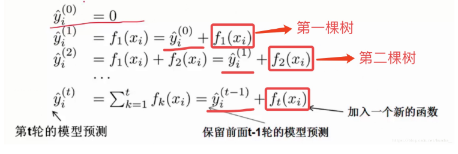

# XGBoost

## 算法思想

在决策树中，我们知道一个样本往左边分或者往右边分，最终到达叶子结点，这样来进行一个分类任务。 其实也可以做回归任务。

看上面一个图例左边：有5个样本，现在想看下这5个人愿不愿意去玩游戏，这5个人现在都分到了叶子结点里面，对不同的叶子结点分配不同的权重项，正数代表这个人愿意去玩游戏，负数代表这个人不愿意去玩游戏。所以我们可以通过叶子结点和权值的结合，来综合的评判当前这个人到底是愿意还是不愿意去玩游戏。上面「tree1」那个小男孩它所处的叶子结点的权值是+2（可以理解为得分）。

用单个决策树好像效果一般来说不是太好，或者说可能会太绝对。通常我们会用一种集成的方法，就是一棵树效果可能不太好，用两棵树呢？

看图例右边的「tree2」，它和左边的不同在于它使用了另外的指标，出了年龄和性别，还可以考虑使用电脑频率这个划分属性。通过这两棵树共同帮我们决策当前这个人愿不愿意玩游戏，小男孩在「tree1」的权值是+2，在「tree2」的权值是+0.9， 所以小男孩最终的权值是+2.9（可以理解为得分是+2.9）。老爷爷最终的权值也是通过一样的过程得到的。

所以说，我们通常在做分类或者回归任务的时候，需要想一想一旦选择用一个分类器可能表达效果并不是很好，那么就要考虑用这样一个集成的思想。上面的图例只是举了两个分类器，其实还可以有更多更复杂的弱分类器，一起组合成一个强分类器。

## XGBoost原理 

XGBoost的集成表示是什么？怎么预测？求最优解的目标是什么？看下图的说明你就能一目了然。

在XGBoost里，每棵树是一个一个往里面加的，每加一个都是希望效果能够提升，下图就是XGBoost这个集成的表示（核心)。

一开始树是0，然后往里面加树，相当于多了一个函数，再加第二棵树，相当于又多了一个函数...等等，这里需要保证加入新的函数能够提升整体对表达效果。提升表达效果的意思就是说加上新的树之后，目标函数（就是损失）的值会下降。

如果叶子结点的个数太多，那么过拟合的风险会越大，所以这里要限制叶子结点的个数，所以在原来目标函数里要加上一个惩罚项「omega(ft)」。

这里举个简单的例子看看惩罚项「omega(ft)」是如何计算的：

一共3个叶子结点，权重分别是2，0.1，-1，带入「omega(ft)」中就得到上面图例的式子，惩罚力度和「lambda」的值人为给定。

XGBoost算法完整的目标函数见下面这个公式，它由自身的损失函数和正则化惩罚项「omega(ft)」相加而成。

 

上图中的constant就是前t-1棵树的复杂度，再忍耐一会儿，我们就会知道如何衡量树的复杂度了，暂时忽略它。

假如我们使用的损失函数是MSE，那么上述表达式会变成这个样子：

这个式子非常漂亮，因为它含有f_t(x_i)的一次式和二次式，而且一次式项的系数是残差。你可能好奇，为什么有一次式和二次式就漂亮，因为它会对我们后续的优化提供很多方便，继续前进你就明白了。

注意：是什么？它其实就是的某个叶子节点的值。之前我们提到过，叶子节点的值是可以作为模型的参数的

但是对于其他的损失函数，我们未必能得出如此漂亮的式子，所以，对于一般的损失函数，我们需要将其作泰勒二阶展开，如下所示：

![n  obj(t) —  1  —hift2@i)] -4- Q(ft) -4- constant  2 ](file:///C:/Users/gaoming/AppData/Local/Temp/msohtmlclip1/01/clip_image009.png)

其中：

这里有必要再明确一下，和的含义。怎么理解呢？现有t-1棵树是不是？这t-1棵树组成的模型对第i个训练样本有一个预测值是不是？这个与第i个样本的真实标签肯定有差距是不是？这个差距可以用,)这个损失函数来衡量是不是？现在和的含义你已经清楚了是不是？

如果你还是觉得抽象，我们来看一个具体的例子，假设我们正在优化第11棵CART树，也就是说前10棵 CART树已经确定了。这10棵树对样本(=1)的预测值是=-1，假设我们现在是做分类，我们的损失函数是

![L(O) E [Yi In(l + e¯ji) + (I — yt•) In(l + eût)] ](XGBoost/clip_image013.png)

在=1时，损失函数变成了

我们可以求出这个损失函数对于的梯度，如下所示：

将 =-1代入上面的式子，计算得到-0.27。这个-0.27就是。该值是负的，也就是说，如果我们想要减小这10棵树在该样本点上的预测损失，我们应该沿着梯度的反方向去走，也就是要增大的值,使其趋向于正，因为我们的=1就是正的

来，答一个小问题，在优化第t棵树时，有多少个和要计算？嗯，没错就是各有N个，N是训练样本的数量。如果有10万样本，在优化第t棵树时，就需要计算出个10万个和。感觉好像很麻烦是不是？但是你再想一想，这10万个之间是不是没有啥关系？是不是可以并行计算呢？聪明的你想必再一次感受到了，为什么xgboost会辣么快！

好，现在我们来审视下这个式子，哪些是常量，哪些是变量。式子最后有一个constant项，聪明如你，肯定猜到了，它就是前t-1棵树的正则化项。(,)也是常数项。剩下的三个变量项分别是第t棵CART树的一次式，二次式，和整棵树的正则化项。再次提醒，这里所谓的树的一次式，二次式，其实都是某个叶子节点的值的一次式，二次式

我们的目标是让这个目标函数最小化，常数项显然没有什么用，我们把它们去掉，就变成了下面这样：

 

好，现在我们可以回答之前的一个问题了，为什么一次式和二次式显得那么漂亮。因为这些一次式和二次式的系数是和，而和可以并行地求出来。而且，和是不依赖于损失函数的形式的，只要这个损失函数二次可微就可以了。这有什么好处呢？好处就是xgboost可以支持自定义损失函数，只需满足二次可微即可。

 

## 模型正则化项

上面的式子已然很漂亮，但是，后面的Ω(ft)仍然是云遮雾罩，不清不楚。现在我们就来定义如何衡量一棵树的正则化项。这个事儿并没有一个客观的标准，可以见仁见智。为此，我们先对CART树作另一番定义，如下所示：

需要解释下这个定义，首先，一棵树有T个叶子节点，这T个叶子节点的值组成了一个T维向量w，q(x)是一个映射，用来将样本映射成1到T的某个值，也就是把它分到某个叶子节点，q(x)其实就代表了CART树的结构。w_q(x)自然就是这棵树对样本x的预测值了。

有了这个定义，xgboost就使用了如下的正则化项：

注意：这里出现了γ和λ，这是xgboost自己定义的，在使用xgboost时，你可以设定它们的值，显然，γ越大，表示越希望获得结构简单的树，因为此时对较多叶子节点的树的惩罚越大。λ越大也是越希望获得结构简单的树。

为什么xgboost要选择这样的正则化项？很简单，好使！效果好才是真的好。

 

## 见证奇迹的时刻

至此，我们关于第t棵树的优化目标已然很清晰，下面我们对它做如下变形，请睁大双眼，集中精力：

这里需要停一停，认真体会下。代表什么？它代表一个集合，集合中每个值代表一个训练样本的序号，整个集合就是被第t棵CART树分到了第j个叶子节点上的训练样本。理解了这一点，再看这步转换，其实就是内外求和顺序的改变。

进一步，我们可以做如下简化：

其中的和应当是不言自明了。

对于第t棵CART树的某一个确定的结构（可用q(x)表示），所有的和都是确定的。而且上式中各个叶子节点的值之间是互相独立的。上式其实就是一个简单的二次式，我们很容易求出各个叶子节点的最佳值以及此时目标函数的值

obj代表了什么呢？

它表示了这棵树的结构有多好，值越小，代表这样结构越好！也就是说，它是衡量第t棵CART树的结构好坏的标准。注意~注意~注意~，这个值仅仅是用来衡量结构的好坏的，与叶子节点的值可是无关的。为什么？请再仔细看一下obj的推导过程。obj只和和和T有关，而它们又只和树的结构(q(x))有关，与叶子节点的值可是半毛关系没有。如下图所示

Note：这里，我们对给出一个直觉的解释，以便能获得感性的认识。我们假设分到j这个叶子节点上的样本只有一个。那么，就变成如下这个样子：

这个式子告诉我们，的最佳值就是负的梯度乘以一个权重系数，该系数类似于随机梯度下降中的学习率。观察这个权重系数，我们发现，越大，这个系数越小，也就是学习率越小。越大代表什么意思呢？代表在该点附近梯度变化非常剧烈，可能只要一点点的改变，梯度就从10000变到了1，所以，此时，我们在使用反向梯度更新时步子就要小而又小，也就是权重系数要更小。

7、找出最优的树结构

好了，有了评判树的结构好坏的标准，我们就可以先求最佳的树结构，这个定出来后，最佳的叶子结点的值实际上在上面已经求出来了。

问题是：树的结构近乎无限多，一个一个去测算它们的好坏程度，然后再取最好的显然是不现实的。所以，我们仍然需要采取一点策略，这就是逐步学习出最佳的树结构。这与我们将K棵树的模型分解成一棵一棵树来学习是一个道理，只不过从一棵一棵树变成了一层一层节点而已。如果此时你还是有点蒙，没关系，下面我们就来看一下具体的学习过程。

我们以上文提到过的判断一个人是否喜欢计算机游戏为例子。最简单的树结构就是一个节点的树。我们可以算出这棵单节点的树的好坏程度obj。假设我们现在想按照年龄将这棵单节点树进行分叉，我们需要知道：

1、按照年龄分是否有效，也就是是否减少了obj的值

2、如果可分，那么以哪个年龄值来分。

为了回答上面两个问题，我们可以将这一家五口人按照年龄做个排序。如下图所示：

按照这个图从左至右扫描，我们就可以找出所有的切分点，即遍历所有分割，选择变化最大的作为最合适的分割。对每一个确定的切分点，我们衡量切分好坏的标准如下：

这个Gain实际上就是单节点的obj减去切分后的两个节点的树obj，Gain如果是正的，并且值越大，表示切分后obj越小于单节点的obj，就越值得切分。同时，我们还可以观察到，Gain的左半部分如果小于右侧的γ，则Gain就是负的，表明切分后obj反而变大了。γ在这里实际上是一个临界值，它的值越大，表示我们对切分后obj下降幅度要求越严。这个值也是可以在xgboost中设定的。

扫描结束后，我们就可以确定是否切分，如果切分，对切分出来的两个节点，递归地调用这个切分过程，我们就能获得一个相对较好的树结构。

注意：xgboost的切分操作和普通的决策树切分过程是不一样的。普通的决策树在切分的时候并不考虑树的复杂度，而依赖后续的剪枝操作来控制。xgboost在切分的时候就已经考虑了树的复杂度，就是那个γ参数。所以，它不需要进行单独的剪枝操作。

## 参考文献

[XGBoost——机器学习（理论+图解+安装方法+python代码）](https://blog.csdn.net/huacha__/article/details/81029680)
