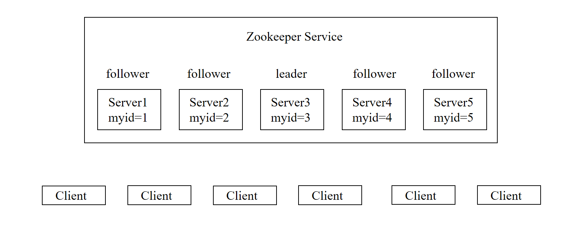
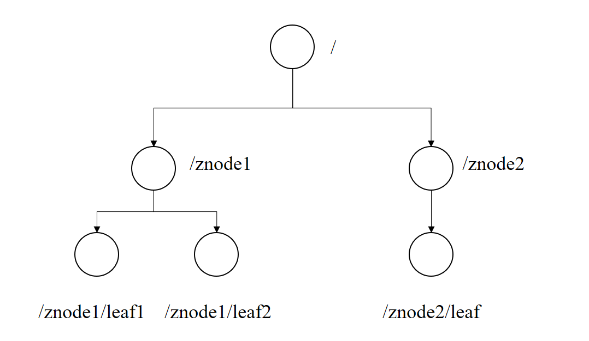
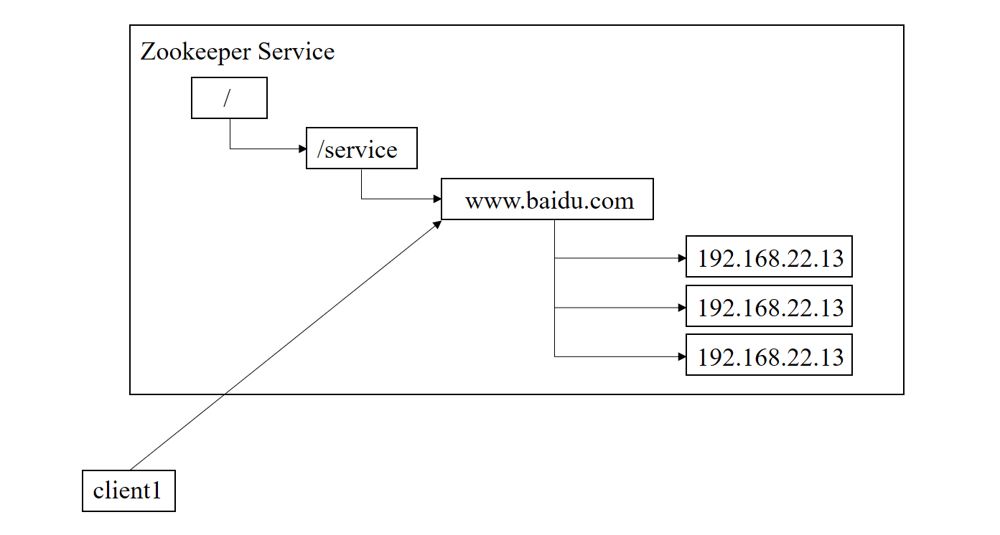
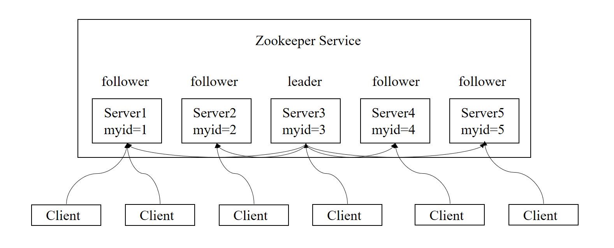
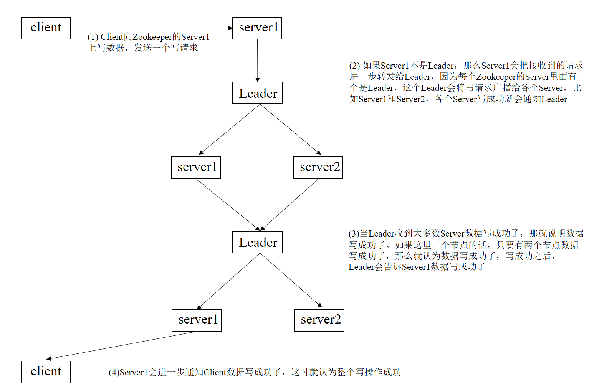

# ZooKeeper

## Zookeeper概述

`zookeeper`是一个开源的分布式的，为分布式应用提供协调服务的`Apache`项目

`Zookeeper`从涉及模式角度来理解：是一个基于观察者模式设计的分布式服务管理框架，它负责存储和管理大家都关心的数据，然后接受观察者的注册，一旦这些数据的状态发生变化，`zookeeper`就将负责通知已经在`zookeeper`上注册的那些观察者做出相应的反应。

> `Zookeeper` = 文件系统 + 通知机制

`zookeeper`配置多个实例共同构成一个集群对外提供服务以达到水平扩展的目的，每个服务器上的数据是相同的，每一个服务器均可以对外提供读和写的服务，这点和`redis`是相同的，即对客户端来讲每个服务器都是平等的

```java
public class Zookeeper {
    List<Server> servers = new ArrayList<>();
    List<Client> clients = new ArrayList<>();
    public void attach(Object o) {
        if (o instanceof Server) {
            servers.add((Server) o);
            notifyAllClient();
        } else if (o instanceof Client) {
            clients.add((Client) o);
        }
    }
    public void remove(Object o) {
        if (o instanceof Server) {
            servers.remove((Server) o);
            notifyAllClient();
        } else if (o instanceof Client) {
            clients.remove((Client) o);
        }
    }
    public void notifyAllClient() {
        for (Client client :
                clients) {
            client.update(servers);
        }
    }
}
```

```java
public abstract class Client {
    public List<Server> servers = new ArrayList<>();
    void update(List<Server> servers) {
        this.servers = servers;
    }
}
public class Client1 extends Client{}
public class Client2 extends Client{}
```

```java
public abstract class Server {
    void update() {}
    void handle() {}
}

public class Server1 extends Server {
    @Override
    public void update() {}
    @Override
    public void handle() {
        System.out.println("server1 handle");
    }
}

public class Server2 extends Server{
    @Override
    public void update() {}
    @Override
    public void handle() {
        System.out.println("server2 handle");
    }
}
```

```java
public class Test {
    public static void main(String[] args) {
        Zookeeper zookeeper = new Zookeeper();
        Client client1 = new Client1();
        Client client2 = new Client2();
        zookeeper.attach(client1);
        zookeeper.attach(client2);
        Server server1 = new Server1();
        Server server2 = new Server2();
        zookeeper.attach(server1);

        List<Server> servers = client1.servers;
        System.out.println(servers);
        zookeeper.attach(server2);
        servers = client1.servers;
        System.out.println(servers);
    }
}
```

## Zookeeper特点



> `Zookeeper`： 一个领导者（`Leader`），多个跟随着（`Follower`）组成的集群
>
> 集群中只要有半数以上节点存活，`Zookeeper`集群就能正常服务
>
> 全局数据一致，每个`Server`保存一份相同的数据副本，`Client`无论连接到哪个`Server`，数据都是一致的
>
> 更新请求顺序进行，来自同一个`Client`的更新请求按其发送的顺序依次执行
>
> 数据更新原子性，一次数据更新要么成功，要么失败（事务）
>
> 实时性，在一定时间范围内，`Client`能读到最新数据

## Zookeeper优点

> **最终一致性：**为客户端展示同一个视图，这是zookeeper里面一个非常重要的功能。
>
> **可靠性：**如果消息被一台服务器接受，那么它将被所有的服务器接受。
>
> **实时性：**Zookeeper不能保证两个客户端能同时得到刚更新的数据，如果需要最新数据，应该在读数据之前调用sync()接口。
>
> **独立性：**各个Client之间互不干预
>
> **原子性：**更新只能成功或者失败，没有中间状态
>
> **顺序性：**所有Server，同一消息发布顺序一致

## 数据结构

`Zookeeper`数据模型的结构于`Unix`文件系统很类似，整体上可以看作是一棵树，每个节点称作一个`ZNode`。每一个ZNode默认能够存储`1MB`的数据，每个`ZNode`都可以通过其路径的唯一标识



## 应用场景

提供的服务包括：统一命名服务，统一配置管理，统一集群管理，服务器节点动态上下线，软负载均衡等

### 统一命名服务

再分布式环境下，经常需要对应用/服务进行统一命名，便于识别，例如：`IP`不容易记住，而域名容易记住



### 统一配置管理

1. 分布式环境下，配置文件同步非常常见
   1. 一般要求一个集群中，所有节点的配置信息是一致的，比如`kafka`集群
   2. 对配置文件修改后，希望能够快速同步到各个节点上
2. 配置管理可交由`Zookeeper`实现
   1. 可将配置信息写入`Zookeeper`上的一个`Znode`
   2. 各个客户端服务器监听这个`Znode`
   3. 一旦再`Znode`中的数据被修改，`Zookeeper`将通知各个客户端服务器

### 统一集群管理

1. 分布式环境中，实时掌握每个节点的状态是必要的
   1. 可根据节点实时状态做出一些调整
2. `Zookeeper`可以实现实时监控节点状态变化
   1. 可将节点信息写入`Zookeeper`上的一个`ZNode`
   2. 监听这个`ZNode`可获取它的实时状态变化

### 服务器动态上下线

客户端实时洞察到服务器上线线的变化

### 软负载均衡

在`Zookeeper`中记录每台服务器的访问数，让访问数最少的服务器去处理最新的客户端请求

## 配置参数

`Zookeeper`的默认配置文件为`zookeeper/conf/zoo_sample.cfg`，需要将其修改为`zoo.cfg`

### tickTime

`Client-Server`通信心跳时间

`Zookeeper`服务器之间或客户端与服务器之间维持心跳的时间间隔，也就是每个`tickTime`时间就会发送一个心跳

`tickTime`以毫秒为单位

`tickTime=2000`

### initLimit

集群中的`follower`服务器（`F`）与`leader`服务器（`L`）之间初始连接时能容忍的最多心跳数（`tickTime`的数量）

`initLimit=5`

### syncLimit

`Leader-Follower`同步通信时限

集群中的`follower`服务器与`leader`服务器之间请求和应答之间能容忍的最多心跳数（`tickTime`的数量）

`syncLimit=2`

### dataDir

数据文件目录

`Zookeeper`保存数据的目录，默认情况下，`Zookeeper`将写数据的日志文件也保存在这个目录里

`dataDir=/home/michael/opt/zookeeper/data`

### clientPort

客户端连接`Zookeeper`服务器的端口，`Zookeeper`会监听这个端口，接受客户端的访问请求

`clientPort=2181`

### 服务器名称与地址

这个配置项的书写格式比较特殊，规则如下：

> server.N=YYY:A:B
>
> server.1=itcast05:2888:3888
> server.2=itcast06:2888:3888
> server.3=itcast07:2888:3888

### ZK为什么设置为奇数个

`zookeeper`有这样一个特性：集群中只要过半的机器是正常工作的，那么整个集群对外就是可用的。也就是说如果有`2`个`zookeeper`，那么只要`1`个死了`zookeeper`就不能用了，所以`2`个`zookeeper`的死亡容忍度为`0`，同理`3`个`zookeeper`的容忍度是`1`。规律，`2n`和`2n-1`的容忍度是一样的，都是`n-1`，所以为了更加高效，不需要增加不必要的`zookeeper`

## 内部原理

### 选举机制

1. 半数机制：集群中半数以上机器存活，集群可用。所以`Zookeeper`适合安装奇数台服务器
2. `Zookeeper`虽然在配置文件中并没有指定`Master`和`Slave`，但是`Zookeeper`工作时，是有一个节点为`Leader`，其他为`Follower`，`Leader`是通过内部的选举机制临时产生的

#### 全新集群选举

假设由五台服务器组成的Zookeeper集群，它们的id从1-5，同时它们都是最新启动的，也就是没有历史数据，在存放数据量这一点上，都是一样的。假设这些服务器依序启动



1. 服务器1启动，首先，会给自己投票，其次，发投票信息，由于其他机器还没有启动所以它无法接收到投票的反馈信息，因此服务器1的状态一直属于LOOKING状态
2. 服务器2启动，首先，会给自己投票，其次，在集群中启动Zookeeper服务的机器发起投票对比，与之前启动的服务器1交换结果，由于服务器2的编号大所以服务器2胜出，此时服务器1会把票投给服务器2，但此时服务器2的投票数没有大于半数（2<5/2），所以两个服务器的状态依然是LOOKING状态
3. 服务器3启动，首先，会给自己投票，同时与之前启动的服务器1,2交换信息，由于服务器3的编号最大所以服务器3胜出，那么服务器1和服务器2会把票投给服务器3，此时服务器3的投票数正好大于半数，所以服务器3成为领导者状态，服务器1,2成为追随者状态
4. 服务器4启动，首先，给自己投票，同时与之前启动的服务器1,2,3交换信息，尽管服务器4的编号大，但之前服务器3已经胜出，所以服务器4只能成为追随者状态
5. 服务器5启动，后面的逻辑同服务器4成为追随者状态

#### 非全新集群选举

对于运行正常的 `zookeeper` 集群，中途有机器 `down` 掉，需要重新选举时， 选举过程就需要加入数据 `ID`、服务器 `ID` 和逻辑时钟

- 数据 `ID`:数据新的 `version` 就大，数据每次更新都会更新 version
- 服务器 `ID`:就是我们配置的 `myid` 中的值，每个机器一个
- 逻辑时钟:这个值从 `0` 开始递增,每次选举对应一个值。 如果在同一次选举 中,这个值是一致的。 这样选举的标准就变成

1. 逻辑时钟小的选举结果被忽略，重新投票
2. 统一逻辑时钟后，数据 `id` 大的胜出
3. 数据 `id` 相同的情况下，服务器 `id` 大的胜出

简单的讲，非全新集群选举时是优中选优，保证Leader和Zookeeper集群中数据最完整，最可靠的一台服务器

### 选举机制中的概念

**Serverid：服务器ID**

比如有三台服务器，编号是`1，2，3`

> 编号越大在选择算法中的权重越大

**Zxid：数据ID**

服务器中存放的最大数据ID

> 值越大说明数据越新，在选举算法中数据越新权重越大

**Epoch：逻辑时钟**

投票的次数，同一轮投票过程中的逻辑时钟值是相同的。每投完一次票这个数据就会增加，然后与接收到的其他服务器返回的投票信息中的数值相比，根据不同的值做出不同的判断

**Server状态：选举状态**

> `LOOKING`：竞选状态
>
> `FOLLOWING`：随从状态，同步`leader`状态，参与投票
>
> `OBSERVING`，观察状态，同步`leader`状态，不参与投票
>
> `LEADING`：领导者状态

### 选举消息内容

在投票完成后，需要将投票信息发送给集群中的所有服务器，包含以下内容

> 服务器ID
>
> 数据ID
>
> 逻辑时钟
>
> 选举状态

### 选举流程


### 选举状态图

描述`Leader`选择过程中的状态变化，这是假设全部实例中均没有数据，假设服务器启动顺序分别为：`A,B,C`


### 节点类型

持久（`Persistent`）：客户端和服务器断开连接之后，创建的节点不删除

短暂（`Ephemeral`）：客户端和服务器端断开之后，创建的节点自己删除

（1）持久化目录节点

客户端与`Zookeeper`断开连接后，该节点依旧存在

（2）持久化顺序编号目录节点

客户端与`Zookeeper`断开连接后，该节点依旧存在，只是`Zookeeper`给该节点名称进行顺序编码

说明：创建`znode`时设置顺序标识，`znode`名称后会附加一个值，顺序号是一个单调递增的计数器，由父节点维护

【注意】在分布式系统中，顺序号可以被用于为所有的事件进行全局排序，这样客户端可以通过顺序号推断事件的顺序

（3）临时目录节点

客户端与`Zookeeper`断开连接后，该节点被删除

（4）临时顺序编号目录节点

客户端与`Zookeeper`断开连接后，该节点被删除，只是`Zookeeper`给该节点名称进行顺序编号

### Stat结构体

1. czxid-创建节点的事务zxid，每次修改Zookeeper状态都会收到一个zxid形式的时间戳，也就是Zookeeper事务ID。事务ID是Zookeeper中所有修改总的次序。每个修改都有唯一的zxid，如果zxid1小于zxid2，那么zxid1在zxid2之前发生
2. ctime-znode被创建的毫秒数
3. mzxid-znode最后更新的事务zxid
4. mtime-znode最有修改的毫秒数
5. pzixd-znode最后更新的子节点zxid
6. cversion-znode子节点变化号，znode子节点修改次数
7. dataversion-znode数据变化号
8. aclVersion-znode访问控制列表的变化号
9. ephemeralOwner-如果是临时节点，这个是znode拥有者的session id，如果不是临时节点则是0
10. dataLength-znode的数据长度
11. numChildren-znode子节点数量

### 监听器原理

1. 首先要有一个main()线程
2. 在main线程中创建Zookeeper客户端，这时就会创建两个线程，一个负责网络连接通信（connect），一个负责监听（listener）
3. 通过connect线程将注册的监听事件发送给Zookeeper
4. 在Zookeeper的注册监听器列表中将注册的监听事件添加到列表中
5. Zookeeper监听到有数据或路径变化，就会将这个消息发送给listener线程
6. listener线程内部调用了process()方法


```bash
常见监听：
1 监听节点数据的变化
get path[watch]

2 监听子节点增减的变化
ls path[watch]
```

### 写数据流程




