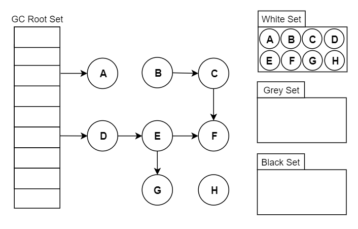
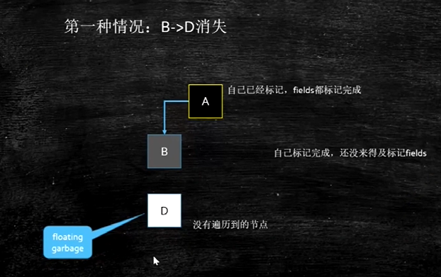
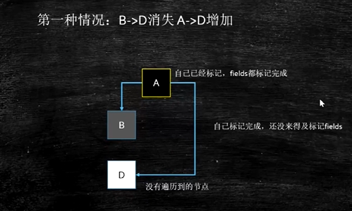
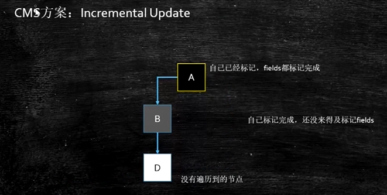
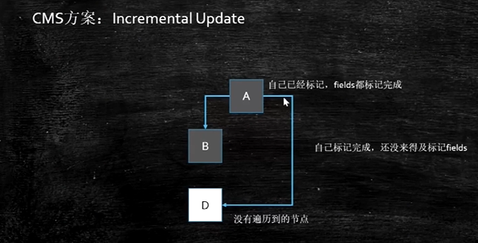
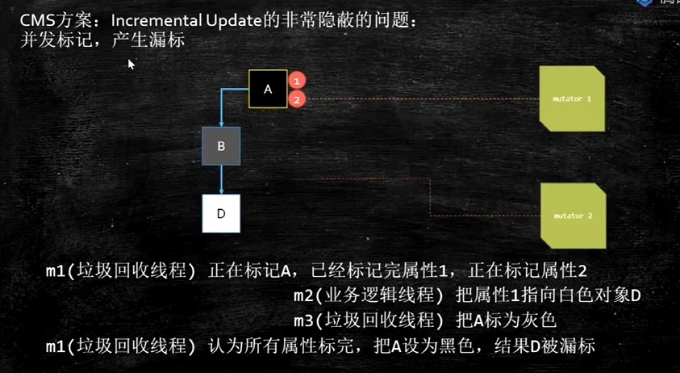
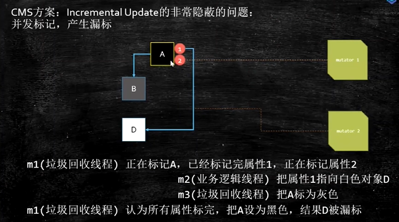
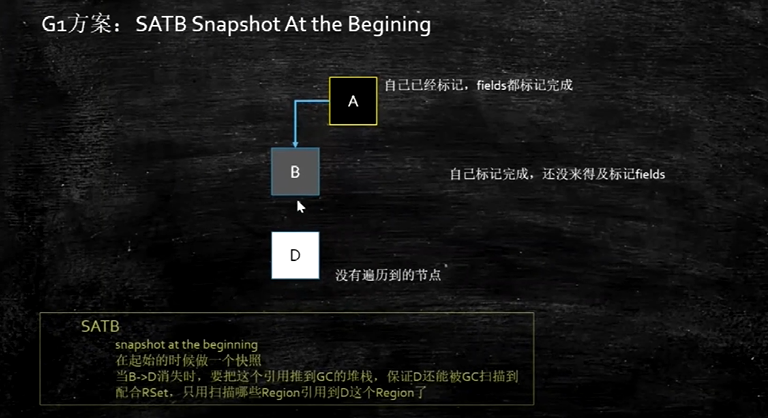
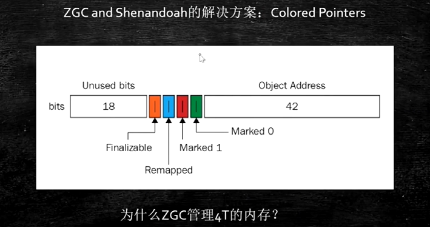

# 三色标记

白色：尚未访问过

黑色：本对象已经访问过，而且本对象引用到的其他对象也全部访问过了

灰色：本对象已经访问过，但是本对象引用到的其他对象尚未全部访问完，全部访问后，会转换为黑色

【流程】

1. 初始时，所有对象都标记为白色中
2. 将GC Roots直接引用到的对象标记为灰色
3. 从灰色集合中获取对象
   1. 将本对象引用到的其他对象全部标记为灰色
   2. 将本对象标记为黑色
4. 重复3，直至没有灰色标记的对象
5. 结束后，仍被标记为白色的对象即为GCRoots不可达，可以进行回收

当Stop The World （以下简称 STW）时，对象间的引用 是不会发生变化的，可以轻松完成标记

而当需要支持并发标记时，即标记期间应用线程还在继续跑，**对象间的引用可能发生变化**，**多标**和**漏标**的情况就有可能发生



## 浮动垃圾



1. A指向B，且A遍历完成，A标记为黑色，B标记为灰色
2. 开始遍历B指向的引用对象，D被标记为灰色
3. B->D的引用被断开，此时D应该时白色（而之前已经被标记为灰色）

最终的结果是：这部分对象仍会被标记为存活，即**本轮GC不会回收这部分内存**。

这部分本应该回收 但是 没有回收到的内存，被称之为“**浮动垃圾**”。浮动垃圾并不会影响应用程序的正确性，只是需要等到下一轮垃圾回收中才被清除

## 错误标记



B->D 消失 D被A引用 由于A之前已经是黑色的，后面就不会被标记了，所以D会被错误回收，**影响到了应用程序的正确性**

错误标记产生的原因：

1. 灰色对象断开了白色对象的引用
2. 黑色对象重新引用了该白色对象

从代码层面看：

```
var D = objB.fieldD; // 读D
objB.fieldD = null; // B指向D的引用指向null
objA.fieldD = D; // A重新指向D
```

我们只要在上面这三步中的任意一步中做一些“手脚”，**将对象D记录起来，然后作为灰色对象再进行遍历**即可

比如放到一个特定的集合，等初始的GC Roots遍历完（并发标记），该集合的对象 遍历即可（重新标记）

> **重新标记通常是需要STW的**，因为应用程序一直在跑的话，该集合可能会一直增加新的对象，导致永远都跑不完。当然，并发标记期间也可以将该集合中的大部分先跑了，从而缩短重新标记STW的时间，这个是优化问题了。

写屏障用于拦截第二和第三步；而读屏障则是拦截第一步

它们的拦截的目的很简单：就是在读写前后，将对象D给记录下来。

#### 写屏障（Store Barrier）

给某个对象的成员变量赋值时，其底层代码大概长这样：

```java
/**
* @param field 某对象的成员变量，如 D.fieldG
* @param new_value 新值，如 null
*/
void oop_field_store(oop* field, oop new_value) { 
    *field = new_value; // 赋值操作
} 
```

所谓的写屏障，其实就是指在赋值操作前后，加入一些处理（可以参考AOP的概念）：

```java
void oop_field_store(oop* field, oop new_value) {  
    pre_write_barrier(field); // 写屏障-写前操作
    *field = new_value; 
    post_write_barrier(field, value);  // 写屏障-写后操作
}
```

##### 写屏障 + SATB

当对象E的成员变量的引用发生变化时（`objE.fieldG = null;`），我们可以利用写屏障，将E**原来成员变量的引用**对象G记录下来：

```java
void pre_write_barrier(oop* field) {
    oop old_value = *field; // 获取旧值
    remark_set.add(old_value); // 记录 原来的引用对象
}
```

【当**原来成员变量的引用发生变化之前，记录下原来的引用对象**】

这种做法的思路是：**尝试保留开始时的对象图，即原始快照（Snapshot At The Beginning，SATB）**，当**某个时刻** 的GC Roots确定后，**当时**的对象图就已经确定了

比如 **当时** B是引用着D的，那后续的标记也应该是按照这个时刻的对象图走（B引用着D）。如果期间发生变化，则可以记录起来，保证标记依然按照原本的视图来

值得一提的是，扫描所有GC Roots 这个操作（即初始标记）通常是需要STW的，否则有可能永远都扫不完，因为并发期间可能增加新的GC Roots。

> SATB破坏了条件一：【灰色对象 断开了 白色对象的引用】，从而保证了不会漏标。

一点小优化：如果不是处于垃圾回收的并发标记阶段，或者已经被标记过了，其实是没必要再记录了，所以可以加个简单的判断：

```java
void pre_write_barrier(oop* field) {
  // 处于GC并发标记阶段 且 该对象没有被标记（访问）过
  if($gc_phase == GC_CONCURRENT_MARK && !isMarkd(field)) { 
      oop old_value = *field; // 获取旧值
      remark_set.add(old_value); // 记录  原来的引用对象
  }
}
```

##### 写屏障+增量更新

当对象A的成员变量的引用发生变化时（`objA.fieldD = D;`），我们可以利用写屏障，将A**新的成员变量引用**对象D记录下来

```java
void post_write_barrier(oop* field, oop new_value) {  
  if($gc_phase == GC_CONCURRENT_MARK && !isMarkd(field)) {
      remark_set.add(new_value); // 记录新引用的对象
  }
}
```

【**当有新引用插入进来时，记录下新的引用对象**】

这种做法的思路是：不要求保留原始快照，而是**针对新增的引用**，将其记录下来等待遍历，即增量更新（Incremental Update）。

增量更新破坏了条件二：【黑色对象 重新引用了 该白色对象】，从而保证了不会漏标。

##### 读屏障（Load Barrier）

```java
oop oop_field_load(oop* field) {
    pre_load_barrier(field); // 读屏障-读取前操作
    return *field;
}
```

读屏障是直接针对第一步：`var D = objB.fieldD;`，当读取成员变量时，一律记录下来：

```java
void pre_load_barrier(oop* field, oop old_value) {  
  if($gc_phase == GC_CONCURRENT_MARK && !isMarkd(field)) {
      oop old_value = *field;
      remark_set.add(old_value); // 记录读取到的对象
  }
}
```

这种做法是保守的，但也是安全的。因为条件二中【黑色对象 重新引用了 该白色对象】，重新引用的前提是：得获取到该白色对象，此时已经读屏障就发挥作用了

### CMS（写屏障+增量更新）

> 值得注意的是，CMS中使用的增量更新，在重新标记阶段，除了需要遍历 写屏障的记录，还需要重新扫描遍历GC Roots（当然标记过的无需再遍历了），这是由于CMS对于astore_x等指令不添加写屏障的原因，具体可参考[这里](https://links.jianshu.com/go?to=https%3A%2F%2Fhllvm-group.iteye.com%2Fgroup%2Ftopic%2F44529)。





重新将A标记成灰色，下一次扫描还会扫它的孩子节点

但是这种方案在并发标记的时候还是会产生漏标





核心：

在多线程标记的过程中，m1标记一个对象的多个引用时，之前标记的还会被其他线程重新引用到新的对象上，导致错误以为自己标记完成了。

即m1以为A应该是黑色的，但是A实际上是灰色的

所以，CMS的remark阶段，必须从头扫描一遍

CMS已经过时了

### G1（写屏障+SATB）

SATB

Snapshot At the Begining



把B->D的指针保存起来

### ZGC（读屏障）



## 参考文献

[三色标记法与读写屏障](https://www.jianshu.com/p/12544c0ad5c1)

