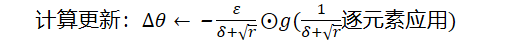
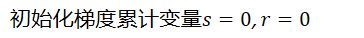

# 优化器

## 深度模型中的优化

寻找神经网络上的一组参数，它能显著地降低代价函数，该代价函数通常包括整个训练集上的性能评估和额外的正则化项。

通常，代价函数可写成训练集上的平均，如：

其中是每个样本的损失函数，是输入时所预测的输出，是经验分布。监督学习中，是目标输出。

机器学习算法的目标是降低

## 基本算法

### 随机梯度下降算法

在整个数据集上计算代价太大，因此可以从数据集中随机采集少量的样本，然后计算这些样本上的平均值

回想一下，**个样本均值的标准差是****，其中****是样本值真实的标准差，分母****表明使用更多的样本来估计梯度的方法是低于线性的。**例如：一个基于100的样本，一个基于10000的样本。后者需要的计算量是前者的100倍，却只降低了10倍的均值标准差。

 

另一个促使从小数目样本中获得梯度的统计估计的动机是**训练集的冗余**。在最坏的情况下，训练集中所有的m个样本都是彼此相同的拷贝。基于采样的梯度估计可以使用单个样本计算出正确的梯度，而比原来的做法少花了m倍的时间。

 

大多数用于深度学习的算法使用一个以上而又不是全部的训练样本。传统上，这些会被称为**小批量**或者**小批量随机**的方法，现在通常称为**随机**方法。**随机梯度算法（****SGD****）**及其变种是一般机器学习中应用最多的优化算法。如表所示，按照数据生成分布抽取m个小批量（独立同分布）样本，通过计算它们梯度均值，我们可以得到梯度的无偏估计。

| 算法 随机梯度下降（SGD）在第个训练迭代的更新 |
| ------------------------------------------------------------ |
| Require：学习率              |
| Require：初始参数            |
| while  停止准则未满足 do                                     |
| 从训练集中采包含个样本的小批量，其中 |
| 计算梯度估计：               |
| 应用更新：                   |
| end while                                                    |

**评价：**

**优点：**

SGD引入噪声，大量的理论和研究表明，只要噪声不是很大，SGD都能很好收敛。

应用大型数据集时，训练速度很快。

**缺点：**

引入噪声，使得梯度方向不一定正确

局部最优解问题

**噪声理解**

小批量是随机抽取重要的一点。从一组样本中计算出的梯度期望的无偏估计要求这些样本是独立的。

我们希望两个连续的梯度估计是相互独立的。

很多现实的数据集自然排列，从而使得连续的样本之间具有高度相关性。

例如：假设我们有一个很长的血液样本测试结果清单，清单上的数据有可能是这样获取的。前五个血液样本于不同的时间段取自第一个病人，接下来的3个血液样本取自第二个病人，再随后的血液样本取自第三个病人，等等。如果是顺序抽取样本，那么每一批数据都服从不同的分布。

SGD算法中一个关键参数是学习率，在实践中，我们有必要随着时间的推移逐渐降低学习率，因此我们将第步迭代的学习率记作

### 动量

虽然随机梯度下降算法是非常受欢迎的算法，但其学习过程有时会很慢。动量方法旨在加速学习，特别是处理高曲率、小但一致的梯度，或是带噪声的梯度。

**动量算法积累了之前梯度指数级衰减的移动平均，并且继续沿着该方向移动。**

动量（moment）通过引入一个新的变量 v 去积累之前的梯度（通过指数衰减平均得到），得到加速学习过程的目的。

| 算法 使用动量的随机梯度下降（SGD）                           |
| ------------------------------------------------------------ |
| Require：学习率，动量参数    |
| Require：初始参数，初始速度  |
| while  没有达到停止准则 do                                   |
| 从训练集中采包含个样本的小批量，其中 |
| 计算梯度估计：               |
| 计算速度更新：               |
| 应用更新：                   |
| end while                                                    |

从形式上看，动量算法引入了变量充当速度角色——它代表参数在参数空间移动的方向和速率。速度倍设为负梯度的指数衰减平均。

动量在物理上定义为质量乘以速度，在动量学习算法中，我们假设单位质量，因此速度向量也可以看作粒子的动量。超参数决定了之前梯度的贡献衰减得有多快。更新规则如下：

 

速度累计了梯度元素。

例如：

 =

同理

=

之前，步长只是梯度范数乘以学习率。现在，步长取决于梯度序列的大小和排列。当许多连续的梯度指向相同的方向时，步长最大。如果动量算法总是观测到梯度，那么它会在方向上不停加速，直到达到最终速度，其中步长大小为：

证明：动量算法总是观测到梯度，即

因此将动量超参数视为，例如=0.9对应着最大速度10倍于梯度下降算法

### Nesterov动量

受Nesterov加速梯度算法的启发，提出了动量算法的一个变种。这种情况的更新规则如下

 

标准更新规则

 

其中参数和发挥了和标准方法中类似的作用，两者的区别在于梯度计算上。Nesterov动量中，梯度计算在施加当前速度之后，因此，Nesterov动量可以解释为往标准动量方法中添加一个校正因子。（即先更新，再计算梯度，再更新）

| 算法 使用Nesterov动量的随机梯度下降（SGD）                   |
| ------------------------------------------------------------ |
| Require：学习率，动量参数    |
| Require：初始参数，初始速度  |
| while  没有达到停止准则 do                                   |
| 从训练集中采包含个样本的小批量，其中 |
| 应用临时更新：               |
| 计算梯度估计：               |
| 计算速度更新：               |
| 应用更新：                   |
| end while                                                    |

### 自适应学习率算法

神经网络研究员早就意识到学习率肯定是难以设置的超参数之一，因为它对模型的性能有显著的影响。动量算法可以在一定程度上缓解这些问题，但这样做的代价是引入了另一个超参数。因而如果我们相信方向敏感度在某种程度是轴对齐的，那么每个参数设置不同的学习率，在整个学习过程中自动适应这些学习率是有道理的。

#### AdaGrad算法

梯度下降算法、随机梯度下降算法（SGD）、小批量梯度下降算法、动量法、Nesterov动量法有一个共同的特点：对于每一个参数都用相同的学习率进行更新

但是在实际应用中，每个参数的重要性肯定是不一样的，所以我们对于不同的参数要动态的采取不同的学习率，让目标函数更快地收敛

**Adagrad算法能够在训练中自动的对学习率进行调整，对于出现频率较低参数采用较大的α更新；相反，对于出现频率较高的参数采用较小的α更新。**因此，Adagrad非常适合处理**稀疏数据。**

AdaGrad算法将每一个参数的每一次迭代的梯度取平方累加后再开方，用全局学习率除以这个数，作为学习率的动态更新

更新规则：

 

AdaGrad相当于增加了一个学习率递减系数

特殊之处在于这个递减系数由之前所有更新的反向梯度的平方和决定，可见，AdaGrad的学习率始终在减小

 

| 算法 AdaGrad算法                                             |
| ------------------------------------------------------------ |
| Require：全局学习率          |
| Require：初始参数            |
| Require：小常数，为了数值稳定大约设为 |
| 初始化梯度累积变量           |
| while  没有达到停止准则 do                                   |
| 从训练集中采包含个样本的小批量，其中 |
| 计算梯度：                   |
| 累积平方梯度：               |
| 计算更新：(逐元素应用)       |
| 应用更新：                   |
| end while                                                    |

 

 

**算法分析**

（1）从AdaGrad算法中可以看出，随着算法不断迭代，会越来越大，整体的学习率会越来越小。所以，一般来说AdaGrad算法一开始是激励收敛，到了后面就慢慢编程惩罚收敛，速度越来越慢。

（2）在SGD中，随着的增大，我们的学习步长应该是增大的。但是在AdaGrad中，随着梯度的增大，我们的也在逐渐的增大，且在梯度更新时在分母上，也就是整个学习率是减少的，这是为什么？

这是因为随着更新的次数增大，我们希望学习率越来越慢。因为我们认为在学习率的最初阶段，我们距离损失函数最优解还很远，随着更新次数的增加，越来越接近最优解，所以学习率也随之变慢。

（3）经验上已经发现，对于训练深度神经网络模型而言，从训练开始时积累梯度平方会导致有效学习率过早和过量的减小。AdaGrade在某些深度学习模型上效果不错，但不是全部。

 

更新公式理解

…

反向梯度的平方和决定

#### RMSProp算法

AdaGrad算法的衰减系数累计了所有更新步骤的梯度，我们可能希望考察最近几步的梯度来决定衰减系数。这就是RMSProp算法

RMSProp算法修改了AdaGrad的梯度积累为指数加权的移动平均，使得其在非凸设定下效果更好

| RMSProp算法                                                  |
| ------------------------------------------------------------ |
| Require：全局学习率，衰减速率 |
| Require：初始参数            |
| Require：小常数，为了数值稳定大约设为（用于小数被除时数值稳定） |
| 初始化梯度累计变量           |
| while  没有达到停止准则 do                                   |
| 从训练集中采包含个样本的小批量，其中 |
| 计算梯度：                   |
| 累计平方梯度：               |
| 计算更新：(逐元素应用)       |
| 应用更新：                   |
| end while                                                    |

 

| 使用Nesterov动量的RMSProp算法                                |
| ------------------------------------------------------------ |
| Require：全局学习率，衰减速率，动量系数 |
| Require：初始参数，初始参数  |
| 初始化梯度累计变量           |
| while  没有达到停止准则 do                                   |
| 从训练集中采包含个样本的小批量，其中 |
| 计算临时更新：               |
| 计算梯度：                   |
| 累计平方梯度：               |
| 计算速度更新：(逐元素应用)   |
| 应用更新：                   |
| end while                                                    |

 

####  Adam算法

首先，Adam中动量直接并入了梯度一阶矩（指数加权）的估计。其次，相比于缺少修正因子导致二阶矩估计可能在训练初期具有很高偏置的RMSProp，Adam包括偏置修正，修正从原点初始化的一阶矩（动量项）和（非中心的）二阶矩估计。

 在训练的最开始我们需要初始化梯度的累积量和梯度的平方累积量

 

| Adam算法                                                     |
| ------------------------------------------------------------ |
| Require：步长（建议默认为：0.001） |
| Require：矩估计的指数衰减速率，和在区间[0,1)内，建议默认为：0.9和0.999 |
| Require：用于数值稳定的小常数，建议默认为： |
| Require：初始参数            |
| 初始化梯度累计变量           |
| 初始化时间步                 |
| while  没有达到停止准则 do                                   |
| 从训练集中采包含个样本的小批量，其中 |
| 计算梯度：                   |
|                              |
| 更新有偏一阶矩估计：         |
| 更新有偏二阶矩估计：         |
| 修正一阶矩的偏差：           |
| 修正二阶矩的偏差：           |
| 计算更新：                   |
| 应用更新：                   |
| end while                                                    |

 

#### 牛顿法

牛顿法是基于二阶泰勒级数展开在某点附近来近似的优化方法，其忽略了高阶导数:

其中是相对于的Hessian矩阵在处的估计。如果我们再求解这个函数的临界点，将得到牛顿参数更新规则。

因此，对于局部的二次函数（具有正定的），用重新调整梯度，牛顿法会直接跳到极小值。如果目标函数是凸的但非二次的（有高阶项），该更新将是迭代的，得到和牛顿法相关的算法，如算法8.8所示。

对于非二次的表面，只要Hession矩阵保持正定，牛顿法能够迭代地应用。这意味着一个两步迭代过程。

首先，更新或计算Hession逆（通过更新二阶近似）

其次，根据更新参数

 

| 目标为的牛顿法              |
| ----------------------------------------------------------- |
| Require：初始参数           |
| Require：包含个样本的训练集 |
| while  没有达到停止准则 do                                  |
| 计算梯度：                  |
| 计算Hession矩阵：           |
| 计算Hession的逆：           |
| 计算更新：                  |
| 应用更新：                  |
| end while                                                   |

 

在深度学习中，目标函数的表面通常是非凸（有很多特征），如鞍点。因此牛顿法是有问题的。如果Hession矩阵的特征值并不都是正的。例如，靠近鞍点处，牛顿法实际上会导致更新朝错误的方向移动。这种情况可以通过正则化Hession矩阵来避免。常用的正则化策略包括在Hession矩阵对角线上增加常数，正则化更新变为：

这个正则化策略用于牛顿法的近似，例如Levenberg-Marquardt算法，只要Hession矩阵的负特征值仍然相对接近零，效果就会很好。在曲率方向更极端的情况下，的值必须足够大，以抵消负特征值。然而，如果持续增加，Hession矩阵会变得由主导，通过牛顿法所选择的方向会收敛到普通梯度除以。当很强的负曲率存在时，可能需要特别大，以至于牛顿法比选择合适学习率的梯度下降的步长更小。

除了目标函数的某些特征带来的挑战，如鞍点，牛顿法用于训练大型神经网络还受限于其显著的计算负担。Hession矩阵中的元素数目是参数数量的平方，因此，如果参数数目为（甚至是在非常小的神经网络中也可能是百万级别）。牛顿法需要计算矩阵的逆，计算复杂度为。另外，由于参数将每次更新都会改变，每次训练迭代都需要计算Hession矩阵的逆。其结果是，只有参数很少的网络才会在实际中用牛顿法训练。

 

## 优化器比较

 

 

三个自适应学习优化器Adagrad、RMSProp与AdaDelta的下降速度明显比SGD要快，其中，Adagrad和RMSProp齐头并进，要比AdaDelta要快。

两个动量优化器Momentum和NAG由于刚开始走了岔路，初期下降的慢；随着慢慢调整，下降速度越来越快，其中NAG到后期甚至超过了领先的Adagrad和RMSProp。

SGD和三个自适应优化器轨迹大致相同。两个动量优化器初期走了“岔路”，后期也调整了过来

## Tensorflow优化器

1. tf.train.GradientDescentOptimizer
2. tf.train.AdadeltaOptimizer
3. tf.train.AdagradOptimizer
4. tf.train.AdagradDAOptimizer
5. tf.train.MomentumOptimizer
6. tf.train.AdamOptimizer
7. tf.train.FtrlOptimizer
8. tf.train.ProximalGradientDescentOptimizer
9. tf.train.ProximalAdagradOptimizer
10. tf.train.RMSPropOptimizer