# 决策树

## 信息增益

### 熵

在物理界中**熵是描述事物无序性的参数，熵越大则越混乱**。信息论中熵是表示随机变量不确定性的度量，定义为信息的期望值。在明晰这个概念之前，我们必须知道信息的定义。如果待分类的事物可能划分在多个分类中，则符号的信息量定义为 其中，是选择该分类的概率。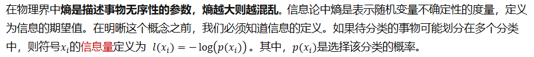

 

这个公式和是反比关系。也就是说一个事件的概率越大，它所蕴涵的信息越小。一个事件概率越小，它所蕴含的信息量就越大。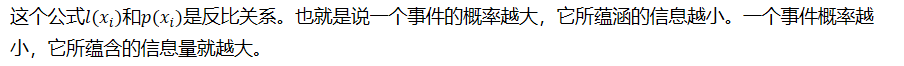

 

比如：我们听到女人能怀孕不奇怪，如果某一天听到哪个男人怀孕了，那这个信息量就很大了

 

为了计算信息熵（所有可能发生的事件的信息量的期望），我们需要计算所有类别所有可能值包含的信息期望值，通过下面的公式得到：

, 其中，n是分类的数目，H表示了X事件的不确定程度。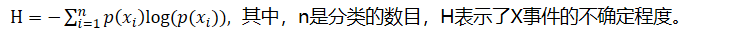

 

###  **条件熵**

在给定X的条件下，Y的条件概率分布的**熵的数学期望**。其公式推导如下：

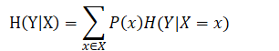

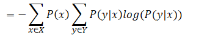

*=−∑8_(x∈X)▒∑8_(y∈Y)▒〖P(x,y)log⁡(P(y|x))〗*

条件熵表示在已知随机变量X的条件下随机变量Y的不确定性。注意，条件熵X也是一个变量，意思是在一个变量X的条件下（变量X的每一个值都会取到），另一个变量Y的熵对X的**期望**。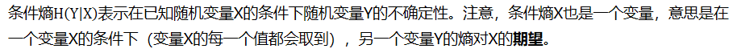

 

例如：如下数据

|      | 颜值 | 身高 | 追不追？ |
| ---- | ---- | ---- | -------- |
| 1    | 帅   | 高   | 追       |
| 2    | 帅   | 不高 | 追       |
| 3    | 不帅 | 高   | 不追     |

上表中，随机变量Y={追，不追}。P(Y=追)=2/3，P(Y=不追)=1/3，得到Y的熵为：

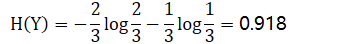

这里还有一个特征变量X，X={高，不高}。当X=高时，追的个数为1，占1/2，不追的个数为1，占1/2。此时：

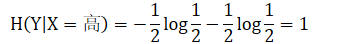

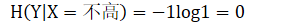

 

所以我们得到条件熵的计算公式：

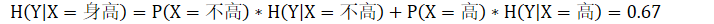

 

### 信息增益

当我们用另一个变量X对原变量Y分类后，原变量Y的不确定性就会减少（即熵值减少）。而熵值就是不确定性，不确定性程度减少了多少其实就是信息增益。这就是信息增益的由来，所以信息增益定义如下:

 

## 决策树（ID3算法）

例如：如下数据

| no  surfacing | flippers | label |
| ------------- | -------- | ----- |
| 1             | 1        | yes   |
| 1             | 1        | yes   |
| 1             | 0        | no    |
| 0             | 1        | no    |
| 0             | 1        | no    |

信息熵：看Label标签，其中‘yes’概率为0.4，‘no’的概率是0.6

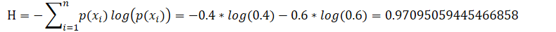

熵越高，则混合的数据也越多，我们可以在数据集中添加更多的分类，观察熵是如何变化的。

比如：我们减少类别‘yes’

| no  surfacing | flippers | label |
| ------------- | -------- | ----- |
| 1             | 1        | yes   |
| 1             | 0        | no    |
| 0             | 1        | no    |
| 0             | 1        | no    |

 

则*0.8112781244591328*

比如：我们增加类别yes

| no  surfacing | flippers | label |
| ------------- | -------- | ----- |
| 1             | 1        | yes   |
| 1             | 1        | yes   |
| 1             | 1        | yes   |
| 1             | 0        | no    |
| 0             | 1        | no    |
| 0             | 1        | no    |

则*1*

比如：只有一个类别yes

*H=0*

熵是数据的不确定程度，熵值越小，数据越稳定，熵值越大，数据越混乱。

数据的不确定程度最大（即熵值的最大值）为1，即所有类别等概率分布（log的底为类别数量）

而决策树的目的就是找到一系列特征对数据进行划分，从而使得子数据集熵值减少（同一个节点下的数据只属于一个类别或者熵值已经达到最小）。熵值减少的过程也就是信息增益的过程

例如：

| no  surfacing | flippers | label |
| ------------- | -------- | ----- |
| 1             | 1        | yes   |
| 1             | 1        | yes   |
| 1             | 0        | no    |
| 0             | 1        | no    |
| 0             | 1        | no    |

(1)如果我们以”no surfacing“特征划分数据，则可以划分“no surfacing”为1或者0。即

| flippers | label |
| -------- | ----- |
| 1        | yes   |
| 1        | yes   |
| 0        | no    |

和

| 1    | no   |
| ---- | ---- |
| 1    | no   |

则*0.9182958340544896*

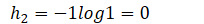

*H**=*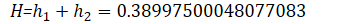

(2)如果我们以“flippers”特征划分数据，则可以划分“flippers”为1或者0。即

| no  surfacing | label |
| ------------- | ----- |
| 1             | yes   |
| 1             | yes   |
| 0             | no    |
| 0             | no    |

和

| no  surfacing | label |
| ------------- | ----- |
| 1             | no    |

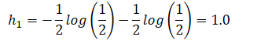

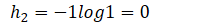

*H**=*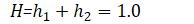

 

我们可以看到，如果以第一维度特征no surfacing为划分，则剩下的数据信息熵为0.9182958340544896，而以第二维度特征flippers划分数据，则剩下的数据信息熵为1.0。

 

我们刚才说到，信息熵是数据混乱程度的表达。我们希望以某个特征划分数据集之后能够得到稳定的数据，即信息熵小（信息增益大）的数据集。因此我们选择以第一个维度特征进行划分数据。

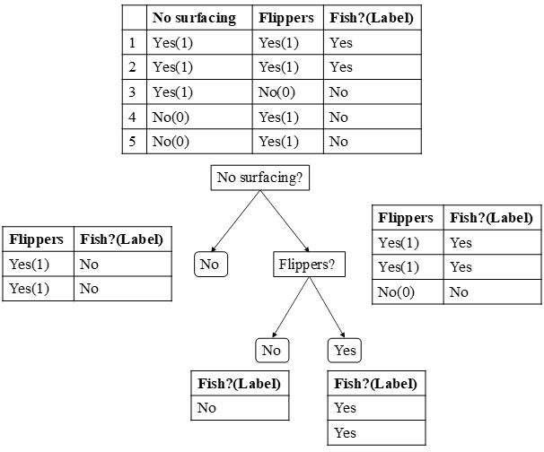

如图所示，对于原始数据集，我们可以选择“No surfacing”或者“Flippers”两个特征对其划分，通过计算我们发现，选择“No surfacing”的信息增益比选择“Flippers”的大。所以我们选择“No surfacing”作为特征划分。

 

数据集被划分为两部分，一部分（左边）的Label已经是一致的（都为No），不需要再划分。另一部分（右边）的Label不一致，因此我们再按照Flippers特征进行划分（这里只剩下一个，如果有多个，依旧要遍历所有剩余的特征，然后再计算每一个特征划分下的信息熵，取信息增益最大的特征作为划分依据）。

最后，所有的叶子节点都已经划分到一种类别上，或者所有的特征都已经作为了划分的依据，则结束。

 

## 决策树的学习过程

有了上述的介绍，我们了解了信息熵的计算，并且通过计算知道按照信息增益我们应该选择第一个维度对数据进行划分。

决策树的构建实质上就是上述过程的递归过程。

（1）对于原始数据，我们遍历每一个特征并按照特征值对数据集进行划分，计算每一个特征值下信息熵的大小，选择信息熵最小的特征划分，同时去掉该维度。

（2）将子数据集再次应用上述规则可以得到第二个划分的特征维度，并在划分之后删除。递归进行，知道所有的特征都遍历完或者所有节点下的类别属于同一类。

 

一颗决策树的生成过程主要分为以下3个部分

**（****1****）特征选择**

特征选择是指从训练数据中众多的特征中选择一个特征作为当前节点的分裂标准，如何选择特征有着很多不同的量化评估标准，从而衍生出不同的决策树算法。

**（****2****）决策树生成**

根据选择的特征评估标准，从上至下递归生成子节点，直到数据集不可分则决策树停止生长。树结构来说，递归结构是最容易理解的方式。

**（****3****）剪枝**

决策树容易过拟合，一般来说需要剪枝，缩小树结构规模，缓解过拟合。剪枝技术有预剪枝和后剪枝两种。

 

## 基于信息论的三种决策树算法

划分数据集的最大原则是：使得无序的数据变的有序。如果一个训练数据中有20个特征，那么选取哪一个特征作为划分的依据呢？

这就必须采用量化的方法来判断，量化划分方法有多重，其中一项就是“信息论度量信息分类”。

基于信息论的决策树算法有ID3、CART和C4.5等算法，其中C4.5和CART两种算法从ID3算法中演化而来。

### ID3

ID3算法由Ross Quinlan发明，建立在“奥卡姆剃刀”的基础上：越是小型的决策树越优于大的决策树（be simple简单理论）。上述文章内容就是ID3算法。

**ID3算法中根据信息论的信息增益评估和选择特征，每次选择信息增益最大的特征做判断模块。**

### C4.5

使用信息增益的话其实是有一个缺点，那就是它偏向于具有大量值的属性--就是说在训练集中，某个属性所取的不同值的个数越多，那么越有可能拿它来作为分裂属性，而这样做有时候是没有意义的，另外ID3不能处理连续分布的数据特征，于是就有了C4.5算法

C4.5是ID3的一个改进算法，继承了ID3算法的优点。C4.5算法用信息增益率（信息增益比）来选择属性，克服了用信息增益选择属性时偏向选择取值多的属性的不足在树构造过程中进行剪枝；能够完成对连续属性的离散化处理；能够对不完整数据进行处理。C4.5算法产生的分类规则易于理解、准确率较高；但效率低，因树构造过程中，需要对数据集进行多次的顺序扫描和排序。也是因为必须多次数据集扫描，C4.5只适合于能够驻留于内存的数据集。

 

#### 信息增益比

我们知道信息增益会偏向取值较多的特征，使用信息增益比可以对这一问题进行校正。

定义：特征A对训练数据集D的信息增益比GainRatio（D，A）与训练数据集D的经验熵H（D）之比：

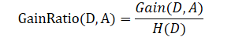

下面举一个例子说明C4.5的基本思想

| 天气 | 温度 | 湿度 | 风速 | 活动 |
| ---- | ---- | ---- | ---- | ---- |
| 晴   | 炎热 | 高   | 弱   | 取消 |
| 晴   | 炎热 | 高   | 强   | 取消 |
| 阴   | 炎热 | 高   | 弱   | 进行 |
| 雨   | 适中 | 高   | 弱   | 进行 |
| 雨   | 寒冷 | 正常 | 弱   | 进行 |
| 雨   | 寒冷 | 正常 | 强   | 取消 |
| 阴   | 寒冷 | 正常 | 强   | 进行 |
| 晴   | 适中 | 高   | 弱   | 取消 |
| 晴   | 寒冷 | 正常 | 弱   | 进行 |
| 雨   | 适中 | 正常 | 弱   | 进行 |
| 晴   | 适中 | 正常 | 强   | 进行 |
| 阴   | 适中 | 高   | 强   | 进行 |
| 阴   | 炎热 | 正常 | 弱   | 进行 |
| 雨   | 适中 | 高   | 强   | 取消 |

 

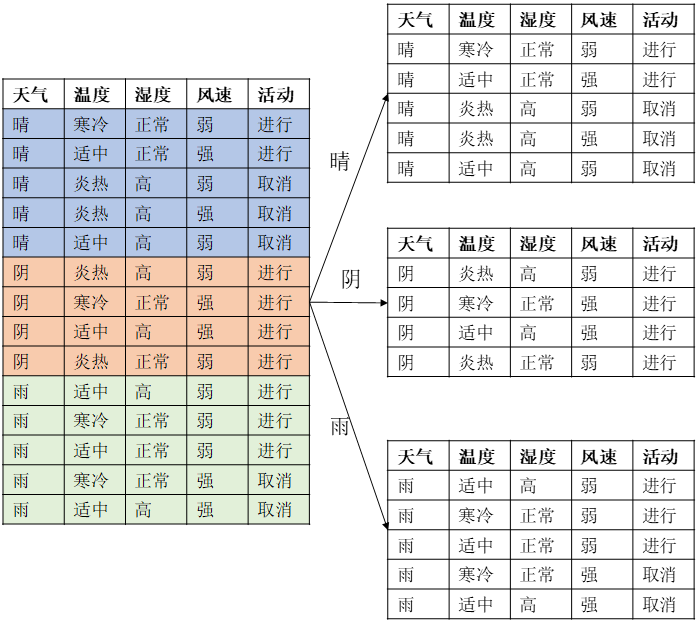

上述数据集有四个属性，属性集合A={ 天气，温度，湿度，风速}， 类别标签有两个，类别集合L={进行，取消}。

#### 计算类别信息熵

类别信息熵表示的是所有样本中各种类别出现的不确定性之和。根据熵的概念，熵越大，不确定性就越大，把事情搞清楚所需要的信息量就越多。

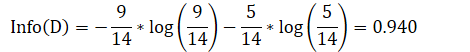

#### 计算每个属性的信息熵

每个属性的信息熵相当于一种条件熵。他表示的是在某种属性的条件下，各种类别出现的不确定性之和。属性的信息熵越大，表示这个属性中拥有的样本类别越不“纯”。

 

Info(天气) = 

Info(温度) = 

Info(湿度) = 

Info(风速) = 

 

#### 计算信息增益

信息增益= 熵 - 条件熵，在这里就是 类别信息熵 - 属性信息熵，它表示的是信息不确定性减少的程度。如果一个属性的信息增益越大，就表示用这个属性进行样本划分可以更好的减少划分后样本的不确定性，当然，选择该属性就可以更快更好地完成我们的分类目标。

信息增益就是ID3算法的特征选择指标

Gain(天气) = Info(D) - Info(天气) = 0.940-0.694=0.246

Gain(温度) = Info(D) - Info(温度) = 0.940-0.911=0.029 

Gain(湿度) = Info(D)-Info(湿度) = 0.940-0.789=0.15

Gain(风速) = Info(D) - Info(风速) = 0.940-0.892=0.048

但是我们假设这样的情况，每个属性中每种类别都只有一个样本，那这样属性信息熵就等于零，根据信息增益就无法选择出有效分类特征。所以，C4.5选择使用信息增益率对ID3进行改进。

#### 计算属性分裂信息度量

用分裂信息度量来考虑某种属性进行分裂时分支的数量信息和尺寸信息，我们把这些信息称为属性的内在信息(instristic information)。信息增益率用信息增益 / 内在信息，会导致属性的重要性随着内在信息的增大而减小（也就是说，如果这个属性本身不确定性就很大，那我就越不倾向于选取它），这样算是对单纯用信息增益有所补偿。

H(天气)=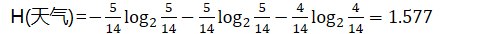

H(温度)=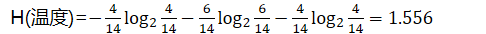

H(湿度)=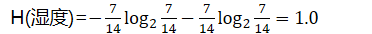

H(风速)=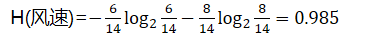

#### 计算信息增益率

IGR(天气)=Gain(天气)/H(天气)=0.246/1.577=0.155

IGR(温度)=Gain(温度)/H(温度)=0.029/1.556=0.0186

IGR(湿度)=Gain(湿度)/H(湿度)=0.029/1.556=0.151

IGR(风速)=Gain(风速)/H(风速)=0.048/0.985=0.048

 

天气的信息增益率最高，选择天气为分裂属性。发现分裂了之后，天气是“阴”的条件下，类别是”纯“的，所以把它定义为叶子节点，选择不“纯”的结点继续分裂。

 

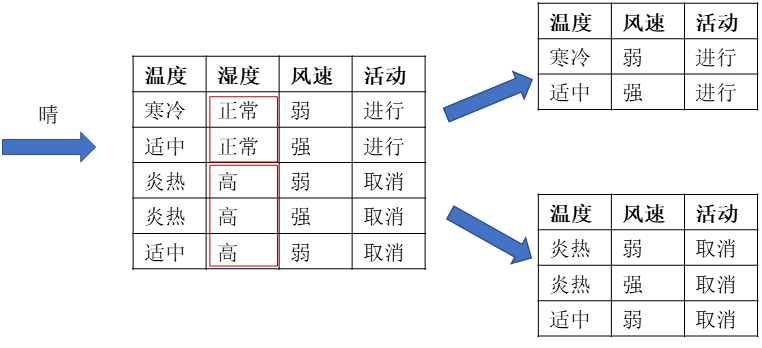

 

### CART

贪心算法的决策树，构建算法是ID3，即通过香农熵计算数据的混乱程度，然后求出信息增益，每次选择最大信息增益的划分方式，作为当前的划分方式，直到数据集完成划分，被划分过的特征在之后不会再有任何作用。所以这种划分方式被认为过于迅速，并且处理连续型数据时需要先离散化，这样可能会破坏连续型数据的内在性质。

另一种切分方式是二元切分法，即每次把数据切成两份。如果数据的某特征值等于切分所要求的值，那么这些数据就进入左子树，反之则进入右子树，这就是CART算法的思想。

CART（分类回归树）算法，该算法既可以用来分类还可以用来回归，所以很值得学习。下面首先使用CART算法构建回归树，并介绍如何为复杂的回归树剪枝（防止过拟合问题）。然后引入一种更高级的方法——模型树。最后对回归树、模型树、线性回归做一个预测（评估）。

模型树与回归树（在叶子节点使用各自的均值做预测）不同，该算法需要在每个叶子节点构建出一个线性模型。

一个核心递归伪代码：

找到最佳的待切分特征： 

如果该节点不能再分，将该节点存为叶节点 

执行二元切分 

在右子树继续调用该函数

在左子树继续调用该函数

[继续]原文链接：https://blog.csdn.net/qq_36523839/article/details/82080076

##  面试问题

### 回归决策树的输出是什么

单元内的均值

### 决策树使用什么指标进行划分

1. 信息增益
2. 信息增益比
3. 基尼指数（越小越好）

### 信息增益的定义是什么

定义：信息不确定性减少的程度

公式：

### 熵的定义什么，公式是什么

定义：随机变量的不确定性，信息的期望值。熵是数据的不确定程度，熵值越小，数据越稳定，熵值越大，数据越混乱。

公式：,