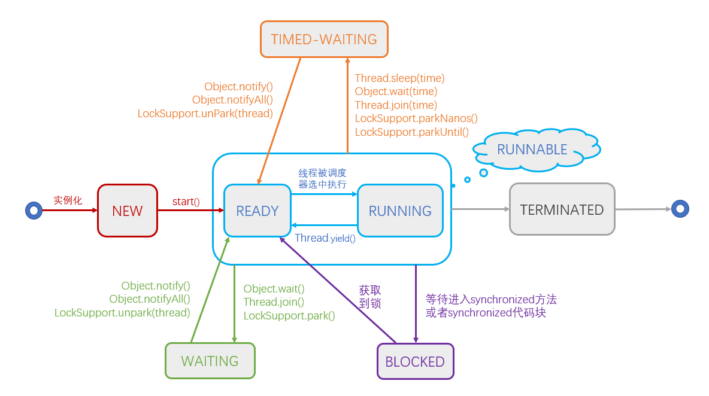

# 多线程-线程状态

## 线程的6种状态

```java
public enum State {
        /**
         * Thread state for a thread which has not yet started.
         */
        NEW,

        /**
         * Thread state for a runnable thread.  A thread in the runnable
         * state is executing in the Java virtual machine but it may
         * be waiting for other resources from the operating system
         * such as processor.
         */
        RUNNABLE,

        /**
         * Thread state for a thread blocked waiting for a monitor lock.
         * A thread in the blocked state is waiting for a monitor lock
         * to enter a synchronized block/method or
         * reenter a synchronized block/method after calling
         * {@link Object#wait() Object.wait}.
         */
        BLOCKED,

        /**
         * Thread state for a waiting thread.
         * A thread is in the waiting state due to calling one of the
         * following methods:
         * <ul>
         *   <li>{@link Object#wait() Object.wait} with no timeout</li>
         *   <li>{@link #join() Thread.join} with no timeout</li>
         *   <li>{@link LockSupport#park() LockSupport.park}</li>
         * </ul>
         *
         * <p>A thread in the waiting state is waiting for another thread to
         * perform a particular action.
         *
         * For example, a thread that has called <tt>Object.wait()</tt>
         * on an object is waiting for another thread to call
         * <tt>Object.notify()</tt> or <tt>Object.notifyAll()</tt> on
         * that object. A thread that has called <tt>Thread.join()</tt>
         * is waiting for a specified thread to terminate.
         */
        WAITING,

        /**
         * Thread state for a waiting thread with a specified waiting time.
         * A thread is in the timed waiting state due to calling one of
         * the following methods with a specified positive waiting time:
         * <ul>
         *   <li>{@link #sleep Thread.sleep}</li>
         *   <li>{@link Object#wait(long) Object.wait} with timeout</li>
         *   <li>{@link #join(long) Thread.join} with timeout</li>
         *   <li>{@link LockSupport#parkNanos LockSupport.parkNanos}</li>
         *   <li>{@link LockSupport#parkUntil LockSupport.parkUntil}</li>
         * </ul>
         */
        TIMED_WAITING,

        /**
         * Thread state for a terminated thread.
         * The thread has completed execution.
         */
        TERMINATED;
    }
```

1. `NEW` 线程被创建出来了，但是还没有`start()`
2. `RUNNABLE` 可运行状态，这个状态比较特殊，我在图中把这个状态拆分成了两部分：一部分是`READY`，顾名思义是准备状态，另一部分是`RUNNING`，即运行状态
   1. `READY` 准备状态，只能说明你有资格运行，单只要调度程序没有调度到你，你就永远是准备状态
   2. `RUNNING` 运行状态，线程调度程序从可运行池中选择一个线程作为当前线程时线程所处的状态
3. `BLOCKED` 阻塞状态是线程阻塞在进入`synchronized`关键字修饰的方法或代码块（获取锁）时的状态
4. `WAITING` 等待状态的线程不会被分配 `CPU` 执行时间，它们要等待被显式地唤醒，否则会处于无限期等待的状态
5. `TIMED_WAITING` 超时等待状态的线程不会被分配 `CPU` 执行时间，不过无须无限期等待被其他线程显示地唤醒，在达到一定时间后它们会自动唤醒。这是和上面的 `WAITING` 状态的区别
6. `TERMINATED` 终止状态，顾名思义，线程执行结束了

## 线程状态切换函数

`Thread.sleep`、`Thread.yeild`、`Object.wait`、`Thread.join`、`Object.notify/notifyAll`、`LockSupport.park/unpark/parkNanos/parkUtil`

`Thread.sleep(time)`：当前线程调用此方法，顾名思义，就是让当前线程进入`TIMED_WAITING`状态，睡眠固定的时间（但是不释放对象锁），到点后自动唤醒，进入准备状态。主要作用是给其他线程执行机会

`Thread.yield()`：当前线程调用此方法，放弃获取的`CPU`时间片，但不释放锁资源，由运行状态变为准备状态，让`OS`再次选择线程。实际中无法保证`yield()`达到让步目的，因为让步的线程还有可能被线程调度程序再次选中。它跟 `sleep`方法的区别在于不能指定暂停多少时间

`Object.wait()`：当前线程调用对象的`wait()`方法，当前线程释放对象锁，进入`WAITING` 状态。依靠`notify()/notifyAll()`来唤醒；而`wait(time)`方法的主要区别是进入 `TIMED_WAITING` 状态，到达时间后，自动唤醒

`Object.notify/notifyAll`：`notify()`唤醒在此对象监视器上等待的单个线程，选择是任意性的。`notifyAll()`唤醒在此对象监视器上等待的所有线程

`Thread.join()`：当前线程里调用其它线程`t`的`join()`方法，当前线程进入`WAITING`状态，当前线程不会释放已经持有的对象锁。线程`t`执行完毕，当前线程进入`RUNNABLE`状态。而`join(time)`方法的主要区别是当前线程进入 `TIMED_WAITING` 状态，到达时间后，进入`RUNNABLE`状态

`LockSupport.park()`：当前线程进入 `WAITING` 状态，需要通过`LockSupport.unpark(thread)`来唤醒

`LockSupport.parkNanos(nanos)/parkUntil(deadlines)`：当前线程进入`TIMED_WAITING`状态，需要通过``LockSupport.unpark(thread)`来唤醒

相比与`wait`方法，`LockSupport`不需要获得锁就可以让线程进入 `WAITING` 或者 `TIMED_WAITING` 状态

当然了，还有个 BLOCKED 状态，涉及到 `synchronized`关键字，由于这块也是面试经常会问到的，下一篇我会全面剖析一下`synchronized`



