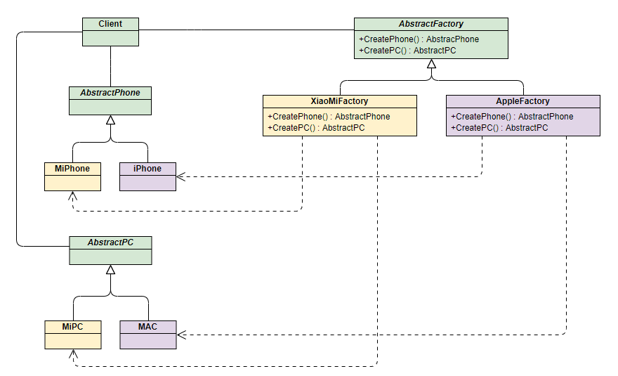

# 工厂模式

工厂顾名思义就是创建产品，根据产品是具体产品还是具体工厂可分为简单工厂模式和工厂方法模式，根据工厂的抽象程度可分为工厂方法模式和抽象工厂模式。该模式用于封装和管理对象的创建，是一种创建型模式。

## 简单工厂模式

该模式对对象创建管理方式最为简单，因为其仅仅简单的对不同类对象的创建进行了一层薄薄的封装。该模式通过向工厂传递类型来指定要创建的对象，其`UML`类图如下


```java
public interface Phone {
    void make();
}
```

```java
public class MiPhone implements Phone{
    @Override
    public void make() {
        System.out.println("make xiaomi phone");
    }
}
```

```java
public class IPhone implements Phone {
    @Override
    public void make() {
        System.out.println("make iphone");
    }
}
```

```java
public class PhoneFactory {
    public Phone makePhone(String phoneType) {
        if (phoneType.equalsIgnoreCase("MiPhone")) {
            return new MiPhone();
        } else if (phoneType.equalsIgnoreCase("iPhone")) {
            return new IPhone();
        }
        return null;
    }
}
```

```java
public class Demo {
    public static void main(String[] arg) {
        PhoneFactory factory = new PhoneFactory();
        Phone miPhone = factory.makePhone("MiPhone");            // make xiaomi phone!
        IPhone iPhone = (IPhone)factory.makePhone("iPhone");    // make iphone!
    }
}
```

## 工厂方法模式

和简单工厂模式中工厂负责生产所有产品相比，工厂方法模式将生成具体产品的任务分发给具体的产品工厂，其`UML`类图如下：


也就是定义一个抽象工厂，其定义了产品的生产接口，但不负责具体的产品，将生产任务交给不同的派生类工厂。这样不用通过指定类型来创建对象了。

其中和产品相关的`Phone`类、`MiPhone`类和`IPhone`类的定义不变

**AbstractFactory类**：生产不同产品的工厂的抽象类

```java
public interface AbstractFactory {
    Phone makePhone();
}
```

**XiaoMiFactory类**：生产小米手机的工厂（`ConcreteFactory1`）

```java
public class XiaoMiFactory implements AbstractFactory{
    @Override
    public Phone makePhone() {
        return new MiPhone();
    }
}
```

**AppleFactory类**：生产苹果手机的工厂（`ConcreteFactory2`）

```java
public class AppleFactory implements AbstractFactory {
    @Override
    public Phone makePhone() {
        return new IPhone();
    }
}
```

```java
public class Demo {
    public static void main(String[] arg) {
        AbstractFactory miFactory = new XiaoMiFactory();
        AbstractFactory appleFactory = new AppleFactory();
        miFactory.makePhone();            // make xiaomi phone!
        appleFactory.makePhone();        // make iphone!
    }
}
```

## 抽象工厂模式

上面两种模式不管工厂怎么拆分抽象，都只是针对一类产品**Phone**（`AbstractProduct`），如果要生成另一种产品`PC`，应该怎么表示呢？

最简单的方式是把**工厂方法模式**中介绍的工厂方法模式完全复制一份，不过这次生产的是`PC`。但同时也就意味着我们要完全复制和修改`Phone`生产管理的所有代码，显然这是一个笨办法，并不利于扩展和维护。

抽象工厂模式通过在`AbstarctFactory`中增加创建产品的接口，并在具体子工厂中实现新加产品的创建，当然前提是子工厂支持生产该产品。否则继承的这个接口可以什么也不干

其UML类图如下：


从上面类图结构中可以清楚的看到如何在工厂方法模式中通过增加新产品接口来实现产品的增加的

接下来我们继续通过小米和苹果产品生产的例子来解释该模式

为了弄清楚上面的结构，我们使用具体的产品和工厂来表示上面的UML类图，能更加清晰的看出模式是如何演变的：



**PC类**：定义PC产品的接口(`AbstractPC`)

```java
public interface PC {
    void make();
}
```

**MiPC类**：定义小米电脑产品(`MIPC`)

```java
public class MiPC implements PC {
    public MiPC() {
        this.make();
    }
    @Override
    public void make() {
        // TODO Auto-generated method stub
        System.out.println("make xiaomi PC!");
    }
}
```

**MAC类**：定义苹果电脑产品(MAC)

```java
public class MAC implements PC {
    public MAC() {
        this.make();
    }
    @Override
    public void make() {
        // TODO Auto-generated method stub
        System.out.println("make MAC!");
    }
}
```

下面需要修改工厂相关的类的定义：

**AbstractFactory类**：增加`PC`产品制造接口

```java
public interface AbstractFactory {
    Phone makePhone();
    PC makePC();
}
```

**XiaoMiFactory类**：增加小米`PC`的制造（`ConcreteFactory1`）

```java
public class XiaoMiFactory implements AbstractFactory{
    @Override
    public Phone makePhone() {
        return new MiPhone();
    }
    @Override
    public PC makePC() {
        return new MiPC();
    }
}
```

**AppleFactory类**：增加苹果`PC`的制造（`ConcreteFactory2`）

```java
public class AppleFactory implements AbstractFactory {
    @Override
    public Phone makePhone() {
        return new IPhone();
    }
    @Override
    public PC makePC() {
        return new MAC();
    }
}
```

```java
public class Demo {
    public static void main(String[] arg) {
        AbstractFactory miFactory = new XiaoMiFactory();
        AbstractFactory appleFactory = new AppleFactory();
        miFactory.makePhone();            // make xiaomi phone!
        miFactory.makePC();                // make xiaomi PC!
        appleFactory.makePhone();        // make iphone!
        appleFactory.makePC();            // make MAC!
    }
}
```

## 总结

上面介绍的三种工厂模式有各自的应用场景，实际应用时能解决问题满足需求即可，可灵活变通，无所谓高级与低级。

此外无论哪种模式，由于可能封装了大量对象和工厂创建，新加产品需要修改已定义好的工厂相关的类，因此对于产品和工厂的扩展不太友好，利弊需要权衡一下。

工厂方法：`FactoryMethod`，产品维度

抽象工厂：产品一族进行扩展，换皮肤等

## 参考文章

[设计模式之工厂模式（factory pattern）](https://www.cnblogs.com/yssjun/p/11102162.html)

