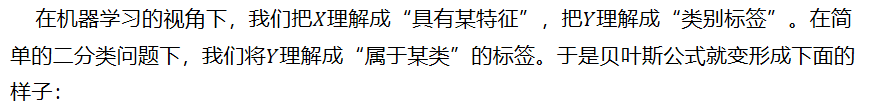
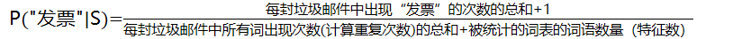

# 朴素贝叶斯

## 贝叶斯方法

长久以来，人们对一件事情发生或不发生的概率，只有固定的0和1，即要么发生，要么不发生，从来不会去考虑某件事情发生的概率有多大，不发生的概率又是多大。而且概率虽然未知，但最起码是一个确定的值。

比如如果问那时的人们一个问题：“有一个袋子，里面装着若干个白球和黑球，请问从袋子中取得白球的概率是多少？”他们会想都不用想，会立马告诉你，取出白球的概率就是1/2，要么取到白球，要么取不到白球，即θ只能有一个值，而且不论你取了多少次，取得白球的概率θ始终都是1/2，即不随观察结果X 的变化而变化。

这种频率派的观点长期统治着人们的观念，但是：

假设我们有如下的7个球在A,B两个框中，如果我们随便取一个球，已知取到的球来自B框中，那么这个球是白球的概率是多少呢？或者问取出的球是白色，那么取自B框的概率是多少呢？

这个问题不是很好解决，直到后来一个名叫Thomas Bayes的人物出现。

### 贝叶斯方法的提出

  托马斯·贝叶斯Thomas Bayes（1702-1763）发表了一篇名为“An essay towards solving a problem in the doctrine of chances”，翻译过来则是：机遇理论中一个问题的解。论文发表后，在当时并未产生多少影响，在20世纪后，这篇论文才逐渐被人们所重视。

  回到上面的例子：“有一个袋子，里面装着若干个白球和黑球，请问从袋子中取得白球的概率θ是多少？”贝叶斯认为取得白球的概率是个不确定的值，因为其中含有机遇的成分。比如，一个朋友创业，你明明知道创业的结果就两种，即要么成功要么失败，但你依然会忍不住去估计他创业成功的几率有多大？你如果对他为人比较了解，而且有方法、思路清晰、有毅力、且能团结周围的人，你会不由自主的估计他创业成功的几率可能在80%以上。这种不同于最开始的“非黑即白、非0即1”的思考方式，便是贝叶斯式的思考方式。

  继续深入讲解贝叶斯方法之前，先简单总结下频率派与贝叶斯派各自不同的思考方式：

  频率派：

  频率派把需要推断的参数θ看做是固定的未知常数，即概率θ虽然是未知的，但最起码是确定的一个值，同时，样本X 是随机的，所以频率派重点研究样本空间，大部分的概率计算都是针对样本X 的分布；

  贝叶斯派：

  而贝叶斯派的观点则截然相反，他们认为参数θ是随机变量，而样本X 是固定的，由于样本是固定的，所以他们重点研究的是参数θ的分布。

贝叶斯派既然把θ看做是一个随机变量，所以要计算θ的分布，便得事先知道θ的无条件分布，即在有样本之前（或观察到X之前），θ有着怎样的分布呢？

  比如往台球桌上扔一个球，这个球落会落在何处呢？如果是不偏不倚的把球抛出去，那么此球落在台球桌上的任一位置都有着相同的机会，即球落在台球桌上某一位置的概率服从均匀分布。这种在实验之前定下的属于基本前提性质的分布称为先验分布，或的无条件分布。

  至此，贝叶斯及贝叶斯派提出了一个思考问题的固定模式：

先验分布 π(θ)+ 样本信息x⇒ 后验分布π(θ|x)

上述思考模式意味着，新观察到的样本信息将修正人们以前对事物的认知。换言之，在得到新的样本信息之前，人们对的认知是先验分布 π(θ)，在得到新的样本信息后x，人们对θ的认知为π(θ|x)。

   综合起来看，则好比是人类刚开始时对大自然只有少得可怜的先验知识，但随着不断是观察、实验获得更多的样本、结果，使得人们对自然界的规律摸得越来越透彻。所以，贝叶斯方法既符合人们日常生活的思考方式，也符合人们认识自然的规律，经过不断的发展，最终占据统计学领域的半壁江山，与经典统计学分庭抗礼。

### 贝叶斯定理

  在引出贝叶斯定理之前，先学习几个定义：

  边缘概率（又称先验概率）：某个事件发生的概率。边缘概率是这样得到的：在联合概率中，把最终结果中那些不需要的事件通过合并成它们的全概率，而消去它们（对离散随机变量用求和得全概率，对连续随机变量用积分得全概率），这称为边缘化（marginalization），比如A的边缘概率表示为P(A)，B的边缘概率表示为P(B)。

  联合概率表示两个事件共同发生的概率。A与B的联合概率表示为P(A∩B)或者P(A,B)。

  条件概率（又称后验概率）：事件A在另外一个事件B已经发生条件下的发生概率。条件概率表示为P(A|B)，读作“在B条件下A的概率“。

  接着，考虑一个问题：P(A|B)是在B发生的情况下A发生的可能性。

  首先，事件B发生之前，我们对事件A的发生有一个基本的概率判断，称为A的先验概率，用P(A)表示；

  其次，事件B发生之后，我们对事件A的发生概率重新评估，称为A的后验概率，用P(A|B)表示；

  类似的，事件A发生之前，我们对事件B的发生有一个基本的概率判断，称为B的先验概率，用P(B)表示；

  同样，事件A发生之后，我们对事件B的发生概率重新评估，称为B的后验概率，用P(B|A)表示。

  贝叶斯定理便是基于下述贝叶斯公式：

  而它其实是由以下的联合概率公式推导出来的：

其中是先验概率，是后验概率，是联合概率。

 

## 用机器学习的视角理解贝叶斯公式

  在机器学习的视角下，我们把理解成“具有某特征”，把理解成“类别标签”。在简单的二分类问题下，我们将理解成“属于某类”的标签。于是贝叶斯公式就变形成下面的样子：

  而我们二分类问题的最终目的就是要判断是否大于1/2就够了。贝叶斯方法把计算“具有某特征的条件下属于某类”的概率转换成需要计算“属于某类的条件下具有某特征”的概率，而后者获取的方法就简单多了。

  我们只需要找到一些包含已知特征标签的样本，即可进行训练。而样本的类别标签都是明确的，所以贝叶斯方法在机器学习里属于有监督学习方法。

  补充：一般“先验概率”和“后验概率”是相对出现的，比如与是关于的先验概率与后验概率。与是关于的先验概率和后验概率。

## 垃圾邮件分类

  举个例子，我们现在要对邮件进行分类，识别垃圾邮件和普通邮件，如果我们选择使用朴素贝叶斯分类器，那目标就是判断是否大于1/2。现在我们假设有垃圾邮件和正常邮件各1万封作为训练集。需要判断以下邮件是否属于垃圾邮件。

“我司可办理正规发票（保真）17%增值税发票点数优惠”

也就是判断概率是否大于1/2。

 

  训练集是有限的，而句子的可能性是无限的。我们不拿句子作为特征，而是拿句子里面的词语作为特征去考虑。

"我","司","可","办理","正规发票","保真","增值税","发票","点数","优惠"

  于是贝叶斯公式就变成了：

=

 

  同理

=

 

### 条件独立假设

  概率依旧不好求解，我们引入一个很朴素的近似。为了让公式显得更加紧凑，我们令字母S表示垃圾邮件，字母H表示正常邮件。近似公式如下：

=P("我"|S)P("司"|S)P("可"|S)P("办理"|S)P("正规发票"|S)…P("优惠"|S)

  这就是条件独立假设

 

  其中P("优惠"|S)=

  这样，式子中的每一项都特别好求。只需要分类统计各类邮件中该关键字出现的概率就可以。统计次数非常方便，而且样本数量足够大，算出来的概率比较接近真实。

 

## 朴素贝叶斯（Naïve Bayes） Naive在何处

  加上条件独立假设的贝叶斯方法就是朴素贝叶斯方法。

  Naive的意思是“朴素的”，“幼稚的”，“愚蠢的”，大神们取名说该方法是一种比较蠢的方法，为什么？

 

  将句子中的"正规发票"调换以下顺序，就变成了一个新的句子。新句子与旧句子的意思完全不同。但由于乘法交换律，朴素贝叶斯方法中算出来二者的条件概率完全一样。

 

  也就是说，朴素贝叶斯失去了词语之间的顺序关系。这就相当于把所有的词汇扔进一个袋子里随便搅和，贝叶斯认为他们一样。因此这种情况也称作词袋模型

  词袋模型与人们的日常经验完全不同。比如，在条件独立假设的情况下，“武松打死了老虎”和“老虎打死了武松”被它认作一个意思。

 

## 处理重复词语的三种方式

  我们之前处理垃圾邮件向量中

  "我","司","可","办理","正规发票","保真","增值税","发票","点数","优惠"

其中，每个词都不重复，而在现实生活中其实很少见。因为如果文本长度增加，或者分词方法改变，必然会有许多词重复出现，因此需要对这种情况进行进一步探讨。

  比如以下邮件：

  "代开发票","增值税发票","正规发票"

  分词之后的向量为：

  "代开","发票","增值税","发票","正规","发票"

 

### 多项式模型

  如果我们考虑重复词语的情况，也就是说，重复的词语我们视为其出现多次，直接按条件独立假设的方式推导，则有：

P("代开","发票","增值税","发票","正规","发票"|S)

=P("代开"|S)P("增值税"|S)P("正规"|S)

  在计算时，每个被统计的垃圾邮件样本中重复的词语也统计了多次。

=

  这个结果中，有些概率出现次方的形式（多次乘积），被称为多项式模型

### 伯努利模型

  另一种更加简化的方法是将重复的词语都视为其只出现1次

P("代开","发票","增值税","发票","正规","发票"|S)

=P("代开"|S)P("增值税"|S)P("正规"|S)

 

  统计计算时也是如词

=

  这样的模型叫做伯努利模型（又称为二项独立模型）。这种方式更加简化与方便。当然丢失了词频的信息，因此效果可能会差一些。

 

### 混合模型

  第三种方式是在计算句子概率时，不考虑重复词语出现的次数，但是在统计计算词语的概率时，却考虑重复词语的出现次数，这样的模型可以叫做混合模型

 

## 朴素贝叶斯学习与分类

### 基本方法

### 极大似然估计

 

 

## 贝叶斯估计（平滑技术）

  计算以下条件假设概率时

P("我","司","可","办理","正规发票"|S)

=P("我"|S)P("司"|S)P("可"|S)P("办理"|S)P("正规发票"|S)

 

  我们扫描一下训练集，发现“正规发票”这个词从来没有出现过。于是，P("正规发票"|S)=0,问题严重了，整个概率都变成0了。朴素贝叶斯方法面对一堆的0，失效了。因为训练集哪怕再大，也可能有覆盖不了的词语。本质上还是样本数量太少，不满足大数定律，计算出来的概率失真。

 

  一种分析思路是直接不考虑这样的词语，但是这种方法默认给P("正规发票"|S)赋值为1，其实效果不好，大量的统计信息给浪费了。

  进一步分析，既然可以默认赋值为1，为什么不能默认赋值一个很小的数。这就是平滑技术的基本思路。

 

### 拉普拉斯平滑

拉普拉斯平滑

=

 

7.2 贝叶斯估计

  用极大似然估计可能会出现所要估计的概率值为0的情况，这时会影响到后验概率的计算结果，使分类产生偏差。解决这一问题的方法是采用贝叶斯估计。

式子中.等价于在随机变量各个取值的频数上赋予一个整数。但时，就是极大似然估计。常取，这时被成为拉普拉斯平滑。

 

同理，先验概率的贝叶斯估计是：

## 参考文献

[贝叶斯公式由浅入深大讲解—AI基础算法入门](https://www.cnblogs.com/zhoulujun/p/8893393.html)