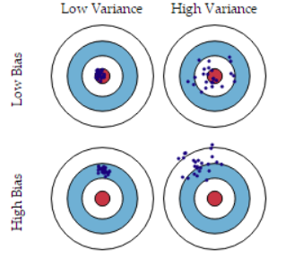

# 机器学习基础

## 代价函数

### 损失函数，代价函数，目标函数定义

- 损失函数`Loss Function`是定义在单个样本上的，算的是一个样本的误差。
- 代价函数`Cost Function`是定义在整个训练集上的，是所有样本误差的平均，也就是损失函数的平均。
- 目标函数`Object Function`定义为：最终需要优化的函数。等于经验风险+结构风险（也就是`Cost Function` + 正则化项）。

### 为什么代价函数要非负

目标函数存在一个下界，在优化过程当中，如果优化算法能够使目标函数不断减小，根据 单调有界准则，这个优化算法就能证明是收敛有效的。 只要设计的目标函数有下界，基本上都可以，代价函数非负更为方便。

### 常见代价函数

#### 二次代价函数

其中，`J` 表示代价函数，`x`表示样本，`y`表示实际值，`a`表示输出值，`n`表示样本的总数。 使用一个样本为例简单说明，此时二次代价函数为： 

假如使用梯度下降法`(Gradient descent`)来调整权值参数的大小，权值`w`和偏置`b`的梯度推 导如下

其中，`z`表示神经元的输入，`sigma`表示激活函数。权值`w`和偏置`b`的梯度跟激活函数的梯度 成正比，激活函数的梯度越大，权值`w`和偏置`b`的大小调整得越快，训练收敛得就越快。 

神经网络常用的激活函数为`sigmoid`函数，该函数的曲线如下所示：

假设目标是收敛到`1.0`。`0.82`离目标比较远，梯度比较大，权值调整比较大。`0.98` 离目标比较近，梯度比较小，权值调整比较小。调整方案合理。 假如目标是收敛到`0`。`0.82`目标比较近，梯度比较大，权值调整比较大。`0.98`离目标比较远，梯度比较小，权值调整比较小。调整方案不合理。 原因：初始的代价（误差）越大，导致训练越慢。

#### 交叉熵代价函数

![— E [y In a + (I — — a)] ](机器学习基础/clip_image005.png)

其中，`J`表示代价函数，`x`表示样本，`y`表示实际值，`a`表示输出值，`n`表示样本的总数。 权值`w`和偏置`b`的梯度推导如下： 

当误差越大时，梯度就越大，权值`w`和偏置`b`调整就越快，训练的速度也就越快。 **二次代价函数适合输出神经元是线性的情况，交叉熵代价函数适合输出神经元是** **S** **型函数的情况。**

 

#### 对数似然代价函数

对数释然函数常用来作为`softmax` 回归的代价函数。深度学习中普遍的做法是将`softmax`作为最后一层，此时常用的代价函数是对数释然代价函数。 对数似然代价函数与`softmax`的组合和交叉熵与`sigmoid`函数的组合非常相似。对数释然代价函数在二分类时可以化简为交叉熵代价函数的形式。

在`tensorflow`中： 

与`sigmoid`搭配使用的交叉熵函数：`tf.nn.sigmoid_cross_entropy_with_logits()`。 

与`softmax`搭配使用的交叉熵函数：`tf.nn.softmax_cross_entropy_with_logits()`。

### 为什么用交叉熵代替二次代价函数

#### 为什么不用二次方代价函数

权值`w`和偏置`b`的偏导数为

偏导数受激活函数的导数影响，`sigmoid` 函数导数在输出接近 `0` 和 `1` 时非常小，会导致一些实例在刚开始训练时学习得非常慢。

 

#### 为什么要用交叉熵 

交叉熵函数权值`w`和偏置`b`的梯度推导为：

由以上公式可知，权重学习的速度受到`sigma(z) - y` 的影响，更大的误差，就有更快的学习速度，避免了二次代价函数方程中因`sigma'(z)`导致的学习缓慢的情况。

## 损失函数

### 什么是损失函数？

损失函数（`Lossfunction`）又叫做误差函数，用来衡量算法的运行情况，估量模型的预测值与真实值Y的不一致程度，是一个非负实值函数,通常使用来表示，损失函数越小，模型的鲁棒性就越好。 损失函数是经验风险函数的核心部分，也是结构风险函数重要组成部分。

### 常见的损失函数

机器学习通过对算法中的目标函数进行不断求解优化，得到最终想要的结果。分类和回归问题中，通常使用损失函数或代价函数作为目标函数。 损失函数用来评价预测值和真实值不一样的程度。通常损失函数越好，模型的性能也越好。 损失函数可分为经验风险损失函数和结构风险损失函数。经验风险损失函数指预测结果和实际结果的差别，结构风险损失函数是在经验风险损失函数上加上正则项。 下面介绍常用的损失函数：

#### 0-1 损失函数

如果预测值和目标值相等，值为 0，如果不相等，值为 1.

一般的在实际使用中，相等的条件过于严格，可适当放宽条件： 

#### 绝对值损失函数 

和 0-1 损失函数相似，绝对值损失函数表示为

#### 平方损失函数

这点可从最小二乘法和欧几里得距离角度理解。最小二乘法的原理是，最优拟合曲线应该 使所有点到回归直线的距离和最小

#### log 对数损失函数

常见的逻辑回归使用的就是对数损失函数，有很多人认为逻辑回归的损失函数是平方损失， 其实不然。逻辑回归它假设样本服从伯努利分布，进而求得满足该分布的似然函数，接着取对数求极值等。逻辑回归推导出的经验风险函数是最小化负的似然函数，从损失函数的角度看， 就是 log 损失函数。

#### 指数损失函数 

指数损失函数的标准形式为：

![I f exp[— yf(x)] ](机器学习基础/clip_image014.png)

例如 `AdaBoost` 就是以指数损失函数为损失函数。

#### Hinge 损失函数 

Hinge 损失函数的标准形式如下：

其中 y 是预测值，范围为(-1,1),t 为目标值，其为-1 或 1.

在线性支持向量机中，最优化问题可等价于

上式相似于下式

其中$l(wx_i+by_i)$ 是Hinge 损失函数，$||w||^2$可看做为正则化项

### 逻辑回归为什么使用对数损失函数？

假设逻辑回归模型

假设逻辑回归模型的概率分布是伯努利分布，其概率质量函数为 

其似然函数为

对数似然函数为

对数函数在单个数据点上的定义为

则全局样本损失函数为

由此可看出，对数损失函数与极大似然估计的对数似然函数本质上是相同的。所以逻辑回 归直接采用对数损失函数。

## 梯度下降法

### 直观理解

由上图，假如最开始，我们在一座大山上的某处位置，因为到处都是陌生的，不知道下山的路，所以 只能摸索着根据直觉，走一步算一步，在此过程中，每走到一个位置的时候，都会求解当前位置的梯度， **沿着梯度的负方向，也就是当前最陡峭的位置向下走一步，然后继续求解当前位置梯度，向这一步所在位** **置沿着最陡峭最易下山的位置走一步。**不断循环求梯度，就这样一步步的走下去，一直走到我们觉得已经 到了山脚。当然这样走下去，有可能我们不能走到山脚，而是到了某一个局部的山峰低处。 由此，从上面的解释可以看出，梯度下降不一定能够找到全局的最优解，有可能是一个局部最优解。 当然，如果损失函数是凸函数，梯度下降法得到的解就一定是全局最优解。

### 核心思想归纳

1. 初始化参数，随机选取取值范围内的任意数； 
2. 迭代操作： 
   1. 计算当前梯度；
   2. 修改新的变量；
   3. 计算朝最陡的下坡方向走一步；
   4. 判断是否需要终止，如否，返回 a)；
3. 得到全局最优解或者接近全局最优解

### 随机梯度和批量梯度区别

 随机梯度下降和批量梯度下降是两种主要梯度下降法，其目的是增加某些限制来加速运算求解。 

引入随机梯度下降法与mini-batch梯度下降法是为了应对大数据量的计算而实现一种快速的求解。 

下面通过介绍两种梯度下降法的求解思路，对其进行比较。 

假设函数为

损失函数为

其中，m为样本个数， j为参数个数。

 

#### 批量梯度下降的求解思路

- 得到每个$theta$对应的梯度：

- 由于是求最小化风险函数，所以按每个参数$theta$的梯度负方向更新$theta_i$ ：

##### 优点

1. 一次迭代是对所有样本进行计算，此时利用矩阵进行操作，实现了并行。
2. 由全数据集确定的方向能够更好地代表样本总体，从而更准确地朝向极值所在的方向。当目标函数为凸函数时，BGD一定能够得到全局最优。

##### 缺点

1. 当样本数目 mm 很大时，每迭代一步都需要对所有样本计算，训练过程会很慢。
2. 从迭代的次数上来看，BGD迭代的次数相对较少。

#### 随机梯度下降的求解思路

- 相比批量梯度下降对应所有的训练样本，随机梯度下降法中损失函数对应的是训练集中每个样本的粒度。 损失函数可以写成如下这种形式

- 对目标函数求偏导得到每个$theta$对应的梯度：

- 对每个参数 $theta$按梯度方向更新$theta_i$ ：

**注意：不再有求和符号**

##### 优点

1. 由于不是在全部训练数据上的损失函数，而是在每轮迭代中，随机优化某一条训练数据上的损失函数，这样每一轮参数的更新速度大大加快。

##### 缺点

1. 准确度下降。由于即使在目标函数为强凸函数的情况下，SGD仍旧无法做到线性收敛。
2. 可能会收敛到局部最优，由于单个样本并不能代表全体样本的趋势。
3. 不易于并行实现。

#### 小结

随机梯度下降法、批量梯度下降法相对来说都比较极端，简单对比如下： 

##### 批量梯度下降

1. 采用所有数据来梯度下降
2. 批量梯度下降法在样本量很大的时候，训练速度慢。

##### 随机梯度下降

1. 随机梯度下降用一个样本来梯度下降。 
2. 训练速度很快。 
3. 随机梯度下降法仅仅用一个样本决定梯度方向，导致解有可能不是最优。

下面介绍能结合两种方法优点的小批量梯度下降法。

#### 小批量mini-batch梯度下降的求解思路

对于总数为m个样本的数据，根据样本的数据，选取其中的n(1<n<m)个子样本来迭代。 其参数$theta$按梯度方向更新 $theta_i$公式如下:

##### 优点

1. 通过矩阵运算，每次在一个batch上优化神经网络参数并不会比单个数据慢太多
2. 每次使用一个batch可以大大减小收敛所需要的迭代次数，同时可以使收敛到的结果更加接近梯度下降的效果。(比如上例中的30W，设置batch_size=100时，需要迭代3000次，远小于SGD的30W次)
3. 可实现并行化

##### 缺点

1. batch_size的不当选择可能会带来一些问题。

#### batch_size的选择带来的影响

1. 在合理地范围内，增大batch_size的好处：
   1. 内存利用率提高了，大矩阵乘法的并行化效率提高
   2. 跑完一次 epoch（全数据集）所需的迭代次数减少，对于相同数据量的处理速度进一步加快
   3. 在一定范围内，一般来说 Batch_Size 越大，其确定的下降方向越准，引起训练震荡越小
2. 盲目增大batch_size的坏处
   1. 内存利用率提高了，但是内存容量可能撑不住了
   2.  跑完一次 epoch（全数据集）所需的迭代次数减少，要想达到相同的精度，其所花费的时间大大增加了，从而对参数的修正也就显得更加缓慢
   3.  Batch_Size 增大到一定程度，其确定的下降方向已经基本不再变化

###  各种梯度下降法性能比较

BGD、SGD、Mini-batchGD,前面均已讨论过，这里介绍一下 OnlineGD。 

OnlineGD 于 mini-batchGD/SGD 的区别在于，所有训练数据只用一次，然后丢弃。这样做的优点在于可预测最终模型的变化趋势。 

OnlineGD 在互联网领域用的较多，比如搜索广告的点击率(CTR)预估模型，网民的点击 行为会随着时间改变。用普通的 BGD 算法（每天更新一次）一方面耗时较长（需要对所有历 史数据重新训练）；另一方面，无法及时反馈用户的点击行为迁移。而 OnlineGD 算法可以实 时的依据网民的点击行为进行迁移。

## 模型评估

### 模型评估常用方法

一般情况来说，单一评分标准无法完全评估一个机器学习模型。只用 good 和 bad 偏离真 实场景去评估某个模型，都是一种欠妥的评估方式。下面介绍常用的分类模型和回归模型评估 方法。 

#### 分类模型常用评估方法

#### 回归模型常用评估方法 

 

### 经验误差与泛化误差

误差（error）：一般地，我们把学习器的实际预测输出与样本的真是输出之间的差异称为 “误差”

经验误差（empiricalerror）：也叫训练误差（trainingerror）。模型在训练集上的误差。

泛化误差（generalizationerror）：模型在新样本集（测试集）上的误差称为“泛化误差”。

### 偏差、方差、欠拟合、过拟合

#### 偏差和方差

- **偏差**与**方差**分别是用于衡量一个模型**泛化误差**的两个方面；

- - 模型的**偏差**，指的是模型预测的**期望值与真实值**之间的差；偏差越大，越偏离真实数据，如下图第二行所示。 
  - 模型的**方差**，指的是模型预测的**期望值与预测值**之间的差平方和；描述的是预测值的变化范围，离散程度，也就是离其期望值的距离。方差越大，数据的分布越分散，模型的稳定程度越差。如果模型在训练集上拟合效果比较优秀， 但是在测试集上拟合效果比较差劣，则方差较大，说明模型的稳定程度较差，出现这种现象可 能是由于模型对训练集过拟合造成的。 如下图右列所示。

- 在监督学习中，模型的泛化误差可分解为偏差、方差与噪声之和。

- 偏差用于描述模型的拟合能力；方差用于描述模型的稳定性。 简单的总结一下： **偏差大，会造成模型欠拟合；** **方差大，会造成模型过拟合**

 

**导致偏差和方差的原因**

1. 偏差通常是由于我们对学习算法做了错误的假设，或者模型的复杂度不够
   1. 比如真实模型是一个二次函数，而我们假设模型为一次函数，这就会导致偏差的增大（欠拟合）
   2. 由偏差引起的误差通常在训练误差上就能体现，或者说训练误差主要是由偏差造成的
2. 方差通常是由于模型的复杂度相对于训练集过高导致的
   1. 比如真实模型是一个简单的二次函数，而我们假设模型是一个高次函数，这就会导致方差的增大（过拟合）
   2. 由方差引起的误差通常体现在测试误差相对训练误差的增量上

- 

**深度学习中的偏差与方差**

- 神经网络的拟合能力非常强，因此它的训练误差（偏差）通常较小；
- 但是过强的拟合能力会导致较大的方差，使模型的测试误差（泛化误差）增大；
- 因此深度学习的核心工作之一就是研究如何降低模型的泛化误差，这类方法统称为正则化方法。

随着模型复杂度的增加，方差会逐渐增大，偏差会逐渐减小

#### 欠拟合和过拟合定义

- 模型欠拟合：在训练集以及测试集上同时具有较高的误差，此时模型的偏差较大；     
- 模型过拟合：在训练集上具有较低的误差，在测试集上具有较高的误差，此时模型的方差较大。     
- 模型正常：在训练集以及测试集上，同时具有相对较低的偏差以及方差。

#### 图解

- **横轴为模型复杂程度，纵轴为误差**

模型欠拟合：模型在点 A 处，在训练集以及测试集上同时具有较高的误差，此时模型的 偏差较大。 

模型过拟合：模型在点 C 处，在训练集上具有较低的误差，在测试集上具有较高的误差， 此时模型的方差较大。 模型正常：模型复杂程度控制在点 B 处为最优。

 

- **横轴为正则项系数，纵轴为误差**

模型欠拟合：模型在点 C 处，在训练集以及测试集上同时具有较高的误差，此时模型的偏差较大。

模型过拟合：模型在点 A 处，在训练集上具有较低的误差，在测试集上具有较高的误差， 此时模型的方差较大。 模型正常：模型复杂程度控制在点 B 处为最优。

 

#### 怎么判断是否过拟合，过拟合的曲线是什么样子的 

- train loss 不断下降，test     loss不断下降，说明网络仍在学习;
- train loss 不断下降，test     loss趋于不变，说明网络过拟合;
- train loss 趋于不变，test     loss不断下降，说明数据集100%有问题;
- train loss 趋于不变，test     loss趋于不变，说明学习遇到瓶颈，需要减小学习率或批量数目;
- train loss 不断上升，test     loss不断上升，说明网络结构设计不当，训练超参数设置不当，数据集经过清洗等问题。

#### 如何解决过拟合和欠拟合

##### 如何解决欠拟合 

1. 添加其他特征项。组合、泛化、相关性、上下文特征、平台特征等特征是特征添加的重要手段，有时候特征项不够会导致模型欠拟合
2. 添加多项式特征。例如将线性模型添加二次项或三次项使模型泛化能力更强。例如， FM 模型、FFM 模型，其实就是线性模型，增加了二阶多项式，保证了模型一定的拟合程度
3. 可以增加模型的复杂程度
4. 减小正则化系数。正则化的目的是用来防止过拟合的，但是现在模型出现了欠拟合， 则需要减少正则化参数

##### 如何解决过拟合 

1. 重新清洗数据，数据不纯会导致过拟合，此类情况需要重新清洗数据
2. 增加训练样本数量，数据增强
3. 降低模型复杂程度
4. 增大正则项系数
5. 采用 dropout 方法，dropout 方法，通俗的讲就是在训练的时候让神经元以一定的概率不工作
6. 提前终止（earlystoping）
7. 减少迭代次数
8. 增大学习率
9. 添加噪声数据
10. 树结构中，可以对树进行剪枝

欠拟合和过拟合这些方法，需要根据实际问题，实际模型，进行选择。

### 交叉验证

为了得到更为稳健可靠的模型，对模型的泛化误差进行评估，得到模型泛化误差的近似值。 当有多个模型可以选择时，我们通常选择“泛化误差”最小的模型。 交叉验证的方法有许多种，但是最常用的是：留一交叉验证、k 折交叉验证

#### k 折交叉验证

1. 将含有 N 个样本的数据集，分成 K 份，每份含有 N/K 个样本。选择其中 1 份作为测试集，另外 K-1 份作为训练集，测试集就有 K 种情况
2. 在每种情况中，用训练集训练模型，用测试集测试模型，计算模型的泛化误差
3. 将 K 种情况下，模型的泛化误差取均值，得到模型最终的泛化误差

**注：** 

1. 一般 2<=K<=10。 k 折交叉验证的优势在于，同时重复运用随机产生的子样本进行训练和验证，每次的结果验证一次，10 折交叉验证是最常用的
2. 训练集中样本数量要足够多，一般至少大于总样本数的 50%
3. 训练集和测试集必须从完整的数据集中均匀取样。均匀取样的目的是希望减少训练集、 测试集与原数据集之间的偏差。当样本数量足够多时，通过随机取样，便可以实现均匀取样的效果 

### 类别不平衡产生原因？

类别不平衡（class-imbalance）是指分类任务中不同类别的训练样例数目差别很大的情况。 

产生原因： 通常分类学习算法都会假设不同类别的训练样例数目基本相同。如果不同类别的训练样例 数目差别很大，则会影响学习结果，测试结果变差。例如二分类问题中有 998 个反例，正例有 2 个，那学习方法只需返回一个永远将新样本预测为反例的分类器，就能达到 99.8%的精度； 然而这样的分类器没有价值。

常见的类别不平衡问题解决方法

防止类别不平衡对学习造成的影响，在构建分类模型之前，需要对分类不平衡性问题进行 处理。主要解决方法有： 

#### 扩大数据集

增加包含小类样本数据的数据，更多的数据能得到更多的分布信息。

#### 对大类数据欠采样

减少大类数据样本个数，使与小样本个数接近。 

缺点：欠采样操作时若随机丢弃大类样本，可能会丢失重要信息。 

代表算法：EasyEnsemble。利用集成学习机制，将大类划分为若干个集合供不同的学习器 使用。相当于对每个学习器都进行了欠采样，但在全局来看却不会丢失重要信息。 

#### 对小类数据过采样

过采样：对小类的数据样本进行采样来增加小类的数据样本个数。 

代表算法：SMOTE 和 ADASYN。 

SMOTE：通过对训练集中的小类数据进行插值来产生额外的小类样本数据。 新的少数类样本产生的策略：对每个少数类样本 a，在 a 的最近邻中随机选一个样本 b， 然后在 a、b 之间的连线上随机选一点作为新合成的少数类样本。 

ADASYN：根据学习难度的不同，对不同的少数类别的样本使用加权分布，对于难以学习的少数类的样本，产生更多的综合数据。 通过减少类不平衡引入的偏差和将分类决策边界 自适应地转移到困难的样本两种手段，改善了数据分布。 

#### 使用新评价指标 

如果当前评价指标不适用，则应寻找其他具有说服力的评价指标。比如准确度这个评价指标在类别不均衡的分类任务中并不适用，甚至进行误导。因此在类别不均衡分类任务中，需要使用更有说服力的评价指标来对分类器进行评价。 

#### 选择新算法

不同的算法适用于不同的任务与数据，应该使用不同的算法进行比较。 

#### 数据代价加权

例如当分类任务是识别小类，那么可以对分类器的小类样本数据增加权值，降低大类样本的权值，从而使得分类器将重点集中在小类样本身上。 

#### 转化问题思考角度

例如在分类问题时，把小类的样本作为异常点，将问题转化为异常点检测或变化趋势检测问题。 异常点检测即是对那些罕见事件进行识别。变化趋势检测区别于异常点检测在于其通 过检测不寻常的变化趋势来识别。 

#### 将问题细化分析

对问题进行分析与挖掘，将问题划分成多个更小的问题，看这些小问题是否更容易解决。

## 归一化

###  为什么归一化能提高求解最优解速度

两张图代表数据是否均一化的最优解寻解过程（圆圈可以理解为等高线）。左图表示未经 归一化操作的寻解过程，右图表示经过归一化后的寻解过程。 当使用梯度下降法寻求最优解时，很有可能走“之字型”路线（垂直等高线走），从而导 致需要迭代很多次才能收敛；而右图对两个原始特征进行了归一化，其对应的等高线显得很圆， 在梯度下降进行求解时能较快的收敛。 因此如果机器学习模型使用梯度下降法求最优解时，归一化往往非常有必要，否则很难收 敛甚至不能收敛。

 

### 归一化类型

#### 线性归一化

适用范围：比较适用在数值比较集中的情况。

缺点：如果 max 和 min 不稳定，很容易使得归一化结果不稳定，使得后续使用效果也不 稳定。 

#### 标准差归一化

含义：经过处理的数据符合标准正态分布，即均值为 0，标准差为 1 其中μ为所有样本数 据的均值，σ为所有样本数据的标准差。 

#### 非线性归一化

适用范围：经常用在数据分化比较大的场景，有些数值很大，有些很小。通过一些数学函 数，将原始值进行映射。该方法包括 log、指数，正切等。

 

## 如何进行特征选择（feature selection）

### 如何考虑特征选择

当数据预处理完成后，我们需要选择有意义的特征输入机器学习的算法和模型进行训练。 通常来说，从两个方面考虑来选择特征： 

1. 特征是否发散：如果一个特征不发散，例如方差接近于 0，也就是说样本在这个特征上基本上没有差异，这个特征对于样本的区分并没有什么用。 
2. 特征与目标的相关性：这点比较显见，与目标相关性高的特征，应当优选选择。除 移除低方差法外，本文介绍的其他方法均从相关性考虑。

 

### 特征选择方法分类

根据特征选择的形式又可以将特征选择方法分为 3 种： 

1. Filter：过滤法，按照发散性或者相关性对各个特征进行评分，设定阈值或者待选择 阈值的个数，选择特征。 
2. Wrapper：包装法，根据目标函数（通常是预测效果评分），每次选择若干特征，或 者排除若干特征。 
3. Embedded：嵌入法，先使用某些机器学习的算法和模型进行训练，得到各个特征的 权值系数，根据系数从大到小选择特征。类似于 Filter 方法，但是是通过训练来确定特征的优劣。

### 特征选择目的

1. 减少特征数量、降维，使模型泛化能力更强，减少过拟合；
2. 增强对特征和特征值之间的理解。 拿到数据集，一个特征选择方法，往往很难同时完成这两个目的。通常情况下，选择一种 自己最熟悉或者最方便的特征选择方法（往往目的是降维，而忽略了对特征和数据理解的目的）。