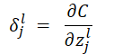
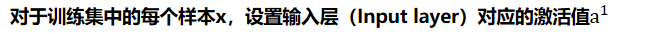
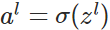
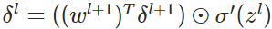
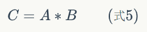
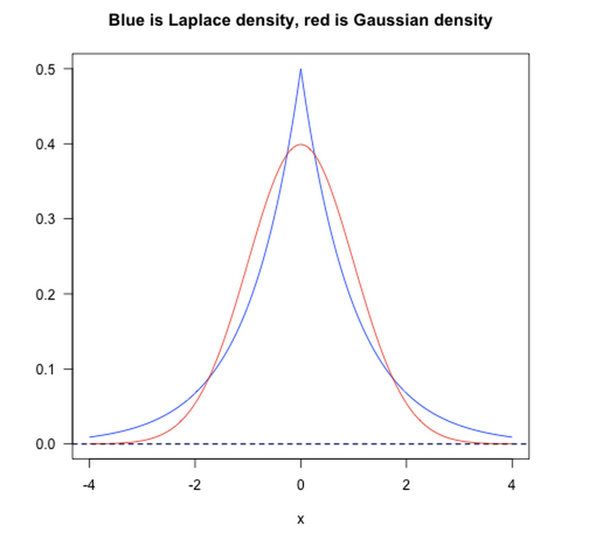
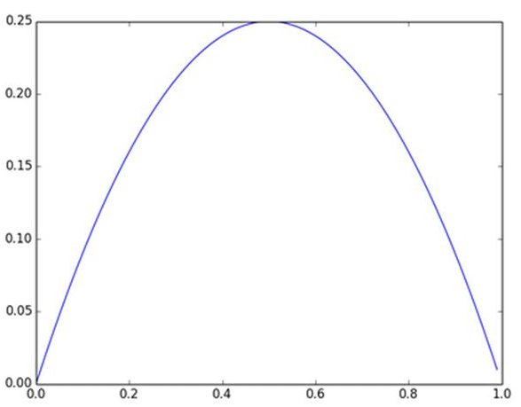
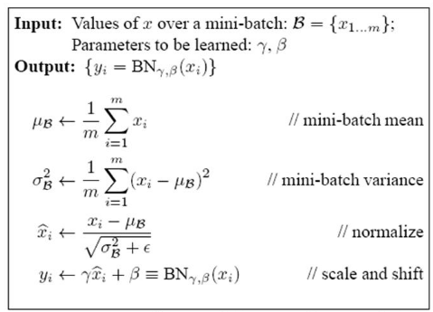

# 深度学习基础

## 基本概念

### 为什么使用深层表示

1. 深度神经网络的多层隐藏层中，前几层能学习一些低层次的简单特征，后几层能把前面简单的特征结合起来，去学习更加复杂的东西。比如刚开始检测到的是边缘信息，而后检测更为细节的信息
2. 深层的网络隐藏单元数量相对较少，隐藏层数目较多，如果浅层的网络想要达到同样的计算结果则需要指数级增长的单元数量才能达到

### 深度学习和机器学习有什么不同

1. **机器学习：**利用计算机、概率论、统计学等知识，输入数据，让计算机学会新知识。机器学习的过程，就是通过训练数据寻找目标函数。 
2. **深度学习：**是机器学习的一种，现在深度学习比较火爆。在传统机器学习中，手工设计特征对学习效果很重要，但是特征工程非常繁琐。而深度学习能够从大数据中自动学习特征，这也是深度学习在大数据时代受欢迎的一大原因

## 全连接网络前向传播和反向传播

### 前向传播过程

在开始反向传播之前，先提一下前向传播过程，即网络如何根据输入X得到输出Y的。这个很容易理解，粗略看一下即可，这里主要是为了统一后面的符号表达。

记为第层第k个神经元到第层第j个神经元的权重，为第 层第 j 个神经元的偏置，为第层第j个神经元的激活值（激活函数的输出）。不难看出，的值取决于上一层神经元的激活：

将上式重写为矩阵形式：

为了方便表示，记为每一层的权重输入，(2)式则变为。 

利用(2)式一层层计算网络的激活值，最终能够根据输入得到相应的输出。

### 反向传播过程

反向传播过程中要计算和，我们先对代价函数做两个假设，以二次损失函数为例：

其中n为训练样本x的总数，y=y(x)为期望的输出，即ground truth，L为网络的层数，为网络的输出向量。 

 

- 假设1：总的代价函数可以表示为单个样本的代价函数之和的平均：

这个假设的意义在于，因为反向传播过程中我们只能计算单个训练样本的 和，在这个假设下，我们可以通过计算所有样本的平均来得到总体的 和 

 

- 假设2：代价函数可以表达为网络输出的函数，比如单个样本x的二次代价函数可以写为：

#### 反向传播的四个基本方程

　　权重w和偏置b的改变如何影响代价函数C是理解反向传播的关键。最终，这意味着我们需要计算出每个 和 ，在讨论基本方程之前，我们引入误差的概念，表示第层第个单元的误差。关于误差的理解，《Neural Network and Deep Learning》书中给了一个比较形象的例子。

　　如上图所示，假设有个小恶魔在第层第个单元捣蛋，他让这个神经元的权重输出变化了，那么这个神经元的激活输出为，然后这个误差向后逐层传播下去，导致最终的代价函数变化了。现在这个小恶魔改过自新，它想帮助我们尽可能减小代价函数的值（使网络输出更符合预期）。假设一开始是个很大的正值或者负值，小恶魔通过选择一个和方向相反的使代价函数更小（这就是我们熟知的梯度下降法）。随着迭代的进行，会逐渐趋向于0，那么对于代价函数的改进效果就微乎其微了，这时小恶魔就一脸骄傲的告诉你：“俺已经找到了最优解了（局部最优）”。**这启发我们可以用****来衡量神经元的误差：**

下面就来看看四个基本方程是怎么来的。 

　　 

### 输出层的误差方程

如果上面的东西你看明白了，这个方程应该不难理解，等式右边第一项衡量了代价函数随网络最终输出的变化快慢，而第二项 则衡量了激活函数输出随 的变化快慢。当激活函数饱和，即 ≈0 时，无论多大，最终≈0，输出神经元进入饱和区，停止学习。 

　　方程中两项都很容易计算，如果代价函数为二次代价函数则 ，同理，对激活函数σ(z)求 的偏导即可求得。将上式重写为矩阵形式：

⊙为Hadamard积，即矩阵的点积。

 

### 误差传递方程 

这个方程说明我们可以通过第层的误差计算第层的误差，结合以上两个方程，我们现在可以计算网络中任意一层的误差了，先计算，然后计算，，…，直到输入层。 

证明过程如下：

因为 ，所以

 

#### 代价函数对偏置的改变率

这里因为 所以

#### 代价函数对权重的改变率

 

可以简写为

，不难发现，当上一层激活输出接近 0 的时候，无论返回的误差有多大，的改变都很小，这也就解释了为什么神经元饱和不利于训练。

　　从上面的推导我们不难发现，当输入神经元没有被激活，或者输出神经元处于饱和状态，权重和偏置会学习的非常慢，这不是我们想要的效果。这也说明了为什么我们平时总是说激活函数的选择非常重要。

　　当我计算得到和后，就能愉悦地使用梯度下降法对参数进行一轮轮更新了，直到最后模型收敛。 

 

### 反向传播算法伪代码

- **输入训练集**

- **对于训练集中的每个样本x，设置输入层（Input     layer）对应的激活值**

- - **前向传播：**

- **计算输出层产生的错误：**

- **反向传播错误：**

- **使用梯度下降（gradient descent），训练参数：**

 

 

## 池化层前向传播和反向传播

### mean pooling

假设pooling的窗大小是2x2, 在forward的时候啊，就是在前面卷积完的输出上依次不重合的取2x2的窗平均，得到一个值就是当前mean pooling之后的值。backward的时候，把一个值分成四等分放到前面2x2的格子里面就好了。如下

 

### max pooling

稍微复杂一点，forward的时候你只需要把2x2窗子里面那个最大的拿走就好了，backward的时候你要把当前的值放到之前那个最大的位置，其他的三个位置都弄成0。如下

由后一层误差推导出前一层误差的公式为： 

1. **卷积层****前向传播和反向传播**

### 前向传播

为了清楚的描述**卷积**计算过程，我们首先对图像的每个像素进行编号，用表示图像的第行第列元素；对filter的每个权重进行编号，用表示第行第列权重，用表示filter的**偏置项**；对Feature Map的每个元素进行编号，用表示Feature Map的第行第列元素；用表示**激活函数**(这个例子选择**relu函数**作为激活函数)。然后，使用下列公式计算卷积：

 

 

我们注意到，当步幅设置为2的时候，Feature Map就变成2*2了。这说明图像大小、步幅和卷积后的Feature Map大小是有关系的。事实上，它们满足下面的关系：

前面我们已经讲了深度为1的卷积层的计算方法，如果深度大于1怎么计算呢？其实也是类似的。如果卷积前的图像深度为D，那么相应的filter的深度也必须为D。我们扩展一下上式，得到了深度大于1的卷积计算公式：

以上就是卷积层的计算方法。这里面体现了**局部连接**和**权值共享**：每层神经元只和上一层部分神经元相连(卷积计算规则)，且filter的权值对于上一层所有神经元都是一样的。对于包含两个3*3*3的fitler的卷积层来说，其参数数量仅有(3*3*3+1)*2=56个，且参数数量与上一层神经元个数无关。与**全连接神经网络**相比，其参数数量大大减少了。

 

上式表达很是繁冗，最好能简化一下。就像利用矩阵可以简化表达全连接神经网络的计算一样，我们利用卷积公式可以简化卷积神经网络的表达。下面我们介绍**二维卷积公式**。

设矩阵，，其行、列数分别为、、、，则二维卷积公式如下：

且满足条件, 我们可以把上式写成

如果我们按照式5来计算卷积，我们可以发现矩阵A实际上是filter，而矩阵B是待卷积的输入，位置关系也有所不同

从上图可以看到，A左上角的值与B对应区块中右下角的值相乘，而不是与左上角的相乘。因此，**数学**中的卷积和**卷积神经网络**中的『卷积』还是有区别的，为了避免混淆，我们把**卷积神经网络**中的『卷积』操作叫做**互相关(cross-correlation)**操作.

**卷积**和**互相关**操作是可以转化的。首先，我们把矩阵A翻转180度，然后再交换A和B的位置（即把B放在左边而把A放在右边。卷积满足交换率，这个操作不会导致结果变化），那么**卷积**就变成了**互相关**。

如果我们不去考虑两者这么一点点的区别，我们可以把**式5**代入到**式4**：

其中，是卷积层输出的feature map。同**式4**相比，**式6**就简单多了。然而，这种简洁写法只适合步长为1的情况。

 

### 反向传播

**已知卷积层的误差，反向推导上一隐藏层的误差**

我们再看一次普通网络的反向推导误差的公式：

可以看到区别在于，下一层的权重w的转置操作，变成了旋转180度的操作，也就是上下翻转一次，左右再翻转一次，这其实就是“卷积”一词的意义（我们可简单理解为数学上的trick），可参考下图，Q是下一层的误差，周围补0方便计算，W是180度翻转后的卷积核，P是W和Q做卷积的结果：

**已知卷积层的误差，推导该层的W,b的梯度**

经过以上各步骤，我们已经算出每一层的误差了，那么：

- 对于全连接层，可以按照普通网络的反向传播算法求该层W,b的梯度。     
- 对于池化层，它并没有W,b,也不用求W,b的梯度。     
- 只有卷积层的W,b需要求出，先看w：     

再对比一下普通网络的求w梯度的公式，发现区别在于，对前一层的输出做翻转180度的操作：

而对于b,则稍微有些特殊，因为在CNN中，误差δ是三维张量，而b只是一个向量，不能像普通网络中那样直接和误差δ相等。通常的做法是将误差δ的各个子矩阵的项分别求和，得到一个误差向量，即为b的梯度：

#### 正则化方法

**BN  L0/L1/L2  Droupout**  **数据增强**   **提前终止**   **集成学习**   **多任务联合** 

正则化主要是用来**解决过拟合问题**。正则化参数要做的就是控制两个目标之间的平衡关系：在最小化训练误差的同时正则化参数使模型简单。

1.最小化误差是为了更好的拟合训练数据。

2.正则化参数是为了防止模型过分拟合训练数据。

所以正则化参数要保证模型简单的基础上使模型具有很好的泛化性能。模型参数过多会导致模型复杂度上升，产生过拟合，即训练误差很小，但测试误差很大，这和监督学习的目标是相违背的。所以需要采取措施，保证模型尽量简单的基础上，最小化训练误差，使模型具有更好的泛化能力（即测试误差也很小）。

#### 范数规则化有两个作用

1）保证模型尽可能的简单，避免过拟合。

2）约束模型特性，加入一些先验知识，例如稀疏、低秩等。

**两个问题**

**1）实现参数的稀疏有什么好处吗？**

一个好处是可以简化模型，避免过拟合。因为一个模型中真正重要的参数可能并不多，如果考虑所有的参数起作用，那么可以对训练数据可以预测的很好，但是对测试数据就只能呵呵了。另一个好处是参数变少可以使整个模型获得更好的可解释性。

**2）参数值越小代表模型越简单吗？**

是的。为什么参数越小，说明模型越简单呢，这是因为越复杂的模型，越是会尝试对所有的样本进行拟合，甚至包括一些异常样本点，这就容易造成在较小的区间里预测值产生较大的波动，这种较大的波动也反映了在这个区间里的导数很大，而只有较大的参数值才能产生较大的导数。因此复杂的模型，其参数值会比较大。

### L_0范数

L_0范数是指向量中非零元素的个数(设0^0=0)，

若用L_0范数来规则化参数矩阵，就是希望参数矩阵大部分元素都为0，**使特征矩阵稀疏**。

但不幸的是，L0范数的最优化问题是一个NP hard问题，而且**理论上有证明，L1范数是L0范数的最优凸近似，因此通常使用L1范数来代替。**

 

 

 

### L_1范数

L_1范数是指向量中各个绝对值元素之和，

L1正则化之所以可以防止过拟合，是因为L1范数就是各个参数的绝对值相加得到的，我们前面讨论了，参数值大小和模型复杂度是成正比的。因此复杂的模型，其L1范数就大，最终导致损失函数就大，说明这个模型就不够好。使用L1范数也可以**实现特征稀疏。**

 

### L_2范数

L2范数即欧氏距离，也叫“岭回归”（Ridge Regression），也叫它“权值衰减weight decay”

但与L1范数不一样的是，它不会是每个元素为0，而只是接近于0。**越小的参数说明模型越简单**，越简单的模型越不容易产生过拟合现象。

 

**weight decay和范数正则有什么关系？**

weight decay的系数其实就是L2正则前面的lambda系数，求个导，梯度下降的时候和w合并一下就看出来了。

 

### L_1和L_2区别

从贝叶斯先验的角度看，加入正则项相当于加入了一种先验。即当训练一个模型时，仅依靠当前的训练数据集是不够的，为了实现更好的泛化能力，往往需要加入先验项。

- L1范数相当于加入了一个Laplacean先验；
- L2范数相当于加入了一个Gaussian先验。

|  |  |
| ---------------------------------------------------- | -------------------------------------- |
|                                                      |                                        |

 

**为什么L****1****稀疏L2平滑？**

**几何空间：**高维我们无法想象，简化到2维的情形，如上右图所示。其中，左边是L1图示，右边是L2图示，左边的方形线上是L1中w1/w2取值区间，右边得圆形线上是L2中w1/w2的取值区间，蓝色的圆圈表示w1/w2取不同值时整个正则化项的值的等高线（凸函数），从等高线和w1/w2取值区间的交点可以看到，**L1中两个权值倾向于一个较大另一个为0，L2中两个权值倾向于均为非零的较小数。这也就是L1稀疏，L2平滑的效果。**

 

**数学公式：**这个角度从权值的更新公式来看权值的收敛结果。首先来看看L1和L2的梯度(导数的反方向）：

所以(不失一般性，我们假定：wi等于不为0的某个正的浮点数，学习速率η 为0.5)：

- L1的权值更新公式为，也就是说权值每次更新都固定减少一个特定的值(比如0.5)，那么经过若干次迭代之后，权值就有可能减少到0。
- L2的权值更新公式为，也就是说权值每次都等于上一次的1/2，那么，虽然权值不断变小，但是因为每次都等于上一次的一半，所以很快会收敛到较小的值但不为0。

**L1能产生等于0的权值，即能够剔除某些特征在模型中的作用（特征选择），即产生稀疏的效果。**

**L2可以得迅速得到比较小的权值，但是难以收敛到0，所以产生的不是稀疏而是平滑的效果。**

**总结**

- **L2 regularizer** ：使得模型的解偏向于范数较小的 W，通过限制 W     范数的大小实现了对模型空间的限制，从而在一定程度上避免了 overfitting 。不过 ridge regression     并不具有产生稀疏解的能力，得到的系数仍然需要数据中的所有特征才能计算预测结果，从计算量上来说并没有得到改观。
- **L1 regularizer** ：它的优良性质是能产生稀疏性，导致 W 中许多项变成零。     稀疏的解除了计算量上的好处之外，更重要的是更具有“可解释性”。

### Dropout

#### Bagging 集成方法

- 集成方法的主要想法是分别训练不同的模型，然后让所有模型表决最终的输出。集成方法奏效的原因是不同的模型通常不会在测试集上产生相同的误差。集成模型能至少与它的任一成员表现得一样好。如果成员的误差是独立的，集成将显著提升模型的性能。
- Bagging 是一种集成策略——具体来说，Bagging 涉及构造 k 个不同的数据集。每个数据集从原始数据集中重复采样构成，和原始数据集具有相同数量的样例——这意味着，每个数据集以高概率缺少一些来自原始数据集的例子，还包含若干重复的例子.更具体的，如果采样所得的训练集与原始数据集大小相同，那所得数据集中大概有原始数据集 2/3 的实例

#### 集成方法与神经网络：

- 神经网络能找到足够多的不同的解，意味着他们可以从模型平均中受益——即使所有模型都在同一数据集上训练。神经网络中**随机初始化**的差异、**批训练数据**的随机选择、**超参数****的差异**等**非确定性**实现往往足以使得集成中的不同成员**具有****部分独立的误差****。**

#### Dropout 策略

- 简单来说，Dropout 通过参数共享提供了一种廉价的 Bagging 集成近似—— Dropout     策略相当于集成了包括所有从基础网络除去部分单元后形成的子网络。
- 通常，隐藏层的采样概率为 0.5，输入的采样概率为 0.8；超参数也可以采样，但其采样概率一般为 1

 

#### 权重比例推断规则

- 权重比例推断规则的目的是确保在测试时一个单元的期望总输入与在训练时该单元的期望总输入大致相同。
- 实践时，如果使用 0.5 的采样概率，权重比例规则相当于在训练结束后将权重乘 0.5，然后像平常一样使用模型；等价的，另一种方法是在训练时将单元的状态乘 2。

#### Dropout 与 Bagging 的不同

- 在 Bagging     的情况下，所有模型都是独立的；而在 Dropout 的情况下，所有模型共享参数，其中每个模型继承父神经网络参数的不同子集。
- 在 Bagging     的情况下，每一个模型都会在其相应训练集上训练到收敛。而在 Dropout     的情况下，通常大部分模型都没有显式地被训练；取而代之的是，在单个步骤中我们训练一小部分的子网络，参数共享会使得剩余的子网络也能有好的参数设定。

**dropout****应该加在卷积层还是全连接层后面，为什么？**

dropout仅适用于卷积神经网络的全连接区域。对于其它区域，我们不应该使用Dropout这项技术。

相反，应该在卷积层之间插入Batch Normalization（批量标准化），这项技术将使得模型正则化，进而使得模型在训练期间更加地稳定。

### Batch Normalization

机器学习领域有个很重要的假设：**IID独立同分布假设**，**就是假设训练数据和测试数据是满足相同分布的，这是通过训练数据获得的模型能够在测试集获得好的效果的一个基本保障****。**那BatchNorm的作用是什么呢？**BatchNorm就是在深度神经网络训练过程中使得每一层神经网络的输入保持相同分布的。**

接下来一步一步的理解什么是BN。

为什么深度神经网络**随着网络深度加深，训练起来越困难，收敛越来越慢？**这是个在DL领域很接近本质的好问题。很多论文都是解决这个问题的，比如ReLU激活函数，再比如Residual Network，BN本质上也是解释并从某个不同的角度来解决这个问题的。

#### Internal Covariate Shift

从论文名字可以看出，BN是用来解决**“****Internal Covariate Shift”**问题的，那么首先得理解什么是“Internal Covariate Shift”？

论文首先说明Mini-Batch SGD相对于One Example SGD的两个优势：梯度更新方向更准确；并行计算速度快；（为什么要说这些？因为BatchNorm是基于Mini-Batch SGD的，所以先夸下Mini-Batch SGD，当然也是大实话）；然后吐槽下SGD训练的缺点：超参数调起来很麻烦。（作者隐含意思是用BN就能解决很多SGD的缺点）

接着引入**covariate shift的概念**：**如果ML系统实例集合<X,Y>中的输入值X的分布老是变，这不符合IID假设**，网络模型很难**稳定的学规律**，这不得引入迁移学习才能搞定吗，我们的ML系统还得去学习怎么迎合这种分布变化啊。对于深度学习这种包含很多隐层的网络结构，在训练过程中，因为各层参数不停在变化，所以每个隐层都会面临covariate shift的问题，也就是**在训练过程中，隐层的输入分布老是变来变去，这就是所谓的“Internal Covariate Shift”，Internal指的是深层网络的隐层，是发生在网络内部的事情，而不是covariate shift问题只发生在输入层。**

然后提出了BatchNorm的基本思想：能不能**让每个隐层节点的激活输入分布固定下来呢**？这样就避免了“Internal Covariate Shift”问题了。

BN不是凭空拍脑袋拍出来的好点子，它是有启发来源的：之前的研究表明如果在图像处理中对输入图像进行白化（Whiten）操作的话——所谓**白化**，**就是对输入数据分布变换到0均值，单位方差的正态分布**——那么神经网络会较快收敛，那么BN作者就开始推论了：图像是深度神经网络的输入层，做白化能加快收敛，那么其实对于深度网络来说，其中某个隐层的神经元是下一层的输入，意思是其实深度神经网络的每一个隐层都是输入层，不过是相对下一层来说而已，那么能不能对每个隐层都做白化呢？这就是启发BN产生的原初想法，而BN也确实就是这么做的，**可以理解为对深层神经网络每个隐层神经元的激活值做简化版本的白化操作。**

#### BatchNorm的本质思想

BN的基本思想其实相当直观：因为深层神经网络在做非线性变换前的**激活输入值**（就是x=WU+B，U是输入）**随着网络深度加深或者在训练过程中，其分布逐渐发生偏移或者变动，之所以训练收敛慢，一般是整体分布逐渐往非线性函数的取值区间的上下限两端靠近**（对于Sigmoid函数来说，意味着激活输入值WU+B是大的负值或正值），所以这**导致反向传播时低层神经网络的梯度消失**，这是训练深层神经网络收敛越来越慢的**本质原因**，**而BN就是通过一定的规范化手段，把每层神经网络任意神经元这个输入值的分布强行拉回到均值为0方差为1的标准正态分布**，其实就是把越来越偏的分布强制拉回比较标准的分布，这样使得激活输入值落在非线性函数对输入比较敏感的区域，这样输入的小变化就会导致损失函数较大的变化，意思是**这样让梯度变大，避免梯度消失问题产生，而且梯度变大意味着学习收敛速度快，能大大加快训练速度。**

THAT’S IT。其实一句话就是：**对于每个隐层神经元，把逐渐向非线性函数映射后向取值区间极限饱和区靠拢的输入分布强制拉回到均值为0方差为1的比较标准的正态分布，使得非线性变换函数的输入值落入对输入比较敏感的区域，以此避免梯度消失问题。**因为梯度一直都能保持比较大的状态，所以很明显对神经网络的参数调整效率比较高，就是变动大，就是说向损失函数最优值迈动的步子大，也就是说收敛地快。BN说到底就是这么个机制，方法很简单，道理很深刻。

上面说得还是显得抽象，下面更形象地表达下这种调整到底代表什么含义。

假设某个隐层神经元原先的激活输入x取值符合正态分布，正态分布均值是-2，方差是0.5，对应上图中最左端的浅蓝色曲线，通过BN后转换为均值为0，方差是1的正态分布（对应上图中的深蓝色图形），意味着什么，意味着输入x的取值正态分布整体右移2（均值的变化），图形曲线更平缓了（方差增大的变化）。这个图的意思是，BN其实就是把每个隐层神经元的激活输入分布从偏离均值为0方差为1的正态分布通过平移均值压缩或者扩大曲线尖锐程度，调整为均值为0方差为1的正态分布。

那么把激活输入x调整到这个正态分布有什么用？首先我们看下均值为0，方差为1的标准正态分布代表什么含义：

这意味着在一个标准差范围内，也就是说64%的概率x其值落在[-1,1]的范围内，在两个标准差范围内，也就是说95%的概率x其值落在了[-2,2]的范围内。那么这又意味着什么？我们知道，激活值x=WU+B,U是真正的输入，x是某个神经元的激活值，假设非线性函数是sigmoid，那么看下sigmoid(x)其其导数图形。sigmoid(x)的导数为：G’=f(x)*(1-f(x))，因为f(x)=sigmoid(x)在0到1之间，所以G’在0到0.25之间，其对应的图如下：

|  |  |
| -------------------------------------- | ------------------------------------------------------------ |
|                                        |                                                              |

假设没有经过BN调整前x的原先正态分布均值是-6，方差是1，那么意味着95%的值落在了[-8,-4]之间，那么对应的Sigmoid（x）函数的值明显接近于0，这是典型的梯度饱和区，在这个区域里梯度变化很慢，为什么是梯度饱和区？**请看下sigmoid(x)如果取值接近0或者接近于1的时候对应导数函数取值，接近于0，意味着梯度变化很小甚至消失。**而假设经过BN后，均值是0，方差是1，那么意味着95%的x值落在了[-2,2]区间内，很明显这一段是sigmoid(x)函数接近于线性变换的区域，意味着x的小变化会导致非线性函数值较大的变化，也即是梯度变化较大，对应导数函数图中明显大于0的区域，就是梯度非饱和区。

从上面几个图应该看出来BN在干什么了吧？其实就是把隐层神经元激活输入x=WU+B从变化不拘一格的正态分布通过BN操作拉回到了均值为0，方差为1的正态分布，即原始正态分布中心左移或者右移到以0为均值，拉伸或者缩减形态形成以1为方差的图形。什么意思？就是说**经过BN后，目前大部分Activation的值落入非线性函数的线性区内，其对应的导数远离导数饱和区，这样来加速训练收敛过程。**

但是很明显，看到这里，稍微了解神经网络的读者一般会提出一个疑问：如果都通过BN，那么不就跟把非线性函数替换成线性函数效果相同了？这意味着什么？我们知道，如果是多层的线性函数变换其实这个深层是没有意义的，因为多层线性网络跟一层线性网络是等价的。这意味着网络的**表达能力**下降了，这也意味着深度的意义就没有了。**所以BN为了保证非线性的获得，对变换后的满足均值为0方差为1的x又进行了scale加上shift操作(y=scale\*x+shift)**，每个神经元增加了两个参数scale和shift参数，这两个参数是通过训练学习到的，意思是通过scale和shift把这个值从标准正态分布左移或者右移一点并长胖一点或者变瘦一点，每个实例挪动的程度不一样，这样等价于非线性函数的值从正中心周围的线性区往非线性区动了动。

#### 训练阶段如何做BatchNorm

上面是对BN的抽象分析和解释，具体在Mini-Batch SGD下做BN怎么做？其实论文里面这块写得很清楚也容易理解。为了保证这篇文章完整性，这里简单说明下。

假设对于一个深层神经网络来说，其中两层结构如下：

|  |  |
| ---------------------------------------- | ------------------------------------------------------------ |
|                                          |                                                              |

要对每个隐层神经元的激活值做BN，可以想象成每个隐层又加上了一层BN操作层，**它位于X=WU+B激活值获得之后，非线性函数变换之前**，其图示如上右图：

对于Mini-Batch SGD来说，一次训练过程里面包含m个训练实例，其具体BN操作就是对于隐层内每个神经元的激活值来说，进行如下变换：

要注意，这里t层某个神经元的x(k)不是指原始输入，就是说不是t-1层每个神经元的输出，而是t层这个神经元的线性激活x=WU+B，这里的U才是t-1层神经元的输出。变换的意思是：某个神经元对应的原始的激活x通过减去mini-Batch内m个实例获得的m个激活x求得的均值E(x)并除以求得的方差Var(x)来进行转换。

上文说过经过这个**变换后某个神经元的激活x形成了均值为0，方差为1的正态分布，目的是把值往后续要进行的非线性变换的线性区拉动，增大导数值，增强反向传播信息流动性，加快训练收敛速度。但是这样会导致网络表达能力下降，为了防止这一点，每个神经元增加两个调节参数（scale和shift），这两个参数是通过训练来学习到的，用来对变换后的激活反变换，使得网络表达能力增强，即对变换后的激活进行如下的scale和shift操作，这其实是变换的反操作：**

BN其具体操作流程，如论文中描述的一样：

过程非常清楚，就是上述公式的流程化描述，这里不解释了，直接应该能看懂。

#### BatchNorm的推理(Inference)过程

- 当测试或预测时，每次可能只会传入**单个数据**，此时模型会使用**全局统计量**代替批统计量；

- - 训练每个 batch 时，都会得到一组（均值，方差）；
  - 所谓全局统计量，就是对这些均值和方差求其对应的数学期望；
  - 具体计算公式为：

![Var@\] ](深度学习基础/clip_image081.png)

其中 μ_i 和 σ_i 分别表示第 i 轮 batch 保存的均值和标准差；m 为 batch_size，系数 m/(m-1) 用于计算**无偏方差估计**，原文称该方法为移动平均（moving averages）

- 此时，BN(x) 调整为：

 

**为什么训练时不采用移动平均？**

1. 使用`BN`的目的就是为了保证每批数据的分布稳定，使用全局统计量反而违背了这个初衷；
2. BN的作者认为在训练时采用移动平均可能会与梯度优化存在冲突；

**BN层，先加BN还是激活，有什么区别** **？**

先加BN，作者在文章中说应该把BN放在激活函数之前，这是因为Wx+b具有更加一致和非稀疏的分布

#### BatchNorm的好处

BatchNorm为什么NB呢，关键还是效果好。**①不仅仅极大提升了训练速度，收敛过程大大加快；②避免深层网络的梯度消失或爆炸问题；③另外调参过程也简单多了，对于初始化要求没那么高，而且可以使用大的学习率等。**总而言之，经过这么简单的变换，带来的好处多得很，这也是为何现在BN这么快流行起来的原因。

## 梯度消失和梯度爆炸

### 为什么会出现梯度消失和梯度爆炸？

那么为什么会出现**梯度消失**的现象呢？因为通常神经网络所用的激活函数是sigmoid函数，这个函数有个特点，就是能将负无穷到正无穷的数映射到0和1之间，并且对这个函数求导的结果是f′(x)=f(x)(1−f(x))。因此两个0到1之间的数相乘，得到的结果就会变得很小了。神经网络的反向传播是逐层对函数偏导相乘，因此当神经网络层数非常深的时候，最后一层产生的偏差就因为乘了很多的小于1的数而越来越小，最终就会变为0，从而导致层数比较浅的权重没有更新，这就是**梯度消失**。

那么什么是**梯度爆炸**呢？梯度爆炸就是由于初始化权值过大，前面层会比后面层变化的更快，就会导致权值越来越大，梯度爆炸的现象就发生了。

在深层网络或循环神经网络中，误差梯度可在更新中累积，变成非常大的梯度，然后导致网络权重的大幅更新，并因此使网络变得不稳定。在极端情况下，权重的值变得非常大，以至于溢出，导致 NaN 值。网络层之间的梯度（值大于 1.0）重复相乘导致的指数级增长会产生梯度爆炸。

**从深层网络角度来讲，不同的层学习的速度差异很大，表现为网络中靠近输出的层学习的情况很好，靠近输入的层学习的很慢，有时甚至训练了很久，前几层的权值和刚开始随机初始化的值差不多。**因此，梯度消失、爆炸，其根本原因在于反向传播训练法则，属于先天不足

### 如何确定是否出现梯度爆炸

训练过程中出现梯度爆炸会伴随一些细微的信号，如：

1. 模型无法从训练数据中获得更新（如低损失）
2. 模型不稳定，导致更新过程中的损失出现显著变化
3. 训练过程中，模型损失变成 NaN

### 如何修复梯度爆炸问题

 有很多方法可以解决梯度爆炸问题，本节列举了一些最佳实验方法。 

#### 重新设计网络模型

在深度神经网络中，梯度爆炸可以通过重新设计层数更少的网络来解决。使用更小的批尺寸对网络训练也有好处。另外也许是学习率的原因，学习率过大导致的问题，减小学习率。在循环神经网络中，训练过程中在更少的先前时间步上进行更新（沿时间的截断反向传播）可以缓解梯度爆炸问题。

####  ReLU等激活函数

**Relu:** 思想也很简单，如果激活函数的导数为1，那么就不存在梯度消失爆炸的问题了，每层的网络都可以得到相同的更新速度，relu就这样应运而生。先看一下relu的数学表达式：

其函数图像：

从上图中，我们可以很容易看出，relu函数的导数在正数部分是恒等于1的，因此在深层网络中使用relu激活函数就不会导致梯度消失和爆炸的问题。

relu的主要贡献在于：

1. 解决了梯度消失、爆炸的问题
2. 计算方便，计算速度快
3. 加速了网络的训练

同时也存在一些缺点：

1. 由于负数部分恒为0，会导致一些神经元无法激活（可通过设置小学习率部分解决）
2. 输出不是以0为中心的

尽管relu也有缺点，但是仍然是目前使用最多的激活函数

**Leakrelu**：leakrelu就是为了解决relu的0区间带来的影响，其数学表达为： 其中k是leak系数，一般选择0.01或者0.02，或者通过学习而来

leakrelu解决了0区间带来的影响，而且包含了relu的所有优点.

 

**Elu**elu激活函数也是为了解决relu的0区间带来的影响，其数学表达为：

其函数及其导数数学形式为：

但是elu相对于leakrelu来说，计算要更耗时间一些

 

#### 使用长短期记忆网络

 在循环神经网络中，梯度爆炸的发生可能是因为某种网络的训练本身就存在不稳定性，如随时间的反向传播本质上将循环网络转换成深度多层感知机神经网络。

使用长短期记忆（LSTM）单元和相关的**门类型神经元结构**可以减少梯度爆炸问题。

采用 LSTM 单元是适合循环神经网络的序列预测的最新最好实践

####  使用梯度截断（Gradient Clipping）

**梯度剪切**这个方案主要是针对梯度爆炸提出的，其思想是设置一个梯度剪切阈值，然后更新梯度的时候，如果梯度超过这个阈值，那么就将其强制限制在这个范围之内。这可以防止梯度爆炸。

####  使用权重正则化（Weight Regularization）

如果梯度爆炸仍然存在，可以尝试另一种方法，即检查网络权重的大小，并惩罚产生较大权重值的损失函数。该过程被称为权重正则化，通常使用的是 L1 惩罚项（权重绝对值）或 L2 惩罚项（权重平方）

#### batch normalization

**Batchnorm**是深度学习发展以来提出的最重要的成果之一了，目前已经被广泛的应用到了各大网络中，具有加速网络收敛速度，提升训练稳定性的效果，Batchnorm本质上是解决反向传播过程中的梯度问题。batchnorm全名是batch normalization，简称BN，即批规范化，通过规范化操作将输出信号x规范化保证网络的稳定性。

具体的batchnorm原理非常复杂，在这里不做详细展开，此部分大概讲一下batchnorm解决梯度的问题上。具体来说就是反向传播中，经过每一层的梯度会乘以该层的权重，举个简单例子：

正向传播中 ，那么反向传播中，反向传播式子中有w 的存在，所以w 的大小影响了梯度的消失和爆炸，batchnorm就是通过对每一层的输出规范为均值和方差一致的方法，消除了w带来的放大缩小的影响，进而解决梯度消失和爆炸的问题，或者可以理解为BN将输出从饱和区拉倒了非饱和区。

#### 残差结构

残差可以很轻松的构建几百层，一千多层的网络而不用担心梯度消失过快的问题，原因就在于残差的捷径（shortcut）部分，其中残差单元如下图所示：

相比较于以前网络的直来直去结构，残差中有很多这样的跨层连接结构，这样的结构在反向传播中具有很大的好处，见下式：

表示的损失函数到达 L 的梯度，小括号中的1表明短路机制可以无损地传播梯度，而另外一项残差梯度则需要经过带有weights的层，梯度不是直接传递过来的。残差梯度不会那么巧全为-1，而且就算其比较小，有1的存在也不会导致梯度消失。所以残差学习会更容易.

##  全连接和卷积层

### 全连接层

以上图为例，我们仔细看上图全连接层的结构，**全连接层中的每一层是由许多神经元组成的(1\*4096)的平铺结构，**

它是怎么样把3x3x5的输出，转换成1x4096的形式

很简单,可以理解为在中间做了一个卷积

 

从上图我们可以看出，我们用一个3x3x5的filter 去卷积激活函数的输出，得到的结果就是一个fully connected layer 的一个神经元的输出，这个输出就是一个值。

因为我们有4096个神经元，我们实际就是用一个3x3x5x4096的卷积层去卷积激活函数的输出。

**全连接层的作用：**

全连接层(fully connected layers,FC),在整个卷积神经网络中起到”**分类器**”作用。如果说卷积层、池化层和激活函数层等操作是将原始数据映射到隐层特征空间的话，全连接层则起到”将学到的分布式特征表示”映射到样本标记空间的作用。 

 

### 卷积层

**卷积**：图像中不同数据窗口的数据和卷积核（一个滤波矩阵）作内积的操作叫做卷积。其计算过程又称为滤波（filter)，本质是提取图像不同频段的特征。

**卷积核：**也称为滤波器filter，带着一组固定权重的神经元，通常是n*m二维的矩阵，n和m也是神经元的感受野。n*m 矩阵中存的是对感受野中数据处理的系数。**一个卷积核的滤波可以用来提取特定的特征**（例如可以提取物体轮廓、颜色深浅等）。通过卷积层从原始数据中提取出新的特征的过程又成为feature map(特征映射)。filter_size是指filter的大小，例如3*3； filter_num是指每种filter_size的filter个数，通常是通道个数

**卷积层：**多个滤波器叠加便成了卷积层。

**一个卷积层有多少个参数：**一个卷积核使用一套权值以便”扫视’数据每一处时以同样的方式抽取特征，最终得到的是一种特征。 一个卷积层的多个卷积核使用相同的m*n, 只是权重不同。 则一个卷积层的参数总共m*n*filter_num个，比全连接少了很多。

**通道(chennel）怎么理解：**通道可以理解为视角、角度。例如同样是提取边界特征的卷积核，可以按照R、G、B三种元素的角度提取边界，RGB在边界这个角度上有不同的表达；再比如需要检查一个人的机器学习能力，可以从特征工程、模型选择、参数调优等多个方面检测

**计算例子：**

解析：图中input 7*7*3中，7*7代表图像的像素/长宽，3代表R、G、B 三个颜色通道，可以看到周边有填充0； 有两个卷积核Filter w0、Filter w1,每个filter对应每个通道有一组w权重；一个filter滑动到一个位置后计算三个通道的卷积，求和，加bias，得到这个filter在该位置的最终结果；每个filter的输出是各个通道的汇总；输出的个数与filter个数相同。所以最右边能得到两个不同的输出。

1的计算过程：

第一个通道和对应权重的结果：0*1+0*1+0*(-1)+0*(-1)+0*0+1*1+0*(-1)+0*(-1)+1*0 = 1

第二个通道和对应权重的结果：0*(-1)+0*0+0*(-1)+0*0+1*0+1*(-1)+0*1+0*(-1)+2*0 = -1

第三个通道和对应权重的结果：0*0+0*1+0*0+0*1+2*0+0*1+0*0+0*(-1)+0*0 = 0

偏置：1+（-1）+ 0 + 1 = 1

**几个参数:**

1. 深度depth：神经元个数，决定输出的depth厚度。同时代表滤波器个数
2. 步长stride：决定滑动多少步可以到边缘
3. 填充值zero-padding：在外围边缘补充若干圈0，方便从初始位置以步长为单位可以刚好滑倒末尾位置，通俗地讲就是为了总长能被步长整除

上面的例子中：

两个神经元，即depth=2，意味着有两个滤波器

数据窗口每次移动两个步长取3*3的局部数据，即stride=2。（步长是步子大小，不是步数）

zero-padding=1

**如何理解权值共享，减少了神经网络需要训练的参数的个数？**

数据窗口滑动，导致输入在变化，但中间滤波器Filter w0的权重是固定不变的，这个权重不变即所谓的CNN中的参数（权重）共享机制。再打个比方，某人环游全世界，所看到的信息在变，但采集信息的双眼不变。不同人的双眼看同一个局部信息所感受到的不同，即一千个读者有一千个哈姆雷特，所以不同的滤波器就像不同的双眼，不同的人有着不同的反馈结果。

如果我们有**1000x1000**像素的图像，有**1百万个隐层神经元**，那么他们全连接的话（每个隐层神经元都连接图像的每一个像素点），就有1000x1000x1000000=10^12个连接，也就是**10^12**个权值参数。然而图像的空间联系是局部的，就像人是通过一个局部的感受野去感受外界图像一样，每一个神经元都不需要对全局图像做感受，每个神经元只感受局部的图像区域，然后在更高层，将这些感受不同局部的神经元综合起来就可以得到全局的信息了。这样，我们就可以减少连接的数目，也就是减少神经网络需要训练的权值参数的个数了。如下图右：假如局部感受野是10x10，隐层每个感受野只需要和这**10x10**的局部图像相连接，所以1百万个隐层神经元就只有一亿个连接，即**10^8**个参数。比原来减少了四个0（数量级），如果我们每个神经元这100个参数是相同的呢？也就是说每个神经元用的是同一个卷积核去卷积图像。这样只有**100**个参数，这就是权值共享！

这样只提取了一种特征，我们需要提取不同的特征，假设我们加到100种滤波器，每种滤波器的参数不一样，表示它提出输入图像的不同特征，例如不同的边缘。这样每种滤波器去卷积图像就得到对图像的不同特征的放映，我们称之为Feature Map。所以100种卷积核就有100个Feature Map。这100个Feature Map就组成了一层神经元。100种卷积核x每种卷积核共享100个参数=100x100=10K，也就是1万个参数。见下图右：不同的颜色表达不同的滤波器。

隐层的参数个数和隐层的神经元个数无关，只和滤波器的大小和滤波器种类的多少有关。那么隐层的神经元个数怎么确定呢？它和原图像，也就是输入的大小（神经元个数）、滤波器的大小和滤波器在图像中的滑动步长都有关！例如，我的图像是1000x1000像素，而滤波器大小是10x10，假设滤波器没有重叠，也就是步长为10，这样隐层的神经元个数就是**(1000x1000 )/ (10x10)=100x100**个神经元了，假设步长是8，也就是卷积核会重叠两个像素，同样可以计算。这只是一种滤波器，也就是一个Feature Map的神经元个数，如果100个Feature Map就是100倍了。由此可见，图像越大，神经元个数和需要训练的权值参数个数的贫富差距就越大。

神经元的偏置部分也是同一种滤波器共享的

卷积网络的核心思想是将：**局部感受野、权值共享以及时间或空间亚采样这三种结构思想结合起来获得了某种程度的位移、尺度、形变不变性。**

**大的卷积核和小的卷积核相比有什么优缺点，为什么现在基本不用大卷积核？** 

1. 3x3 是最小的能够捕获像素八邻域信息的尺寸
2. 两个 3x3 的堆叠卷基层的有限感受野是 5x5 ；三个 3x3     的堆叠卷基层的感受野是7x7，故可以通过小尺寸卷积层的堆叠替代大尺寸卷积层，并且**感受野大小不变**
3. 多个 3x3 的卷基层比一个大尺寸 filter卷基层有**更多的非线性**（更多层的非线性函数），使得判决函数更加具有判决性
4. 多个 3x3的卷积层比一个大尺寸的 filter 有**更少的参数**，假设卷基层的输入和输出的特征图大小相同为 C，那么三个 3x3     的卷积层参数个数 3x（3x3xCxC）=27C2；一个7x7的卷积层参数为49C2；所以可以把三个3x3的filter看成是一个7x7 filter的分解（中间层有非线性的分解, 并且起到**隐式正则化**的作用）

### 多层感知机、权值共享CNN和非权值共享CNN的区别

1. MLP的最大的缺点在于**参数众多**，比如说我们的网络层为1000--1000--500--20，那么它的总的参数为：1000*1000+1000*500+500*20.     参数过多不好训练，**容易产生过拟合现象**
2. 卷积神经网络，即CNN，它大大减少的网络参数的数目，通过**1. 权值共享 2. 局部连接**     来完成，为了增强网络性能，也需要增加全连接层（跟MLP一样)。CNN的大部分参数为卷积核参数以及后面的全连接层参数。当然，这里CNN也要通过下采样来减少参数和提取不同尺度的特征。权值共享型卷积神经网络适合用来做分类
3. 非权值共享卷积神经网络,跟CNN最大的区别在于**它在每个位置上的卷积核都是不一样的**，相对与CNN来说，参数的数目也就大大的增加了，但是相对于MLP来说，它的参数还是减少了不少。非权值共享型卷积神经网络的参数更多的是卷积核参数，因为它的卷积核数量大大增加了

### 全连接和卷积的计算量和参数量

#### 全连接层的计算量和参数量

考虑VGG-16的最后一个全连接层：上层神经元数为4096，下层神经元数为1000。这样的全连接层复杂度应该如何计算？其实全连接层可以视为一种特殊的卷积层：上层为1×1×4096，下层为1×1×1000，使用的1×1的卷积核进行卷积。

那么，计算量： 

参数量： 

#### 卷积操作的计算量和参数量

我们以VGG-16的第一层卷积为例：输入图像224×224×3，输出224×224×64，卷积核大小3×3。

计算量： 

​                 

参数量： 

Space≈3×3×3×64=1728

再举一个例子，VGG-16的最后一个卷积层：输入14×14×512，输出14×14×512，卷积核大小3×3。

计算量： 

参数量： 

 

## 超参数

### 什么是超参数

超参数: 比如算法中的 learning rate （学习率）、iterations(梯度下降法循环的数量)、（隐藏层数目）、 （隐藏层单元数目）、choice of activation function（激活函数的选择）都需要根据实际情况来设置，这些数字实际上控制了最后的参数和的值，所以它们被称作超参数。

###  如何寻找超参数的最优值

在使用机器学习算法时，总有一些难搞的超参数。例如权重衰减大小，高斯核宽度等等。 算法不会设置这些参数，而是需要你去设置它们的值。设置的值对结果产生较大影响。常见设置超参数的做法有：

1. 猜测和检查：根据经验或直觉，选择参数，一直迭代
2. 网格搜索：让计算机尝试在一定范围内均匀分布的一组值
3. 随机搜索：让计算机随机挑选一组值
4. 贝叶斯优化：使用贝叶斯优化超参数，会遇到贝叶斯优化算法本身就需要很多的参数的困难
5. 在良好初始猜测的前提下进行局部优化：这就是 MITIE 的方法，它使用 BOBYQA 算 法，并有一个精心选择的起始点。由于 BOBYQA 只寻找最近的局部最优解，所以这个方法是否成功很大程度上取决于是否有一个好的起点。在 MITIE 的情况下，我们知道一个好的起点. 但这不是一个普遍的解决方案，因为通常你不会知道好的起点在哪里。从好的方面来说，这种方法非常适合寻找局部最优解
6. 最新提出的 LIPO 的全局优化方法。这个方法没有参数，而且经验证比随机搜索方法好

### 超参数搜索一般过程

超参数搜索一般过程：

1. 将数据集划分成训练集、验证集及测试集
2. 在训练集上根据模型的性能指标对模型参数进行优化
3. 在验证集上根据模型的性能指标对模型的超参数进行搜索
4. 步骤 2 和步骤 3 交替迭代，最终确定模型的参数和超参数，在测试集中验证评价模型的优劣。 其中，搜索过程需要搜索算法，一般有： 网格搜索、随机搜过、启发式智能搜索、贝叶斯搜索

## 激活函数

### 为什么需要非线性激活函数？

#### 为什么需要激活函数？ 

1. 激活函数对模型学习、理解非常复杂和非线性的函数具有重要作用
2. 激活函数**可以引入非线性因素**。如果不使用激活函数，**则输出信号仅是一个简单的线性函数**。线性函数一个一级多项式，线性方程的复杂度有限，从数据中学习复杂函数映射的能力很小。没有激活函数，神经网络将无法学习和模拟其他复杂类型的数据，例如图像、视频、     音频、语音等
3. 激活函数可以**把当前特征空间通过一定的线性映射转换到另一个空间**，让数据能够更好的被分类

#### 为什么激活函数需要非线性函数

1. 假若网络中全部是线性部件，那么线性的组合还是线性，与单独一个线性分类器无异。     这样就做不到用非线性来逼近任意函数
2. 使用非线性激活函数以便使网络更加强大，增加它的能力，使它可以学习复杂的事物，复杂的表单数据，以及表示输入输出之间非线性的复杂的任意函数映射。使用非线性激活函数，能够从输入输出之间生成非线性映射

### 常见的激活函数

#### sigmoid 激活函数

在逻辑回归中我们介绍过sigmoid函数，该函数是将取值为 (−∞,+∞)的数映射到 (0,1) 之间。sigmoid函数的公式、图形以及求导图像的公式图像如下：

|  |  |
| -------------------------------------- | ------------------------------------------------------- |
|                                        |                                                         |

 

**优点：**从图片上

1. 可以看到sigmoid函数处处连续 ->便于求导
2. 可以将函数值的范围压缩到[0,1]->可以压缩数据，且幅度不变
3. 便于前向传输

sigmoid函数作为非线性激活函数，但是其并不被经常使用，它具有以下几个**缺点**：

1. 当 z 值**非常大**或者**非常小**时，通过上图我们可以看到，sigmoid函数的**导数** g′(z)将接近 0 。这会导致权重 W的**梯度**将接近 0 ，使得**梯度更新十分缓慢**，即**梯度消失**
2. 激活函数计算量大，反向传播求误差梯度时，求导涉及除法
3. 函数均值不为0，当输出大于0时，则梯度方向将大于0，也就是说接下来的反向运算中将会持续正向更新；同理，当输出小于0时，接下来的方向运算将持续负向更新

**sigmoid函数可用在网络最后一层，作为输出层进行二分类**，尽量不要使用在隐藏层。

#### tanh激活函数

tanh函数相较于sigmoid函数要常见一些，该函数是将取值为 (−∞,+∞)的数映射到 (−1,1) 之间，其公式与图形为：

|  |  |
| --------------------------------------------------------- | -------------------------------------- |
|                                                           |                                        |

tanh函数在 00 附近很短一段区域内可看做线性的。由于tanh函数**均值**为 00 ，因此弥补了sigmoid函数均值为 0.50.5 的缺点。

tanh函数的**缺点**同sigmoid函数的第一个缺点一样，当 zz **很大或很小**时，g′(z)g′(z) 接近于 00 ，会导致梯度很小，权重更新非常缓慢，即**梯度消失问题**。

 

#### relu激活函数

ReLU函数又称为**修正线性单元（Rectified Linear Unit）**，是一种分段线性函数，其弥补了sigmoid函数以及tanh函数的**梯度消失问题**。ReLU函数的公式以及图形如下：

|  |  |
| ------------------------------------------------------- | ------------------------------------------------------ |
|                                                         |                                                        |

ReLU函数的**优点**：

1. 在输入为正数的时候（对于大多数输入 z空间来说），不存在梯度消失问题
2.  计算速度要快很多。ReLU函数只有线性关系，不管是前向传播还是反向传播，都比sigmod和tanh要快很多。（sigmod和tanh要计算指数，计算速度会比较慢）

ReLU函数的**缺点**：

（1）当输入为负时，梯度为0，会产生梯度消失问题。

#### leaky relu激活函数

这是一种对ReLU函数改进的函数，又称为PReLU函数，但其并不常用。其公式与图形如下，其中 a取值在 (0,1)(0,1) 之间。

|  |  |
| -------------------------------------- | ------------------------------------------ |
|                                        |                                            |

Leaky ReLU函数解决了ReLU函数在输入为负的情况下产生的**梯度消失问题**。

 

#### softmax 激活函数 

softmax用于多分类过程中，它将多个神经元的输出，映射到（0,1）区间内，可以看成概率来理解，从而来进行多分类！

假设我们有一个数组，V，Vi表示V中的第i个元素，那么这个元素的softmax值就是

softmax直白来说就是将原来输出是3,1,-3通过softmax函数一作用，就映射成为(0,1)的值，而这些值的累和为1（满足概率的性质），那么我们就可以将它理解成概率，在最后选取输出结点的时候，我们就可以选取概率最大（也就是值对应最大的）结点，作为我们的预测目标！