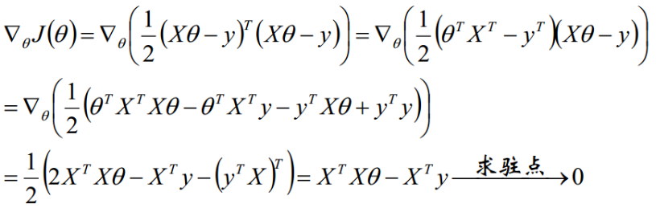
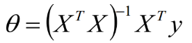

# 线性回归和逻辑回归

## 线性回归

利用大量的样本

通过有监督的学习，学习到由x到y的映射f，利用该映射关系对未知的数据进行预估，因为y为连续值，所以是回归问题。

### 单变量情况

### 多变量情况

二维空间的直线，转化为高维空间的平面

 

### 线性回归的表达式

机器学习是数据驱动的算法，数据驱动=数据+模型，模型就是输入到输出的映射关系。

**模型=假设函数（不同的学习方式）+优化**

**假设函数**

线性回归的假设函数（表示截距项，，方便矩阵表达）：

向量形式（都是列向量）：

### 优化方法

监督学习的优化方法=损失函数+对损失函数的优化

### 损失函数

**如何衡量已有的参数θ的好坏？**

利用损失函数来衡量，损失函数度量预测值和标准答案的偏差，不同的参数有不同的偏差，所以要通过最小化损失函数，也就是最小化偏差来得到最好的参数。

映射函数：

损失函数：

解释：因为有m个样本，所以要平均，分母的2是为了求导方便

损失函数：凸函数

 

### 解析式的求解过程

我们需要最小化目标函数，关心 取什么值的时候，目标函数取得最小值，而目标函数连续，那么 一定为 目标函数的驻点，所以我们求导寻找驻点。

求导可得：

最终我们得到参数 的解析式：

### 线性回归之梯度下降求解

求出代价函数关于的θ偏导（即梯度），最后按照梯度反方向来更新θ。公式推导如下：

 

 

## 逻辑回归

### Logistic回归的主要用途

1. 寻找危险因素：寻找某一疾病的危险因素等
2. 预测：根据模型，预测在不同的自变量情况下，发生某病或某种情况的概率有多大
3. 判别：实际上跟预测有些类似，也是根据模型，判断某人属于某病或属于某种情况的概率有多大，也就是看一下这个人有多大的可能性是属于某病

### 常规步骤

Regression问题的常规步骤为：

1. 寻找h函数（即hypothesis）
2. 构造J函数（损失函数）
3. 想办法使得J函数最小并求得回归参数（θ）

### 构造预测函数h

从名字来理解逻辑回归.在逻辑回归中,逻辑一词是logistics的音译字,并不是因为这个算法是突出逻辑的特性.

至于回归,我们前一段讲到回归任务是结果为连续型变量的任务,logistics regression是用来做分类任务的,为什么叫回归呢?那我们是不是可以假设,逻辑回归就是用回归的办法来做分类的呢.

 

假设刚刚的思路是正确的,逻辑回归就是在用回归的办法做分类任务,那有什么办法可以做到呢,此时我们就先考虑最简单的二分类,结果是正例或者负例的任务.

按照多元线性回归的思路,我们可以先对这个任务进行线性回归,学习出这个事情结果的规律,比如根据人的饮食,作息,工作和生存环境等条件预测一个人"有"或者"没有"得恶性肿瘤,可以先通过回归任务来预测人体内肿瘤的大小,取一个平均值作为阈值,假如平均值为y,肿瘤大小超过y为恶心肿瘤,无肿瘤或大小小于y的,为非恶性.这样通过线性回归加设定阈值的办法,就可以完成一个简单的二分类任务.如下图:

上图中,红色的x轴为肿瘤大小,粉色的线为回归出的函数的图像,绿色的线为阈值.

预测肿瘤大小还是一个回归问题,得到的结果(肿瘤的大小)也是一个连续型变量.通过设定阈值,就成功将回归问题转化为了分类问题.但是,这样做还存在一个问题.

我们上面的假设,依赖于所有的肿瘤大小都不会特别离谱,如果有一个超大的肿瘤在我们的例子中,阈值就很难设定.加入还是取平均大小为阈值,则会出现下图的情况:

从上边的例子可以看出,使用线性的函数来拟合规律后取阈值的办法是行不通的,行不通的原因在于拟合的函数太直,离群值(也叫异常值)对结果的影响过大,但是我们的整体思路是没有错的,错的是用了太"直"的拟合函数,如果我们用来拟合的函数是非线性的,不这么直,是不是就好一些呢?

 

原来的判别函数我们用线性的y = wx, 逻辑回归的函数呢,我们目前就用sigmod函数,函数如下:

函数hθ(x) 的值有特殊的含义，它表示结果取1的概率，因此对于输入x分类结果为类别1和类别0的概率分别为：

### 构造损失函数J

由上式可得似然函数：

对数似然函数为：

最大似然估计就是求使取最大值时的θ，将

因为乘了一个负的系数-1/m，所以取最小值时的θ为要求的最佳参数。可用梯度下降求解。

### 梯度下降法求损失函数最小值

 

 

## 线性回归和逻辑回归的区别

1. 线性回归要求变量服从正态分布，logistic回归对变量分布没有要求
2. 线性回归要求自变量和因变量呈线性关系，而logistic回归不要求自变量和因变量呈线性关系
3. 因变量不同：logistic回归是分析因变量取某个值的概率与自变量的关系，而线性回归是直接分析因变量与自变量的关系

Logistic Regression最大的特点就是将函数值收缩到[0,1]这个范围

## 面试问题

### LR损失函数是什么，LR的梯度是如何表示的

1. **他为什么用****log****损失而不是均方误差损失（最小二乘****)** https://blog.csdn.net/zk_ken/article/details/82284723

- 在逻辑回归这个模型下，**对数损失函数的训练求解参数的速度是比较快的**。至于原因大家可以求出这个式子的梯度更新

- - 

- 这个式子的更新速度只和**x****i****j,** **y****i**关。和sigmod函数本身的梯度是无关的。这样更新的速度是可以自始至终都比较的稳定。

- 为什么不选平方损失函数的呢？其一是因为如果你使用平方损失函数，你会发现梯度更新的速度和sigmod函数本身的梯度是很相关的。sigmod函数在它在定义域内的梯度都不大于0.25。这样训练会非常的慢。

- 如果根据似然函数，直接计算，有两点缺点：(1)不利于后续的求导，(2)似然函数的计算会导致下溢出。

### 逻辑回归不能解决什么问题

- 很难处理数据不平衡的问题。举个例子：如果我们对于一个正负样本非常不平衡的问题比如正负样本比     10000:1.我们把所有样本都预测为正也能使损失函数的值比较小。但是作为一个分类器，它对正负样本的区分能力不会很好。

### 逻辑回归在训练的过程当中，如果有很多的特征高度相关或者说有一个特征重复了100遍，会造成怎样的影响

- 先说结论，如果在损失函数最终收敛的情况下，其实就算有很多特征高度相关也不会影响分类器的效果。
- 但是对特征本身来说的话，假设只有一个特征，在不考虑采样的情况下，你现在将它重复100遍。训练以后完以后，数据还是这么多，但是这个特征本身重复了100遍，实质上将原来的特征分成了100份，每一个特征都是原来特征权重值的百分之一。
- 如果在随机采样的情况下，其实训练收敛完以后，还是可以认为这100个特征和原来那一个特征扮演的效果一样，只是可能中间很多特征的值正负相消了。

### 为什么我们还是会在训练的过程当中将高度相关的特征去掉

- 去掉高度相关的特征会让模型的可解释性更好
- 可以大大提高训练的速度。如果模型当中有很多特征高度相关的话，就算损失函数本身收敛了，但实际上参数是没有收敛的，这样会拉低训练的速度。其次是特征多了，本身就会增大训练的时间。

 

## 逻辑回归的优缺点总结

面试的时候，别人也经常会问到，你在使用逻辑回归的时候有哪些感受。觉得它有哪些优缺点。

   **在这里我们总结了逻辑回归应用到工业界当中一些优点：**

- 形式简单，模型的可解释性非常好。从特征的权重可以看到不同的特征对最后结果的影响，某个特征的权重值比较高，那么这个特征最后对结果的影响会比较大。
- 模型效果不错。在工程上是可以接受的（作为baseline)，如果特征工程做的好，效果不会太差，并且特征工程可以大家并行开发，大大加快开发的速度。
- 训练速度较快。分类的时候，计算量仅仅只和特征的数目相关。并且逻辑回归的分布式优化sgd发展比较成熟，训练的速度可以通过堆机器进一步提高，这样我们可以在短时间内迭代好几个版本的模型。
- 资源占用小,尤其是内存。因为只需要存储各个维度的特征值，。
- 方便输出结果调整。逻辑回归可以很方便的得到最后的分类结果，因为输出的是每个样本的概率分数，我们可以很容易的对这些概率分数进行cutoff，也就是划分阈值(大于某个阈值的是一类，小于某个阈值的是一类)。

   **但是逻辑回归本身也有许多的缺点:**

- 准确率并不是很高。因为形式非常的简单(非常类似线性模型)，很难去拟合数据的真实分布。
- 很难处理数据不平衡的问题。
- 处理非线性数据较麻烦。逻辑回归在不引入其他方法的情况下，只能处理线性可分的数据，或者进一步说，处理二分类的问题     。
- 逻辑回归本身无法筛选特征。有时候，我们会用gbdt来筛选特征，然后再上逻辑回归。

 

## **LR与SVM**

https://blog.csdn.net/ccblogger/article/details/81711840

首先是两者的**共同点**：

1. LR和SVM都是分类算法
2. 如果不考虑核函数，LR和SVM都是线性分类算法，即分类决策面都是线性的
3. LR和SVM都是有监督学习算法
4. LR和SVM都是判别模型

两者的**不同点**：

1. 损失函数的不同，逻辑回归采用的是log loss（对数损失函数），svm采用的是hinge loss（合页损失函数）
2. 分类原理的不同，LR基于概率理论，通过极大似然估计的方法估计出参数的值，而SVM基于几何间隔最大化原理，认为存在最大几何间隔的分类面为最优分类面，从最大间隔出发，转化为求对变量w和b的凸二次规划问题
3. 由于分类原理的不同，也导致了LR是所有样本都有影响，而SVM只是少量样本有影响的（支持向量），在支持向量外添加样本点是没有影响的
4. 正因为LR受数据影响较大，所以在数据不同类别时，要先对数据做balancing
5. 同样的，由于SVM依赖数据表达的距离测度，所以要先对数据做normalization标准化
6. 对于线性不可分的情况，SVM的核函数可以帮助将低维不可分的数据转换到高维，变成线性可分的，而LR很少用到核函数（并不是没有。）假设我们在LR里也运用核函数的原理，那么每个样本点都必须参与核计算，这带来的计算复杂度是相当高的。所以，在具体应用时，LR很少运用核函数机制
7. SVM的损失函数就自带正则（损失函数中的1/2||w||^2项），这就是为什么SVM是结构风险最小化算法的原因，而LR必须另外在损失函数上添加正则化

**关于LR和SVM的选择：**

1. 如果Feature的数量很大，跟样本数量差不多，这时候选用LR或者是Linear Kernel的SVM
2. 如果Feature的数量比较小，样本数量一般，不算大也不算小，选用SVM+Gaussian Kernel
3. 如果Feature的数量比较小，而样本数量很多，需要手工添加一些feature变成第一种情况

## 参考文献

[线性回归和逻辑回归](https://blog.csdn.net/jiaoyangwm/article/details/81139362)

[逻辑回归](https://blog.csdn.net/weixin_39445556/article/details/83930186)