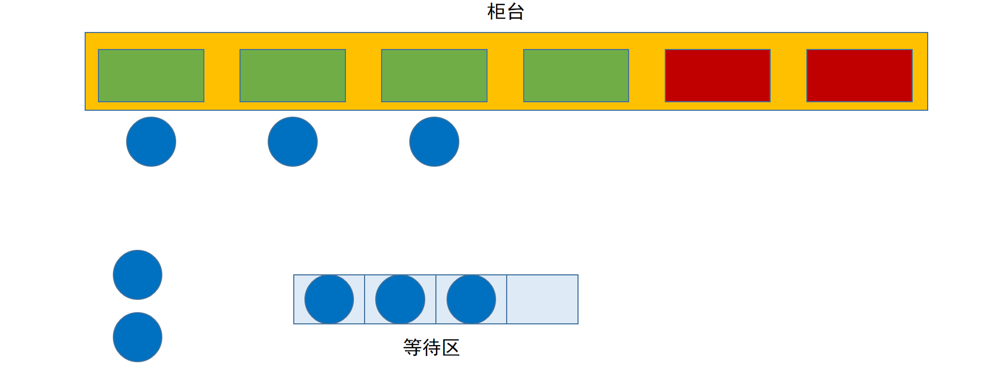

# 线程池

池化思想：线程池、字符串常量池、数据库连接池

提高资源的利用率

1. 手动创建对象
2. 执行任务
3. 执行完毕，释放线程对象

线程池的优点：

1. 提高线程的利用率
2. 提高程序的响应速度
3. 便于统一管理线程对象
4. 可以控制最大并发数

<iframe src="//player.bilibili.com/player.html?aid=627135272&bvid=BV1dt4y1i7Gt&cid=237251751&page=1" scrolling="no" border="0" frameborder="no" framespacing="0" allowfullscreen="true"> </iframe>



```java
ExecutorService executorService = new ThreadPoolExecutor(3, 3, 1L, TimeUnit.SECONDS, new ArrayBlockingQueue<>(3), Executors.defaultThreadFactory(), new ThreadPoolExecutor.AbortPolicy());
for (int i = 0; i < 2; i++) {
    executorService.execute(() -> {
        System.out.println(Thread.currentThread().getName() + "正在执行");
    });
}
executorService.shutdown();
```

<iframe src="//player.bilibili.com/player.html?aid=714397419&bvid=BV1SX4y1G79Z&cid=305079680&page=1" scrolling="no" border="0" frameborder="no" framespacing="0" allowfullscreen="true"> </iframe>

## 线程和线程池的区别

### 实现多线程的方式

实际上只有1种

## 线程复用


## 线程池参数

### corePoolSize

核心线程数

### maximunPoolSize

非核心线程数

### keepAliveTime

时间

### unit

时间单位

### blockingQueue

队列

### threadFactory

线程工厂

### rejectedExecutionHandler

拒绝策略

## Excutors

### newCacheThreadPool

### newFixedThreadPool

### newSingleThreadPool

# 参考文献

[java 线程池（线程的复用）](https://www.cnblogs.com/myseries/p/10895078.html)

