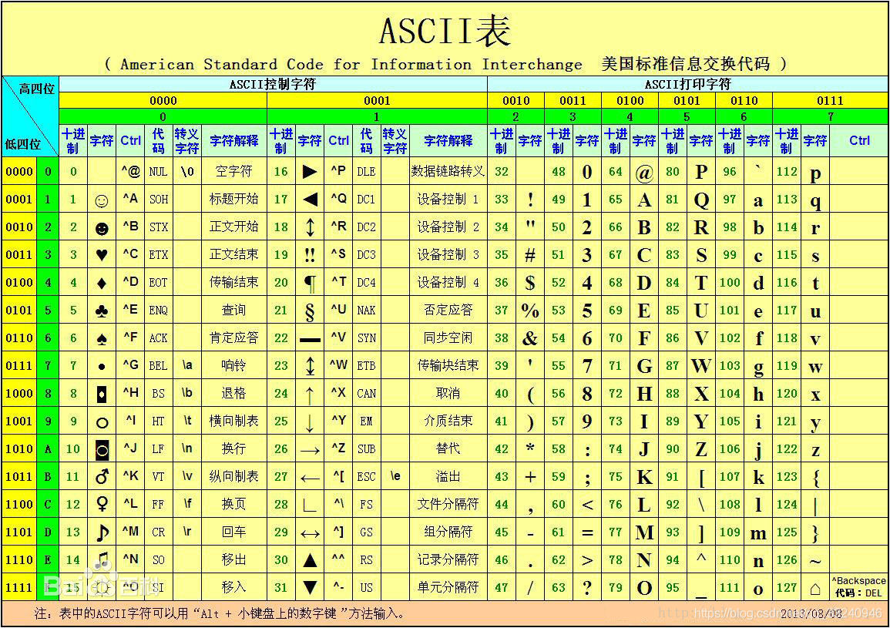

# 编码与解码

## 编码

人类先有了自己的语言，交流了若干个世纪，然后出现了计算机。可惜计算机只认`0`和`1`，人类只能认文字，双方都不能妥协，那就必须要有一个从文字到`0、1`的映射了。从文字到`0、1`的映射称为编码，反过来从`0、1`到文字叫解码

**编码**：将字符转为字节序列（`abcdefg`->`0101010…10010`）
**解码**：将字节序列转为字符（`1001010…10010110`-> `abcdefg`）

### ASCII编码

计算机，它只认识`0`和`1`，也就是高低电平。于是想让计算机识别我们人类的语言，也就是字符，则需要一个对应关系。由于计算机在美国诞生，于是美国给了一个对应关系表，称为`ASCII`编码

计算机里只有`0`和`1`，怎么来表示`Hello World`呢（假如我们在美国），那就需要将字母数字及标点符号编一个号。一个字节可以表示`256`个数字，表示字母数字标点足够了，所以用一个字节就可以对应一个字符了。这样一来计算机在显示文字的时候，先将`0`、`1`解码成对应的文字，然后在屏幕上渲染出来就可以了。我们将`Hello World`叫做字符，计算机实际存储的是字符对应的编号，这些编号就叫字节流。

.上边这种编码就是ASCII码，如果计算机只在美国用或者只显示英语，那编码就是透明的，谁都不需要去关心编码，一切都觉得理所当然。

各个国家为了使用计算机，也需要本国的语言符号被计算机识别，于是各种编码层出不穷：中国有`GBK`，日本有`EUC-JP`，韩国有`EUC-KR`，甚至一个国家也不只有一种编码，比如中国繁体还有`big5`等等。总之就是，每个国家为了让计算机认识自己国家的文字，都出了许多对应的编码。

很显然这样做并不长久，每个国家都有自己的编码实在有点乱，连两个国家的语言都不能放在一起。所以可以将世界当成一个整体，把所有的文字统一编号，这时候就出现了`unicode`编码。

### Unicode编码

每个国家都制定了自己的编码，每个网站都可以在自己的国家运行良好。但互联网是让全世界连成了一体，当本国发出的信息走向国际时，多语言环境让每一种编码都措手不及。于是出现了`unicode`编码

> Unicode（中文：万国码、国际码、统一码、单一码）是计算机科学领域里的一项业界标准。它对世界上大部分的文字系统进行了整理、编码，使得计算机可以用更为简单的方式来呈现和处理文字。
>
> Unicode伴随着通用字符集的标准而发展，同时也以《The Unicode Standard》书本的形式对外发表。Unicode至今仍在不断增修，每个新版本都加入更多新的字符。当前最新的版本为2019年3月5日公布的12.0.0[2]，已经收录超过13万个字符（第十万个字符在2005年获采纳）。Unicode涵盖的数据除了视觉上的字形、编码方法、标准的字符编码外，还包含了字符特性，如大小写字母。 ——维基百科

`unicode`编码就是收录了全世界的所有字符，统一进行编码。

unicode编码用了两个字节来表示一个字符。其实，编码的发展过程并没有这么顺利，中间还是出现了很多其他的编码。那问题岂不是解决了，大家都用`unicode`不就完事了吗，哪有这么简单呢，`unicode`出现之前计算机领域已经有很多成型的操作系统软件甚至标准，不可能都统一改成`unicode`编码。所以到现在还是会遇到编码问题，`unicode`只是给我们提供了一种统一解释所有文字的编码方案

`Unicode`的实现方式不同于编码方式。一个字符的`Unicode`编码是确定的（也就是说，字符对应的数字是确定的）。但是在实际传输过程中，由于不同系统平台的设计不一定一致，以及出于节省空间的目的，对`Unicode`编码的实现方式有所不同（也就是说，这个数字用几个字节来存有所不同）。`Unicode`的实现方式称为`Unicode`转换格式（`Unicode Transformation Format`，简称为`UTF`）。比如`UTF-8`、`UTF-16`等。可以简单理解，`unicode`是一个字符集，`utf8`等是这个字符集的不同编码规则实现

### UTF

事实证明，对可以用`ASCII`表示的字符使用`UNICODE`并不高效，因为`UNICODE`比`ASCII`占用大一倍的空间，而对`ASCII`来说高字节的`0`对他毫无用处。为了解决这个问题，就出现了一些中间格式的字符集，他们被称为通用转换格式，即`UTF（Unicode Transformation Format）`。目前存在的UTF格式有：`UTF-7`，`UTF-7.5`，`UTF-8`，`UTF-16`，以及 `UTF-32`。

`UTF`，是**U**nicode **T**ransformation **F**ormat的缩写，意为`Unicode`转换格式。

其中，`UTF-8`是`UTF`中最常用的转换格式，是`UNICODE`的一种变长字符编码

`UTF-8`（`8`位元，`Universal Character Set/Unicode Transformation Format`）是针对`Unicode`的一种可变长度字符编码。它可以用来表示`Unicode`标准中的任何字符，而且其编码中的第一个字节仍与`ASCII`相容，使得原来处理`ASCII`字符的软件无须或只进行少部分修改后，便可继续使用。因此，它逐渐成为电子邮件、网页及其他存储或传送文字的应用中，优先采用的编码

> 在所有字符集中，最知名的可能要数被称为ASCII的8位字符集了。它是美国标准信息交换代码（American Standard Code for Information Interchange）的缩写, 为美国英语通信所设计。它由128个字符组成，包括大小写字母、数字0-9、标点符号、非打印字符（换行符、制表符等4个）以及控制字符（退格、响铃等）组成。
> 但是，由于它是针对英语设计的，当处理带有音调标号（形如汉语的拼音）的亚洲文字时就会出现问题。因此，创建出了一些包括256个字符的由ASCII扩展的字符集。其中有一种通常被称为IBM字符集，它把值为128-255之间的字符用于画图和画线，以及一些特殊的欧洲字符。另一种8位字符集是ISO 8859-1Latin 1，也简称为ISOLatin-1。它把位于128-255之间的字符用于拉丁字母表中特殊语言字符的编码，也因此而得名。欧洲语言不是地球上的唯一语言，因此亚洲和非洲语言并不能被8位字符集所支持。仅汉语字母表（或pictograms）就有80000以上个字符。但是把汉语、日语和越南语的一些相似的字符结合起来，在不同的语言里，使不同的字符代表不同的字，这样只用2个字节就可以编码地球上几乎所有地区的文字。因此，创建了UNICODE编码。它通过增加一个高字节对ISO Latin-1字符集进行扩展，当这些高字节位为0时，低字节就是ISO Latin-1字符。UNICODE支持欧洲、非洲、中东、亚洲（包括统一标准的东亚象形汉字和韩国表音文字）。但是，UNICODE并没有提供对诸如Braille(盲文),Cherokee, Ethiopic(埃塞俄比亚语), Khmer(高棉语), Mongolian(蒙古语), Hmong(苗语), Tai Lu, Tai Mau文字的支持。同时它也不支持如Ahom(阿霍姆语), Akkadian(阿卡德语), Aramaic(阿拉米语), Babylonian Cuneiform(古巴比伦楔形文字), Balti(巴尔蒂语), Brahmi(婆罗米文), Etruscan(伊特拉斯坎语), Hittite(赫梯语/西台语), Javanese(爪哇语)，Numidian(努米底亚语), Old Persian Cuneiform(古波斯楔形文字)，Syrian(叙利亚语)之类的古老文字。
> Unicode只是一组字符设定或者说是从数字和字符之间的逻辑映射的概念编码，但是它并没有指定代码点如何在计算机上存储。UCS4、UTF-8、UTF-16（UTF后的数字代表编码的最小单位，如UTF-8表示最小单位1字节（=8 bits）,所以它可以使用1、2、3字节等进行编码，UTF-16表示最小单位2字节，所以它可以使用2、4字节进行编码）都是Unicode的编码方案。其中UTF-8因可以兼容ASCII而被广泛使用

## 乱码

编码之所以受到关注，乱码几乎起到了决定性的作用

出现乱码的原因就是文本字符编码过程与字节流解码过程使用了不同的编码格式，这个往往归咎于解码格式选择错误，也就是说在解码的过程中出现了问题。如果我的字符是用`utf-8`编码，你用`GBK`解码那肯定出问题。因为文字按照`utf-8`的编码规则编成的`0、1`，按照`GBK`的规则解码回来的文字并不是原来的文字，这时候就会出现乱码了。这种问题会出现在文件读写、网络编码传输、数据库存取上。只要牵涉到字符都有可能出现乱码，因为只要有字符就会有解码过程。

还有一种情况就是文件压根不是文本文件，也就是说根本就没有经过编码这个过程，那你去解码当然乱码了。比如`64`，你如果看做文本字符就是`6`和`4`两个字符，可以对应编码格式进行编码。如果看做是数字`64`，那对应的存储结构是`01000000`，就没有编码过程，也就不需要去解码

要搞清楚的一点就是同样的文本字符，经过不同的编码，在存储结构上是不一样的，但是代表的字符是一样的，不同编码真正的区别在于存储结构。反过来，相同的存储结构，经过不同的解码，对应的文本字符并不一样，但是在内存上结构上并没有改变。如果碰到乱码，不要慌张，因为原始存储结构一动没动，只不过用错了解码方式。就像一千个读者有一千个哈姆雷特一样，真实的哈姆雷特就在那里。

乱码是显示在屏幕上才被认为是乱码，也就是说乱码取决于人的感官，乱码只有人才知道﹐计算机不认为这是乱码。

## 参考文献

[从原理上搞定编码（一）-- 初识编码](https://www.cnblogs.com/luguo3000/p/3592562.html)

[编码和解码](https://blog.csdn.net/qq_33240946/article/details/88936379)

