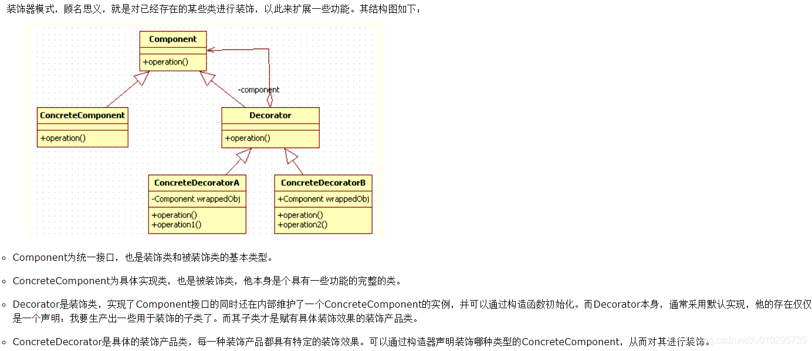

# 装饰器模式

装饰器的价值在于装饰，他并不影响被装饰类本身的核心功能。在一个继承的体系中，子类通常是互斥的。比如一辆车，品牌只能要么是奥迪、要么是宝马，不可能同时属于奥迪和宝马，而品牌也是一辆车本身的重要属性特征。但当你想要给汽车喷漆，换坐垫，或者更换音响时，这些功能是互相可能兼容的，并且他们的存在不会影响车的核心属性：那就是他是一辆什么车。这时你就可以定义一个装饰器：喷了漆的车。不管他装饰的车是宝马还是奥迪，他的喷漆效果都可以实现。

1. `Component`
2. `ComponentDecorator`
   1. `component`
   2. `action()`->`component.action() + 装饰`



```java
//基础接口
public interface Component {
    
    public void biu();
}
//具体实现类
public class ConcretComponent implements Component {
 
    public void biu() {
        
        System.out.println("biubiubiu");
    }
}
//装饰类
public class Decorator implements Component {
 
    public Component component;
    
    public Decorator(Component component) {
        
        this.component = component;
    }
    
    public void biu() {
        
        this.component.biu();
    }
}
//具体装饰类
public class ConcreteDecorator extends Decorator {
 
    public ConcreteDecorator(Component component) {
 
        super(component);
    }
 
    public void biu() {
        
        System.out.println("ready?go!");
        this.component.biu();
    }
}
```

```java
//使用装饰器
Component component = new ConcreteDecorator(new ConcretComponent());
component.biu();
 
//console：
ready?go!
biubiubiu
```

同一级下的兄弟类通常有很多。当你有五个甚至十个ConcreteComponent时，再想要为每个类都加上“ready？go！”的效果，就要写出五个子类了。毫无疑问这是不合理的。装饰器模式在不影响各个ConcreteComponent核心价值的同时，添加了他特有的装饰效果，具备非常好的通用性，这也是他存在的最大价值

## 参考文献

[装饰器模式(Decorator)——深入理解与实战应用](https://www.cnblogs.com/jzb-blog/p/6717349.html)


