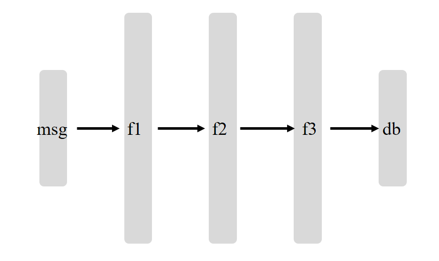
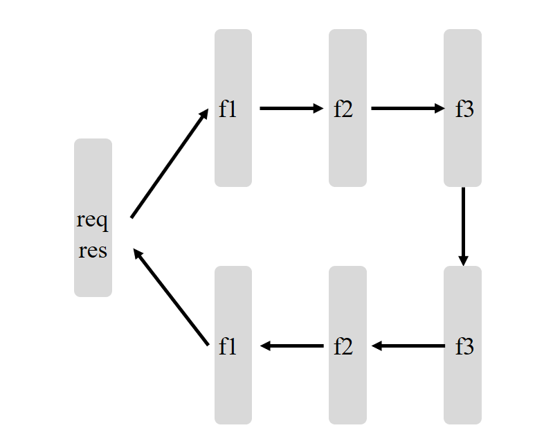

# 责任链模式

`Chain of Responsibility Pattern`

`javax.servlet.Filter`

 在论坛中发表文章

后台要经过信息处理才可以发表或者进入数据库

 

传统过滤

```java
public class RespoMain {
    public static void main(String[] args) {
        Msg msg = new Msg();
        msg.setMsg("大家好，:)，欢迎访问www.baidu.com");

        msg.setMsg(msg.getMsg().replace(":)","嘻嘻"));
        msg.setMsg(msg.getMsg().replace("www.baidu.com"," https://www.baidu.com"));
        System.out.println(msg.getMsg());
    }
}
```

增加Filter接口，实现doFilter方法，实现FaceFilter和HttpFilter

```java
public interface Filter {
    void doFilter(Msg msg);
}
```

```java
public class FaceFilter implements Filter {
    @Override
    public void doFilter(Msg msg) {
        msg.setMsg(msg.getMsg().replace(":)", "嘻嘻"));
    }
}
```

```java
public class HttpFilter implements Filter{
    @Override
    public void doFilter(Msg msg) {
        msg.setMsg(msg.getMsg().replace("www.baidu.com"," https://www.baidu.com"));
    }
}
```

```java
public class RespoMain {
    public static void main(String[] args) {
        Msg msg = new Msg();
        msg.setMsg("大家好，:)，欢迎访问www.baidu.com");

        FaceFilter faceFilter = new FaceFilter();
        HttpFilter httpFilter = new HttpFilter();
        faceFilter.doFilter(msg);
        httpFilter.doFilter(msg);
        System.out.println(msg.getMsg());
    }
}
```

多个`filter`过滤，可以用数组

```java
public class RespoMain {
    public static void main(String[] args) {
        Msg msg = new Msg();
        msg.setMsg("大家好，:)，欢迎访问www.baidu.com");

        List<Filter> filters = new ArrayList<>();
        filters.add(new FaceFilter());
        filters.add(new HttpFilter());

        for (Filter filter :
                filters) {
            filter.doFilter(msg);
        }
        System.out.println(msg.getMsg());
    }
}
```

增加`filterChain`，实现`Filter`可实现责任链链接责任链

```java
public class FilterChain implements Filter {

    private List<Filter> filters = new ArrayList<>();


    @Override
    public void doFilter(Msg msg) {
        for (Filter filter :
                filters) {
            filter.doFilter(msg);
        }
    }

    FilterChain add(Filter filter) {
        filters.add(filter);
        return this;
    }

    FilterChain remove(Filter filter) {
        filters.remove(filter);
        return this;
    }

}
```

```java
public class RespoMain {
    public static void main(String[] args) {
        Msg msg = new Msg();
        msg.setMsg("大家好，:)，欢迎访问www.baidu.com");

        FilterChain filterChain = new FilterChain();
        filterChain.add(new FaceFilter()).add(new HttpFilter());
        filterChain.doFilter(msg);
        System.out.println(msg.getMsg());
    }
}
```

责任链中断，`Filter`的`doFilter`方法返回`boolean`

```java
public interface Filter {
    boolean doFilter(Msg msg);
}
```

```java
public class FaceFilter implements Filter {
    @Override
    public boolean doFilter(Msg msg) {
        msg.setMsg(msg.getMsg().replace(":)", "嘻嘻"));
        return false;
    }
}
```

```java
public class HttpFilter implements Filter {
    @Override
    public boolean doFilter(Msg msg) {
        msg.setMsg(msg.getMsg().replace("www.baidu.com", " https://www.baidu.com"));
        return true;
    }
}
```

```java
public class FilterChain implements Filter {

    private List<Filter> filters = new ArrayList<>();


    @Override
    public boolean doFilter(Msg msg) {
        for (Filter filter :
                filters) {
            if (!filter.doFilter(msg)) {
                return false;
            }
        }
        return false;
    }

    FilterChain add(Filter filter) {
        filters.add(filter);
        return this;
    }

    FilterChain remove(Filter filter) {
        filters.remove(filter);
        return this;
    }

}
```

```java
public class RespoMain {
    public static void main(String[] args) {
        Msg msg = new Msg();
        msg.setMsg("大家好，:)，欢迎访问www.baidu.com");

        FilterChain filterChain = new FilterChain();
        filterChain.add(new FaceFilter()).add(new HttpFilter());
        filterChain.doFilter(msg);
        System.out.println(msg.getMsg());
    }
}
```

```
大家好，嘻嘻，欢迎访问www.baidu.com
```

实现`Filter`



```java
public class Request {
    private String info;

    public String getInfo() {
        return info;
    }

    public void setInfo(String info) {
        this.info = info;
    }
}
```

```java
public class Response {
    private String info;

    public String getInfo() {
        return info;
    }

    public void setInfo(String info) {
        this.info = info;
    }
}
```

```java
public interface Filter {
    void doFilter(Request request, Response response, FilterChain filterChain);
}
```

```java
public class OneFilter implements Filter {
    @Override
    public void doFilter(Request request, Response response, FilterChain filterChain) {
        request.setInfo(request.getInfo() + " one filter");
        filterChain.doFilter(request, response);
        response.setInfo(response.getInfo() + " one filter");
    }
}
```

```java
public class TwoFilter implements Filter {
    @Override
    public void doFilter(Request request, Response response, FilterChain filterChain) {
        request.setInfo(request.getInfo() + " two filter");
        filterChain.doFilter(request, response);
        response.setInfo(response.getInfo() + " two filter");
    }
}
```

```java
public class FilterChain {

    private List<Filter> filters = new ArrayList<>();

    private Integer index = 0;

    void add(Filter filter) {
        filters.add(filter);
    }

    void remove(Filter filter) {
        filters.remove(filter);
    }

    public void doFilter(Request request, Response response) {
        if (index == filters.size()) {
            return;
        }
        Filter filter = filters.get(index);
        index++;
        filter.doFilter(request, response, this);
    }
}
```

```java
public class FilterMain {
    public static void main(String[] args) {
        FilterChain filterChain = new FilterChain();
        filterChain.add(new OneFilter());
        filterChain.add(new TwoFilter());
        Request request = new Request();
        request.setInfo("init request");
        Response response = new Response();
        response.setInfo("init response");
        filterChain.doFilter(request, response);
        System.out.println(request.getInfo());
        System.out.println(response.getInfo());
    }
}
```

```
init request one filter two filter
init response two filter one filter
```

