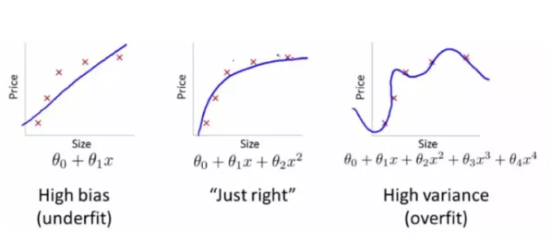
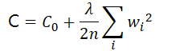

# 过拟合和欠拟合

机器学习的基本问题是

利用模型对数据进行拟合，学习的目的并非是对有限训练集进行正确预测，而是对未曾在训练集合出现的样本能够正确预测。

模型对训练集数据的误差称为经验误差，对测试集数据的误差称为泛化误差。模型对训练集以外样本的预测能力就称为模型的泛化能力，追求这种泛化能力始终是机器学习的目标

过拟合(overfitting)和欠拟合(underfitting)是导致模型泛化能力不高的两种常见原因，都是模型学习能力与数据复杂度之间失配的结果。

欠拟合常常在模型学习能力较弱，而数据复杂度较高的情况出现，此时模型由于学习能力不足，无法学习到数据集中的“一般规律”，因而导致泛化能力弱。

与之相反，“过拟合”常常在模型学习能力过强的情况中出现，此时的模型学习能力太强，以至于将训练集单个样本自身的特点都能捕捉到，并将其认为是“一般规律”，同样这种情况也会导致模型泛化能力下降

过拟合与欠拟合的区别在于，欠拟合在训练集和测试集上的性能都较差，而过拟合往往能较好地学习训练集数据的性质，而在测试集上的性能较差。在神经网络训练的过程中，欠拟合主要表现为输出结果的高偏差，而过拟合主要表现为输出结果的高方差

 

 

## 欠拟合

欠拟合出现原因

1. 模型复杂度过低
2. 特征量过少

欠拟合的情况比较容易克服，常见解决方法有

1. 增加新特征，可以考虑加入进特征组合、高次特征，来增大假设空间；添加多项式特征，这个在机器学习算法里面用的很普遍，例如将线性模型通过添加二次项或者三次项使模型泛化能力更强
2. 减少正则化参数，正则化的目的是用来防止过拟合的，但是模型出现了欠拟合，则需要减少正则化参数
3. 使用非线性模型，比如核SVM 、决策树、深度学习等模型
4. 调整模型的容量(capacity)，通俗地，模型的容量是指其拟合各种函数的能力
5. 容量低的模型可能很难拟合训练集；使用集成学习方法，如Bagging ,将多个弱学习器Bagging

## 过拟合

过拟合出现原因

建模样本选取有误，如样本数量太少，选样方法错误，样本标签错误等，导致选取的样本数据不足以代表预定的分类规则

样本噪音干扰过大，使得机器将部分噪音认为是特征从而扰乱了预设的分类规则

假设的模型无法合理存在，或者说是假设成立的条件实际并不成立

参数太多，模型复杂度过高

对于决策树模型，如果我们对于其生长没有合理的限制，其自由生长有可能使节点只包含单纯的事件数据(event)或非事件数据(no event)，使其虽然可以完美匹配（拟合）训练数据，但是无法适应其他数据集

对于神经网络模型：a)对样本数据可能存在分类决策面不唯一，随着学习的进行,，BP算法使权值可能收敛过于复杂的决策面；b)权值学习迭代次数足够多(Overtraining)，拟合了训练数据中的噪声和训练样例中没有代表性的特征

### 过拟合的解决方案

1. 正则化（Regularization）（L1和L2）
2. 数据扩增，即增加训练数据样本
3. Dropout
4. Early stopping

### 正则化

在模型训练的过程中，需要降低 loss 以达到提高 accuracy 的目的。此时，使用正则化之类的方法直接将权值的大小加入到 loss 里，在训练的时候限制权值变大。训练过程需要降低整体的 loss，这时候，一方面能降低实际输出与样本之间的误差，也能降低权值大小

 

正则化方法包括 L0 正则、 L1 正则和 L2 正则，而正则一般是在目标函数之后加上对于的范数。但是在机器学习中一般使用 L2 正则:

L2范数是指向量各元素的平方和然后求平方根。可以使得 W的每个元素都很小，都接近于0，但不会让它等于0，而是接近于0。 L2正则项起到使得参数 W变小加剧的效果，关于它为什么能防止过拟合简答的理解为：更小的参数值W意味着模型的复杂度更低，对训练数据的拟合刚刚好，不会过分拟合训练数据，从而使得不会过拟合，以提高模型的泛化能力

 

### 数据增广

这是解决过拟合最有效的方法，只要给足够多的数据，让模型「看见」尽可能多的「例外情况」，它就会不断修正自己，从而得到更好的结果

如何获取更多数据，可以有以下几个方法

 

1. 从数据源头获取更多数据
2. 根据当前数据集估计数据分布参数，使用该分布产生更多数据：这个一般不用，因为估计分布参数的过程也会代入抽样误差
3. 数据增强（Data Augmentation）：通过一定规则扩充数据。如在物体分类问题里，物体在图像中的位置、姿态、尺度，整体图片明暗度等都不会影响分类结果。我们就可以通过图像平移、翻转、缩放、切割等手段将数据库成倍扩充

### Dropout

在训练时，每次随机（如50%概率）忽略隐层的某些节点；这样，我们相当于随机从 2^n(n个神经元的网络) 个模型中采样选择模型

### Early stopping

Early stopping便是一种迭代次数截断的方法来防止过拟合的方法，即在模型对训练数据集迭代收敛之前停止迭代来防止过拟合

具体做法是，在每一个Epoch结束时计算validation data的accuracy，当accuracy不再提高时，就停止训练。当然我们并不会在accuracy一降低的时候就停止训练，因为可能经过这个Epoch后，accuracy降低了，但是随后的Epoch又让accuracy又上去了，所以不能根据一两次的连续降低就判断不再提高。一般的做法是，在训练的过程中，记录到目前为止最好的validation accuracy，当连续10次Epoch（或者更多次）没达到最佳accuracy时，则可以认为accuracy不再提高了。此时便可以停止迭代了（Early Stopping）。这种策略也称为“No-improvement-in-n”，n即Epoch的次数，可以根据实际情况取，如10、20、30……