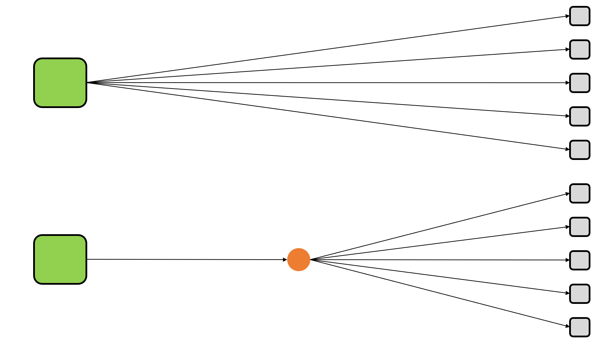
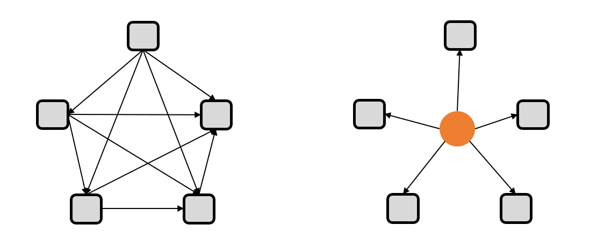

# 门面与调停者模式

## 门面模式

`Facade`

门面模式是对象的结构模式，外部与一个子系统的通信必须通过一个统一的门面对象进行。门面模式提供一个高层次的接口，使得子系统更易于使用。

在这个对象图中，出现了两个角色：

- **门面(Facade)角色** ：客户端可以调用这个角色的方法。此角色知晓相关的（一个或者多个）子系统的功能和责任。在正常情况下，本角色会将所有从客户端发来的请求委派到相应的子系统去。
- **子系统(SubSystem)角色** ：可以同时有一个或者多个子系统。每个子系统都不是一个单独的类，而是一个类的集合（如上面的子系统就是由`ModuleA`、`ModuleB`、`ModuleC`三个类组合而成）。每个子系统都可以被客户端直接调用，或者被门面角色调用。子系统并不知道门面的存在，对于子系统而言，门面仅仅是另外一个客户端而已。

使用门面模式还有一个附带的好处，就是能够有选择性地暴露方法。一个模块中定义的方法可以分成两部分，一部分是给子系统外部使用的，一部分是子系统内部模块之间相互调用时使用的。有了`Facade`类，那么用于子系统内部模块之间相互调用的方法就不用暴露给子系统外部了

### 一个系统可以有几个门面

　　在门面模式中，通常只需要一个门面类，并且此门面类只有一个实例，换言之它是一个单例类。当然这并不意味着在整个系统里只有一个门面类，而仅仅是说对每一个子系统只有一个门面类。或者说，如果一个系统有好几个子系统的话，每一个子系统都有一个门面类，整个系统可以有数个门面类。

### 为子系统增加新行为

　　初学者往往以为通过继承一个门面类便可在子系统中加入新的行为，这是错误的。门面模式的用意是为子系统提供一个集中化和简化的沟通管道，而不能向子系统加入新的行为。比如医院中的接待员并不是医护人员，接待员并不能为病人提供医疗服务。

　　如果一个门面模式不能将子系统的所有的行为提供给外界,那么可以通过修改门面类或继承门面类的方法,使门面类或子类将子系统的行为提供给外界.但是如果一个子系统没有某个行为,想通过修改门面类或继承门面类的方法来提供这种新行为是错误的。

### 门面模式的优点：

- 松散耦合。门面模式松散了客户端与子系统的耦合关系，让子系统内部的模块能更容易扩展和维护。
- 简单易用。门面模式让子系统更加易用，客户端不再需要了解子系统内部的实现，也不需要跟众多子系统内部的模块进行交互，只需要跟门面类交互就可以了。
- 更好的划分访问层次。通过合理使用`Facade`，可以帮助我们更好地划分访问的层次。有些方法是对系统外的，有些方法是系统内部使用的。把需要暴露给外部的功能集中到门面中，这样既方便客户端使用，也很好地隐藏了内部的细节。

## 调停者模式

调停者模式是对象的行为模式。调停者模式包装了一系列对象相互作用的方式，使得这些对象不必相互明显引用。从而使它们可以较松散地耦合。当这些对象中的某些对象之间的相互作用发生改变时，不会立即影响到其他的一些对象之间的相互作用。从而保证这些相互作用可以彼此独立地变化

消息中间件（MQ）

解耦

如下图所示，这个示意图中有大量的对象，这些对象既会影响别的对象，又会被别的对象所影响，因此常常叫做同事(`Colleague`)对象。这些同事对象通过彼此的相互作用形成系统的行为。从图中可以看出，几乎每一个对象都需要与其他的对象发生相互作用，而这种相互作用表现为一个对象与另一个对象的直接耦合。这就是过度耦合的系统

通过引入调停者对象(`Mediator`)，可以将系统的网状结构变成以中介者为中心的星形结构，如下图所示。在这个星形结构中，同事对象不再通过直接的联系与另一个对象发生相互作用；相反的，它通过调停者对象与另一个对象发生相互作用。调停者对象的存在保证了对象结构上的稳定，也就是说，系统的结构不会因为新对象的引入造成大量的修改工作。

一个好的面向对象的设计可以使对象之间增加协作性(`Collaboration`)，减少耦合度(`Couping`)。一个深思熟虑的设计会把一个系统分解为一群相互协作的同事对象，然后给每一个同事对象以独特的责任，恰当的配置它们之间的协作关系，使它们可以在一起工作。

调停者模式包括以下角色：

- 抽象调停者(`Mediator`)角色：定义出同事对象到调停者对象的接口，其中主要方法是一个（或多个）事件方法。
- 具体调停者(`ConcreteMediator`)角色：实现了抽象调停者所声明的事件方法。具体调停者知晓所有的具体同事类，并负责具体的协调各同事对象的交互关系。
- 抽象同事类(`Colleague`)角色：定义出调停者到同事对象的接口。同事对象只知道调停者而不知道其余的同事对象。
- 具体同事类(`ConcreteColleague`)角色：所有的具体同事类均从抽象同事类继承而来。实现自己的业务，在需要与其他同事通信的时候，就与持有的调停者通信，调停者会负责与其他的同事交互。

### 调停者模式的优点

- 松散耦合.调停者模式通过把多个同事对象之间的交互封装到调停者对象里面，从而使得同事对象之间松散耦合，基本上可以做到互补依赖。这样一来，同事对象就可以独立地变化和复用，而不再像以前那样“牵一处而动全身”了。
- 集中控制交互.多个同事对象的交互，被封装在调停者对象里面集中管理，使得这些交互行为发生变化的时候，只需要修改调停者对象就可以了，当然如果是已经做好的系统，那么就扩展调停者对象，而各个同事类不需要做修改。
- 多对多变成一对多.没有使用调停者模式的时候，同事对象之间的关系通常是多对多的，引入调停者对象以后，调停者对象和同事对象的关系通常变成双向的一对多，这会让对象的关系更容易理解和实现。

### 调停者模式的缺点

　　调停者模式的一个潜在缺点是，过度集中化。如果同事对象的交互非常多，而且比较复杂，当这些复杂性全部集中到调停者的时候，会导致调停者对象变得十分复杂，而且难于管理和维护。

### 门面模式和中介者（调停者模式）的区别

　　门面模式为复杂的子系统提供给一个统一的访问界面，它定义的而是一个高层接口，该接口使得子系统更加容易使用，避免外部模块深入到子系统内部而产生于子系统内部细节耦合的问题。中介者模式是用一个中介对象来封装一系列同事对象的交互行为，它使各对象之间不再显示地引用，从而使其耦合松散，建立一个可扩展应用架构。

　　门面模式和中介者模式之间的区别还是比较明显的，门面模式是以封装和隔离为主要任务，而中介者模式则是以调和同事类之间的关系为主，因为要调和，所以具有了子系统的业务逻辑控制。

   功能区别：门面模式只增加了一个门面，他对子系统来说没有增加任何的功能，子系统若脱离门面独立运行完全是可以的。而中介者模式则增加了业务功能，它把各个同事类中的原有耦合关系移植到了中介者，同事类不可能脱离中介者而独立存在。

   知晓状态不同：对门面模式来说，子系统部知道有门面存在，而对中介者来说，每个同事类都知道中介者的存在，因为要依靠中介者调和同事之间的关系

   封装程度不同：门面模式是一种简单的封装，所有的请求处理都委托给子系统完成，而中介者模式则需要有一个中心，由中心协调同事类完成，并且中心本身也完成部分业务，它属于更进一步的业务封装

## 参考文献

[调停者(Mediator)模式](https://www.cnblogs.com/wxgblogs/p/5666016.html)